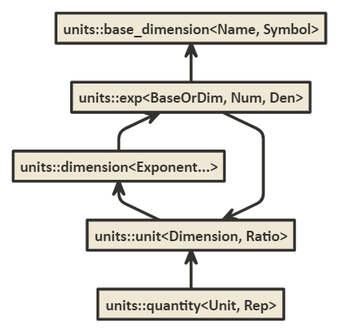

# `mp-units` - A Units Library for C++


## Summary

`Units` is a compile-time enabled Modern C++ library that provides compile-time dimensional
analysis and unit/quantity manipulation. The basic idea and design heavily bases on
`std::chrono::duration` and extends it to work properly with many dimensions.

Here is a small example of possible operations:

```cpp
// simple numeric operations
static_assert(10km / 2 == 5km);

// unit conversions
static_assert(1h == 3600s);
static_assert(1km + 1m == 1001m);

// dimension conversions
static_assert(1km / 1s == 1000mps);
static_assert(2kmph * 2h == 4km);
static_assert(2km / 2kmph == 1h);

static_assert(1000 / 1s == 1kHz);

static_assert(10km / 5km == 2);
```


## Approach

1. Safety and performance
    - strong types
    - compile-time safety
    - `constexpr` all the things
    - as fast or even faster than when working with fundamental types
2. The best possible user experience
    - compiler errors
    - debugging
3. No macros in the user interface
4. Easy extensibility
5. No external dependencies
6. Possibility to be standardized as a freestanding part of the C++ Standard Library


## Basic Concepts

Below UML diagram shows the most important entities in the library design and how they relate to
each other:



### `Dimensions`

`units::dimension` represents a derived dimension and is implemented as a type-list like type that
stores an ordered list of exponents of one or more base dimensions:

```cpp
template<Exponent... Es>
struct dimension : downcast_base<dimension<Es...>> {};
```

`units::Dimension` is a concept that is satisfied by a type that is empty and publicly
derived from `units::dimension` class template:

```cpp
template<typename T>
concept Dimension =
    std::is_empty_v<T> &&
    detail::is_dimension<downcast_base_t<T>>; // exposition only
```

#### `Exponents`

`units::Exponent` concept is satisfied if provided type is an instantiation of `units::exp` class
template:

```cpp
template<typename T>
concept Exponent =
    detail::is_exp<T>;  // exposition only
```

`units::exp` provides an information about a single dimension and its (possibly fractional)
exponent in a derived dimension.

```cpp
template<typename Dim, int Num, int Den = 1>
  requires BaseDimension<Dim> || Dimension<Dim>
struct exp {
  using dimension = Dim;
  static constexpr int num = Num;
  static constexpr int den = Den;
};
```

Both a base dimension and a derived dimension can be provided to `units::exp` class template.

`units::base_dimension` represents a base dimension and has assigned a unique compile-time text
describing the dimension name:

```cpp
template<typename Name, typename Symbol>
struct base_dimension {
  using name = Name;
  using symbol = Symbol;
};
```

`units::BaseDimension` is a concept to match all types derived from `base_dimension` instantiations:

```cpp
template<typename T>
concept BaseDimension = std::is_empty_v<T> &&
    requires {
      typename T::name;
      typename T::symbol;
    } &&
    std::derived_from<T, base_dimension<typename T::name, typename T::symbol>>;
```

For example here is a list of SI base dimensions:

```cpp
struct base_dim_length : base_dimension<"length", "m"> {};
struct base_dim_mass : base_dimension<"mass", "kg"> {};
struct base_dim_time : base_dimension<"time", "s"> {};
struct base_dim_current : base_dimension<"current", "A"> {};
struct base_dim_temperature : base_dimension<"temperature", "K"> {};
struct base_dim_substance : base_dimension<"substance", "mol"> {};
struct base_dim_luminous_intensity : base_dimension<"luminous intensity", "cd"> {};
```

#### `derived_dimension`

Above design of dimensions is created with the ease of use for end users in mind. Compile-time
errors should provide as short as possible template instantiations strings that should be easy to
understand by every engineer. Also types visible in a debugger should be easy to understand.
That is why `units::dimension` type for derived dimensions always stores information about only
those base dimensions that are used to form that derived dimension.

However, such an approach have some challenges:

```cpp
constexpr Velocity auto v1 = 1_m / 1s;
constexpr Velocity auto v2 = 2 / 2s * 1m;

static_assert(std::same_as<decltype(v1), decltype(v2)>);
static_assert(v1 == v2);
```

Above code, no matter what is the order of the base dimensions in an expression forming our result,
must produce the same `Velocity` type so that both values can be easily compared. In order to achieve
that, `dimension` class templates should never be instantiated manually but through a `derived_dimension`
helper:

```cpp
template<typename Child, Exponent... Es>
struct derived_dimension : downcast_helper<Child, typename detail::make_dimension<Es...>::type> {};
```

`Child` class template parameter is a part of a CRTP idiom and is used to provide a downcasting facility
described later in this document.

So for example to create a `velocity` type we have to do:

```cpp
struct velocity : derived_dimension<velocity, exp<base_dim_length, 1>, exp<base_dim_time, -1>> {};
```

In order to make `derived_dimension` work as expected it has to provide unique ordering for
contained base dimensions. Beside providing ordering to base dimensions it also has to:
- aggregate two arguments of the same base dimension but different exponents
- eliminate two arguments of the same base dimension and with opposite equal exponents

`derived_dimension` is also able to form a dimension type based not only on base dimensions but
it can take other derived dimensions as well. So for some more complex dimensions user can
type either:

```cpp
struct pressure : derived_dimension<pressure, exp<base_dim_mass, 1>, exp<base_dim_length, -1>, exp<base_dim_time, -2>> {};
```

or

```cpp
struct pressure : derived_dimension<pressure, exp<force, 1>, exp<area, -1>> {};
```

In the second case `derived_dimension` will extract all derived dimensions into the list of
exponents of base dimensions. Thanks to that both cases will result with exactly the same base
class formed only from the exponents of base units.

#### `merge_dimension`

`units::merge_dimension` is a type alias that works similarly to `derived_dimension` but instead
of sorting the whole list of base dimensions from scratch it assumes that provided input `dimension`
types are already sorted as a result of `derived_dimension`. Also contrary to `derived_dimension`
it works only with exponents of bas dimensions (no derived dimensions allowed).

Typical use case for `merge_dimension` is to produce final `dimension` return type of multiplying
two different dimensions:

```cpp
template<Dimension D1, Dimension D2>
struct dimension_multiply;

template<Exponent... E1, Exponent... E2>
struct dimension_multiply<dimension<E1...>, dimension<E2...>> {
  using type = downcast_traits_t<merge_dimension_t<dimension<E1...>, dimension<E2...>>>;
};

template<Dimension D1, Dimension D2>
using dimension_multiply = dimension_multiply<typename D1::base_type, typename D2::base_type>::type;
```


### `Units`

`units::unit` is a class template that expresses the unit of a specific physical dimension:

```cpp
template<Dimension D, Ratio R>
  requires (R::num * R::den > 0)
struct unit : downcast_base<unit<D, R>> {
  using dimension = D;
  using ratio = R;
};
```

`units::Unit` is a concept that is satisfied by a type that is empty and publicly
derived from `units::unit` class template:

```cpp
template<typename T>
concept Unit =
    std::is_empty_v<T> &&
    detail::is_unit<downcast_base_t<T>>;  // exposition only
```

Coherent derived units (units with `ratio<1>`) are created with a `coherent_derived_unit` class
template:

```cpp
template<typename Child, fixed_string Symbol, Dimension D, typename PrefixType = no_prefix>
struct coherent_derived_unit : downcast_helper<Child, unit<D, ratio<1>>> {
  static constexpr auto symbol = Symbol;
  using prefix_type = PrefixType;
};
```

The above exposes public `prefix_type` member type and `symbol` used to print unit symbol
names. `prefix_type` is a tag type used to identify the type of prefixes to be used (i.e. SI,
data).

For example to define the coherent unit of `length`:

```cpp
struct metre : coherent_derived_unit<metre, "m", length, si_prefix> {};
```

Again, similarly to `derived_dimension`, the first class template parameter is a CRTP idiom used
to provide downcasting facility (described below).

To create the rest of derived units the following class template can be used:

```cpp
template<typename Child, basic_fixed_string Symbol, Dimension D, Ratio R>
struct derived_unit : downcast_helper<Child, unit<D, R>> {
  static constexpr auto symbol = Symbol;
};
```

User has to provide a symbol name, dimension, and a ratio relative to a coherent derived unit.
For example to define `minute`:

```cpp
struct minute : derived_unit<minute, "min", time, ratio<60>> {};
```

The `mp-units` library provides also a few helper class templates to simplify the above process.

For example to create a prefixed unit the following may be used:

```cpp
template<typename Child, Prefix P, Unit U>
  requires requires { U::symbol; } && std::same_as<typename U::prefix_type, typename P::prefix_type>
struct prefixed_derived_unit : downcast_helper<Child, unit<typename U::dimension,
                                                           ratio_multiply<typename P::ratio,
                                                                          typename U::ratio>>> {
  static constexpr auto symbol = P::symbol + U::symbol;
  using prefix_type = P::prefix_type;
};
```

where `Prefix` is a concept requiring the instantiation of the following class template:

```cpp
template<typename PrefixType, Ratio R, basic_fixed_string Symbol>
struct prefix {
  using prefix_type = PrefixType;
  using ratio = R;
  static constexpr auto symbol = Symbol;
};
```

With this to create prefixed units user does not have to specify numeric value of the prefix ratio
or its symbol and just has to do the following:

```cpp
struct kilometre : prefixed_derived_unit<kilometre, kilo, metre> {};
```

For the cases where determining the exact ratio is not trivial another helper can be used:

```cpp
template<typename Child, basic_fixed_string Symbol, Dimension D, Unit U, Unit... Us>
struct deduced_derived_unit : downcast_helper<Child, detail::make_derived_unit<D, U, Us...>> {
  static constexpr auto symbol = Symbol;
};
```

This will deduce the ratio based on the ingredient units and their relation defined in the
dimension:

```cpp
struct mile_per_hour : deduced_derived_unit<mile_per_hour, "mi/h", velocity, mile, hour> {};
```


### `Quantities`

`units::quantity` is a class template that expresses the quantity/amount of a specific dimension
expressed in a specific unit of that dimension:

```cpp
template<Unit U, Scalar Rep = double>
class quantity;
```

`units::Quantity` is a concept that is satisfied by a type that is an instantiation of `units::quantity`
class template:

```cpp
template<typename T>
concept Quantity =
    detail::is_quantity<T>;  // exposition only
```

`units::quantity` provides the interface really similar to `std::chrono::duration`. The difference is that
it uses `double` as a default representation and has a few additional member types and functions as below:

```cpp
template<Unit U, Scalar Rep = double>
class quantity {
public:
  using unit = U;
  using rep = Rep;
  using dimension = U::dimension;

  [[nodiscard]] static constexpr quantity one() noexcept { return quantity(quantity_values<Rep>::one()); }

  template<Unit U1, Scalar Rep1, Unit U2, Scalar Rep2>
      requires std::same_as<typename U1::dimension, dim_invert<typename U2::dimension>>
  [[nodiscard]] constexpr Scalar operator*(const quantity<U1, Rep1>& lhs,
                                           const quantity<U2, Rep2>& rhs);

  template<Unit U1, Scalar Rep1, Unit U2, Scalar Rep2>
      requires (!std::same_as<typename U1::dimension, dim_invert<typename U2::dimension>>) &&
               (treat_as_floating_point<decltype(lhs.count() * rhs.count())> ||
                (std::ratio_multiply<typename U1::ratio, typename U2::ratio>::den == 1))
  [[nodiscard]] constexpr Quantity operator*(const quantity<U1, Rep1>& lhs,
                                             const quantity<U2, Rep2>& rhs);

  template<Scalar Rep1, typename U, typename Rep2>
  [[nodiscard]] constexpr Quantity operator/(const Rep1& v,
                                             const quantity<U, Rep2>& q);

  template<Unit U1, Scalar Rep1, Unit U2, Scalar Rep2>
    requires std::same_as<typename U1::dimension, typename U2::dimension>
  [[nodiscard]] constexpr Scalar operator/(const quantity<U1, Rep1>& lhs,
                                           const quantity<U2, Rep2>& rhs);

  template<Unit U1, Scalar Rep1, Unit U2, Scalar Rep2>
    requires (!std::same_as<typename U1::dimension, typename U2::dimension>) &&
             (treat_as_floating_point<decltype(lhs.count() / rhs.count())> ||
              (ratio_divide<typename U1::ratio, typename U2::ratio>::den == 1))
  [[nodiscard]] constexpr Quantity operator/(const quantity<U1, Rep1>& lhs,
                                             const quantity<U2, Rep2>& rhs);

  // ...
};
```

Additional functions provide the support for operations that result in a different dimension type
than those of their arguments.

Beside adding new elements a few other changes where applied compared to the `std::chrono::duration` class:
1. The `duration` is using `std::common_type_t<Rep1, Rep2>` to find a common representation
    for a calculation result. Such a design was reported as problematic by numerics study group members
    as sometimes we want to provide a different type in case of multiplication and different in case of
    division. `std::common_type` lacks that additional information. That is why `units::quantity` uses
    the resulting type of a concrete operator operation and provides it directly to `units::common_quantity_t`
    type trait.
2. `operator %` is constrained with `treat_as_floating_point` type trait to limit the types to integral
   representations only. Also `operator %(Rep)` takes `Rep` as a template argument to limit implicit
   conversions.


#### `quantity_cast`

To explicitly force truncating conversions `quantity_cast` function is provided which is a direct
counterpart of `std::chrono::duration_cast`. As a template argument user can provide here either
a `quantity` type or only its template parameters (`Unit`, `Rep`):  

```cpp
template<Quantity To, typename U, typename Rep>
  requires same_dim<typename To::dimension, typename U::dimension>
[[nodiscard]] constexpr To quantity_cast(const quantity<U, Rep>& q);

template<Unit ToU, Scalar ToRep, typename U, typename Rep>
[[nodiscard]] constexpr quantity<ToU, ToRep> quantity_cast(const quantity<U, Rep>& q);

template<Unit ToU, typename U, typename Rep>
[[nodiscard]] constexpr quantity<ToU, Rep> quantity_cast(const quantity<U, Rep>& q);

template<Scalar ToRep, typename U, typename Rep>
[[nodiscard]] constexpr quantity<U, ToRep> quantity_cast(const quantity<U, Rep>& q);
```

#### `operator<<`

The library tries its best to print a correct unit of the quantity. This is why it performs a series
of checks:
1. If the user predefined a unit with a `coherent_derived_unit` or `derived_unit` class templates,
  the symbol provided by the user will be used (i.e. `60 W`).
2. If a quantity has an unknown unit for a dimension predefined by the user with `derived_dimension`,
  the symbol of a coherent unit of this dimension will be used. Additionally:
    - if `Prefix` template parameter of a `coherent_derived_unit` is different than `no_prefix` then
      the prefix symbol (i.e. `8 cJ`) defined by the specialization of `units::prefix_symbol` will be
      aded wherever possible (`Ratio` matches the prefix ratio),
    - otherwise, non-standard ratio (i.e. `2 [60]Hz`) will be printed.
3. If a quantity has an unknown dimension, the symbols of base dimensions will be used to construct
  a unit symbol (i.e. `2 m/kg^2`). In this case no prefix symbols are added.

#### Text Formatting

| Specifier | Replacement                                                  |
|-----------|--------------------------------------------------------------|
| `%q`      | The quantity’s unit symbol                                   |
| `%Q`      | The quantity’s numeric value (as if extracted via `.count()` |


## Strong types instead of aliases, and type downcasting facility

Most of the important design decisions in the library are dictated by the requirement of providing
the best user experience as possible.

For example with template aliases usage the following code:

```cpp
const Velocity auto t = 20s;
```

could generate a following compile time error:

```text
<path>\example\example.cpp:39:22: error: deduced initializer does not satisfy placeholder constraints
   const Velocity auto t = 20s;
                           ^~~~
In file included from <path>\example\example.cpp:23:
<path>/src/include/units/si/velocity.h:41:16: note: within 'template<class T> concept const bool units::Velocity<T> [with T = units::quantity<units::unit<units::dimension<units::exp<units::base_dim_time, 1> >, std::ratio<1> >, long long int>]'
   concept Velocity = Quantity<T> && std::same_as<typename T::dimension, velocity>;
           ^~~~~~~~
In file included from <path>/src/include/units/bits/tools.h:25,
                 from <path>/src/include/units/dimension.h:25,
                 from <path>/src/include/units/si/base_dimensions.h:25,
                 from <path>/src/include/units/si/velocity.h:25,
                 from <path>\example\example.cpp:23:
<path>/src/include/units/bits/stdconcepts.h:33:18: note: within 'template<class T, class U> concept const bool std::same_as<T, U> [with T = units::dimension<units::exp<units::base_dim_time, 1> >; U = units::dimension<units::exp<units::base_dim_length, 1>,units::exp<units::base_dim_time, -1> >]'
     concept same_as = std::is_same_v<T, U>;
             ^~~~
<path>/src/include/units/bits/stdconcepts.h:33:18: note: 'std::is_same_v' evaluated to false
```

Time and velocity are not that complicated dimensions and there are much more complicated dimensions
out there, but even for those dimensions

```text
[with T = units::quantity<units::unit<units::dimension<units::exp<units::base_dim_time, 1> >, std::ratio<1> >, long long int>]
```

and

```text
[with T = units::dimension<units::exp<units::base_dim_time, 1> >; U = units::dimension<units::exp<units::base_dim_length, 1>,units::exp<units::base_dim_time, -1> >]
```

starts to be really hard to analyze or debug.

That is why it was decided to provide automated downcasting capability when possible. Thanks to this feature the
same code will result with such an error:

```text
<path>\example\example.cpp:40:22: error: deduced initializer does not satisfy placeholder constraints
   const Velocity t = 20s;
                      ^~~~
In file included from <path>\example\example.cpp:23:
<path>/src/include/units/si/velocity.h:48:16: note: within 'template<class T> concept const bool units::Velocity<T> [with T = units::quantity<units::second, long long int>]'
   concept Velocity = Quantity<T> && std::same_as<typename T::dimension, velocity>;
           ^~~~~~~~
In file included from <path>/src/include/units/bits/tools.h:25,
                 from <path>/src/include/units/dimension.h:25,
                 from <path>/src/include/units/si/base_dimensions.h:25,
                 from <path>/src/include/units/si/velocity.h:25,
                 from <path>\example\example.cpp:23:
<path>/src/include/units/bits/stdconcepts.h:33:18: note: within 'template<class T, class U> concept const bool std::same_as<T, U> [with T = units::time; U = units::velocity]'
     concept same_as = std::is_same_v<T, U>;
             ^~~~
<path>/src/include/units/bits/stdconcepts.h:33:18: note: 'std::is_same_v' evaluated to false
```

Now

```text
[with T = units::quantity<units::second, long long int>]
```

and

```text
[with T = units::time; U = units::velocity]
```

are not arguably much easier to understand thus provide better user experience.

Downcasting facility provides a type substitution mechanism. It connects a specific primary template
class specialization with a strong type assigned to it by the user. A simplified mental model of the
facility may be represented as:

```cpp
struct metre : unit<dimension<exp<base_dim_length, 1>>, std::ratio<1, 1, 0>>;
```

In the above example `metre` is a downcasting target (child class) and a specific `unit` class
template specialization is a downcasting source (base class). The downcasting facility provides
1 to 1 tpe substitution mechanism. Only one child class can be created for a specific base class
template instantiation.

Downcasting facility is provided through 2 dedicated types, a concept, and a few helper template aliases.

```cpp
template<typename BaseType>
struct downcast_base {
  using base_type = BaseType;
  friend auto downcast_guide(downcast_base);
};
```

`units::downcast_base` is a class that implements CRTP idiom, marks the base of downcasting
facility with a `base_type` member type, and provides a declaration of downcasting ADL friendly
(Hidden Friend) entry point member function `downcast_guide`. An important design point is that
this function does not return any specific type in its declaration. This non-member function
is going to be defined in a child class template `downcast_helper` and will return a target
type of the downcasting operation there.

```cpp
template<typename T>
concept Downcastable =
    requires {
      typename T::base_type;
    } &&
    std::derived_from<T, downcast_base<typename T::base_type>>;
```

`units::Downcastable` is a concepts that verifies if a type implements and can be used in a downcasting
facility.

```cpp
template<typename Target, Downcastable T>
struct downcast_helper : T {
  friend auto downcast_guide(typename downcast_helper::downcast_base) { return Target(); }
};
```

`units::downcast_helper` is another CRTP class template that provides the implementation of a
non-member friend function of the `downcast_base` class template which defines the target
type of a downcasting operation. It is used in the following way to define `dimension` and
`unit` types in the library:

```cpp
template<typename Child, Exponent... Es>
struct derived_dimension : downcast_helper<Child, detail::make_dimension_t<Es...>> {};
```

```cpp
template<typename Child, fixed_string Symbol, Dimension D>
struct derived_unit<Child, Symbol, D, R> : downcast_helper<Child, unit<D, ratio<1>>> {};
```

With such CRTP types the only thing the user has to do to register a new type to the downcasting
facility is to publicly derive from one of those CRTP types and provide its new child type as
the first template parameter of the CRTP type.

```cpp
struct metre : derived_unit<metre, "m", length> {};
```

Above types are used to define base and target of a downcasting operation. To perform the actual
downcasting operation a dedicated template alias is provided:

```cpp
template<Downcastable T>
using downcast_target = decltype(detail::downcast_target_impl<T>());
```

`units::downcast_target` is used to obtain the target type of the downcasting operation registered
for a given specialization in a base type.

For example to determine a downcasted type of a quantity multiply operation the following can be done:

```cpp
using dim = dimension_multiply<typename U1::dimension, typename U2::dimension>;
using common_rep = decltype(lhs.count() * rhs.count());
using ret = quantity<downcast_target<unit<dim, ratio_multiply<typename U1::ratio, typename U2::ratio>>>, common_rep>;
```

`detail::downcast_target_impl` checks if a downcasting target is registered for the specific base class.
If yes, it returns the registered type, otherwise it works like a regular identity type returning
a provided base class.

```cpp
namespace detail {

  template<typename T>
  concept has_downcast = requires {
    downcast_guide(std::declval<downcast_base<T>>());
  };

  template<typename T>
  constexpr auto downcast_target_impl()
  {
    if constexpr(has_downcast<T>)
      return decltype(downcast_guide(std::declval<downcast_base<T>>()))();
    else
      return T();
  }

}
```

Additionally there is on more simple helper alias provided that is used in the internal
library implementation:

```cpp
template<Downcastable T>
using downcast_base_t = T::base_type;
```


## Adding custom dimensions and units

In order to extend the library with custom dimensions the user has to:
1. Create a new base dimension if the predefined ones are not enough to form a new derived dimension:

    ```cpp
    struct base_dim_digital_information : units::base_dimension<"digital information", "b"> {};
    ```

2. Create a new dimension type with the recipe of how to construct it from base dimensions and
   register it for a downcasting facility:

    ```cpp
    struct digital_information : units::derived_dimension<digital_information, units::exp<base_dim_digital_information, 1>> {};
    ```

3. Define a concept that will match a new dimension:

    ```cpp
    template<typename T>
    concept DigitalInformation = units::QuantityOf<T, digital_information>;
    ```

4. If non-SI prefixes should be applied to the unit symbol, define a new prefix tag and provide
   `prefix_symbol` specializations to provide their text representation:

    ```cpp
    struct data_prefix;

    template<> inline constexpr std::string_view units::prefix_symbol<data_prefix, units::ratio<    1'024>> = "Ki";
    template<> inline constexpr std::string_view units::prefix_symbol<data_prefix, units::ratio<1'048'576>> = "Mi";
    ```

5. Define units and register them to a downcasting facility:

    ```cpp
    struct bit : units::coherent_derived_unit<bit, "b", digital_information, data_prefix> {};
    struct byte : units::derived_unit<byte, "B", digital_information, units::ratio<8>> {};
    ```

6. Provide user-defined literals for the most important units:

    ```cpp
    inline namespace literals {
      constexpr auto operator""_b(unsigned long long l) { return units::quantity<bit, std::int64_t>(l); }
      constexpr auto operator""_b(long double l) { return units::quantity<bit, long double>(l); }

      constexpr auto operator""_B(unsigned long long l) { return units::quantity<byte, std::int64_t>(l); }
      constexpr auto operator""_B(long double l) { return units::quantity<byte, long double>(l); }
    }
    ```


## Open questions

1. Should we ensure that dimension is always a result of `derived_dimension` and unit is a result
    of `derived_unit`? How to do it?

2. What to do with `std::chrono::duration`?

3. Should we provide `seconds<int>` or stay with `quantity<second, int>`?

4. What is the best way to add support for temperatures?

    Temperature absolute values not only require `std::ratio` but also should be adjusted/shifted
    by some constant values (i.e. [°C] = [K] − 273.15). Relative temperatures does need an offset.
    Users will most probably have problems with differentiating those two. Maybe the best solution
    is to provide only `K` support in quantity and provide non-member helper conversion functions
    with verbose names to convert to `°C` and `°C`?

5. Do we need a non-linear scale?

6. Should we provide integral UDLs or just leave floating point ones?

7. Should we provide support for dimensionless quantities?

    Because dimensionless quantities have no associated units, they behave as normal scalars,
    and allow implicit conversion to and from the underlying value type or types that are
    convertible to/from that value type.

8. Should we standardize accompany tools (downcasting facility, `type_list` operations, `common_ratio`, etc)?

9. `k`, `K`, `W`, `F` UDLs conflict with gcc GNU extensions (<https://gcc.gnu.org/onlinedocs/gcc-4.3.0/gcc/Fixed_002dPoint.html>)
    for floating point types.

10. `J` imaginary constants are a GCC extension

11. Do we need custom/multiple systems?
