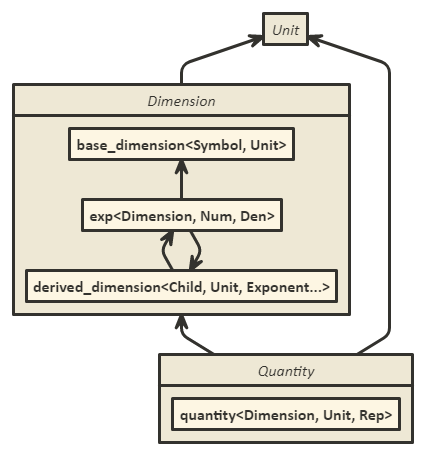
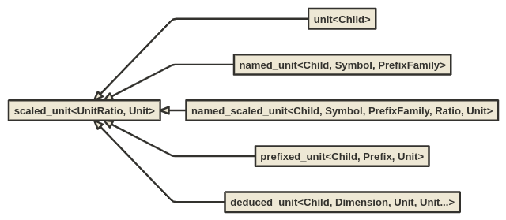
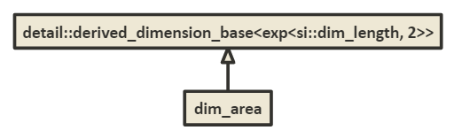

# `mp-units` - Design Overview


## Summary

`mp-units` is a compile-time enabled Modern C++ library that provides compile-time dimensional
analysis and unit/quantity manipulation. The basic idea and design heavily bases on
`std::chrono::duration` and extends it to work properly with many dimensions.

Here is a small example of possible operations:

```cpp
// simple numeric operations
static_assert(10q_km / 2 == 5q_km);

// unit conversions
static_assert(1q_h == 3600q_s);
static_assert(1q_km + 1q_m == 1001q_m);

// dimension conversions
static_assert(1q_km / 1q_s == 1000q_m_per_s);
static_assert(2q_km_per_h * 2q_h == 4q_km);
static_assert(2q_km / 2q_km_per_h == 1q_h);

static_assert(1000 / 1q_s == 1q_kHz);

static_assert(10q_km / 5q_km == 2);
```


## Approach

1. Safety and performance
    - strong types
    - compile-time safety
    - `constexpr` all the things
    - as fast or even faster than when working with fundamental types
2. The best possible user experience
    - compiler errors
    - debugging
3. No macros in the user interface
4. Easy extensibility
5. No external dependencies
6. Possibility to be standardized as a freestanding part of the C++ Standard Library


## Basic Concepts

The most important concepts in the library are `Unit`, `Dimension`, and `Quantity`:



`Unit` is a basic building block of the library. Every dimension works with a concrete
hierarchy of units. Such hierarchy defines a reference unit and often a few scaled versions of
it.

`Dimension` concept matches a dimension of either a base or derived quantity. `base_dimension`
is instantiated with a unique symbol identifier and a base unit. `derived_unit` is a list of
exponents of either base or other derived dimensions.

`Quantity` is a concrete amount of a unit for a specified dimension with a specific
representation.


## `Unit`

All units are represented in the framework by a `scaled_unit` class template:

```cpp
template<UnitRatio R, typename U>
struct scaled_unit : downcast_base<scaled_unit<R, U>> {
  using ratio = R;
  using reference = U;
};
```

where:

```cpp
template<typename R>
concept UnitRatio = Ratio<R> && R::num > 0 && R::den > 0; // double negatives not allowed
```

and `Ratio` is satisfied by any instantiation of `units::ratio<Num, Den, Exp>`.

The `scaled_unit` type is a framework's private type and the user should never instantiate it directly.
The public user interface to create units consists of:



All below class templates indirectly derive from a `scaled_unit` class template and satisfy a
`Unit` concept:
- `unit`
  - Defines a new unnamed, in most cases coherent derived unit of a specific derived
    dimension and it should be passed in this dimension's definition.
- `named_unit`
  - Defines a named, in most cases base or coherent unit that is then passed to a dimension's
    definition.
  - A named unit may be used by other units defined with the prefix of the same type, unless
    `no_prefix` is provided for `PrefixType` template parameter (in such a case it is impossible
    to define a prefixed unit based on this one).
- `named_scaled_unit`
  - Defines a new named unit that is a scaled version of another unit.
  - Such unit can be used by other units defined with the prefix of the same type, unless
    `no_prefix` is provided for `PrefixType` template parameter (in such a case it is impossible
    to define a prefixed unit based on this one).
- `prefixed_unit`
  - Defines a new unit that is a scaled version of another unit by the provided prefix.
  - It is only possible to create such a unit if the given prefix type matches the one defined
    in a reference unit.
- `deduced_unit`
  - Defines a new unit with a deduced ratio and symbol based on the recipe from the provided
    derived dimension.
  - The number and order of provided units should match the recipe of the derived dimension.
  - All of the units provided should also be a named ones so it is possible to create a deduced
    symbol text.

Some of the above types depend on `PrefixType` and `no_prefix`. `PrefixType` is a concept that
is defined as:

```cpp
template<typename T>
concept PrefixType = std::derived_from<T, prefix_type>;
```

where `prefix_type` is just an empty tag type used to identify the beginning of prefix types
hierarchy and `no_prefix` is one of its children:

```cpp
struct prefix_type {};
struct no_prefix : prefix_type {};
```

Concrete prefix derives from a `prefix` class template:

```cpp
template<typename Child, PrefixType PT, basic_fixed_string Symbol, Ratio R>
  requires (!std::same_as<PT, no_prefix>)
struct prefix;
```

You could notice that both units and above `prefix` class template take `Child` as a first
template parameter. `mp-units` library heavily relies on CRTP (Curiously Recurring Template
Parameter) idiom to provide the best user experience in terms of readability of compilation
errors and during debugging. It is possible thanks to the downcasting facility described later
in the design documentation.

Coming back to units, here are a few examples of unit definitions:

```cpp
namespace units::si {

// prefixes
struct prefix : prefix_type {};
struct centi : units::prefix<centi, prefix, "c", ratio<1, 1, -2>> {};
struct kilo : units::prefix<kilo, prefix, "k", ratio<1, 1, 3>> {};

// length
struct metre : named_unit<metre, "m", "m", prefix> {};
struct centimetre : prefixed_unit<centimetre, centi, metre> {};
struct kilometre : prefixed_unit<kilometre, kilo, metre> {};

// time
struct second : named_unit<second, "s", "s", prefix> {};
struct hour : named_scaled_unit<hour, "h", "h", no_prefix, ratio<3600>, second> {};

// velocity
struct metre_per_second : unit<metre_per_second> {};
struct kilometre_per_hour : deduced_unit<kilometre_per_hour, dim_velocity, kilometre, hour> {};

}

namespace units::us {

// length
struct yard : named_scaled_unit<yard, "yd", "yd", no_prefix, ratio<9'144, 10'000>, si::metre> {};
struct mile : named_scaled_unit<mile, "mi", "mi", no_prefix, ratio<1'760>, yard> {};

// velocity
struct mile_per_hour : deduced_unit<mile_per_hour, si::dim_velocity, mile, si::hour> {};

}
```

Please note that thanks to C++20 features we are able to provide all information about the unit
(including text output) in a single line of its type definition. There is no need to specialize
additional type traits or use preprocessor macros.


## `Dimension`

`Dimension` is either a `BaseDimension` or a `DerivedDimension`:

```cpp
template<typename T>
concept Dimension = BaseDimension<T> || DerivedDimension<T>;
```

### `BaseDimension`

According to ISO 80000 a base quantity is a quantity in a conventionally chosen subset of a
given system of quantities, where no quantity in the subset can be expressed in terms of the
other quantities within that subset. They are referred to as being mutually independent since a
base quantity cannot be expressed as a product of powers of the other base quantities. Base unit
is a measurement unit that is adopted by convention for a base quantity in a specific system of
units.

`base_dimension` represents a dimension of a base quantity and is identified with a pair of
an unique compile-time text describing the dimension symbol and a base unit adopted for this
dimension:

```cpp
template<basic_fixed_string Symbol, Unit U>
  requires U::is_named
struct base_dimension {
  static constexpr auto symbol = Symbol;
  using base_unit = U;
};
```

Pair of symbol and unit template parameters form an unique identifier of the base dimension.
These identifiers provide total ordering of exponents of base dimensions in a derived dimension.

The SI physical units system defines 7 base dimensions:

```cpp
namespace units::si {

struct dim_length : base_dimension<"L", metre> {};
struct dim_mass : base_dimension<"M", kilogram> {};
struct dim_time : base_dimension<"T", second> {};
struct dim_electric_current : base_dimension<"I", ampere> {};
struct dim_thermodynamic_temperature : base_dimension<"Θ", kelvin> {};
struct dim_substance : base_dimension<"N", mole> {};
struct dim_luminous_intensity : base_dimension<"J", candela> {};

}
```

All other derived quantities of SI are composed from those.

There are two reasons why a `base_dimension` gets a unit as its template parameter. First, the
base unit is needed for the text output of unnamed derived units. Second, there is more than
one system of physical units. For example CGS definitions look as follows:

```cpp
namespace units::cgs {

using si::centimetre;
using si::gram;
using si::second;

struct dim_length : base_dimension<"L", centimetre> {};
struct dim_mass : base_dimension<"M", gram> {};
using si::dim_time;

}
```

Equivalent base dimensions in different systems have the same symbol identifier and get units
from the same hierarchy (with the same reference in `scaled_unit`). Thanks to that we have
the ability to explicitly cast quantities of the same dimension from different systems or
even mix them in one `derived_dimension` definition.


### `DerivedDimension`

According to ISO 80000 a derived quantity is a quantity, in a system of quantities, defined in
terms of the base quantities of that system. Dimension of such quantity is an expression of the
dependence of a quantity on the base quantities of a system of quantities as a product of
powers of factors corresponding to the base quantities, omitting any numerical factors. A power
of a factor is the factor raised to an exponent. Each factor is the dimension of a base
quantity.

A derived dimension used internally in a library framework is implemented as a type-list like
type that stores an ordered list of exponents of one or more base dimensions:

```cpp
namespace detail {

template<Exponent E, Exponent... ERest>
  requires (BaseDimension<typename E::dimension> && ... && BaseDimension<typename ERest::dimension>)
struct derived_dimension_base;

}
```

A derived dimension can be formed from multiple exponents (i.e. velocity is represented as
`exp<L, 1>, exp<T, -1>`). It is also possible to form a derived dimension with only one exponent
(i.e. frequency is represented as just `exp<T, -1>`).

Exponents are implemented with `exp` class template that provides an information about a single
dimension and its (possibly fractional) exponent in a derived dimension.

```cpp
template<Dimension Dim, std::intmax_t Num, std::intmax_t Den = 1>
struct exp {
  using dimension = Dim;
  static constexpr std::intmax_t num = Num;
  static constexpr std::intmax_t den = Den;
};
```

In order to be able to perform computations on an arbitrary set of exponents,
`derived_dimension_base` class template have to obey the following rules:
- it contains only base dimensions in the list of exponents,
- base dimensions are not repeated in a list (the exponent of each base dimension is provided
  at most once),
- exponents of base dimensions are consistently ordered,
- in case the numerator of the exponent equals zero such base dimension is erased from the list.

Above is needed for the framework to provide dimensional analysis. However, sometimes it is
useful to define derived units in terms of other derived units. To support this both a base
dimension and a derived dimension can be provided to `exp` class template.

As it was stated above `derived_dimension_base` is a private utility of the framework. In order
to define a new derived dimension the user has to instantiate the following class template:

```cpp
template<typename Child, Unit U, Exponent E, Exponent... ERest>
struct derived_dimension : downcast_child<Child, typename detail::make_dimension<E, ERest...>> {
  using recipe = exp_list<E, ERest...>;
  using coherent_unit = U;
  using base_units_ratio = /* see below */;
};
```

There are a few important differences between `detail::derived_dimension_base` and
`derived_dimension`. First, the latter one gets the coherent unit of the derived dimension.

According to ISO 80000 a coherent unit is a unit that, for a given system of quantities and for
a chosen set of base units, is a product of powers of base units with no other proportionality
factor than one.

The other difference is that `derived_dimension` allows to provide other derived dimensions in
the list of its exponents. This is called a "recipe" of the dimension and among others is used
to print unnamed coherent units of this dimension.

In case a derived dimension appears on the list of exponents, such derived dimension will be
unpacked, sorted, and consolidated by a `detail::make_dimension` helper to form a valid list
of exponents of only base dimensions later provided to `detail::derived_dimension_base`.

Sometimes units of equivalent quantities in different systems of units do not share the same
reference so they cannot be easily converted to each other. An example can be a pressure for
which a coherent unit in SI is pascal and in CGS barye. Those two units are not directly
related with each other with some ratio. As they both are coherent units of their dimensions,
the ratio between them is directly determined by the ratios of base units defined in base
dimensions end their exponents in the derived dimension recipe. To provide interoperability of
such quantities of different systems `base_units_ratio` is being used. The result of the
division of two `base_units_ratio` of two quantities of equivalent dimensions in two different
systems gives a ratio between their coherent units. Alternatively, the user would always have to
directly define a barye in terms of pascal or vice versa.

Below are a few examples of derived dimension definitions:

```cpp
namespace units::si {

struct dim_velocity : derived_dimension<dim_velocity, metre_per_second,
                                        exp<dim_length, 1>, exp<dim_time, -1>> {};

struct dim_acceleration : derived_dimension<dim_acceleration, metre_per_second_sq,
                                            exp<dim_length, 1>, exp<dim_time, -2>> {};

struct dim_force : derived_dimension<dim_force, newton,
                                     exp<dim_mass, 1>, exp<dim_acceleration, 1>> {};

struct dim_energy : derived_dimension<dim_energy, joule,
                                      exp<dim_force, 1>, exp<dim_length, 1>> {};

struct dim_power : derived_dimension<dim_power, watt,
                                     exp<dim_energy, 1>, exp<dim_time, -1>> {};

}
```

If as a result of dimensional computation the library framework will generate a derived
dimension that was not predefined by the user than the instance of
`unknown_dimension<Exponent...>`. The coherent unit of such an unknown dimension is
`scaled_unit<ratio<1>, unknown_coherent_unit>`.


## `Quantity`

`quantity` is a class template that expresses the quantity/amount of a specific dimension
expressed in a specific unit of that dimension:

```cpp
template<Dimension D, UnitOf<D> U, Scalar Rep = double>
class quantity
```

`quantity` provides a similar interface to `std::chrono::duration`. The difference is that it
uses `double` as a default representation and has a few additional member types and
functions as below:

```cpp
template<Dimension D, UnitOf<D> U, Scalar Rep = double>
class quantity {
public:
  using dimension = D;
  using unit = U;
  using rep = Rep;

  [[nodiscard]] static constexpr quantity one() noexcept;
  // ...
};

template<typename D1, typename U1, typename Rep1, typename D2, typename U2, typename Rep2>
  requires detail::basic_arithmetic<Rep1, Rep2> && equivalent_dim<D1, dim_invert<D2>>
[[nodiscard]] constexpr Scalar auto operator*(const quantity<D1, U1, Rep1>& lhs,
                                              const quantity<D2, U2, Rep2>& rhs);

template<typename D1, typename U1, typename Rep1, typename D2, typename U2, typename Rep2>
  requires detail::basic_arithmetic<Rep1, Rep2> && (!equivalent_dim<D1, dim_invert<D2>>)
[[nodiscard]] constexpr Quantity auto operator*(const quantity<D1, U1, Rep1>& lhs,
                                                const quantity<D2, U2, Rep2>& rhs);

template<Scalar Value, typename D, typename U, typename Rep>
  requires std::magma<std::ranges::divided_by, Value, Rep>
[[nodiscard]] constexpr Quantity auto operator/(const Value& v,
                                                const quantity<D, U, Rep>& q);

template<typename D1, typename U1, typename Rep1, typename D2, typename U2, typename Rep2>
  requires detail::basic_arithmetic<Rep1, Rep2> && equivalent_dim<D1, D2>
[[nodiscard]] constexpr Scalar auto operator/(const quantity<D1, U1, Rep1>& lhs,
                                              const quantity<D2, U2, Rep2>& rhs);

template<typename D1, typename U1, typename Rep1, typename D2, typename U2, typename Rep2>
  requires detail::basic_arithmetic<Rep1, Rep2> && (!equivalent_dim<D1, D2>)
[[nodiscard]] constexpr Quantity AUTO operator/(const quantity<D1, U1, Rep1>& lhs,
                                                const quantity<D2, U2, Rep2>& rhs);
```

Additional functions provide the support for operations that result in a different dimension
type than those of their arguments. `equivalent_dim` constraint requires two dimensions to be
either the same or have convertible units of base dimension (with the same reference unit).

Beside adding new elements a few other changes where applied compared to the `std::chrono::duration` class:
1. The `duration` is using `std::common_type_t<Rep1, Rep2>` to find a common representation
  for a calculation result. Such a design was reported as problematic by SG6 (numerics study group) members
  as sometimes we want to provide a different type in case of multiplication and different in case of
  division. `std::common_type` lacks that additional information. That is why `units::quantity` uses
  the resulting type of a concrete operator operation.
2. `operator %` is constrained with `treat_as_floating_point` type trait to limit the types to integral
   representations only. Also `operator %(Rep)` takes `Rep` as a template argument to limit implicit
   conversions.

To simplify writing efficient generic code quantities of each dimension have associated:
1. Concept (i.e. `units::Length`) that matches a length dimension of any physical systems.
2. Per-system quantity alias (i.e. `units::si::length<Unit, Rep>` for
  `units::quantity<units::si::dim_length, Unit, Rep>`).

Also, to help instantiate quantities with compile-time known values every unit in the library
has an associated UDL. For example:

```cpp
namespace si::inline literals {

// m
constexpr auto operator"" q_m(unsigned long long l) { return length<metre, std::int64_t>(l); }
constexpr auto operator"" q_m(long double l) { return length<metre, long double>(l); }

// km
constexpr auto operator"" q_km(unsigned long long l) { return length<kilometre, std::int64_t>(l); }
constexpr auto operator"" q_km(long double l) { return length<kilometre, long double>(l); }

}
```


### `quantity_cast`

To explicitly force truncating conversions `quantity_cast` function is provided which is a direct
counterpart of `std::chrono::duration_cast`. As a template argument user can provide here either
a `quantity` type or only its template parameters (`Dimension`, `Unit`, or `Rep`):

```cpp
template<Quantity To, typename D, typename U, typename Rep>
  requires QuantityOf<To, D> &&
           detail::basic_arithmetic<std::common_type_t<typename To::rep, Rep, intmax_t>>
[[nodiscard]] constexpr auto quantity_cast(const quantity<D, U, Rep>& q);

template<Dimension ToD, typename D, typename U, typename Rep>
  requires equivalent_dim<ToD, D>
[[nodiscard]] constexpr auto quantity_cast(const quantity<D, U, Rep>& q);

template<Unit ToU, typename D, typename U, typename Rep>
  requires UnitOf<ToU, D>
[[nodiscard]] constexpr auto quantity_cast(const quantity<D, U, Rep>& q);

template<Scalar ToRep, typename D, typename U, typename Rep>
  requires detail::basic_arithmetic<std::common_type_t<ToRep, Rep, intmax_t>>
[[nodiscard]] constexpr auto quantity_cast(const quantity<D, U, Rep>& q);
```

## Text output

### Unit Symbol

The library tries its best to print a correct unit of the quantity. This is why it performs
a series of checks:
1. If the user predefined a unit with a `named_XXX_unit` class templates, the symbol provided
  by the user will be used (i.e. `60 W`).
2. If a unit was created with a `deduced_unit` class template, the symbol of deduced unit is
  printed (i.e. `70 km/h`).
3. Otherwise, the library tries to print a prefix and symbol of an unknown unit for this derived
  dimension:
  - prefix:
    - if ratio of the scaled unit is `1`, than no prefix is being printed,
    - otherwise, if `PrefixType` template parameter of a reference unit is different than
      `no_prefix`, and if the ratio of scaled unit matches the ratio of a prefix of a specified
      type, than the symbol of this prefix will be used,
    - otherwise, non-standard ratio (i.e. `2 [60]Hz`) will be printed.
  - symbol:
    - if a reference unit has a user-predefined or deduced symbol, than this symbol it is being
      printed,
    - otherwise, the symbol is constructed from names and exponents of base dimensions
      (i.e. `2 m/kg^2`).


### `operator<<`

`quantity::operator<<()` provides only a basic support to print a quantity. It prints its count
and a symbol separated with one space character.


### Text Formatting

`mp-units` supports new C++20 formatting facility (currently provided as a dependency on
[`fmt`](https://github.com/fmtlib/fmt) library). `parse()` member functions of
`fmt::formatter<units::quantity<Dimension, Unit, Rep>, CharT>` class template partial
specialization interprets the format specification as a `units-format-spec` according to the
following syntax:

```text
units-format-spec:
     fill-and-align[opt] sign[opt] width[opt] precision[opt] units-specs[opt]
units-specs:
     conversion-spec
     units-specs conversion-spec
     units-specs literal-char
literal-char:
     any character other than { or }
conversion-spec:
     % modifier[opt] type
modifier: one of
     E O
type: one of
     n q Q t %
```

The productions `fill-and-align`, `sign`, `width`, and `precision` are described in
[Format string](https://wg21.link/format.string.std) chapter of the C++ standard. Giving a
`precision` specification in the `units-format-spec` is valid only for `units::quantity` types
where the representation type `Rep` is a floating-point type. For all other `Rep` types, an
exception of type `format_error` is thrown if the `units-format-spec` contains a precision
specification. An `format_error` is also thrown if `sign` is provided with a `conversion-spec`
to print quantity unit but not its value.

Each conversion specifier `conversion-spec` is replaced by appropriate characters as described
in the following table:

| Specifier | Replacement                                                   |
|:---------:|---------------------------------------------------------------|
|   `%n`    | A new-line character                                          |
|   `%q`    | The quantity’s unit symbol                                    |
|   `%Q`    | The quantity’s numeric value (as if extracted via `.count()`) |
|   `%t`    | A horizontal-tab character                                    |
|   `%%`    | A `%` character                                               |

If the `units-specs` is omitted, the `quantity` object is formatted as if by streaming it to
`std::ostringstream os` and copying `os.str()` through the output iterator of the context with
additional padding and adjustments as specified by the format specifiers.

```cpp
std::string s = fmt::format("{:=>12}", 120q_km_per_h); // value of s is "====120 km/h"
```


## Improving user's experience

Most of the important design decisions in the library are dictated by the requirement of
providing the best user experience as possible.

Most of C++ libraries in the world use template aliases to provide a friendly name for a
developer. Unfortunately, such aliases are quickly lost in a compilation process and as a
result the potential error log contains a huge source type rather than a short alias for it.
The same can be observed during debugging of a code using template aliases.

Let's assume that we want to provide a user friendly name for a capacitance derived dimension.
Other libraries will do it in the following way:

```cpp
using dim_capacitance = detail::derived_dimension_base<exp<si::dim_electric_current, 2>,
                                                       exp<si::dim_length, -2>,
                                                       exp<si::dim_mass, -1>,
                                                       exp<si::dim_time, 4>>;
```

The above solution does provide a good developer's experience but a really poor one for the end
user. If we will get a compilation error message containing `dim_capacitance` in most cases
the compiler will print the following type instead of the alias:

```text
units::detail::derived_dimension_base<units::exp<units::si::dim_electric_current, 2, 1>,
units::exp<units::si::dim_length, -2, 1>, units::exp<units::si::dim_mass, -1, 1>,
units::exp<units::si::dim_time, 4, 1> >
```

You can notice that even this long syntax was carefully selected to provide quite good user
experience (some other units libraries produce a type that cannot easily fit on one slide)
but it is not questionable less readable than just `dim_capacitance`.

NOTE: To better understand how the framework works and not clutter the text and graphs with
long types in the following examples we will switch from `dim_capacitance` to `dim_area`.
The latter one has much shorter definition but the end result for both will be exactly the same.
User-friendly, short name printed by the compiler and the debugger.

To fix it we have to provide a strong type. As we do not have opaque/strong typedefs
in the language we have to use inheritance:



This gives us a nice looking strong type but does not solve the problem of how to switch from
a long instantiation of a `derived_dimension_base` class template that was generated by the
framework as a result of dimensional calculation to a child class assigned by the user for this
instantiation.

### Downcasting facility

To support this `mp-units` library introduces a new downcasting facility implemented fully as
a library feature. It creates 1-to-1 link between a long class template instantiation and a
strong type provided by the user. This means that only one child class can be created for a
specific base class template instantiation.

Downcasting facility is provided by injecting two classes into our hierarchy:


In the above example `dim_area` is a downcasting target (child class) and a specific
`detail::derived_dimension` class template instantiation is a downcasting source (base class).

```cpp
template<typename BaseType>
struct downcast_base {
  using downcast_base_type = BaseType;
  friend auto downcast_guide(downcast_base);  // declaration only (no implementation)
};
```

`units::downcast_base` is a class that implements CRTP idiom, marks the base of downcasting
facility with a `downcast_base_type` member type, and provides a declaration of downcasting ADL
friendly (Hidden Friend) entry point member function `downcast_guide`. An important design point
is that this function does not return any specific type in its declaration. This non-member
function is going to be defined in a child class template `downcast_child` and will return a
target type of the downcasting operation there.

```cpp
template<typename T>
concept Downcastable =
    requires {
      typename T::downcast_base_type;
    } &&
    std::derived_from<T, downcast_base<typename T::downcast_base_type>>;
```

`units::Downcastable` is a concepts that verifies if a type implements and can be used in a
downcasting facility.

```cpp
template<typename Target, Downcastable T>
struct downcast_child : T {
  friend auto downcast_guide(typename downcast_child::downcast_base) { return Target(); }
};
```

`units::downcast_child` is another CRTP class template that provides the implementation of a
non-member friend function of the `downcast_base` class template which defines the target
type of a downcasting operation.

With such CRTP types the only thing the user has to do to register a new type to the downcasting
facility is to publicly derive from one of those CRTP types and provide its new child type as
the first template parameter of the CRTP type.

Above types are used to define base and target of a downcasting operation. To perform the actual
downcasting operation a dedicated template alias is provided:

```cpp
template<Downcastable T>
using downcast = decltype(detail::downcast_target_impl<T>());
```

`units::downcast` is used to obtain the target type of the downcasting operation registered
for a given instantiation in a base type. `detail::downcast_target_impl` checks if a downcasting
target is registered for the specific base class. If yes, it returns the registered type,
otherwise it works like a regular identity type returning a provided base class.

```cpp
namespace detail {

  template<typename T>
  concept has_downcast = requires {
    downcast_guide(std::declval<downcast_base<T>>());
  };

  template<typename T>
  constexpr auto downcast_target_impl()
  {
    if constexpr(has_downcast<T>)
      return decltype(downcast_guide(std::declval<downcast_base<T>>()))();
    else
      return T();
  }

}
```

Additionally there is one more simple helper alias provided that is used in the internal
library implementation:

```cpp
template<Downcastable T>
using downcast_base_t = T::downcast_base_type;
```


### `unknown_dimension<Exponent...>`

Sometimes dimensional calculation results with a class template instantiation that was not
predefined by the user in the downcasting facility. A typical example of such a case are
temporary results of calculations:

```cpp
units::Length auto d1 = 123q_m;
units::Time auto t1 = 10q_s;
units::Velocity auto v1 = avg_speed(d1, t1);

auto temp1 = v1 * 50q_m;  // intermediate unknown dimension

units::Velocity auto v2 = temp1 / 100q_m; // back to known dimensions again
units::Length auto d2 = v2 * 60q_s;
```

To provide support to form an unknown derived dimension that could be than be converted to a
known one with a correct unit, and also to improve the user experience and clearly state that
it is an unknown dimension the library framework will provide an instance of:

```cpp
struct unknown_coherent_unit : unit<unknown_coherent_unit> {};

template<Exponent E, Exponent... ERest>
struct unknown_dimension : derived_dimension<unknown_dimension<E, ERest...>,
                                             scaled_unit<ratio<1>, unknown_coherent_unit>,
                                             E, ERest...> {
  using coherent_unit = scaled_unit<ratio<1>, unknown_coherent_unit>;
};
```

with this the error log or a debugger breakpoint involving a `temp1` type will include:

```text
units::quantity<units::unknown_dimension<units::exp<units::si::dim_length, 2, 1>,
units::exp<units::si::dim_time, -1, 1> >, units::unknown_coherent_unit, long int>
```


## Extensibility

The library was designed with a simple extensibility in mind. It is easy to add new units,
dimensions, and prefixes. The systems of units are not closed (classes) but open (namespaces)
and can be easily extended, or its content can be partially/fully imported to other systems.


### Adding a new system with custom dimensions and units

A great example of a adding a whole new system can be a `data` system in the library which
adds support for digital information quantities. In summary it adds:
1. New prefix type and its prefixes:

    ```cpp
    namespace units::data {

    struct prefix : prefix_type {};

    struct kibi : units::prefix<kibi, prefix, "Ki", ratio<    1'024>> {};
    struct mebi : units::prefix<mebi, prefix, "Mi", ratio<1'048'576>> {};

    }
    ```

2. New units for `information`:

    ```cpp
    namespace units::data {

    struct bit : named_unit<bit, "b", "b", prefix> {};
    struct kibibit : prefixed_unit<kibibit, kibi, bit> {};

    struct byte : named_scaled_unit<byte, "B", "B", prefix, ratio<8>, bit> {};
    struct kibibyte : prefixed_unit<kibibyte, kibi, byte> {};

    }
    ```

3. New base dimension, its concept, and quantity alias:

    ```cpp
    namespace units::data {

    struct dim_information : base_dimension<"information", bit> {};

    template<typename T>
    concept Information = QuantityOf<T, dim_information>;

    template<Unit U, Scalar Rep = double>
    using information = quantity<dim_information, U, Rep>;

    }
    ```

4. UDLs for new units

    ```cpp
    namespace units::data::inline literals {

    // bits
    constexpr auto operator"" q_b(unsigned long long l) { return information<bit, std::int64_t>(l); }
    constexpr auto operator"" q_Kib(unsigned long long l) { return information<kibibit, std::int64_t>(l); }

    // bytes
    constexpr auto operator"" q_B(unsigned long long l) { return information<byte, std::int64_t>(l); }
    constexpr auto operator"" q_KiB(unsigned long long l) { return information<kibibyte, std::int64_t>(l); }

    }
    ```

5. A new `bitrate` derived dimension, its units, concept, quantity helper, and UDLs

    ```cpp
    namespace units::data {

    struct bit_per_second : unit<bit_per_second> {};
    struct dim_bitrate : derived_dimension<dim_bitrate, bit_per_second, exp<dim_information, 1>, exp<si::dim_time, -1>> {};

    struct kibibit_per_second : deduced_unit<kibibit_per_second, dim_bitrate, kibibit, si::second> {};

    template<typename T>
    concept Bitrate = QuantityOf<T, dim_bitrate>;

    template<Unit U, Scalar Rep = double>
    using bitrate = quantity<dim_bitrate, U, Rep>;

    inline namespace literals {

    // bits
    constexpr auto operator"" q_b_per_s(unsigned long long l) { return bitrate<bit_per_second, std::int64_t>(l); }
    constexpr auto operator"" q_Kib_per_s(unsigned long long l) { return bitrate<kibibit_per_second, std::int64_t>(l); }

    }

    }
    ```


### Using custom representations

In theory `quantity` can take any arithmetic-like type as a `Rep` template parameter. In
practice some interface is forced by numeric concepts.

To provide basic library functionality the type should satisfy the `Scalar` concept:

```cpp
template<typename T, typename U = T>
concept basic-arithmetic = // exposition only
  std::magma<std::ranges::plus, T, U> &&
  std::magma<std::ranges::minus, T, U> &&
  std::magma<std::ranges::times, T, U> &&
  std::magma<std::ranges::divided_by, T, U>;

template<typename T>
concept Scalar =
  (!Quantity<T>) &&
  (!WrappedQuantity<T>) &&
  std::regular<T> &&
  std::totally_ordered<T> &&
  basic-arithmetic<T>;
```

Where `WrappedQuantity` is a concept that applies `Quantity<typename T::value_type>` recursively
on all nested types to check if `T` is not actually a wrapped quantity type (i.e. a vector or
matrix of quantities).

The above implies that the `Rep` type should provide at least:
- default constructor, destructor, copy-constructor, and copy-assignment operator
- `operator==(Rep, Rep)`, `operator!=(Rep, Rep)`
- `operator<(Rep, Rep)`, `operator>(Rep, Rep)`, `operator<=(Rep, Rep)`, `operator>=(Rep, Rep)`
- `operator-(Rep)`
- `operator+(Rep, Rep)`, `operator-(Rep, Rep)`, `operator*(Rep, Rep)`, `operator*(Rep, Rep)`

Above also requires that the `Rep` should be implicitly convertible from integral types
(i.e. `int`) so a proper implicit converting constructor should be provided.

Moreover, in most cases to observe expected behavior `Rep` will have to be registered as a
floating-point representation type by specializing `units::treat_as_floating_point` type
trait:

```cpp
template<typename Rep>
inline constexpr bool treat_as_floating_point;
```

An example of such a type can be found in [measurement example](../example/measurement.cpp).

However, as written above this will enable only a basic functionality of the library. In case
additional `quantity` operations are needed the user may opt-in to any of them by providing
the equivalent operation for `Rep` type. Here is an additional list of opt-in operations:
- `operator++()`
- `operator++(int)`
- `operator--()`
- `operator--(int)`
- `operator+=(Rep)`
- `operator-=(Rep)`
- `operator*=(Rep)`
- `operator/=(Rep)`
- `operator%=(Rep)`
- `operator%(Rep, Rep)`

`quantity` also has 4 static  functions `zero()`, `one()`, `min()`, and `max()` which can
be enabled by providing a specialization of `quantity_values` type trait for `Rep` type:

```cpp
template<Scalar Rep>
struct quantity_values;
```

## FAQ

1. Why all UDLs are prefixed with `q_` instead of just using unit symbol?

    Usage of only unit symbols in UDLs would be a preferred approach (less to type, easier to
    understand and maintain). However, while increasing the coverage for the library we learned
    that there are a lot unit symbols that conflict with built-in types or numeric extensions.
    A few of those are: `F` (farad), `J` (joule), `W` (watt), `K` (kelvin), `d` (day), `l` or
    `L` (litre), `erg`, `ergps`. For a while we had to used `_` prefix to make the library work
    at all but at some point we had to unify the naming and we came up with `q_` prefix which
    results in a creation of quantity of a provided unit.

2. Why dimensions depend on units and not vice versa?

    Most of the libraries define units in terms of dimensions and this was also an initial
    approach for this library. However it turns out that for such a design it is hard to provide
    support for all the required scenarios.

    The first of them is to support multiple unit systems (like SI, CGS, ...) where each of
    can have a different base unit for the same dimension. Base quantity of dimension length in
    SI has to know that it should use `m` to print the unit symbol to the text output, while
    the same dimension for CGS should use `cm`. Also it helps in conversions among those systems.

    The second one is to support natural units where more than one dimension can be measured
    with the same unit (i.e. `GeV`). Also if someone will decide to implement a systems where
    SI quantities of the same kind are expressed as different dimensions (i.e. height, width,
    and depth) all of them will just be measured in meters.

3. Why do we spell `metre` instead of `meter`?
