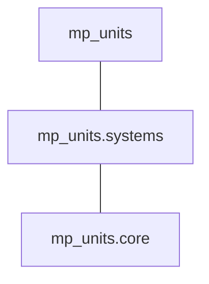

# mp-units 2.2.0 released!

**A new product version can be obtained from
[GitHub](https://github.com/mpusz/mp-units/releases/tag/v2.2.0) and
[Conan](https://conan.io/center/recipes/mp-units?version=2.2.0).**

Among other features, this release provides long-awaited support for C++20 modules, redesigns and
enhances text output formatting, and greatly simplifies quantity point usage. This post describes
those and a few other smaller interesting improvements, while a much longer list of the most
significant changes introduced by the new version can be found in our
[Release Notes](../../release_notes.md#2.2.0).

<!-- more -->

## C++20 modules

[GitHub Issue #7](https://github.com/mpusz/mp-units/issues/7) was our oldest open issue
before this release. Not anymore. After 4.5 years, we finally closed it, even though
the C++ modules' support is still really limited.

!!! info

    To benefit from C++ modules, we need at least:

    - CMake 3.28.1
    - Ninja 1.11
    - clang-17

In the upcoming months, hopefully, the situation will improve with the gcc-14 release and
bug fixes in MSVC.

!!! note

    More requirements for C++ modules support can be found in the
    [CMake's documentation](https://cmake.org/cmake/help/latest/manual/cmake-cxxmodules.7.html).

To enable the compilation and distribution of C++ modules, a
[`cxx_modules`](../../getting_started/installation_and_usage.md#cxx_modules) Conan or
[`MP_UNITS_BUILD_CXX_MODULES`](../../getting_started/installation_and_usage.md#MP_UNITS_BUILD_CXX_MODULES)
CMake option has to be enabled.

With the above, the following C++ modules will be provided:



| C++ Module         | CMake Target         | Contents                                                 |
|--------------------|----------------------|----------------------------------------------------------|
| `mp_units.core`    | `mp-units::core`     | Core library framework and systems-independent utilities |
| `mp_units.systems` | `mp-units::systems`  | All the systems of quantities and units                  |
| `mp_units`         | `mp-units::mp-units` | Core + Systems                                           |

The easiest way to use them is just to `import mp_units;` at the beginning of your translation unit
(see the [Quick Start](../../getting_started/quick_start.md) chapter for some usage examples).

In this release, we also highly limited the number of CMake targets (**breaking change**). Now, they
correspond exactly to the C++ modules they provide. This means that many smaller partial targets
were removed. We also merged text output targets with the core library's definition.

The table below specifies where we can now find the contents of previously available CMake targets:

| Before                    | Now                 |
|---------------------------|---------------------|
| `mp-units::utility`       | `mp-units::core`    |
| `mp-units::core-io`       | `mp-units::core`    |
| `mp-units::core-fmt`      | `mp-units::core`    |
| `mp-units::{system_name}` | `mp-units::systems` |

While we were enabling C++ modules, we also had to refactor our header files slightly
(**breaking change**). Some had to be split into smaller pieces (e.g., _math.h_), while
others had to be moved to a different subdirectory (e.g., _chrono.h_).

In version 2.2, the following headers have a new location or contents:

| Header File                       | C++ Module         | Contents                                        |
|-----------------------------------|--------------------|-------------------------------------------------|
| _mp-units/math.h_                 | `mp_units.core`    | System-independent functions only               |
| _mp-units/systems/si/math.h_      | `mp_units.systems` | Trigonometric functions using `si::radian`      |
| _mp-units/systems/angular/math.h_ | `mp_units.systems` | Trigonometric functions using `angular::radian` |
| _mp-units/systems/si/chrono.h_    | `mp_units.systems` | `std::chrono` compatibility traits              |

Additionally, we merged all of the compatibility-related macros into one header file
_mp-units/compat_macros.h_. This header file should be explicitly included before importing C++
modules if we want to benefit from the [Wide Compatibility tools](../../users_guide/use_cases/wide_compatibility.md).


## Better control over the library's API

With this release, nearly all of the Conan and CMake build options were refactored with the intent
of providing better control over the library's API.

Previously, the library used the latest available feature set supported by a specific
compiler. For example,
[`quantity_spec` definitions would use CRTP](../../users_guide/framework_basics/systems_of_quantities.md#defining-quantities)
on an older compiler or provide a simpler API on a newer one thanks to the C++23 `this` deduction
feature. This could lead to surprising results where the same code written by the user would
compile fine on one compiler but not the other.

From this release, all API extensions have their corresponding configuration options in Conan and
CMake. With this, a user has full control over the API exposed by the library. Those options expose
three values:

- `True` - The feature is always enabled (the configuration error will happen if the compiler does
  not support this feature)
- `False` - The feature is disabled, and an older alternative is always used.
- `Auto` - The feature is automatically enabled if the compiler supports it (old behavior).

Additionally, some CMake options were renamed to better express the impact on our users
(**breaking change**). For example, now CMake options include:

- `MP_UNITS_API_*` - options affecting the library's API,
- `MP_UNITS_BUILD_*` - options affecting the build process,
- `MP_UNITS_DEV_*` - options primarily useful for the project developers or people who want to
  compile our unit tests and examples.

!!! info

    To learn more, please refer to the [Build options](../../getting_started/installation_and_usage.md#build-options)
    chapter.


## Simplified quantity point support

This release significantly simplifies the usage of quantity points and affine space abstractions
in general.

Previously, the user always had to define an explicit point origin even if the domain being modeled
does not have such an explicit origin. Now, in such cases, we can benefit from the implicit point
origins. For example:

=== "Now"

    ```cpp
    quantity_point price_usd{100 * USD};
    ```

=== "Before"

    ```cpp
    constexpr struct zero : absolute_point_origin<zero, currency> {} zero;

    quantity_point price_usd = zero + 100 * USD;
    ```

As we can see above, the new design allows
[direct-initialization](https://en.cppreference.com/w/cpp/language/direct_initialization) of a
`quantity_point` class template from a `quantity`, but only if the former one is defined in terms
of the implicit point origin. Otherwise, an explicit origin still always has to be provided during
initialization.

Also, we introduced the possibility of specifying a default point origin in the unit definition.
With that, we could provide proper temperature scales without forcing the user to always use
the origins explicitly. Also, a new member function, `.quantity_from_zero(),` was introduced
that always returns the quantity from the unit's specific point origin or from the absolute
point origin otherwise.

=== "Now"

    ```cpp
    quantity_point temp{20 * deg_C};
    std::cout << "Temperature: " << temp << " ("
              << temp.in(deg_F).quantity_from_zero() << ", "
              << temp.in(K).quantity_from_zero() << ")\n";
    ```

=== "Before"

    ```cpp
    quantity_point temp = si::zeroth_degree_Celsius + 20 * deg_C;
    std::cout << "Temperature: " << temp << " ("
              << temp.in(deg_F).quantity_from(usc::zeroth_degree_Fahrenheit) << ", "
              << temp.in(K).quantity_from(si::zeroth_kelvin) << ")\n";
    ```

More information about the new design can be found in
[The Affine Space](../../users_guide/framework_basics/the_affine_space.md)
chapter.


## Unified temperature point origins names

By omission, we had the following temperature point origins in the library:

- `si::zero_kelvin` (for `si::kelvin`),
- `si::zeroth_degree_Celsius` (for `si::degree_Celsius`),
- `usc::zero_Fahrenheit` (for `usc::degree_Fahrenheit`).

With this release, the last one was renamed to `usc::zeroth_degree_Fahrenheit` to be consistently
named with its corresponding unit and with the `si::zeroth_degree_Celsius` (**breaking change**).


## Changes to units definitions

[WG21 Study Group 16 (Unicode) raised concerns](https://github.com/sg16-unicode/sg16-meetings#january-24th-2024)
about potential ABI issues when different translation units are compiled with different ordinary
literal encodings. Those issues were resolved with a change to units definitions (**breaking
change**). It affects only units that specify both Unicode and ASCII symbols. The new design
requires the Unicode symbol to be provided as a UTF-8 literal:

=== "Now"

    ```cpp
    inline constexpr struct ohm : named_unit<{u8"Ω", "ohm"}, volt / ampere> {} ohm;
    ```

=== "Before"

    ```cpp
    inline constexpr struct ohm : named_unit<{"Ω", "ohm"}, volt / ampere> {} ohm;
    ```


## Improved text output

With this release, we can print not only whole quantities but also just their units or dimensions.
Also, we fixed the `std::format` support so users can now enjoy full C++20 compatibility and
don't have to use [fmtlib](https://github.com/fmtlib/fmt) anymore.

We have also changed the grammar for quantities formatting (**breaking change**). It introduces
the composition of underlying formatters that finally allows us to properly format user-defined
representation types (assuming they have `std::format` support). Additionally, thanks to a
new `%?` token, we can provide a custom format string that will properly print quantity of any unit.

Here is a small preview of what is now available:

```cpp
using namespace mp_units::si::unit_symbols;
using namespace mp_units::international::unit_symbols;
quantity q = (90. * km / h).in(mph);

std::cout << "Number: " << q.numerical_value_in(mph) << "\n";
std::cout << "Unit: " << q.unit << "\n";
std::cout << "Dimension: " << q.dimension << "\n";
std::println("{:{%N:.2f}%?%U}", q);
std::println("{:.4f} in {} of {}", q.numerical_value_in(mph), q.unit, q.dimension);
std::println("{:{%N:.4f} in %U of %D}", q);
```

```text
Number: 55.9234
Unit: mi/h
Dimension: LT⁻¹
55.92 mi/h
55.9234 in mi/h of LT⁻¹
55.9234 in mi/h of LT⁻¹
```

More on this subject can be found in the updated [Text Output](../../users_guide/framework_basics/text_output.md)
chapter.


## Improved casts

We added a new conversion function. `value_cast<Unit, Representation>` forces the conversion
of both a unit and representation type in one step and always ensures that the best precision
is provided.

Also, we have finally added proper implementations of `value_cast` and `quantity_cast` for
quantity points.


## Even better error messages

This release made a few small refactorings that, without changing the user-facing API, allowed us
to improve the readability of the generated types that can be observed in the compilation errors.

Example 1 (clang):

=== "Now"

    ```txt
    error: no matching function for call to 'time_to_goal'
       26 |   const quantity ttg = time_to_goal(half_marathon_distance, pace);
          |                        ^~~~~~~~~~~~
    note: candidate template ignored: constraints not satisfied [with distance:auto = quantity<kilo_<metre>{}, double>,
                                                                      speed:auto = quantity<derived_unit<second, per<kilo_<metre>>>{}, double>]
       13 | QuantityOf<isq::time> auto time_to_goal(QuantityOf<isq::length> auto distance,
          |                            ^
    note: because 'QuantityOf<quantity<derived_unit<si::second, per<si::kilo_<si::metre> > >{{{}}}>, isq::speed>' evaluated to false
       14 |                                         QuantityOf<isq::speed> auto speed)
          |                                         ^
    note: because 'QuantitySpecOf<std::remove_const_t<decltype(quantity<derived_unit<second, per<kilo_<metre> > >{{{}}}, double>::quantity_spec)>, struct speed{{{}}}>' evaluated to false
       61 | concept QuantityOf = Quantity<Q> && QuantitySpecOf<std::remove_const_t<decltype(Q::quantity_spec)>, QS>;
          |                                     ^
    note: because 'implicitly_convertible(kind_of_<derived_quantity_spec<isq::time, per<isq::length> > >{}, struct speed{{{}}})' evaluated to false
      147 |   QuantitySpec<T> && QuantitySpec<std::remove_const_t<decltype(QS)>> && implicitly_convertible(T{}, QS) &&
          |                                                                         ^
    1 error generated.
    Compiler returned: 1
    ```

=== "Before"

    ```txt
    error: no matching function for call to 'time_to_goal'
       26 |   const quantity ttg = time_to_goal(half_marathon_distance, pace);
          |                        ^~~~~~~~~~~~
    note: candidate template ignored: constraints not satisfied [with distance:auto = quantity<kilo_<metre{{}}>{}, double>,
                                                                      speed:auto = quantity<derived_unit<second, per<kilo_<metre{{}}>>>{}, double>]
       13 | QuantityOf<isq::time> auto time_to_goal(QuantityOf<isq::length> auto distance,
          |                            ^
    note: because 'QuantityOf<quantity<derived_unit<si::second, per<si::kilo_<si::metre{{}}> > >{{{}}}>, isq::speed>' evaluated to false
       14 |                                         QuantityOf<isq::speed> auto speed)
          |                                         ^
    note: because 'QuantitySpecOf<std::remove_const_t<decltype(quantity<derived_unit<second, per<kilo_<metre{{}}> > >{{{}}}, double>::quantity_spec)>, struct speed{{{}}}>' evaluated to false
       61 | concept QuantityOf = Quantity<Q> && QuantitySpecOf<std::remove_const_t<decltype(Q::quantity_spec)>, QS>;
          |                                     ^
    note: because 'implicitly_convertible(kind_of_<derived_quantity_spec<isq::time, per<isq::length> >{{}, {{}}}>{}, struct speed{{{}}})' evaluated to false
      147 |   QuantitySpec<T> && QuantitySpec<std::remove_const_t<decltype(QS)>> && implicitly_convertible(T{}, QS) &&
          |                                                                         ^
    1 error generated.
    Compiler returned: 1
    ```

Example 2 (gcc):

=== "Now"

    ```txt
    error: no matching function for call to 'Box::Box(quantity<reference<isq::height, si::metre>(), int>, quantity<reference<horizontal_length, si::metre>(), int>,
                                                      quantity<reference<isq::width, si::metre>(), int>)'
       27 | Box my_box(isq::height(1 * m), horizontal_length(2 * m), isq::width(3 * m));
          |                                                                           ^
    note: candidate: 'Box::Box(quantity<reference<horizontal_length, si::metre>()>, quantity<reference<isq::width, si::metre>()>,
                                              quantity<reference<isq::height, si::metre>()>)'
       19 |   Box(quantity<horizontal_length[m]> l, quantity<isq::width[m]> w, quantity<isq::height[m]> h):
          |   ^~~
    note:   no known conversion for argument 1 from 'quantity<reference<isq::height, si::metre>(),int>'
            to 'quantity<reference<horizontal_length, si::metre>(),double>'
       19 |   Box(quantity<horizontal_length[m]> l, quantity<isq::width[m]> w, quantity<isq::height[m]> h):
          |       ~~~~~~~~~~~~~~~~~~~~~~~~~~~~~~~^
    ```

=== "Before"

    ```txt
    error: no matching function for call to 'Box::Box(quantity<reference<isq::height(), si::metre()>(), int>, quantity<reference<horizontal_length(), si::metre()>(), int>,
                                                      quantity<reference<isq::width(), si::metre()>(), int>)'
       27 | Box my_box(isq::height(1 * m), horizontal_length(2 * m), isq::width(3 * m));
          |                                                                           ^
    note: candidate: 'Box::Box(quantity<reference<horizontal_length(), si::metre()>()>, quantity<reference<isq::width(), si::metre()>()>,
                                              quantity<reference<isq::height(), si::metre()>()>)'
       19 |   Box(quantity<horizontal_length[m]> l, quantity<isq::width[m]> w, quantity<isq::height[m]> h):
          |   ^~~
    note:   no known conversion for argument 1 from 'quantity<reference<isq::height(), si::metre()>(),int>'
            to 'quantity<reference<horizontal_length(), si::metre()>(),double>'
       19 |   Box(quantity<horizontal_length[m]> l, quantity<isq::width[m]> w, quantity<isq::height[m]> h):
          |       ~~~~~~~~~~~~~~~~~~~~~~~~~~~~~~~^
    ```


## _math.h_ header changes

This release provided lots of changes to the _mp_units/math.h_ header file.

First, `fma`, `isfinite`, `isinf`, and `isnan` math function were added by
[@NAThompson](https://github.com/NAThompson). Thanks!

Additionally, we changed the namespace for trigonometric functions using SI units. Now they are
inside of the `mp_units::si` subnamespace and not in `mp_units::isq` like it was the case before
(**breaking change**).

Also, the header itself was split into smaller pieces that improve C++20 modules definitions.
