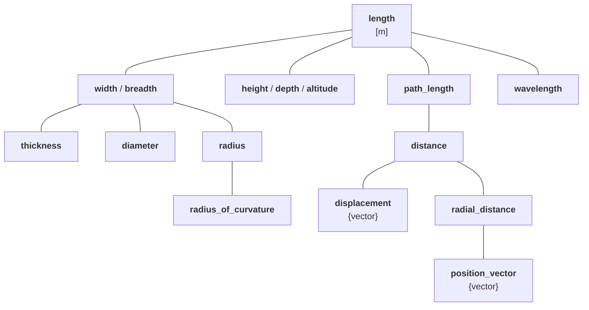

# Bringing Quantity-Safety To The Next Level

All quantities and units libraries need to be unit-safe. Most of the libraries on the market do
this correctly. Some of them are also dimension-safe, which adds another level of protection for
their users.

**mp-units** is probably the only library on the market that additionally is quantity-safe. This
gives a new quality and possibilities. I've described the major idea behind it, implementation
details, and benefits to the users in the [series of posts about the International System of Quantities](isq-part-5-benefits.md).

However, this is only the beginning. We've always planned more and worked on the extensions in our
free time. In this post, I will describe:

- What a quantity character is?
- The importance of using proper representation types for the quantities.
- The power of providing character-specific operations for the quantities.
- Discuss implementation challenges and possible solutions.

<!-- more -->

## Quantity characters

A quantity character determines the properties and operations that can be performed on the
[numerical value of a quantity](../../appendix/glossary.md#numerical-value).

Quantities defined by the ISQ may be of the following characters:

- scalar (e.g., _time_, _width_, _speed_, _apparent power_),
- complex (e.g., _complex power_, _voltage phasor_, _electric current phasor_),
- vector (e.g., _displacement_, _velocity_, _force_),
- tensor (e.g., _moment of inertia_, _stress_, _strain_).

From the beginning, **mp-units** V2 was meant to properly support quantities of various
characters. By default, all quantity types are scalars, but we can set any other quantity character
in a `quantity_spec` definition. For example:

```cpp
inline constexpr struct displacement final : quantity_spec<length, quantity_character::vector> {} displacement;
```

Character of derived quantities is inherited from the quantity equation taking into account the
operations and their ingredients. For example the below _velocity_ quantity will automatically
get a vector character without the need to explicitly state it in the definition:

```cpp
inline constexpr struct velocity final : quantity_spec<displacement / duration> {} velocity;
```

Similarly, the below will yield a _speed_ quantity of a scalar character:

```cpp
inline constexpr struct speed final : quantity_spec<magnitude(velocity)> {} speed;
```


## Representation types

**mp-units** V2 requires providing representation types compatible with a specific character set
in its `quantity_spec` definition:

```cpp
template<Reference auto R, RepresentationOf<get_quantity_spec(R)> Rep = double>
class quantity;
```

For example, this allows us to check that vector representation type is used to construct
a _velocity_ quantity and to ensure that _speed_ gets a scalar:

```cpp
quantity q = vector{1, 2, 3} * m / s;
quantity velocity = isq::velocity(q);
// quantity speed = isq::speed(q);     // Compile-time error
```

Another example here may be a _complex power_ quantity that should use a representation type
modeling a complex number, but _apparent power_, _active power_, and _reactive power_ should
get scalars.

As we can see above, in the case of `q`, we can use any representation type with a quantity kind
that just specify a unit ([simple quantities](../../users_guide/framework_basics/simple_and_typed_quantities.md#simple-quantities)).
However, we need to provide a compatible representation type when we want to use
[strongly-typed quantities](../../users_guide/framework_basics/simple_and_typed_quantities.md#typed-quantities)
and be quantity-safe.

Such checks already prevent many simple but common errors of mixing similar quantities in
a specific domain.

!!! info

    It is a common engineering practice to use fundamental types for vector quantities when we know
    the direction of the vector. For example, in many cases, we use `double` to express _velocity_
    or _acceleration_. In such cases, negative values mean moving backward or decelerating. This
    is why we also decided to allow such use cases in the library. A scalar representation type
    that provides `abs()` member or non-member function or works with `std::abs()` is considered
    a one-dimensional vector type:

    ```cpp
    quantity speed = isq::speed(60 * km / h);
    quantity velocity = isq::velocity(60 * km / h);
    ```


## Character-specific operations

Checking the representation type is only the first step in bringing additional safety.
The real power comes with implementing character-specific operations.

### Current state of the art

Most units libraries on the market (not only for C++) provide only regular arithmetic operations for
scalars and don't constrain them for quantities of other characters. They also do not offer any
character-specific operations.

For example, let's look closer into vector quantities. Most of the libraries on the market
will happily accept the following or similar code:

```cpp
auto force = get_force();
auto length = get_length();
auto work = force * length;
```

They will also accept the following line:

```cpp
auto moment_of_force = force * length;
```

Does it mean that _moment of force_ and _work_ are the same quantities? Of course not! It is just
how naive most libraries are today.

But first, to defend them, I must admit that the behavior above is partially OK. `force * length`
could yield some specific quantity, but it is definitely not _work_ or _moment of force_.

There are two problems here:

1. Libraries on the market are not aware of the characters of the quantities being used in the equation.
   This means they can't prevent scalar arithmetic operations from being performed on vector quantities.
   This typically leads to compile-time errors when a proper linear algebra representation type is
   used in a quantity, as most linear algebra libraries will not overload `operator*` for vectors,
   and those that do, treat it as a dot product, which returns a scalar.
2. None of the libraries allows us to constrain the return type of such multiplication with
   a specific quantity type to specify exactly what we want to achieve. Most of them allow for replacing
   `auto` with a type that describes just a unit, or, at best, the dimension. This means that all of
   them are unit-safe, and some are also dimension-safe. However, this is not helpful here and does
   not allow the library to do any additional compile-time checks on the resulting quantities.
   The fact that we named the results as `work` or `moment_of_force` does not mean anything to
   the compiler or the library being used.

This isn't good.

### Benefits of quantity-safe library

As we've stated in the beginning, **mp-units**, besides being unit-safe and dimension-safe, is also
quantity-safe. Let's see what it means.

!!! note

    The features described below are planned for the next major release of the library and are
    not available on the master branch as of today.

First, we repeat what other libraries did:

```cpp
quantity force = get_force();
quantity length = get_length();
quantity q1 = force * length;
```

The code compiles as long as `length` is a scalar quantity with a scalar representation type.
We can always multiply or divide a vector quantity (e.g., _force_) by a scalar one.

However, things stop compiling when we want to convert the obtained result to a specific quantity
type:

```cpp
// quantity moment_of_force = isq::moment_of_force(q1);  // Compile-time error
// quantity work = isq::work(q1);                        // Compile-time error
```

Neither _moment of force_ nor _work_ quantity can be created from a scalar _length_. We need very
specific vector quantities of kind _length_ to do that:

```cpp
quantity displacement = get_displacement();
quantity position_vector = get_position_vector();
```

Now, if we try to multiply the variables as before, we will end up with a compilation error:

```cpp
// quantity q2 = force * displacement;                   // Compile-time error
// quantity q3 = force * position_vector;                // Compile-time error
```

Multiplication on vectors is mathematically not defined. We have to use proper operations:

```cpp
quantity q2 = scalar_product(force, displacement);
quantity q3 = scalar_product(force, position_vector);
quantity q4 = vector_product(force, displacement);
quantity q5 = vector_product(force, position_vector);
```

All of the above compile and result in some quantities. After that, we can try to convert those
results to our required quantities:

```cpp
quantity work = isq::work(q2).in[J];
// quantity work = isq::work(q3);                        // Compile-time error
// quantity work = isq::work(q4);                        // Compile-time error
// quantity work = isq::work(q5);                        // Compile-time error
```

!!! important

    It is essential to realize that just like multiplication and division are for scalars,
    vector and scalar products are for vectors. We never want to accept a quantity that
    accidentally was created with multiplication instead of division of its arguments or
    with the scalar product instead of a vector product, right?

So we are done with _work_. Let's create a _moment of force_ quantity as well.
It might be surprising to many that none of the following code compiles:

```cpp
// quantity moment_of_force = isq::moment_of_force(q2);  // Compile-time error
// quantity moment_of_force = isq::moment_of_force(q3);  // Compile-time error
// quantity moment_of_force = isq::moment_of_force(q4);  // Compile-time error
// quantity moment_of_force = isq::moment_of_force(q5);  // Compile-time error
```

Do you know why it does not compile? Please try to think about it for a minute and figure out what
is the problem before checking the answer below.

??? Tip "!!! Spoiler alert !!!"

    Vector product is anti-commutative. Similarly to the division for scalars, for a vector product
    it is important to decide which quantity we put on the left and right-hand side of the
    operation.

    To make it compile, we need to reverse the arguments of a `vector_product()` operation:

    ```cpp
    quantity q6 = vector_product(position_vector, force);
    quantity moment_of_force = isq::moment_of_force(q6);
    ```

Do you start to see the need for such checks at compile-time already? :nerd:

### Explicit conversions are not really needed

You may be worried by the fact that we needed explicit quantity conversions above and that the code
without them compiled fine. It might look like a safety pitfall, but it is really not an issue.

The code above used a `quantity` CTAD placeholder which works a bit like `auto`. It accepts any
quantity and deduced proper type for it. And all of the above operations resulted in some
quantities, but often not the ones we were interested in.

In the production code, we deal with strong types in many places (members in classes, function
arguments and return types, etc.). In generic code, we should use concepts to constrain template
parameters. This will be enough to guarantee quantity-safety.

For example:

```cpp
void func1(quantity<isq::work[J]> w);
void func2(QuantityOf<isq::moment_of_force> auto mof);

func1(q2);
func2(q6);
// func1(q6);  // Compile-time error
// func2(q2);  // Compile-time error
```

*[CTAD]: Class Template Argument Deduction

### Peeking under the hood

Let's look at the definitions of _work_ and _moment of force_ quantities to understand how and why
the above works:

```cpp
inline constexpr struct work final : quantity_spec<scalar_product(force, displacement)> {} work;
inline constexpr struct moment_of_force final : quantity_spec<vector_product(position_vector, force)> {} moment_of_force;
```

`scalar_product()` and `vector_product()` functions are overloaded not only for `quantity` but
also for `quantity_spec` types. The results of such operations are symbolic expressions that
identify those operations. When used as a quantity recipe in a `quantity_spec` definition, they
tell the library which derived quantities may be implicitly converted to our quantity.

### What do other libraries do?

I am probably not wrong in stating that none of the major C++ units libraries on the market provides
vector or complex operations on quantities. This is why none of them will work when a proper
representation type will be provided to a quantity. Trying to do any operations on a quantity with
a linear algebra vector as its representation type will fail to compile.

This is also mostly true for other programming languages.
A great exception, and in fact the only library that I know which provides such operations, is
Python's [Pint](https://pint.readthedocs.io/en/stable/user/numpy.html#Function/Method-Support)
(thanks to [NumPy](https://numpy.org/doc/stable/index.html) support).

As other libraries do not support quantities of a vector type, they require users to create
homogenous vectors of quantities and do all of the linear algebra operations with a 3rd party
library. This approach can't be quantity-safe!

In such scenarios, the units library can't detect if an external linear algebra library performs
a scalar or vector product operation. It only observes the individual multiplications on scalar
ingredients of an external vector type. This is actually why such multiplication operations are
provided in other units libraries in the first place.

Let's compare those approaches:

=== "Quantity-Safe"

    ```cpp
    quantity displacement_1 = isq::displacement(la::vector{1, 2, 3} * m);
    quantity displacement_2 = isq::displacement(la::vector{2, 1, 0} * m);
    quantity displacement = displacement_1 + displacement_2;
    quantity force = isq::force(la::vector{42, 42, 42} * N);
    quantity work = isq::work(scalar_product(force, displacement));
    ```

=== "Also Quantity-Safe"

    ```cpp
    quantity displacement_1 = la::vector{1, 2, 3} * m;
    quantity displacement_2 = la::vector{2, 1, 0} * m;
    quantity displacement = displacement_1 + displacement_2;
    quantity force = la::vector{42, 42, 42} * N;
    quantity<isq::work[J]> work = scalar_product(force, displacement);
    ```

=== "Other units libraries"

    ```cpp
    la::vector<quantity<si::metre>> displacement_1 = la::vector{1 * m, 2 * m, 3 * m};
    la::vector<quantity<si::metre>> displacement_2 = la::vector{2 * m, 1 * m, 0 * m};
    la::vector<quantity<si::metre>> displacement = displacement_1 + displacement_2;
    la::vector<quantity<si::newton>> force = la::vector{42 * N, 42 * N, 42 * N};
    quantity<si::joule> work = la::scalar_product(force, displacement);
    ```

Of course, someone could argue that incorrect use of a vector product operation above would also
be safe as it will not compile as the return type differs. Yes, it is true. However, please
remember that there are more cases where errors may happen.

For example, an external linear algebra library will not protect us from providing arguments to
a vector product in an invalid order.

Also, our `work` quantity will never be able to detect if what we are trying to assign to it is
a result of a scalar product of two vector quantities of _displacement_ and _force_, or maybe just
some naive multiplication of scalar quantities that accidentally matched the dimensionality of
the expected result.

Please also remember that the quantity characters are not only about linear algebra. For example,
in the case of complex quantities, we want to ensure that only:

- the real part of a _complex power_ is assigned to an _active power_,
- the imaginary part of a _complex power_ is assigned to an _active power_,
- the modulus of a _complex power_ is assigned to an _apparent power_.

Mixing the above is a fatal error in power systems engineering.


## Implementation challenges

I had planned to implement the above features for a few years now but never had enough time to do it.
Now, I am close to finishing the work. However, I've discovered a few interesting issues on the way,
and I have to solve them before putting my code on the mainline and releasing the next **mp-units**
version.

### Modeling magnitudes

Let's dig in a bit more into proper modelling of _position vector_ and _displacement_ quantities.
First, we have to think to which scalar quantities their magnitude should convert to:

- a magnitude of a _position vector_ is equivalent to a _radial distance_ quantity,
- a magnitude of a _displacement_ is a special case of a _distance_ quantity.

Taking the above into account, we should refactor our tree of quantities of kind _length_ into
the following:



Having the above, we can look a bit closer into how _velocity_ and _speed_ are defined in the ISQ:

!!! quote "ISO 80000-3: Space and time"

    **_velocity_** - vector quantity giving the rate of change of a _position vector_.

    **_speed_** - magnitude of the _velocity_.

Change of a _position vector_ is nothing else than a _displacement_. This means that _velocity_
and _speed_ can be defined as follows:

```cpp
inline constexpr struct velocity final : quantity_spec<displacement / duration> {} velocity;
inline constexpr struct speed final : quantity_spec<magnitude(velocity)> {} speed;
```

This is compatible with the ISQ definitions. However, we should check what it means from the
engineering point of view. Let's assume that we want to calculate _speed_ directly from
a _distance_ traveled and _duration_, without using any vector quantities like _displacement_
or _velocity_:

```cpp
quantity<isq::distance[m]> distance = 42 * m;
quantity<isq::duration[s]> duration = 2 * s;
// quantity<isq::speed[m / s]> speed = distance / duration;  // Compile-time error
```

The above does not compile because _distance_ quantity is not implicitly convertible to
_magnitude(displacement)_. This is the same case as stating that not every _length_ is
a _distance_. We need to cast here explicitly. To fix it, we can do any of the below:

```cpp
quantity<isq::speed[m / s]> speed1 = isq::speed(distance / duration);
quantity<isq::speed[m / s]> speed2 = magnitude(isq::displacement)(distance) / duration;
```

Also, the following will work:

```cpp
quantity length_kind = 42 * m;
quantity<isq::speed[m / s]> speed3 = length_kind / duration;
```

If we do not specify a specific quantity type and just use an SI unit, then we deal with the
kind of quantity. Such quantity can behave like any quantity from the hierarchy tree with
the same character, so it is also the same as `magnitude(isq::displacement)`.

!!! question

    Is it good enough from the engineering and usability point of views? If you would like to
    share your thoughts, please provide your comments below the article.

### More about _displacement_ and _position vector_

As we've stated above, a change of _position vector_ is a _displacement_. Let's try to calculate
it here:

```cpp
quantity pos1 = isq::position_vector(vector{1, 2} * m);
quantity pos2 = isq::position_vector(vector{2, 3} * m);
quantity q7 = pos2 - pos1;
// quantity<isq::displacement[m], vector> displacement = q7;  // Compile-time error
// quantity displacement = isq::displacement(q7);             // Compile-time error
quantity displacement = quantity_cast<isq::displacement>(q7);
```

Again, the above might be surprising and considered a usability issue. Let me describe why the code
behaves like that.

As of today, the result of an addition or subtraction of two quantities is their common quantity
type. When subtracting two _position vectors_ we end up with a _position vector_.
Looking at the above hierarchy tree, we can easily see that _position vector_ and
_displacement_ are on different branches. This prevents implicit and explicit conversions
between those. The only one allowed to force such a conversion is an explicit cast.

If we think more about it, this makes a lot of sense. _Position vector_ is not a special
case of _displacement_ or vice versa. Those should not be convertible. We do not want the code
to compile when we accidentally pass a _position vector_ to the numerator of the equation for
_velocity_, right? What does calculating the _velocity_ for a _position vector_ mean?

### Affine spaces within quantity trees

Also, let's look at the type of variable `q7`. We know that subtracting two
quantities of the same type results in a quantity of the same type. This is also the case
when we do it for _position vectors_. We will see the same resulting type when we add two
_position vectors_ as well. But wait... What does it actually mean to add two _position vectors_?

Looks familiar? Yes, we can clearly see that we are dealing with yet another case of
the [affine space](../../users_guide/framework_basics/the_affine_space.md). This time, it is
hidden within the quantities hierarchy tree. This also means that adding a _position vector_
and a _displacement_ should result in a _position vector_. Let's try to do it:

```cpp
quantity q8 = pos1 + displacement;                       // Often a compile-time error
```

Unfortunately, this often fails on the very first step, even before assigning the result to
the _position vector_ quantity. The reason for this is that in the hierarchy tree, the first common
node for _position vector_ and _displacement_ is _distance_, which is a scalar quantity. Trying
to use a vector representation type for a scalar quantity yields an error as a result of already
existing checks described in the [Representation types](#representation-types) chapter.

However, the code will compile if we use the same representation type for scalar and vector
quantity (e.g., `int` or `double` may be used as a vector representation type for a well-known
axis). In this case, we will end up with:

```cpp
// quantity<isq::position_vector[m], vector> pos3 = q8;       // Compile-time error
quantity<isq::position_vector[m], vector> pos3 = isq::position_vector(q8);
```

We need to convert a _distance_ explicitly to a _position vector_ quantity to move "down" over
a branch in a hierarchy tree.

It is important to note that there are more quantities that may behave the same. For example,
_altitude_/_height_ and _time_/_duration_ may also form similar affine spaces. More similar
examples can be found in other hierarchy trees.

### Extending arithmetic on quantity specifications

**mp-units** provided support for multiplication and division of `quantity_spec` from the
beginning. It was needed to obtain derived quantities. Adding support for quantity characters
also added special operations (e.g., `magnitude()`, `scalar_product()`, etc.) on `quantity_spec`
arguments. If we want to support such affine space abstractions, we must also add support
for addition and subtraction, which may yield different results.

For example:

```cpp
static_assert(isq::length + isq::length == isq::length);
static_assert(isq::height + isq::width == isq::length);
static_assert(isq::altitude + isq::height == isq::altitude);
static_assert(isq::height + isq::altitude == isq::altitude);

static_assert(isq::length - isq::length == isq::length);
static_assert(isq::height - isq::width == isq::length);
static_assert(isq::altitude - isq::height == isq::altitude);
static_assert(isq::altitude - isq::altitude == isq::height);
```

Also, some operations should not compile. For example:

```cpp
// auto qs1 = isq::altitude + isq::altitude;  // Compile-time error
// auto qs2 = isq::height - isq::altitude;    // Compile-time error
```

### Defining affine space abstractions in a `quantity_spec`

We can add support for the above by adding `point_for<QuantitySpec>` attribute to the
`quantity_spec` definition:

```cpp
inline constexpr struct height final : quantity_spec<length> {} height;
inline constexpr struct altitude final : quantity_spec<length, point_for<height>> {} altitude;
inline constexpr struct displacement final : quantity_spec<distance, quantity_character::vector> {} displacement;
inline constexpr struct position_vector final : quantity_spec<radial_distance, point_for<displacement>, quantity_character::vector> {} position_vector;
```

Thanks to the above, the library always knows a "delta" quantity for a "point" type. I've
implemented this logic, got great results, and thought I was done. But next, I realized that
I need to update a few more things.

### Adding support to `quantity_point`

`quantity_point` is intended to model "point" quantities and return "delta" quantities on
subtraction or by calling `.quantity_from...()` family of member functions. This is possible and
can be done. I've finished most of the implementation already. However, two interesting questions
arise:

1. Should `isq::altitude` be reserved only for `quantity_point` and not available for
   "regular" `quantity` types?
2. Should `isq::height` apply only to `quantity`?

I think that question #1 makes a lot of sense. If we realize that `quantity` always represents
"delta" quantities, what would a `quantity` of `isq::altitude` mean? However, forcing the
usage of `quantity_point` might be too strict here. Some users are not familiar or comfortable with
this abstraction. Also, we can't multiply or divide quantity points.

!!! question

    Does anyone know a derived quantity built with altitude or time instant? If so, please let me
    know in the comments, as limiting "point" `quantity_spec` to `quantity_point` would prevent
    forming such derived quantities.

Question #2 is also interesting. However, in this case, I think that the answer should be "NO".
I can imagine a series of _height_ measurements. Every physical measurement can be modeled as
a `quantity_point`, so a `quantity_point` of _height_ might make sense.

### Opening can of worms

So far, so good. I thought I was done here and could continue my work on symbolic expressions
for vector and complex quantities. However, I've realized that I've opened a can of worms.
What about the convertibility of `quantity_spec`? How should `common_quantity_spec()` behave?

Let's start with conversions. It might seem easy. `isq::altitude` and `isq::height` should not be
convertible to each other. But more questions arise:

1. Should it be possible to `quantity_cast` from `isq::altitude` to `isq::height` or vice versa?
2. Should `isq::height` be convertible to `isq::length`?
3. Should `isq::length` be explicitly convertible to `isq::height`?
4. Should `isq::altitude` be convertible to `isq::length`?
5. Should `isq::length` be explicitly convertible to `isq::altitude`?

The need for #1 will always probably mean an error in program logic, so `quantity_cast` could
not work for such entities. This would be an exception to our conversion rules that always
allow casting between branches of one tree.

The answer to questions #2 and #3 is "YES".

We might be tempted to say "NO" to questions #4 and #5 as `isq::altitude` is defined as "point"
while `isq::length` is not specified as such. However, I've just realized that it is not the case.

The proper answer to questions #4 and #5 is "It depends". If we are dealing with a `quantity_point`
then converting from `isq::altitude` to `isq::length` or the other way around should work. However,
it would probably be a bad idea for a `quantity` type.

It turns out that `common_quantity_spec()` is similar. It is probably safe to state that it should
not compile for `isq::altitude` and `isq::height` arguments. This means that we will not be able
to compare such quantities as well. As those are different abstractions, preventing that might be
an excellent idea.

Again, it gets tricky if we consider passing `isq::length` and `isq::altitude` to it. For
`quantity_point` it probably should work fine and fail to compile for `quantity`.

The above means that to determine the conversion rules and common quantity specifications, we need
to know the context in which the `quantity_spec` is being used. This sucks!


### Should we get rid of a `quantity_point`?

There are at least two ways of solving the above issue. In any case, we need to introduce a wrapper
over the `quantity_spec` to denote it is being used in a "point" abstraction.

A simpler solution could be implicitly amending the `Reference` provided to the `quantity_point`
class template with `point<...>`. So, for example, we would have the following members in
`quantity_point<isq::altitude[m]>`:

- `qp::quantity_spec == point<isq::altitude>`,
- `qp::reference` of a type `reference<point<isq::altitude>, si::metre>`.

This should work but might be a bit confusing as members of the class template would not exactly
contain the types of template parameters.

A better solution might be removing a dedicated `quantity_point` abstraction and providing both
functionalities through the `quantity` class template. I still haven't figured out the best syntax.
Please let me know if you have good ideas in the comments below. Here are some rough ideas:

| Before                                             | After                                               | `quantity_spec`               |
|----------------------------------------------------|-----------------------------------------------------|-------------------------------|
| `quantity<si::metre>`                              | `quantity<si::metre>`                               | `kind_of<isq::length>`        |
| `quantity_point<si::metre>`                        | `quantity<point<si::metre>>`                        | `point<kind_of<isq::length>>` |
| `quantity_point<si::metre, mean_sea_level>`        | `quantity<point<si::metre, mean_sea_level>>`        | `point<kind_of<isq::length>>` |
| `quantity<isq::height[m]>`                         | `quantity<isq::height[m]>`                          | `isq::height`                 |
| `quantity_point<isq::height[m]>`                   | `quantity<point<isq::height[m]>>`                   | `point<isq::height>`          |
| `quantity_point<isq::altitude[m]>`                 | `quantity<point<isq::altitude[m]>>`                 | `point<isq::altitude>`        |
| `quantity_point<isq::altitude[m], mean_sea_level>` | `quantity<point<isq::altitude[m], mean_sea_level>>` | `point<isq::altitude>`        |

I am still undecided about whether we should pursue this option, which would involve a huge design
change in the library. It may even require bumping the library major version to V3.

On the bright side, it would limit the number of abstractions in the library. It would also make
the library more consistent with standards like ISO/IEC 80000, which talk about quantities and do
not mention quantity points at all. This could also be useful before we start our work on the next
big task - logarithmic quantities and units.
