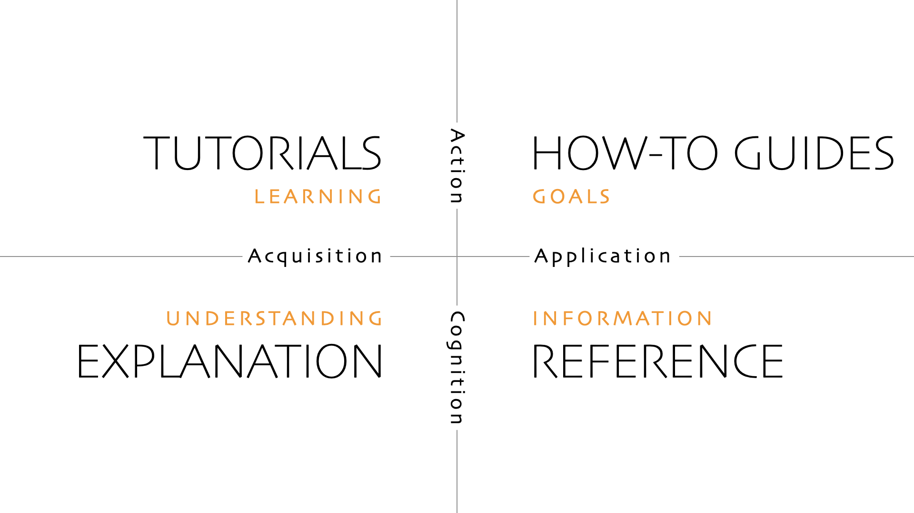
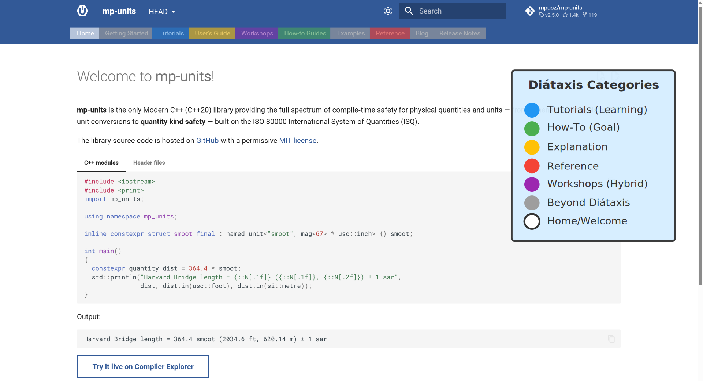

# Documentation is prose, not a Doxygen dump

You found the perfect C++ library. The code is clean, the benchmarks hold up, and the
license fits. Then you go looking for the documentation, and there is none. There is a
`README`, a little longer than most, and after that, you are on your own.

<!-- more -->

This is the most common failure, and it is worse than a clumsy documentation site.
Some of the most technically impressive C++ libraries of the last decade do exactly this.
There is no browsable index of the types and operations they provide, so the only way to
discover what exists is to open the headers and read them. These are excellent projects,
written by people who know their domains far better than most. That is exactly the point:
technical brilliance does not save you here. If the only way to learn what your library
offers is to parse its template headers, most people will simply leave.

So the first rule is boring and not up for debate: write documentation. Not a longer
`README`. Actual documentation.

The second failure is subtler, and it is the one this post is really about. Once a project
decides to document itself, the reflex in C++ is to run Doxygen over the headers and
publish the result.

## Doxygen is one quarter of the job

I want to be fair to Doxygen, because it is often cast as the villain, and it is not. An
autogenerated API reference is genuinely useful. It is complete, it stays in sync with
the code, and when you already know what you are looking for, it is the right tool. The
problem is not that it is bad. The problem is that it is presented as the whole, even
though it is only one part of the documentation.

A reference is a dictionary. A dictionary is invaluable once you know the words. Hand it
to someone learning the language, and it teaches them nothing, because they do not yet
know what to look up. "Sets the width. Parameter: the width to set" is technically a
definition and practically useless. A newcomer who did not understand the function before
still does not understand it after.

## Four readers, four kinds of documentation

The model that makes this concrete is [Diátaxis](https://diataxis.fr), by Daniele
Procida. It observes that people arrive at documentation with four different intents, and
one document cannot serve all four.

*The Diátaxis framework. Diagram by Daniele Procida,
[diataxis.fr](https://diataxis.fr), licensed
[CC BY-SA 4.0](https://creativecommons.org/licenses/by-sa/4.0/).*

The four intents map to four kinds of documentation:

- **Tutorials**, for the reader who wants to learn. A guided first success, where they
  follow you rather than look things up.
- **How-to guides**, for the reader with a specific task. A recipe for a real problem,
  assuming some familiarity.
- **Reference**, for the reader who needs to look something up. Precise and exhaustive.
  This is the quadrant Doxygen fills well, and usually the only one a C++ project has
  (if any).
- **Explanation**, for the reader who wants to understand why the design is the way it
  is. The tradeoffs and the reasoning behind them.

An autogenerated reference covers exactly one of these four. Shipping it alone and calling
the library documented is the mistake. The tutorial and the explanation are the hardest to
write, because no tool can generate them, and they are the two that decide whether a
stranger becomes a user. In the **mp-units** docs, this split is deliberate: the navigation
is divided into [Tutorials](../../tutorials/index.md),
[How-to Guides](../../how_to_guides/index.md), a
[User's Guide](../../users_guide/index.md) for understanding, and a
[Reference](../../reference/index.md), so a visitor lands on the quadrant that matches what
they actually need.

*The mp-units navigation, with each section color-coded to its Diátaxis quadrant.*

There is a side effect worth naming, and it is the part that helped me the most. Writing
the prose is a design review. When you try to explain an API in plain words and the
explanation comes out tangled, the API is usually tangled too. "How do I even describe
this?" is a reliable signal that something needs to be redesigned. This is not abstract
for me. On several interfaces I went through three rounds of redesign purely because the
documentation refused to read cleanly, and each round left the API in a better place.
Without that pressure I would have committed a design that merely worked, far inferior to
what I eventually shipped once writing the docs forced the rethink. Better docs produce a
better API, because writing them puts you in the user's shoes before release, not after.

## Make the examples runnable, not just readable

Engineers would rather play with a tool than read about it, and they are lazy: if trying
your example takes more than a moment, they will skip it and move on. The last barrier is
exactly that gap between reading an example and running it. If running it means cloning the
repo, configuring CMake, and resolving dependencies, most readers will not bother.

The cost is not only convenience. Reading an example is not the same as typing it. Typing
builds muscle memory, and you learn the syntax of a library far faster by writing it than
by scanning it. Once the code is live in front of you, you can change a unit, flip a
representation type, and watch what the compiler says. Breaking an example on purpose
teaches more about a design than any paragraph I could write about it, and it does so at a
very low entry bar. This is why I run hands-on workshops as a Modern C++ trainer instead of
lecturing from slides: an hour spent breaking and fixing real code teaches more than a day
of reading about it. Documentation can borrow the same trick.

For C++, the lever is [Compiler Explorer](https://godbolt.org), by
[Matt Godbolt](https://xania.org), and there are two ways to use it. Deep links from the
docs into Compiler Explorer work, but they are a maintenance burden: as the API moves, the
links drift out of date, and you usually find out only when a reader hits a broken one.
What has worked far better for us is embedding Compiler Explorer directly into the
[interactive tutorials](../../tutorials/index.md) and the
[workshop material](../../workshops/index.md), so the example compiles and runs inside the
page the reader is already on. They edit it, they break it, they understand it, with no
install and nothing for them to keep in sync.

## Where mp-units actually is, and how it got there

**mp-units** does not yet follow all of the advice in this article, so here is the honest
history, including the parts I would not repeat.

**mp-units** was prose-first from the beginning. The early documentation was built around
[Getting Started](../../getting_started/index.md) and a
[User's Guide](../../users_guide/index.md), and that scope worked very well. If you are
starting out, that is a pairing I would recommend: get someone to their first success,
then explain the model. What I did not have at the start was Diátaxis as an explicit frame.
The structure grew into the four quadrants over time, it was not designed that way up
front.

The API reference was the hard part, and not for the reason you might expect. I tried the
usual C++ toolchain, Doxygen into Breathe into Sphinx, and spent most of my time fighting
the parsers. The C++20 syntax the library relies on was not supported by those tools at
the time, so the autogeneration simply crashed. I gave up on it, moved the whole site to
MkDocs, and shipped with no generated reference at all.

What filled that gap later was a shortcut I want to flag clearly rather than recommend.
Because the library is on an ISO standardization track, a contributor proposed writing
formal specification wording for the API, and we decided to use that wording as the
Reference section. It let me start the standards work early, which was the real motivation.
It is not a documentation pattern to copy. Standardese is written to remove ambiguity for
an implementer, not to teach a user, and it reads that way. Worse, it has drifted out of
date: the wording is LaTeX-based, and keeping that in sync with an evolving library is far
from easy, so the Reference now lags the actual API. The plan is to replace it with a
proper autogenerated API reference once the wording lands in the
[ISO C++ paper](https://wg21.link/p3045), which is where it belongs.

So the scoreboard is honest: strong on tutorials, getting started, and explanation, with
a Reference quadrant that is currently doing a job it was never designed for. A
direction, not a finish line.

If your library is good and nobody is using it, look at the documentation before you
blame anything else. First write some. Then make it prose for the people learning, a
reference for the people who already know, and runnable for everyone. For most potential
users, the documentation is the first thing they judge, long before they read a single
line of your code.

This is one piece of a longer talk on why technically excellent C++ libraries fail to get
adopted, and how to fix it. The extended two-hour version is my upcoming keynote at
Meeting C++ 2026. The full checklist and the slides are in
[the using std::cpp 2026 conference deck](https://github.com/train-it-eu/conf-slides/tree/master/2026.03%20-%20using%20std_cpp).
