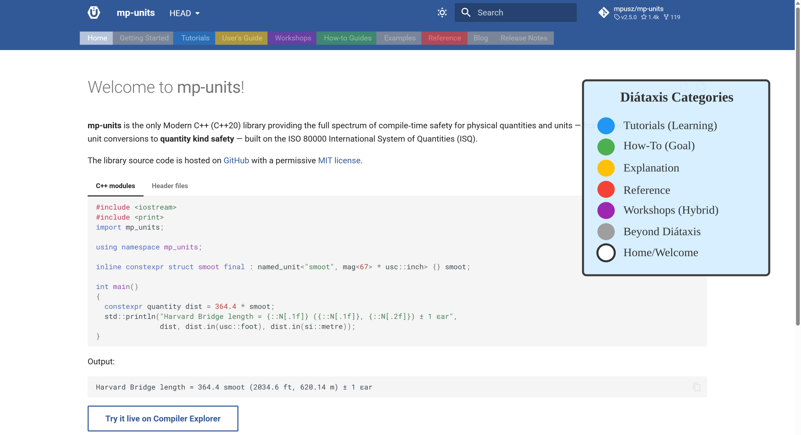

# Documentation is prose, not a Doxygen dump

You found the perfect C++ library. The code is clean, the benchmarks hold up, and the
license fits. Then you go looking for the documentation, and the only thing you find is a
`README`, a little longer than most.

<!-- more -->

!!! info "Part of a series: Why Great C++ Libraries Fail"

    This post is part of a
    [series](../../../../category/why-great-c-libraries-fail/)
    based on my using std::cpp 2026 talk on why technically excellent C++ libraries fail to
    get adopted. It covers the **Understanding** stage of the six-stage library journey: can
    people actually learn your library once they trust it? New here? Start with
    [the overview](nobody-uses-your-great-library.md).

This is a common failure, and it is worse than a clumsy documentation site. Some very
impressive C++ libraries do exactly this. There is no browsable index of the types and
operations they provide, so the only way to discover what exists is to open the headers and
read them. These are excellent projects, written by people who know their domains far
better than most, which is why technical brilliance on its own does not help here. If the
only way to learn what your library offers is to parse its template headers, most people
will simply leave.

So the first rule is a boring one: write documentation, and not just a longer `README`.

The second failure is subtler. Once a project decides to document itself, the reflex in C++
is to run Doxygen over the headers and publish the result.

## Doxygen is one quarter of the job

I want to be fair to Doxygen, because it is often cast as the villain and it is not. An
autogenerated API reference is genuinely useful. It is complete, it stays in sync with
the code, and when you already know what you are looking for, it is the right tool. The
problem is that it is presented as the whole documentation, even though it is only one
part of it.

A reference is a dictionary, and a dictionary is invaluable once you know the words. Hand
it to someone learning the language, and it teaches them nothing, because they do not yet
know what to look up. "Sets the width. Parameter: the width to set" is a definition that
does not help anyone who did not already understand the function.

## Four kinds of documentation

The model that makes this concrete is [Diátaxis](https://diataxis.fr), by Daniele
Procida. It observes that people arrive at documentation with four different intents, and
one document cannot serve all four.

*The Diátaxis framework. Diagram by Daniele Procida,
[diataxis.fr](https://diataxis.fr), licensed
[CC BY-SA 4.0](https://creativecommons.org/licenses/by-sa/4.0/).*

The four intents map to four kinds of documentation:

- **Tutorials**, for the reader who wants to learn. A guided first success, where they
  follow you rather than look things up.
- **How-to guides**, for the reader with a specific task. A recipe for a real problem,
  assuming some familiarity.
- **Reference**, for the reader who needs to look something up. Precise and exhaustive.
  This is the quadrant Doxygen fills well, and usually the only one a C++ project has
  (if any).
- **Explanation**, for the reader who wants to understand why the design is the way it
  is. The tradeoffs and the reasoning behind them.

An autogenerated reference covers exactly one of these four, and shipping it alone is the
mistake. The tutorial and the explanation are the hardest to write, because no tool can
generate them, and they are also the ones a newcomer needs most. In the **mp-units**
docs, this split is deliberate: the navigation is divided into [Tutorials](../../tutorials/index.md),
[How-to Guides](../../how_to_guides/index.md), a
[User's Guide](../../users_guide/index.md) for understanding, and a
[Reference](../../reference/index.md), so a visitor lands on the quadrant that matches what
they actually need.

*The mp-units navigation, with each section color-coded to its Diátaxis quadrant.*

There is a side effect worth naming, and it is the part that helped me the most. Writing
the prose works as a design review. When you try to explain an API in plain words and the
explanation comes out tangled, the API is usually tangled too. "How do I even describe
this?" is a reliable signal that something needs to be redesigned. On several interfaces I
went through three rounds of redesign purely because the documentation refused to read
cleanly, and each round left the API in a better place. Without that pressure I would have
committed a design that merely worked, far inferior to what I eventually shipped once
writing the docs forced the rethink.

Real documentation sites also outgrow the four quadrants, and that is fine. A getting-started
ramp, worked examples that solve a whole problem, migration guides from the library you are
replacing, and, for a standards-track project, a bibliography of the papers and standards
behind it all earn their own space. Whatever the structure is, treat the documentation as
code: it lives in the repository, it changes in the same pull request as the code it
describes, and a feature is not finished until its documentation is written.

## Make the examples runnable

Engineers would rather play with a tool than read about it, and if trying your example
takes more than a moment, they will skip it. If running it means cloning the repo,
configuring CMake, and resolving dependencies, most readers will not bother.

The cost is not only convenience. Typing an example builds muscle memory, and you learn the
syntax of a library far faster by writing it than by scanning it. Once the code is live in
front of you, you can change a unit, flip a representation type, and see what the compiler
says. Breaking an example on purpose teaches more about a design than any paragraph I could
write about it, and it costs the reader almost nothing. This is why I run hands-on workshops
as a Modern C++ trainer instead of lecturing from slides, and documentation can borrow the
same approach.

For C++, the lever is [Compiler Explorer](https://godbolt.org), by
[Matt Godbolt](https://xania.org), and there are two ways to use it. Deep links from the
docs into Compiler Explorer work, but they are a maintenance burden: as the API moves, the
links drift out of date, and you usually find out only when a reader hits a broken one.
What has worked far better for us is embedding Compiler Explorer directly into the
[interactive tutorials](../../tutorials/index.md) and the
[workshop material](../../workshops/index.md), so the example compiles and runs inside the
page the reader is already on. They can edit it and break it without installing anything,
and there is nothing for them to keep in sync.

## Where mp-units actually is

**mp-units** does not yet follow all of the advice in this article, so here is the history,
including the parts I would not repeat.

**mp-units** was prose-first from the beginning. The early documentation was built around
[Getting Started](../../getting_started/index.md) and a
[User's Guide](../../users_guide/index.md), and that scope worked very well. If you are
starting out, that is a pairing I would recommend: get someone to their first success,
then explain the model. What I did not have at the start was Diátaxis as an explicit frame.
The structure grew into the four quadrants over time, it was not designed that way up
front.

The API reference was the hard part. I tried the
usual C++ toolchain, Doxygen into Breathe into Sphinx, and spent most of my time fighting
the parsers. The C++20 syntax the library relies on was not supported by those tools at
the time, so the autogeneration simply crashed. I gave up on it, moved the whole site to
MkDocs, and shipped with no generated reference at all.

What filled that gap later was a shortcut I want to flag clearly rather than recommend.
Because the library is on an ISO standardization track, a contributor proposed writing
formal specification wording for the API, and we decided to use that wording as the
Reference section. It let me start the standards work early, which was the real motivation.
It is not a documentation pattern to copy. Standardese is written to remove ambiguity for
an implementer, not to teach a user, and it reads that way. Worse, it has drifted out of
date: the wording is LaTeX-based, and keeping that in sync with an evolving library is far
from easy, so the Reference now lags the actual API. The plan is to replace it with a
proper autogenerated API reference once the wording lands in the
[ISO C++ paper](https://wg21.link/p3045), which is where it belongs.

So the current state is strong on tutorials, getting started, and explanation, with a
Reference quadrant that is currently doing a job it was never designed for.

If your library is good and nobody is using it, look at the documentation before you blame
anything else. Write prose for the people learning, a reference for the people who already
know, and make the examples runnable. For most potential users, the documentation is the
first thing they judge, long before they read a single line of your code.

These tips come from my conference talk on why technically excellent C++ libraries fail to
get adopted, and how to fix it. You can
[watch the recording](https://www.youtube.com/watch?v=DWXlyOd_z88), which won best talk at
using std::cpp 2026, and read
[the slides](https://github.com/train-it-eu/conf-slides/tree/master/2026.03%20-%20using%20std_cpp).
I am giving an updated version of it at CppCon 2026, and the full, extended two-hour keynote
at Meeting C++ 2026.
