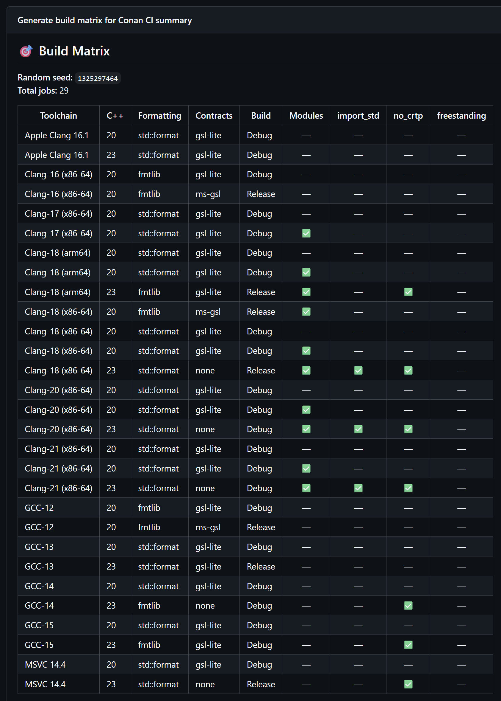
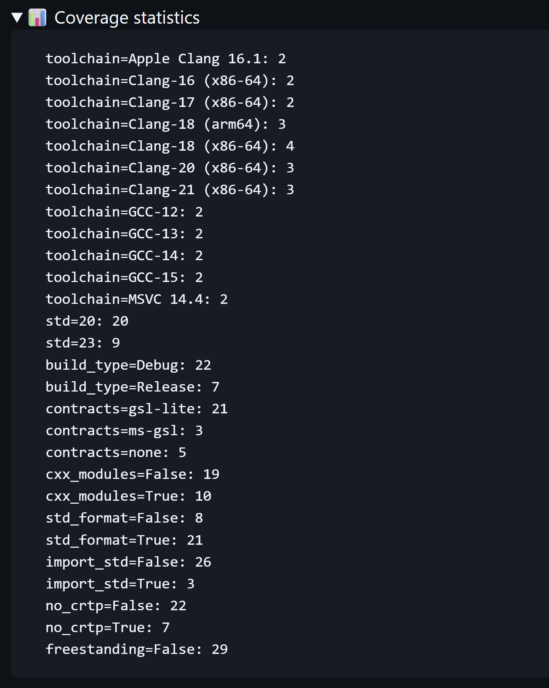
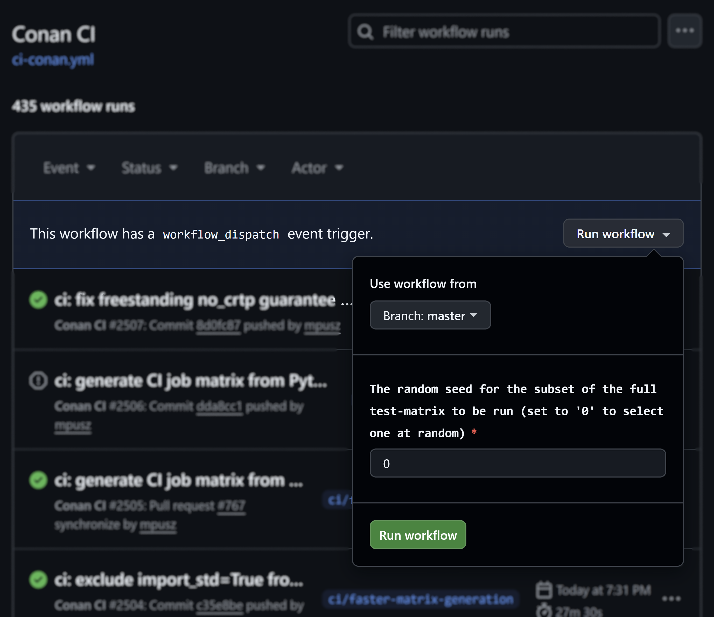

# A green master is a promise to your users

A stranger found your library. They have not read a line of your code yet. What they do next
is glance at the CI badge and the date of the last commit, and in about thirty seconds decide
whether the project is alive and safe to depend on. A red badge, or a master branch last
touched two years ago, and they are gone, without ever telling you they were there.

<!-- more -->

!!! info "Part of a series: Why Great C++ Libraries Fail"

    This post is part of a
    [series](../../../../category/why-great-c-libraries-fail/) based on my using
    std::cpp 2026 talk on why technically excellent C++ libraries fail to get adopted. It
    covers the **Evaluation** stage of the six-stage library journey: do they trust it
    works? New here? Start with [the overview](nobody-uses-your-great-library.md).

Trust is fragile, and it is cheap to lose. One broken build on your main branch reads as
"abandoned" or "amateur," and that judgment is made in seconds by people who will never open
an issue about it. This stage is about the signals that turn a curious visitor into a
confident adopter, and the first of them is simple to state and hard to keep: your master
branch always works.

## A green master is a promise

A green master is not a vanity metric. It is a promise you make to a stranger: this compiles
and passes its tests, in environments like yours, and the maintainer keeps it that way on
every commit. Portability is not a goal you get to later. It is a property you verify daily,
or it quietly rots while you are not looking.

<figure markdown="span">
  { width="90%" }
  <figcaption>
    The first thing a visitor sees: every check passing.
  </figcaption>
</figure>

The hard part is that "environments like yours" is enormous in C++. Your users are spread
across compilers (GCC, Clang, MSVC, Apple Clang), language standards (C++20 and C++23), and
build options: modules or headers, `import std` or includes, freestanding or hosted, `{fmt}`
or `std::format`, one contracts library or another. Every combination is a real user, and
each one catches a different class of bug:

- modules surface a missing `export`,
- `import std` surfaces header and module mixing conflicts,
- freestanding surfaces an accidental `#include <iostream>`,
- the oldest supported compiler surfaces a too-new feature you reached for without noticing.

Testing the full cross-product is hundreds of jobs: slow, and quick to exhaust your CI quota.
So most projects test one or two configurations and hope the rest hold. They do not.

## Fuzz your build matrix

This is the part of mp-units' CI I am most pleased with, because it borrows an idea from
fuzzing. Instead of running the entire combination space on every push, the matrix is sampled
randomly on each run, with a guarantee that every compiler, every standard, and every option
appears at least a couple of times. You get broad coverage over many runs without paying for
the full cross-product on any single one.

<figure markdown="span">
  { width="90%" }
  <figcaption>
    Each push runs a different random subset of the full configuration space.
  </figcaption>
</figure>

<figure markdown="span">
  { width="60%" }
  <figcaption>
    Across the sampling, every compiler, standard, and option appears at least twice.
  </figcaption>
</figure>

The matrix is generated by a script,
[`generate-job-matrix.py`](https://github.com/mpusz/mp-units/blob/master/.github/generate-job-matrix.py),
and the sampling is driven by a seed. The seed is a workflow input (see the `matrix-seed`
parameter in
[`ci-conan.yml`](https://github.com/mpusz/mp-units/blob/master/.github/workflows/ci-conan.yml)):
pass a specific seed to reproduce an exact failing configuration, or pass `0` to roll a fresh
matrix and keep exploring the space. Random, but reproducible, which is the property that
makes a failure actionable instead of a mystery.

<figure markdown="span">
  { width="70%" }
  <figcaption>
    A workflow input: pick a seed to reproduce a run, or 0 to sample a fresh matrix.
  </figcaption>
</figure>

The mindset shift is the lesson: you are not testing everything every time, you are exploring
the configuration space intelligently and reproducibly, the same way property-based testing
explores an input space.

## Green means more than "it compiled"

A trustworthy master is gated in layers, and a change merges only when all of them pass:

- **Pre-commit hooks** catch formatting before code ever reaches CI.
- **The build matrix** proves portability across the sampled configurations.
- **Quality checks** go beyond compiling: warnings as errors, `clang-tidy`, the unit tests,
  and coverage.
- **Integration tests** consume the library the way a user will: `find_package`, a Conan
  package, a documentation build, a freestanding build.

Each layer catches what the others cannot. One honest caveat on sanitizers, since every CI
checklist lists them: for a compile-time library like mp-units there is little runtime for
ASan or UBSan to find. They earn their place in runtime-heavy code, so I run them where they
pay off rather than as ritual. Naming where a standard practice does not apply is part of
doing it honestly.

## Be the most restrictive user of your own library

`-Wall` is a lower bar than its name suggests. Your users compile your headers under their
flags, not yours, and many run far stricter sets: `-Wall -Wextra -Wpedantic`, often with
`-Wconversion`, `-Wshadow`, or `-Wold-style-cast`, frequently with `-Werror`, and on MSVC
with `/W4 /permissive-`. If your code only compiles clean under `-Wall`, the first thing
those users see is a wall of warnings from inside *your* library, on their machine, in their
build. That is a terrible first impression, and you never get to explain it.

The fix is to hold yourself to a stricter standard than any user will reach. Turn on a broad
warning set, treat warnings as errors in CI, and a warning that would have surprised a user
fails your build first instead. mp-units compiles under
[a deliberately aggressive set](https://github.com/mpusz/mp-units/blob/master/cmake/warnings.cmake):
`-Wall -Wextra -Wpedantic` plus `-Wconversion`, `-Wsign-conversion`, `-Wshadow`,
`-Wold-style-cast`, `-Wcast-qual`, `-Wnull-dereference`, and more, with `/W4 /permissive-`
on MSVC, all as errors. The rule is simple: be the most restrictive user of your own
library, so that no real user is ever stricter than you are.

## What "all checks passed" says to a stranger

When a potential user sees a green check on your latest commit, they read three things from
it without consciously noticing: the project is actively maintained, because CI ran on this
change; it works in their environment, because their compiler and platform were in the
matrix; and it will not quietly break their build, because warnings are treated as errors.
That is trust earned by testing, not claimed by marketing copy. It is also why the work above
is worth it: the payoff is a stranger deciding, in their thirty seconds, that you are safe
to build on.

## Proving performance, honestly

Correctness is what CI proves well. Performance is harder, and pretending otherwise is its
own kind of dishonesty, so let me be concrete about what mp-units measures and what it does
not.

mp-units is a compile-time library, so its runtime promise is narrow and absolute: zero
overhead. The abstraction should compile to exactly the code you would have written by hand,
and the honest proof of that is not a benchmark, it is the generated assembly. You drop the
code into Compiler Explorer and show the output is identical to the hand-written version,
which is deterministic and impossible to fake. Automating that as a CI gate, instead of
checking it by eye, is harder than it sounds and is tracked as an open issue
([#804](https://github.com/mpusz/mp-units/issues/804)). The assembly proof gets its own
post later in this series. I
do not run runtime micro-benchmarks in CI, and for a library like this that is a deliberate
choice rather than a gap: shared runners vary by 10 to 20 percent between identical runs,
so a number that noisy is not evidence. When you do need real runtime figures, measure them
where the variance is controlled: on a self-hosted runner, by running the baseline and the
change in the same job so the noise cancels, or through a service like
[CodSpeed](https://codspeed.io/), whose instrumentation mode measures C++ on GitHub Actions
with variance under one percent.

The performance cost that actually bites a heavy template library is not runtime at all, it
is compile time. That is the honest weak spot here, the first thing users feel, and the one
I do not track rigorously, because it is genuinely hard to gate. Wall-clock compile time is
as noisy on shared runners as any runtime benchmark, and the machine-independent proxies
(template instantiation counts and binary size) move with every new feature and refactor,
so a fail-on-change gate would fire constantly on a library that is still growing.
CodSpeed, the service above, measures runtime, not compile time, so it does not rescue this
either. What works is to treat compile time as something you profile rather than gate: when
a build feels slower, or before a release, run Clang's `-ftime-trace` through
[ClangBuildAnalyzer](https://github.com/aras-p/ClangBuildAnalyzer) to find the worst
template instantiation hot spots and fix those. For now that stays a manual discipline.

## The solo exception, and where mp-units falls short

Branch protection deserves an honest answer, because it is not one size fits all. For a team
it is non-negotiable: require reviews and passing CI, and allow no direct pushes to main.
For a solo maintainer, opening a pull request to review your own typo fix is mostly ceremony.

I will be plain about my own workflow, because the practice-what-you-preach rule demands it.
I write the large majority of mp-units myself, and I push to master after testing locally,
with no branch protection. What keeps that honest is a local mirror of the CI matrix,
[`check_all.sh`](https://github.com/mpusz/mp-units/blob/master/.devcontainer/check_all.sh),
run before I push, plus pre-commit hooks for formatting. The principle is "master is always
green." The mechanism scales from a solo script today to full branch protection the day a
second regular contributor arrives.

That same solo reality is where mp-units is weakest at this stage, and it would be dishonest
to hide it behind the strong CI. With no required review and, most of the time, no second
pair of eyes, a mistake I do not catch locally can reach master, and the bus factor is low.
The
automated gate is genuinely strong. The human review process, today, is mostly just me, and
that is a real limit, not a humble-brag.

These tips come from my talk on why technically excellent C++ libraries fail to get
adopted, and how to fix it. You can
[watch the using std::cpp 2026 version](https://www.youtube.com/watch?v=DWXlyOd_z88), or
browse [the slides](https://github.com/train-it-eu/conf-slides/tree/master/2026.03%20-%20using%20std_cpp).
An expanded version is coming as a keynote at Meeting C++ 2026.
