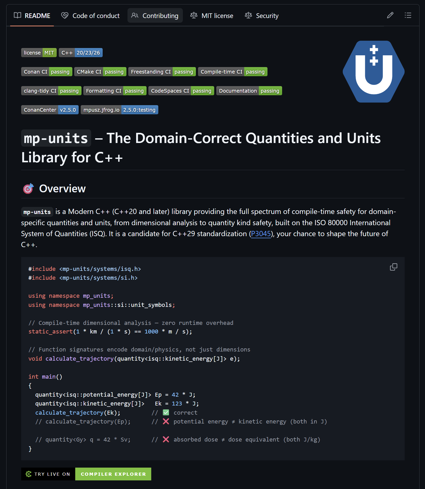

# If they can't find you, the code doesn't matter

You need a units library for C++. You search GitHub for "units" and get a wall of
repositories, all some variation of the same word, by different authors, with no obvious way
to tell which one is alive, which one is serious, and which one will still be maintained next
year. You pick one almost at random, or you give up and write your own. The library you
needed might have been right there. You just could not find it, or could not tell it apart
from the noise.

<!-- more -->

!!! info "Part of a series: Why Great C++ Libraries Fail"

    This post is part of a
    [series](../../../../category/why-great-c-libraries-fail/)
    based on my using std::cpp 2026 talk on why technically excellent C++ libraries fail to
    get adopted. It covers the **Discovery** stage of the six-stage library journey: can
    people even find your project? New here? Start with
    [the overview](nobody-uses-your-great-library.md).

Discovery is the first filter, and it is brutal. Before anyone reads your code, runs your
benchmarks, or admires your API, they have to find you and then decide, in a few seconds,
that you are worth a closer look. Most projects lose people right here without ever knowing
it, because the ones who leave at this stage leave no trace. Here is how to stop losing them.

## A name is a technical decision

This library used to be called, simply, `units`. It lived at `mpusz/units`, one of a dozen
repositories by that name, competing head to head with `nholthaus/units` and the rest. Search
"C++ units library" and you got chaos. When people discussed it online they had to say
"mpusz's units" every single time, because the bare name meant nothing on its own. A generic
name is a permanent tax: on search, on every conversation about your project, and on anyone
trying to recommend you to a colleague.

Renaming to **mp-units** fixed it, and the repo rename was less painful than I feared.
GitHub redirects the old URL and keeps your stars, forks, issues, and history, so the repo
move itself costs almost nothing. The real cost lands on your users and your docs: renaming
the namespace, the package, and the include paths is a breaking change in everyone's code,
and the documentation site URL moves with the repo name, so existing links to it break.
That is the lesson, and the reason this is the first tip: choose a unique, searchable name
*before* you have users, because the expensive part of a late rename is everything attached
to the name, not the repository itself.

A good name is also used identically everywhere, so that one search resolves to exactly one
thing:

```text
GitHub repo:    mpusz/mp-units
Namespace:      mp_units
CMake target:   mp-units::mp-units
Conan package:  mp-units
Include path:   <mp-units/systems/si.h>
```

Same string, top to bottom. When a user searches "mp-units cmake" or "mp-units conan," they
find one unambiguous answer instead of guessing.

## Do not bury your library in a committee repo

There is a specific version of this problem I see constantly from people on the C++
committee, and it quietly kills good work. The reference implementation lives as a
subdirectory inside a generic `wg21` or `proposals` repository. It cannot be found by a
search for what it actually does, it cannot be starred or watched on its own, and it signals
"academic exercise" rather than "production library." If you want adoption, and adoption is
exactly what strengthens a standardization proposal, give the library its own repository with
its own name and keep the paper separate. mp-units had real users and production feedback
before it was ever a standardization candidate. That order is not an accident; it is the
point.

## The five-second README test

When someone lands on your README, they decide in about five seconds whether to keep reading.
Four things earn that second look:

1. **Badges that show the lights are on.** A green CI badge, a license, a version. A red
   badge, or no badges at all, reads as "abandoned," and people leave.
2. **A pitch that says what you solve,** specifically. More on that below.
3. **A code example visible without scrolling,** so the reader thinks "I could write this."
4. **A live demo link.** A Compiler Explorer link lets a skeptic verify your claims in thirty
   seconds, with nothing to install.

<figure markdown="span">
  { width="90%" }
  <figcaption>
    The four signals a visitor judges in about five seconds.
  </figcaption>
</figure>

## Say what you do, and be specific

The pitch is where most projects waste their five seconds.

!!! failure "A vague pitch describes any of fifty repositories"

    A units library for C++.

!!! success "mp-units, its actual opening line"

    **mp-units** is a Modern C++ (C++20 and later) library providing the full spectrum of
    compile-time safety for domain-specific quantities and units, from dimensional
    analysis to quantity kind safety, built on the ISO 80000 International System of
    Quantities (ISQ). It is a candidate for C++29 standardization
    ([P3045](https://wg21.link/p3045)), your chance to shape the future of C++.

Every claim in the good version is specific and falsifiable: "compile-time" (verify the
assembly), "quantity kind safety" (it distinguishes quantities that share a dimension but
not a meaning), "ISO 80000" (a real, citable standard), "candidate for C++29" (a paper you
can read). Specific, verifiable claims build trust before anyone clones the repository.
Vague ones build nothing.

## Stars are a discovery signal, not a vanity metric

The overview post in this series made the case that stars do not measure adoption, and they
do not. But they are not noise either. Stars measure reach and discoverability, the simple
fact that people keep finding you, and the *shape* of the curve is feedback you can act on.

Track your star history against your competitors, not for ego, but as market research, and
embed the live chart so it tells the story at a glance:

<figure markdown="span">
  [](https://www.star-history.com/#mpusz/mp-units&nholthaus/units&bernedom/SI&aurora-opensource/au&boostorg/units&Date)
</figure>

The inflection points are the lesson: a conference talk, a Reddit thread, a rewritten README.
Each visible jump tells you what actually drove discovery, so you can do more of it.

## The three-minute fix that unlocks enterprise users

Two files that most maintainers skip are invisible to you and decisive to someone else:

- A clear **LICENSE** at the repository root, and a license identifier in every source
  header, so a legal team can approve the dependency without a meeting.
- A **SECURITY.md** with a private disclosure path, so a security team has somewhere to send
  a vulnerability report instead of opening a public issue.

A technical lead can fall in love with your library and still be overruled. Legal and
security teams hold a veto, and they will use it when these files are missing, because their
default answer to ambiguity is no. Three minutes of work removes that veto and unlocks an
entire class of adopters who will never tell you they bounced.

A cheaper-still signal for a different audience: a `CITATION.cff` file. mp-units ships
one, so GitHub shows a "Cite this repository" button and researchers can quote your work
in the right format without asking. For a library that turns up in papers and lectures,
that small file says the project expects to be cited and intends to stick around.

## Where mp-units actually is, and where it still falls short

Discovery is the stage mp-units now mostly gets right. The naming is consistent, the README
leads with a specific pitch, there is a code sample on the first screen and a Compiler
Explorer link beside it. But it earned that the hard way, and it is not finished:

- It started life as the generic `units` and only became mp-units with the 2.0 release. The
  early name cost real discoverability, and while the GitHub rename itself was cheap, it
  forced a breaking change on every user and broke old documentation links. Naming it well
  on day one would have avoided all of that.
- It shipped without a `SECURITY.md` for far too long. Writing this post is what finally pushed
  me to add one, which is the practice-what-you-preach loop working exactly as it should.
- Its source headers still carry the full MIT license text rather than a one-line SPDX
  identifier. That one is deliberate, not laziness: mp-units is likely to move to a more
  permissive license so standard-library vendors can reuse the code
  ([#778](https://github.com/mpusz/mp-units/issues/778)), so the header cleanup waits
  for the 3.0 release rather than rewriting every file twice.

So: strong on naming and the README, the `SECURITY.md` gap now closed, and the license-header
tidy-up deliberately parked until 3.0. Hold me to the rest.

These tips come from my talk on why technically excellent C++ libraries fail to get
adopted, and how to fix it. You can
[watch the using std::cpp 2026 version](https://www.youtube.com/watch?v=DWXlyOd_z88), or
browse [the slides](https://github.com/train-it-eu/conf-slides/tree/master/2026.03%20-%20using%20std_cpp).
An expanded version is coming as a keynote at Meeting C++ 2026.
