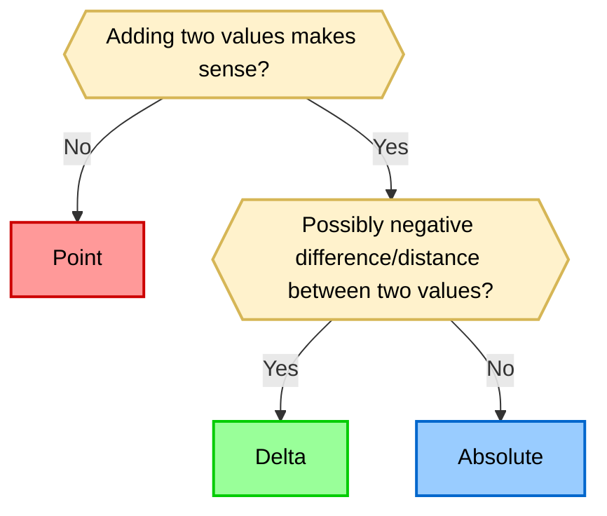

# Introducing Absolute Quantities

An **absolute quantity** represents an **absolute amount** of a physical property —
measured from a true, physically meaningful zero. Examples include _mass_ in kilograms,
_temperature_ in Kelvin, or _length_ in meters (as a size, not a position). Such
quantities live on a **ratio scale** and have a well-defined origin; negative values are
typically meaningless.

Absolute quantities stand in contrast to:

- **Affine points** (e.g., $20\ \mathrm{°C}$, $100\ \mathrm{m}\ \mathrm{AMSL}$) — values
  measured relative to an arbitrary or conventional origin.
- **Deltas** (e.g., $10\ \mathrm{K}$, $–5\ \mathrm{kg}$) — differences between two values.

Arithmetic on absolute quantities behaves like ordinary algebra: addition, subtraction,
and scaling are well-defined and map naturally to physical reasoning. This article
proposes making absolute quantities the **default abstraction** in **mp-units V3**,
reflecting how scientists express equations in practice.

---

_Note: Revised October 31 2025 for clarity, accuracy, and completeness._

<!-- more -->

## Background

### Affine Space Recap

Until now, **mp-units** modeled two fundamental abstractions:

- **Points** – represented by `quantity_point` in V2
- **Deltas** – represented by `quantity`

!!! info

    More information on this subject can be found in
    [the Affine Space chapter](../../users_guide/framework_basics/the_affine_space.md).

This design works but is sometimes awkward: users often misuse `quantity_point` to
represent absolute magnitudes (e.g., total mass), losing arithmetic and printability.
Conversely, using deltas everywhere hides physical intent and allows nonsensical operations.

The new **absolute quantity** abstraction aims to bridge that gap.

### Quantity abstractions in physics

Below is a summary table comparing the three main quantity abstractions:

| Feature              |         Point          |        Absolute         |         Delta          |
|----------------------|:----------------------:|:-----------------------:|:----------------------:|
| **Physical Model**   |     Interval Scale     |       Ratio Scale       |       Difference       |
| **Example**          |   20 °C, 100 m AMSL    |    293.15 K, 100 kg     |      10 K, -5 kg       |
| **Absolute Zero?**   |  No (Arbitrary Zero)   |     Yes (True Zero)     |          N/A           |
| **Allows Negative?** |      Yes (-10 °C)      |       No (Opt-in)       |      Yes (-10 m)       |
| **A + A**            | Error (20 °C + 10 °C)  | Absolute (10 kg + 5 kg) |         Delta          |
| **A - A**            | Delta (30 °C - 10 °C)  |  Delta (50 kg - 5 kg)   |         Delta          |
| **scalar * A**       |   Error (2 * 20 °C)    |  Absolute (2 * 10 kg)   |         Delta          |
| **A / A**            |         Error          |  scalar (10 kg / 5 kg)  |         scalar         |
| **API**              | `quantity<point<...>>` |     `quantity<...>`     | `quantity<delta<...>>` |

This table summarizes the key differences in semantics, API, and physical meaning for each
abstraction. Use it as a quick reference when deciding which concept to use in your code.


## Motivation

This section explains the driving reasons for introducing absolute quantities. It
highlights the practical pain points, limitations, and sources of confusion in the
current model, motivating the need for a new abstraction.

### Current Pain Points

1. **Limited arithmetic for points** – Points can’t be multiplied, divided, or accumulated.
   This often forces the users to convert the quantity point to a delta with either
   `qp.quantity_from_zero()` or `qp.quantity_from(some_origin)` member functions, which is
   at least cumbersome.
2. **No text output for points** – A point's textual representation depends on its origin,
   which is often implicit or user-defined. As of today, we do not have the means to
   provide a text symbol for the point origin. Moreover, points may contain both an
   absolute and a relative origin at the same time, which makes it harder to determine
   which origin to use for printing. Also, the same point may be represented in many ways
   (different deltas from various origins). Should such a point have the same or
   a different textual output for each representation?
3. **Error-prone simplifications** – Developers frequently replace points with deltas for
   convenience, losing safety and physical clarity.

### Example

!!! example "Mass Balance in Drying Process"

    A food technologist is drying several samples of a specific product to estimate its
    change in moisture content (on a wet basis) during the drying process.

    === "Simple but error-prone"

        ```cpp
        quantity<percent> moisture_content_change(quantity<kg> water_lost, // delta
                                                  quantity<kg> total)      // absolute
        {
          gsl_Expects(is_gt_zero(total));
          return water_lost / total;
        }

        quantity<kg> initial[] = { 2.34 * kg, 1.93 * kg, 2.43 * kg };
        quantity<kg> dried[] = { 1.89 * kg, 1.52 * kg, 1.92 * kg };

        quantity total_initial = std::reduce(std::cbegin(initial), std::cend(initial));
        quantity total_dried = std::reduce(std::cbegin(dried), std::cend(dried));

        std::cout << "Initial product mass: " << total_initial << "\n";
        std::cout << "Dried product mass: " << total_dried << "\n";
        std::cout << "Moisture content change: " << moisture_content_change(total_initial - total_dried, total_initial) << "\n";
        ```

    === "Safer but cumbersome"

        ```cpp
        quantity<percent> moisture_content_change(quantity<kg> water_lost,
                                                  quantity_point<kg> total)
        {
          gsl_Expects(is_gt_zero(total));
          return water_lost / total.quantity_from_zero();
        }

        quantity_point<kg> initial[] = { point<kg>(2.34), point<kg>(1.93), point<kg>(2.43) };
        quantity_point<kg> dried[] = { point<kg>(1.89), point<kg>(1.52), point<kg>(1.92) };

        auto point_plus = [](QuantityPoint auto a, QuantityPoint auto b){ return a + b.quantity_from_zero(); };
        quantity_point total_initial = std::reduce(std::cbegin(initial), std::cend(initial), point<kg>(0.), point_plus);
        quantity_point total_dried = std::reduce(std::cbegin(dried), std::cend(dried), point<kg>(0.), point_plus);

        std::cout << "Initial product mass: " << total_initial.quantity_from_zero() << "\n";
        std::cout << "Dried product mass: " << total_dried.quantity_from_zero() << "\n";
        std::cout << "Moisture content change: " << moisture_content_change(total_initial - total_dried, total_initial) << "\n";
        ```

In the above example:

- `water_lost` should be a delta (difference in _mass_),
- `total` should conceptually be non-negative absolute amount of _mass_, yet the type system
  doesn’t enforce it.

## Semantics

This section details the semantics of absolute quantities, their relationship to other
abstractions, and how they interact in code and mathematics. It clarifies the rules,
conversions, and algebraic properties that underpin the new model.

### Position of Absolute Quantities Among Abstractions

| Feature                     |   Point    |     Absolute      |   Delta   |
|-----------------------------|:----------:|:-----------------:|:---------:|
| Interpolation               |     ✓      |         ✓         |     ✓     |
| Multiplication / Division   |     ✗      |         ✓         |     ✓     |
| Addition                    |     ✗      |         ✓         |     ✓     |
| Subtraction                 |     ✓      |         ✓         |     ✓     |
| May be non‑negative         |     ✓      |         ✓         |     ✗     |
| Relative to origin          |  Explicit  | Implicit global 0 |     ✗     |
| Can use offset units        |     ✓      |         ✗         |     ✓     |
| Convertible to offset units | Via offset |         ✗         | No offset |
| Text output                 |     ✗      |         ✓         |     ✓     |

Absolute quantities sit logically between points and deltas: they behave like deltas
algebraically, yet conceptually reference a true zero. This design simplifies arithmetic,
improves printing, and preserves physical meaning.

As we can see above, absolute quantities have only two limitations, and both are connected
to the use of offset units. They can't use those because they must remain absolute
instead of being measured relative to some custom origin.


### Simplified API in V3

As I mentioned in my [previous post](bringing-quantity-safety-to-the-next-level.md#should-we-get-rid-of-a-quantity_point),
we are seriously considering removing the `quantity_point` class template and replacing it
with a `quantity_spec` point wrapper. For example, `quantity_point<isq::altitude[m]>` will
become `quantity<point<isq::altitude[m]>>`.

I initially planned `quantity<isq::mass>` to be the same as `quantity<delta<isq::mass>>`,
but it turns out that deltas probably should not be the default. It is consistent with how
we write physical expressions on paper, right? The delta symbol (∆) is always "verbose"
in physical equations. It would be nice for the C++ code to do the same. So, starting with
**mp-units** V3, deltas will always need to be explicit.

And this brings us to absolute quantities. As we stated in the previous chapter, they could
be considered:

- deltas against nothing, and
- points from a well-established zero.

This leads us to the observation that they are the perfect default we are looking for.
If we take any physics books, such quantities are the ones that we see in most of the
physical equations. This is why we will not need any specifier to denote them in
**mp-units** V3.

Here are some simple examples:

```cpp
quantity q1 = 20 * kg;        // absolute quantity (measured from true zero)
quantity q2 = delta<kg>(20);  // delta quantity (difference)
quantity q3 = point<kg>(20);  // point quantity (relative to an origin)
```

The above will produce the following types:

```cpp
static_assert(std::is_same_v<decltype(q1), quantity<kg>>);
static_assert(std::is_same_v<decltype(q2), quantity<delta<kg>>>);
static_assert(std::is_same_v<decltype(q3), quantity<point<kg>>>);
```

This mirrors the way physicists write equations: absolute values by default, with explicit
Δ when needed.


### Alignment with scientific practice

The proposed abstractions mirror the way quantities are treated in physics and
engineering textbooks:

- **Absolute quantities** (e.g., _mass_, _energy_, _length_) are always measured from
  a natural zero and are mostly non-negative.
- **Points** (e.g., _position_, _temperature_ on a relative scale) are always defined
  relative to an origin.
- **Deltas** (differences) are the result of subtracting two points or two absolutes.

This correspondence ensures that code written with **mp-units** is not only type-safe,
but also directly maps to the equations and reasoning found in scientific literature.
This makes code easier to review, verify, and maintain.


### Conversions Between Abstractions

As absolute quantities share properties of both deltas and points with implicit origins,
they should be explicitly convertible to those:

```cpp
quantity<delta<kg>> q1(20 * kg);
quantity<point<kg>> q2(20 * kg);
```

or

```cpp
quantity<delta<kg>> q1 = (20 * kg).delta();
quantity<point<kg>> q2 = (20 * kg).point();
```

The opposite is not always true:

- not every delta will be a positive amount against nothing,
- not every point on the scale will be positive (e.g., _altitudes_).

This is why it is better only to expose named functions to convert points and deltas
to absolute quantities:

```cpp
quantity<kg> q3 = q1.absolute();  // may fail the pre-condition check if negative
quantity<kg> q4 = q2.absolute();  // may fail the pre-condition check if negative
```

It is important to note that conversions between absolute quantities and points should
be available only when there is no point origin specified for a point (an implicit point
origin is being used).

If the user provided an explicit origin, then such a quantity can only be used as a delta:

```cpp
inline constexpr struct nhn_sea_level final : absolute_point_origin<isq::altitude> {} nhn_sea_level;

quantity<m> alt1 = 42 * m;
quantity<point<m>> alt2(alt1);                     // OK
// quantity<point<m>, nhn_sea_level> alt3(alt1);   // Compile-time error
quantity<point<m>, nhn_sea_level> alt4 = nhn_sea_level + alt1.delta();
```

If the user used an offset unit, then a conversion should work fine as long as the point
origin of the offset unit is defined in terms of the implicit point origin:

```cpp
quantity<K> temp1 = 300 * K;
quantity<point<K>> temp2(temp1);                   // OK
quantity<point<C>> temp3(temp1);                   // OK
```

To summarize:

|    From \ To |         Point          |   Absolute    |         Delta          |
|-------------:|:----------------------:|:-------------:|:----------------------:|
|    **Point** |        Identity        | `.absolute()` | point - point → delta  |
| **Absolute** | Explicit or `.point()` |   Identity    | Explicit or `.delta()` |
|    **Delta** | origin + delta → point | `.absolute()` |        Identity        |


### Arithmetic Semantics

Affine space arithmetic is well-defined and commonly used in physics and engineering.
With the introduction of absolute quantities, it is important to clarify the meaning
of arithmetic operations involving points, absolutes, and deltas.

#### Addition

**Adding two absolute quantities** (e.g., $10\ \mathrm{kg} + 5\ \mathrm{kg}$) produces
another absolute quantity. This is simply the sum of two non-negative amounts, both
measured from the true zero of the physical property.

**Adding a delta to an absolute quantity** (e.g., $10\ \mathrm{kg} + (-2\ \mathrm{kg})$)
yields a (potentially negative) delta. If you need an absolute quantity as a result,
you must explicitly convert the delta to an absolute quantity (i.e., using `.absolute()`),
which will check the non-negativity precondition at runtime and may fail if the value
is negative. This approach ensures that negative results are always intentional and
checked, increasing code safety.

**Adding an absolute quantity or delta to a point** yields a point shifted by the given
amount.

Here is the summary of all the addition operations:

|    Lhs \ Rhs |         Point          | Absolute | Delta |
|-------------:|:----------------------:|:--------:|:-----:|
|    **Point** | :material-close-thick: |  Point   | Point |
| **Absolute** |         Point          | Absolute | Delta |
|    **Delta** |         Point          |  Delta   | Delta |

!!! info

    Here are some numerical examples that present the available operations and their
    results:

    ```cpp
    quantity abs = isq::height(42 * m);
    quantity pt = point<isq::altitude[m]>(10);
    quantity d = delta<isq::height[m]>(2);
    quantity res1 = abs + abs;                 // Absolute
    quantity res2 = pt + abs;                  // Point
    quantity res3 = d + abs;                   // Delta
    ```

#### Subtraction

Subtraction in the context of physical quantities is best understood as finding the
difference between two amounts.

**Subtracting two absolute quantities** (e.g., $50\ \mathrm{kg} - 5\ \mathrm{kg}$)
yields a delta (difference), which may be negative or positive. This is consistent
with the mathematical and physical meaning of subtraction.

If an absolute result is needed (e.g., remaining _mass_), it should be obtained
via an explicit conversion:

```cpp
quantity<kg> remaining = (total - used).absolute();
```

This rule prevents invalid negative absolutes while remaining explicit when needed.

**Subtracting a delta from an absolute quantity** (e.g., $10\ \mathrm{kg} - 2\ \mathrm{kg}$)
yields a delta. If you need an absolute quantity as a result, you must explicitly convert
the delta to an absolute quantity (i.e., using `.absolute()`), which will check the
non-negativity precondition at runtime and may fail if the value is negative. This
approach ensures that negative results are always intentional and checked, increasing
code safety.

**Subtracting an absolute quantity from a point** yields a point, and
**subtracting a point from an absolute** quantity is not meaningful.

Here is a summary of all of the subtraction operations

|    Lhs \ Rhs |         Point          | Absolute | Delta |
|-------------:|:----------------------:|:--------:|:-----:|
|    **Point** |         Delta          |  Point   | Point |
| **Absolute** | :material-close-thick: |  Delta   | Delta |
|    **Delta** | :material-close-thick: |  Delta   | Delta |

!!! info

    Here are some numerical examples that present the available operations and their
    results:

    ```cpp
    quantity abs = isq::height(42 * m);
    quantity pt = point<isq::altitude[m]>(10);
    quantity d = delta<isq::height[m]>(2);
    quantity res1 = pt - abs;                  // Point
    // quantity res2 = abs - pt;               // Compile-time error
    quantity res3 = abs - pt.absolute();       // Delta or quantity_difference
    quantity res4 = abs - d;                   // Delta
    quantity res5 = d - abs;                   // Delta
    ```

#### Interpolation

**Interpolation of absolute quantities** (e.g., finding a value between $a$ and $b$)
is well-defined and results in another absolute quantity. This is commonly used in
physics and engineering for averaging, blending, or estimating values between two known
points.


#### Non-negativity

Non-negativity of absolute quantities is meant to be an opt-in feature in the quantity
specification. For example, we can pass a `non_negative` tag type in quantity definition:

```cpp
inline constexpr struct mass final : quantity_spec<dim_length, non_negative> {} mass;
```

With that, we will be able to mark any quantity as non-negative and this property will be
inherited by the subquantities in the quantity hierarchy tree of the same kind.

We could also derive non-negativity for derived quantities based on their equations.
A non-negative flag could be set only if all of the components in the equations are
marked as non-negative. However, we will not be able to account for a negative scalar
possibly used in an equation. This is why it is probably better to assume that ad-hoc
derived quantities do not inherit this property. If this result is assigned to a
typed/named quantity, then the non-negativity will be checked then (if set).


### Interesting Quantity Types

#### Time

Let's look closer at the quantity of _time_. There is no way to measure its absolute value
as we don't even know where (when?) the _time_ axis starts... Only _time_ points and
_time_ deltas (durations) make sense.

However it seems that the ISQ thought this through already. It does not define a quantity
of _time_ at all. It only provides _duration_ defined as:

!!! quote "ISO 80000-3:2019"

    **name:** duration

    **symbol:** $t$

    **Definition:** measure of the time difference between two events

    **Remarks:** Duration is often just called time. Time is one of the seven base
                 quantities in the International System of Quantities, ISQ
                (see ISO 80000-1). Duration is a measure of a time interval.

As long as absolute `quantity<isq::time[s]>` may seem off, `quantity<isq::duration[s]>`
is OK as an absolute quantity. Durations typically should be non-negative as well.
If we need a negative duration then `quantity<delta<isq::duration[s]>>` makes sense.

`isq::time` should be reserved for affine space point only
(e.g., `quantity<point<isq::time>[s]>`). You can find more about this in my
[Bringing Quantity-Safety To The Next Level](bringing-quantity-safety-to-the-next-level.md#affine-spaces-within-quantity-trees)
blog article.

The above does not mean that we should always use typed quantities for _time_. We can
still use simple quantities and the library will reason about them correctly:

- `quantity<s>` or `42 * s` -> absolute _duration_
- `quantity<delta<s>>` or `delta<s>(-3)` -> delta _duration_
- `quantity<point<s>>` or `point<s>(94573457438583)` -> _time_ point

#### Length

A somewhat similar case might be the _length_ quantity, as there is no one well-established
zero origin that serves as a reference for all _length_ measurements. However, asking the
users always to provide a `delta` specifier for _length_ would probably be overkill.
Everyone can imagine what no _length_/_radius_/_height_ means. Also, most of us are okay
with each object having its own _length_ measurement origin.

!!! note

    In the context of absolute quantities, `quantity<m>` always represents a size (such
    as the _length_, _width_, or _height_ of an object), not a _position_ in space.

    Positions are modeled using the `point<m>` abstraction, which always refers to
    a location relative to a defined origin.

    This distinction ensures that code using absolute quantities for size cannot be
    confused with code representing positions. For example, `quantity<m>` is used
    for the _length_ of a rod, not its _position_ in space.

#### Electric Current

_Electric current_ is the only ISQ base quantity that has a well defined zero point
(no _current_ flow in the wire), but its values can be both positive and negative
depending on the direction the current flows.

We could be tempted to model _electric current_ as the 1-dimensional vector quantity,
but probably it is not the best idea. It is officially defined as a signed scalar
quantity.

Absolute _electric current_ values should be available, but should not perform a
non-negative precondition check on construction and assignment.

#### Temperature

As we pointed out before, it will be possible to form absolute quantities of _temperature_,
but only when the unit is (potentially prefixed) Kelvin. For offset units like degree
Celsius, it will not be possible.

If the user has a temperature point in Celsius and wants to treat it as an absolute
quantity and pass it to some quantity equation, then such point first needs to
be converted to use Kelvin as its unit and then we need to create an absolute
quantity from it:

```cpp
quantity temp = point<deg_C>(21);
quantity kinetic_energy = 3 / 2 * si::boltzmann_constant * temp.in(K).absolute();
```

### Which Quantity Abstraction Should I Use?

The decision tree below provides guidance on choosing the appropriate quantity abstraction
for a specific use case. Start with the first question and follow the path based on your
answers:



### Bug Prevention and Safety Benefits

The new model eliminates a class of subtle bugs that arise from conflating positions,
sizes, and differences. For example:

- **No accidental addition of positions**
    - the type system prevents adding two `point<m>` objects, which is physically
      meaningless
- **No silent sign errors**
    - subtracting two absolute quantities always yields a delta, so negative results are
      explicit and must be handled intentionally
- **No misuse of offset units**
    - absolute quantities cannot be constructed with offset units (like Celsius),
      preventing incorrect temperature calculations
- **Compile‑time enforcement**
    - most mistakes caught before runtime


### Revised Example

Let's revisit our initial example. Here is what it can look like with the absolute
quantities usage:

!!! example "Mass Balance in Drying Process"

    A food technologist is drying several samples of a specific product to estimate its
    change in moisture content (on a wet basis) during the drying process.

    ```cpp
    quantity<delta<percent>> // (1)!
    moisture_content_change(quantity<delta<kg>> water_lost, // (2)!
                            quantity<kg> total) // (3)!
    {
      // gsl_Expects(is_gt_zero(total)); (4)
      return water_lost / total;
    }

    quantity<kg> initial[] = { 2.34 * kg, 1.93 * kg, 2.43 * kg }; // (5)!
    quantity<kg> dried[] = { 1.89 * kg, 1.52 * kg, 1.92 * kg };

    quantity total_initial = std::reduce(std::cbegin(initial), std::cend(initial)); // (6)!
    quantity total_dried = std::reduce(std::cbegin(dried), std::cend(dried));

    std::cout << "Initial product mass: " << total_initial << "\n"; // (7)!
    std::cout << "Dried product mass: " << total_dried << "\n";
    std::cout << "Moisture content change: " << moisture_content_change(total_initial - total_dried, total_initial) << "\n"; // (8)!
    ```

    1. Theoretically a negative result is possible if the product gained water in the process of drying.
    2. Explicit delta.
    3. Absolute quantity.
    4. No longer needed as absolute quantities of mass will have a precondition of
       being non-negative.
    5. Simple initialization of absolute quantities.
    6. Arithmetic works.
    7. Test output works.
    8. Type safe!

This version is concise, physically sound, and type‑safe. Function arguments can't be reordered
and non‑negativity guarantees remove the need for manual runtime checks.


## Migration and Backward Compatibility

Although the theory in the chapters above may seem intimidating, users will not be
significantly affected by the changes in **mp-units** V3.

As we can see, the new code above does not differ much from our previously unsafe but
favored version. The only difference is that we spell `delta` explicitly now, and that we
can safely assume that absolute values of mass are non-negative. The rest looks and feels
the same, but the new solution is safer and more expressive.

The biggest migration challenge is related to the results of subtraction on two
quantities, points, or deltas. From now on, they will result in a different type
(i.e., `quantity<delta<...>>`) which is not implicitly convertible to an absolute
quantity.

=== "Before"

    ```cpp
    quantity<km / h> avg_speed(quantity<km> distance, quantity<h> duration)
    {
      return distance / duration;
    }

    quantity_point<km> odo1 = ...;
    quantity_point<s> ts1 = ...;
    quantity_point<km> odo2 = ...;
    quantity_point<s> ts2 = ...;
    // quantity res = avg_speed(odo2 - odo1, ts2 - ts1);  // Compile-time error
    ```

=== "After"

    ```cpp
    quantity<km / h> avg_speed(quantity<km> distance, quantity<h> duration)
    {
      return distance / duration;
    }

    quantity_point<km> odo1 = ...;
    quantity_point<s> ts1 = ...;
    quantity_point<km> odo2 = ...;
    quantity_point<s> ts2 = ...;
    quantity res = avg_speed((odo2 - odo1).absolute(), (ts2 - ts1).absolute());  // OK
    ```

In case of an invalid order of subtraction arguments, the precondition check will fail
at runtime only for the conversion to absolutes case. This increases the safety of our
code.

Another migration challenge may be related to the usage of negative values. All of the
ISQ base quantities besides _electric current_ could be defined to be non-negative
for absolute quantities. This means that if a user is dealing with a negative
delta today, such code will fail the precondition check in the absolute quantity
constructor. To fix that, the user will need to use explicit `delta` specifiers or
construction helpers in such cases:

```cpp
quantity<m> d1 = -2 * m;       // Precondition check failure at runtime
quantity<delta<m>> d2(-2 * m); // Precondition check failure at runtime
quantity d3 = delta<m>(-2);    // OK
```

Regarding temperature support, in the [Semantics](#semantics) chapter,
we said that a new abstraction will not work for offset units. However, it was
also the case in **mp-units** V2. If we check
[The Affine Space chapter](../../users_guide/framework_basics/the_affine_space.md#displacement-vector-is-modeled-by-quantity)
we will find a note that:

!!! quote

    The multiply syntax support is disabled for units that provide a point origin in
    their definition (i.e., units of temperature like `K`, `deg_C`, and `deg_F`).

We always found those confusing and required our users to be explicit about the intent
with `point` and `delta` construction helpers. So nothing changes here from the coding
point of view. From the design point of view, we replace some strange corner case design
constraint with a properly named abstraction that models that behavior.

Actually, V3 will improve temperature support significantly. Thanks to the new abstraction,
we will be able to multiply and divide absolute temperatures with other quantities, but
only if the temperature is measured in Kelvin. Also, the multiply syntax will work to
construct such absolute quantities (e.g., `300 * K`).

Last, but not least, the `quantity_point<...>` class template will be replaced with
`quantity<point<...>>` syntax.

### Key Migration Rules

| V2 Pattern                            | V3 Equivalent                                | Notes                                        |
|---------------------------------------|----------------------------------------------|----------------------------------------------|
| `quantity<kg>`                        | `quantity<kg>`                               | Before delta and now absolute                |
| `quantity<kg> m = m1 - m2;`           | `quantity<kg> m = (m1 - m2).absolute();`     | Explicit if you want abs                     |
| `quantity<kg> dm = m1 - m2;`          | `quantity<delta<kg>> dm = m1 - m2;`          | Explicit deltas when negative value possible |
| `quantity_point<kg> p = ...;`         | `quantity<point<kg>> p = ...`                | Use `point<kg>` wrapper                      |
| `quantity<kg> d = p - point<kg>(42);` | `quantity<delta<kg>> d = p - point<kg>(42);` | Deltas must be explicit                      |

Most user code will continue to compile after adding explicit `delta` or `.absolute()`
conversions where needed.


## Rationale

Here we discuss the rationale behind the proposed changes, including the design philosophy,
alignment with scientific practice, and the benefits for standardization and future
extensibility.

### Non-negativity in Physical Equations vs API Design

In most physical equations, the quantities we work with are expected to be
**_non-negative amounts_**. For example, _mass_, _energy_, _distance_, and _duration_
are all inherently non-negative in physical reality. While the mathematical abstraction
of a delta (difference) allows for negative values, in practice, negative deltas are
rare or even unphysical in many domains.

Consider the case of _speed_:

!!! quote

    _Speed_ is defined as the ratio of a change in _length_ (_distance_ traveled) to
    a change in _time_ (_duration_):

    $speed = \frac{\Delta length}{\Delta time}$

While the formula uses deltas, in almost all practical scenarios, both $\Delta length$
and $\Delta time$ are non-negative. A negative _duration_, for example, is not physically
meaningful and would indicate a logic error in most applications.

#### Prefer absolute quantities for non-negative deltas

This has important implications for API design. If a function like `avg_speed` accepts
deltas as arguments, users might inadvertently pass negative values, leading to
nonsensical results or subtle bugs:

```cpp
// Problematic: allows negative duration
quantity<m/s> avg_speed(quantity<delta<m>> distance, quantity<delta<s>> duration)
{
  return distance / duration;
}
```

Instead, it is safer and more physically correct to require *absolute* quantities for
such parameters, leveraging the fact that ISQ provides `distance` and `duration` as
non-negative quantities:

=== "Simple"

    ```cpp
    // Safer: enforces non-negativity
    quantity<m/s> avg_speed(quantity<m> distance, quantity<s> duration)
    {
      return distance / duration;
    }
    ```

=== "Typed"

    ```cpp
    // Safer: enforces non-negativity
    quantity<isq::speed[m/s]> avg_speed(quantity<isq::distance[m]> distance, quantity<isq::duration[s]> duration)
    {
      return distance / duration;
    }
    ```

This approach ensures that only non-negative values can be passed, preventing negative
_durations_ or _distances_ from entering your calculations. This reduces the risk of bugs,
makes your code more robust, and better reflects the intent of most physical equations.


### New opportunities

The new syntax allows us to model quantities that were impossible to express before
without some workarounds.

For example, we can now correctly calculate _Carnot engine efficiency_ with any of the
following:

```cpp
quantity temp_cold = 300. * K;
quantity temp_hot = 500. * K;
quantity carnot_eff_1 = 1. - temp_cold / temp_hot;
quantity carnot_eff_2 = (temp_hot - temp_cold) / temp_hot;
```

In the above code, we can easily create absolute or delta values of temperatures and perform
arithmetic on them. Previously, we had to create deltas from both points artificially
with:

```cpp
quantity temp_cold = point<K>(300.);
quantity temp_hot = point<K>(500.);
quantity carnot_eff_1 = 1. - temp_cold.quantity_from_zero() / temp_hot.quantity_from_zero();
quantity carnot_eff_2 = (temp_hot - temp_cold) / temp_hot.quantity_from_zero();
```

It worked, but was far from being physically pure and pretty.


### Design Philosophy and Standardization

Absolute quantities make physical semantics explicit while simplifying common use cases.
They expose existing conceptual complexity rather than adding new layers. The design is:

- **Consistent with ISQ** – mirrors the distinction between displacement, position, and
  difference.
- **Predictable** – clear subtraction and conversion rules.
- **Scalable** – a single `quantity` class handles all variants via wrappers.
- **Safe** – non‑negativity and offset‑unit rules prevent misuse.
- **Extensible** – additional quantity abstractions may be added in the future by simply
  introducing a new wrapper (e.g., anchored quantities).

For standardization, this model brings three tangible benefits:

1. **Closer alignment with physical reasoning** used by scientists and engineers.
2. **Improved readability and verification** in generic C++ code.
3. **Zero runtime overhead** — all checks are compile‑time or lightweight preconditions.


## Conclusion

Adding **absolute quantities** elevates **mp-units** from a dimensional analysis tool to
a true **physical reasoning framework**. The proposal clarifies semantics, improves
safety, and aligns code directly with equations found in textbooks. This is not extra
complexity—it's the formalization of the real structure of physical space in C++ types.

We plan to deliver this as part of **mp-units V3** and welcome community and WG21 feedback.
