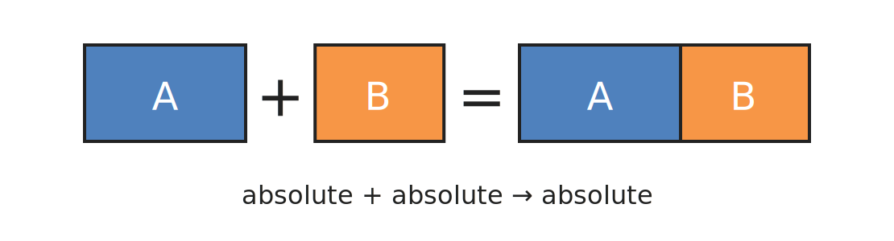
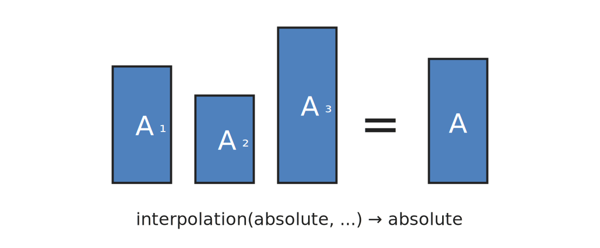

# Introducing absolute quantities

An **absolute quantity** is a quantity that represents a whole measurement of an entity
(for example: a _mass_, a _temperature_ on an absolute scale, or the total _height_ of
an object).

Unlike an affine **point** (which is measured relative to a named origin) or
a **delta** (which represents a difference), an **absolute** quantity behaves like
a delta for arithmetic (you can add, multiply, and divide it) while conceptually denoting
a whole (typically non-negative) amount of a given quantity measured against an implicit
well-established zero origin. This makes many common physical expressions
(summing _masses_, computing _energies_) more natural and less verbose.

We are considering making absolute quantities the default quantity abstraction in
**mp-units** V3.

---

_Note: This article underwent significant revisions on October 30, 2025, to improve
       clarity, accuracy, and depth of content._

<!-- more -->

## Affine space in a nutshell

So far, **mp-units** and other quantities and units libraries traditionally have been
modeling two kinds of abstractions:

- **points**
    - modeled with `quantity_point` class template in **mp-units** V2
- **deltas**
    - modeled with `quantity` class template in **mp-units** V2

!!! info

    More information on this subject can be found in
    [the Affine Space chapter](../../users_guide/framework_basics/the_affine_space.md).


## Quantity points issues

A current affine space implementation works well for many essential use cases. However,
due to the lack of better tools, points are sometimes also used to denote absolute values
in domains where they should not be conflated with deltas or where a non-negative value
is required (even though points in general can't guarantee such non-negativity).

Such usage results in some issues:

1. Quantity points are hard to use in physical equations as:
    - They can't be multiplied or divided by other quantities.
    - They can't be added to accumulate the value (in proper use cases, it is
      a great feature, but may be cumbersome when misused).
2. We can't print quantity points, at least for today, as:
    - We do not have the means to describe the user-provided origin in the text output properly.
    - It is often unclear if those should be printed against the current relative origin
      or the absolute one.
    - The same point may be represented in many ways (different deltas from various
      origins). Should such a point have the same or a different textual output for each
      representation?

To make both of the above work, a user needs to convert the quantity point to a delta with
either `qp.quantity_from_zero()` or `qp.quantity_from(some_origin)` member functions.
Doing that all the time is inconvenient and is a common reason for avoiding quantity points
abstraction in many equations in the source code, where it would be a good fit otherwise.
This is why the users often use the implicit deltas, which may lead to subtle bugs in our
source code due to conflating points with deltas. Such oversimplification can be problematic.

!!! example

    A food technologist is drying several samples of a specific product to estimate its
    change in moisture content (on a wet basis) during the drying process.

    === "Simple but error-prone"

        ```cpp
        quantity<percent> moisture_content_change(quantity<kg> water_lost, // delta
                                                  quantity<kg> total)      // absolute
        {
          gsl_Expects(is_gt_zero(water_lost));
          gsl_Expects(is_gt_zero(total));
          return water_lost / total;
        }

        quantity<kg> initial[] = { 2.34 * kg, 1.93 * kg, 2.43 * kg };
        quantity<kg> dried[] = { 1.89 * kg, 1.52 * kg, 1.92 * kg };

        quantity total_initial = std::reduce(std::cbegin(initial), std::cend(initial));
        quantity total_dried = std::reduce(std::cbegin(dried), std::cend(dried));

        std::cout << "Initial product mass: " << total_initial << "\n";
        std::cout << "Dried product mass: " << total_dried << "\n";
        std::cout << "Moisture content change: " << moisture_content_change(total_initial - total_dried, total_initial) << "\n";
        ```

    === "Safer but cumbersome"

        ```cpp
        quantity<percent> moisture_content_change(quantity<kg> water_lost,
                                                  quantity_point<kg> total)
        {
          gsl_Expects(is_gt_zero(water_lost));
          gsl_Expects(is_gt_zero(total));
          return water_lost / total.quantity_from_zero();
        }

        quantity_point<kg> initial[] = { point<kg>(2.34), point<kg>(1.93), point<kg>(2.43) };
        quantity_point<kg> dried[] = { point<kg>(1.89), point<kg>(1.52), point<kg>(1.92) };

        auto point_plus = [](QuantityPoint auto a, QuantityPoint auto b){ return a + b.quantity_from_zero(); };
        quantity_point total_initial = std::reduce(std::cbegin(initial), std::cend(initial), point<kg>(0.), point_plus);
        quantity_point total_dried = std::reduce(std::cbegin(dried), std::cend(dried), point<kg>(0.), point_plus);

        std::cout << "Initial product mass: " << total_initial.quantity_from_zero() << "\n";
        std::cout << "Dried product mass: " << total_dried.quantity_from_zero() << "\n";
        std::cout << "Moisture content change: " << moisture_content_change(total_initial - total_dried, total_initial) << "\n";
        ```

Despite the above drawbacks, affine space points are necessary to model some abstractions
(e.g., _temperatures_ in degrees Celsius, tared _mass_ measurements, _altitudes_ above
some reference point, etc.) and do it really well. Constrained affine space arithmetic
(e.g., preventing accidental addition of points) also improves the safety of our programs.
This is why it is a valuable abstraction and should be used even more frequently than it is now.


## Absolute quantities

To improve the user experience and open the doors for new features in the future, we are
considering adding a third abstraction for **absolute quantities**. In terms of properties,
an absolute quantity will lie between points and deltas.

| Feature                        |         Point          |                    Absolute                    |         Delta          |
|--------------------------------|:----------------------:|:----------------------------------------------:|:----------------------:|
| **Interpolation**              |   :white_check_mark:   |               :white_check_mark:               |   :white_check_mark:   |
| **Subtraction**                |   :white_check_mark:   |               :white_check_mark:               |   :white_check_mark:   |
| **Addition**                   | :material-close-thick: |               :white_check_mark:               |   :white_check_mark:   |
| **Multiply/Divide**            | :material-close-thick: |               :white_check_mark:               |   :white_check_mark:   |
| **May be non-negative**        |   :white_check_mark:   |               :white_check_mark:               | :material-close-thick: |
| **Relative to origin**         |  Absolute & relative   | No user-provided origin (implicit global zero) | :material-close-thick: |
| **Can use offset units**       |   :white_check_mark:   |             :material-close-thick:             |   :white_check_mark:   |
| **Conversion to offset units** |      With offset       |             :material-close-thick:             |       No offset        |
| **Text output**                | :material-close-thick: |               :white_check_mark:               |   :white_check_mark:   |

As we can see above, absolute quantities have only two limitations, and both are connected
to the use of offset units. They can't use those because they must remain absolute
instead of being measured relative to some custom origin.

Absolute quantities could be considered delta quantities that represent a whole
-- the entire entity being measured from zero. This is why we can represent a _system mass_
by adding absolute _masses_ of all system elements, or a _system energy_ by adding absolute
_temperatures_ of all the system elements.

Absolute quantities could also be considered points specified in terms of a well-established,
thus implicit, zero origin. This is why it is impossible to specify their origin
points explicitly. This also allows us to print them, as we do not need any special text
to describe their origin, as they are always measured against nothing/void.


## Interfaces refactoring

As I mentioned in my [previous post](bringing-quantity-safety-to-the-next-level.md#should-we-get-rid-of-a-quantity_point),
we are seriously considering removing the `quantity_point` class template and replacing it
with a `quantity_spec` point wrapper. For example, `quantity_point<isq::altitude[m]>` will
become `quantity<point<isq::altitude[m]>>`.

I initially planned `quantity<isq::mass>` to be the same as `quantity<delta<isq::mass>>`,
but it turns out that deltas probably should not be the default. It is consistent with how
we write physical expressions on paper, right? The delta symbol (∆) is always "verbose"
in physical equations. It would be nice for the C++ code to do the same. So, starting with
**mp-units** V3, deltas will always need to be explicit.

And this brings us to absolute quantities. As we stated in the previous chapter, they could
be considered:

- deltas against nothing, and
- points from a well-established zero.

This leads us to the observation that they are the perfect default we are looking for.
If we take any physics books, such quantities are the ones that we see in most of the
physical equations. This is why we will not need any specifier to denote them in
**mp-units** V3.

Here are some simple examples:

```cpp
quantity q1 = 20 * kg;        // absolute quantity
quantity q2 = delta<kg>(20);  // delta quantity
quantity q3 = point<kg>(20);  // point quantity
```

The above will produce the following types:

```cpp
static_assert(std::is_same_v<decltype(q1), quantity<kg>>);
static_assert(std::is_same_v<decltype(q2), quantity<delta<kg>>>);
static_assert(std::is_same_v<decltype(q3), quantity<point<kg>>>);
```


## Conversions

As absolute quantities share properties of both deltas and points with implicit origins,
they should be explicitly convertible to those:

```cpp
quantity<delta<kg>> q1(20 * kg);
quantity<point<kg>> q2(20 * kg);
```

or

```cpp
quantity<delta<kg>> q1 = (20 * kg).delta();
quantity<point<kg>> q2 = (20 * kg).point();
```

The opposite is not always true:

- not every delta will be a positive amount against nothing,
- not every point on the scale will be positive (e.g., _altitudes_).

This is why it is better only to expose named functions to convert points and deltas
to absolute quantities:

```cpp
quantity<kg> q3 = q1.absolute();  // may fail the pre-condition check if negative
quantity<kg> q4 = q2.absolute();  // may fail the pre-condition check if negative
```

It is important to note that conversions between absolute quantities and a points should
be available only when there is no point origin specified for a point (an implicit point
origin is being used).

If the user provided an explicit origin, then such a quantity can only be used as a delta:

```cpp
inline constexpr struct nhn_sea_level final : absolute_point_origin<isq::altitude> {} nhn_sea_level;

quantity<m> alt1 = 42 * m;
quantity<point<m>> alt2(alt1);                     // OK
// quantity<point<m>, nhn_sea_level> alt3(alt1);   // Compile-time error
quantity<point<m>, nhn_sea_level> alt4 = nhn_sea_level + alt1.delta();
```

If the user used an offset unit, then a conversion should work fine as long as the point
origin of the offset unit is defined in terms of the implicit point origin:

```cpp
quantity<K> temp1 = 300 * K;
quantity<point<K>> temp2(temp1);                   // OK
quantity<point<C>> temp3(temp1);                   // OK
```

Below is a concise conversion matrix that summarises what conversions are meaningful and
how they should be performed. Rows are the source abstraction, and columns are the target.

|    From \ To |                   Point                    |       Absolute       |                    Delta                     |
|-------------:|:------------------------------------------:|:--------------------:|:--------------------------------------------:|
|    **Point** |            Identity — same type            |    `.absolute()`     | Subtract two points (point - point -> delta) |
| **Absolute** |           Explicit or `.point()`           | Identity — same type |            Explicit or `.delta()`            |
|    **Delta** | Add to an origin (origin + delta -> point) |    `.absolute()`     |             Identity — same type             |


## Arithmetic

Affine space arithmetic is well-defined, well-understood, and commonly used in our
industry. As we are adding a new type to the library that lands between points and deltas,
we must discuss the arithmetic and decide on a result for all possible operations.

### Addition

Adding two absolute quantities produces an aggregate quantity for the entire system.
It describes a whole amount of the quantity against zero, so the result type should also
be an absolute quantity:

{style="width:80%;display: block;margin: 0 auto;"}

Adding a delta (a part of something or a difference between different quantities) to
an absolute quantity will yield some partial quantity as a result as well. Moreover,
a delta may be negative so that the result might be smaller than our initial absolute
quantity. In the extreme case, the delta may be negative and greater than the absolute
quantity, which will yield a negative value. This is why the result should be a delta:

{style="width:80%;display: block;margin: 0 auto;"}

As absolute quantities are deltas against nothing, we can add them to points and get
a point as a result.

Here is the summary of all the addition operations:

| Lhs \ Rhs    |         Point          | Absolute | Delta |
|--------------|:----------------------:|:--------:|:-----:|
| **Point**    | :material-close-thick: |  Point   | Point |
| **Absolute** |         Point          | Absolute | Delta |
| **Delta**    |         Point          |  Delta   | Delta |

!!! info

    Here are some numerical examples that present the available operations and their
    results:

    ```cpp
    quantity abs = isq::height(42 * m);
    quantity pt = point<isq::altitude[m]>(10);
    quantity d = delta<isq::height[m]>(2);
    quantity res1 = abs + abs;                 // Absolute
    quantity res2 = pt + abs;                  // Point
    quantity res3 = d + abs;                   // Delta
    ```


### Subtraction

Similarly, during subtraction, regular affine space arithmetics for deltas apply.
Subtracting an absolute quantity from a point yields a point, and trying to do the
opposite does not make physical sense.

Subtracting a delta from an absolute quantity yields a partial (potentially negative)
result, so it should be a delta:

{style="width:80%;display: block;margin: 0 auto;"}

The most interesting case is a subtraction of two absolute quantities. There are two
particular cases that we need to discuss.

First, we may subtract two unrelated non-negative absolute quantities. If we subtract
a larger quantity from the smaller one, then we may end up with a negative value. In such
a case, the result should definitely be a delta:

{style="width:80%;display: block;margin: 0 auto;"}

However, the left operand may be an aggregate quantity of our system. If we subtract one
of its components, we may argue to get an absolute quantity:

{style="width:80%;display: block;margin: 0 auto;"}

To solve the above, we have the following options for API design:

1. Always return delta

    - Subtracting two absolutes always yields a delta.
    - Explicit conversion to absolute is needed.
    - **Pros:** Consistent, matches how temperature, position, and time work.
    - **Cons:** Slightly awkward for mass/length, where subtraction often means
      "remaining absolute".

    ```cpp
    quantity<delta<K>> temp = 320 * K - 360 * K;
    quantity<kg> mass = (50 * kg - 5 * kg).absolute();
    quantity<one> ratio = (50 * kg - 25 * kg) / (50 * kg);
    ```

2. Always return absolute

    - Subtracting two absolutes always yields an absolute.
    - If the result is negative, a precondition check may fail.
    - Explicit conversion to delta needed.
    - **Pros:** Intuitive for mass/length, but not for temperature/position/time.
    - **Cons:** Breaks physical meaning for quantities where subtraction should yield
      a delta.

    ```cpp
    quantity absolute = 320 * K - 360 * K;                  // precondition violation :-(
    quantity<delta<K>> temp = absolute.delta();
    quantity<kg> mass = 50 * kg - 5 * kg;                   // OK
    quantity<one> ratio = (50 * kg - 25 * kg) / (50 * kg);
    ```

3. Return a distinct result type (e.g., `quantity_difference`)

    - Subtraction returns a proxy type convertible (implicitly or explicitly) to both
      absolute and delta.
    - It is to be decided if the proxy type should satisfy the `Quantity` concept.
    - **Pros:** Forces user to clarify intent, avoids ambiguity.
    - **Cons:** More complex API, but safest and most explicit.

    ```cpp
    auto res = 320 * K - 360 * K;                                   // quantity_difference

    // implicit conversions
    quantity<delta<K>> temp1 = res;                                 // OK
    quantity<kg> mass1 = 50 * kg - 5 * kg;                          // OK
    quantity<one> ratio1 = (50 * kg - 25 * kg) / (50 * kg);         // May fail to compile if not quantity
                                                                    // Also, type deduction may be tricky
    // explicit conversions
    quantity<delta<K>> temp2 = res.delta();                         // OK
    quantity<kg> mass2 = (50 * kg - 5 * kg).absolute();             // OK
    quantity<one> ratio2 = (50 * kg - 25 * kg).delta() / (50 * kg); // OK
    ```

Here is a detailed discussion of all the available options:

| Approach                           | Safety  | API Simplicity |
|------------------------------------|---------|----------------|
| Always Delta                       | High    | High           |
| Always Absolute                    | Low     | High           |
| Implicitly-convertible Result Type | High    | Medium         |
| Explicitly-convertible Result Type | Highest | Medium         |

After careful consideration, we recommend that subtracting two absolute quantities
should always yield a delta. This approach is the most physically consistent, matches
established practice in physics and engineering, and avoids subtle bugs. If an absolute
result is needed (e.g., remaining _mass_), it should be obtained via an explicit conversion:

```cpp
quantity<kg> remaining = (total - used).absolute();
```

This explicitness ensures that negative results are always intentional and checked,
increasing code safety.

Here is a summary of all of the subtraction operations

| Lhs \ Rhs    |         Point          | Absolute | Delta |
|--------------|:----------------------:|:--------:|:-----:|
| **Point**    |         Delta          |  Point   | Point |
| **Absolute** | :material-close-thick: |  Delta   | Delta |
| **Delta**    | :material-close-thick: |  Delta   | Delta |

!!! info

    Here are some numerical examples that present the available operations and their
    results:

    ```cpp
    quantity abs = isq::height(42 * m);
    quantity pt = point<isq::altitude[m]>(10);
    quantity d = delta<isq::height[m]>(2);
    quantity res1 = pt - abs;                  // Point
    // quantity res2 = abs - pt;               // Compile-time error
    quantity res3 = abs - pt.absolute();       // Delta or quantity_difference
    quantity res4 = abs - d;                   // Delta
    quantity res5 = d - abs;                   // Delta
    ```

### Interpolation

There is one more interesting operation that we should bring up here. The interpolation
of absolute values is very useful and should be supported. The result of it should be
an absolute quantity as well:

{style="width:80%;display: block;margin: 0 auto;"}

## Example

After discussing most of the theory, let's come back to our initial example and
check how it works in practice. Here is what it can look like with the absolute
quantities usage:

!!! example

    A food technologist is drying several samples of a specific product to estimate its
    change in moisture content (on a wet basis) during the drying process.

    ```cpp
    quantity<percent> moisture_content_change(quantity<delta<kg>> water_lost,  // (1)!
                                              quantity<kg> total)              // (2)!
    {
      gsl_Expects(is_gt_zero(water_lost));
      // gsl_Expects(is_gt_zero(total));  (3)
      return water_lost / total;
    }

    quantity<kg> initial[] = { 2.34 * kg, 1.93 * kg, 2.43 * kg };    // (4)!
    quantity<kg> dried[] = { 1.89 * kg, 1.52 * kg, 1.92 * kg };

    quantity total_initial = std::reduce(std::cbegin(initial), std::cend(initial));   // (5)!
    quantity total_dried = std::reduce(std::cbegin(dried), std::cend(dried));

    std::cout << "Initial product mass: " << total_initial << "\n";   // (6)!
    std::cout << "Dried product mass: " << total_dried << "\n";
    std::cout << "Moisture content change: " << moisture_content_change(total_initial - total_dried, total_initial) << "\n";  // (7)!
    ```

    1. Explicit delta.
    2. Absolute quantity.
    3. No longer needed as absolute quantities of mass will have a precondition of
    being non-negative.
    4. Simple initialization of absolute quantities.
    5. Arithmetic works.
    6. Test output works.
    7. Type safe!


## Migration recipe

Although the theory in the chapters above may seem intimidating, users will not be
significantly affected by the changes in **mp-units** V3.

As we can see, the new code above does not differ much from our previously unsafe but
favored version. The only difference is that we spell `delta` explicitly now, and that we
can assume that absolute values of mass are non-negative. The rest looks and feels the
same, but the new solution is safer and more expressive.

The biggest migration challenge may be related to the usage of negative values. All of the
ISQ base quantities besides _electric current_ could be defined to be non-negative
for absolute quantities. This means that if a user is dealing with a negative
delta today, such code will fail the precondition check in the absolute quantity
constructor. To fix that, the user will need to use explicit `delta` specifiers in such
cases.

Regarding temperature support, in the [Absolute quantities](#absolute-quantities) chapter,
we said that a new abstraction will not work for offset units. However, it was
also the case in **mp-units** V2. If we check
[The Affine Space chapter](../../users_guide/framework_basics/the_affine_space.md#displacement-vector-is-modeled-by-quantity) we will find a note that:

!!! quote

    The multiply syntax support is disabled for units that provide a point origin in
    their definition (i.e., units of temperature like `K`, `deg_C`, and `deg_F`).

We always found those confusing and required our users to be explicit about the intent
with `point` and `delta` construction helpers.

In the V3, we will actually be able to use the multiply syntax for temperatures, but
only for those measured in Kelvin.

Last, but not least. If we decide that the result of the subtraction of absolute quantities
does not implicitly convert to an absolute quantity, then the users will need to use
explicit `delta` specifiers again, or call named functions to make the existing code
to compile.

### Cheat sheet

| Old Pattern                           | New Pattern (V3)                             | Notes                                        |
|---------------------------------------|----------------------------------------------|----------------------------------------------|
| `quantity<kg> m = ...;`               | `quantity<kg> m = ...;`                      | Now always absolute                          |
| `quantity<kg> m = m1 - m2;`           | `quantity<kg> m = (m1 - m2).absolute();`     | Explicit if you want abs                     |
| `quantity<kg> m = m1 - m2;`           | `quantity<delta<kg>> m = m1 - m2;`           | Explicit deltas when negative value possible |
| `quantity_point<kg> p = ...;`         | `quantity<point<kg>> p = ...`                | Use `point<kg>` wrapper                      |
| `quantity<kg> d = p - point<kg>(42);` | `quantity<delta<kg>> d = p - point<kg>(42);` | Deltas must be explicit                      |


## Challenges

### What about _time_?

Everything looks promising and friendly for now. But let's look closer at the quantity of _time_.
There is no way to measure its absolute value as we don't even know where (when?) the _time_
axis starts... Only _time_ points and _time_ deltas (durations) make sense.

The above raises a few questions:

1. Does it mean that `quantity<si::second>` or `quantity<isq::time[s]>` should not compile?
2. Should we require the user to always state `quantity<delta<si::second>>` or
   `quantity<delta<isq::time[s]>>`? This would be consistent with physical equations but more
   verbose in the source code.
3. Should the syntax `40 * s` be disallowed or should it implicitly create`quantity<delta<si::second>>`
   instead of `quantity<si::second>`?


!!! questions "Feedback is welcome"

    As you can see, I do not yet have good answers to the above problems. Please share some
    feedback in the Comments section below on this.

!!! info

    It is interesting to mention that the ISQ provides both `isq::time` and `isq::duration`
    quantities and treats them as the same. This is why they are defined as aliases in V2.
    
    In V3 we could change `isq::duration` to mean `delta<isq::time>` as writing
    `delta<isq::duration>` seems strange anyway. But maybe it is better to stay consistent
    and require deltas everywhere...

    However, it does not help us much with the above questions, as it could only help for
    typed quantities like (`40 * isq::duration[s]` or `quantity<isq::duration[s]>`).


### What about _length_?

A somewhat similar case might be the _length_ quantity, as there is no one well-established
zero origin that serves as a reference for all _length_ measurements. However, asking the
users always to provide a `delta` specifier for _length_ would probably be overkill.
Everyone can imagine what no _length_/_radius_/_height_ means. Also, most of us are okay
with each object having its own _length_ measurement origin.

!!! note

    In the context of absolute quantities, `quantity<m>` always represents a size (such
    as the _length_, _width_, or _height_ of an object), not a _position_ in space.
    
    Positions are modeled using the `point<m>` abstraction, which always refers to
    a location relative to a defined origin.
    
    This distinction ensures that code using absolute quantities for size cannot be
    confused with code representing positions. For example, `quantity<m>` is used
    for the _length_ of a rod, not its _position_ in space.


## Alignment with scientific practice

The proposed abstractions mirror the way quantities are treated in physics and
engineering textbooks:

- **Absolute quantities** (e.g., _mass_, _energy_, _length_) are always measured from
  a natural zero and are non-negative.
- **Points** (e.g., _position_, _temperature_ on a relative scale) are always defined
  relative to an origin.
- **Deltas** (differences) are the result of subtracting two points or two absolutes.

This correspondence ensures that code written with **mp-units** is not only type-safe,
but also directly maps to the equations and reasoning found in scientific literature.
This makes code easier to review, verify, and maintain.


## Preventing bugs and improving code safety

The new model eliminates a class of subtle bugs that arise from conflating positions,
sizes, and differences. For example:

- **No accidental addition of positions**
    - the type system prevents adding two `point<m>` objects, which is physically
      meaningless
- **No silent sign errors**
    - subtracting two absolute quantities always yields a delta, so negative results are
      explicit and must be handled intentionally
- **No misuse of offset units**
    - absolute quantities cannot be constructed with offset units (like Celsius),
      preventing incorrect temperature calculations
- **Safer arithmetic in safety-critical code**
    - In domains like aerospace, medical, or automotive, these checks prevent unit and
      logic errors that could have catastrophic consequences

By making the intent explicit in code, the library helps catch most mistakes at compile
time, not at runtime.


## New opportunities

The new syntax simplifies the API as one `quantity` class template will now serve all quantity
variations (possibly even more in the future). It also allows us to model quantities that
were impossible to express before without some workarounds.

For example, we can now correctly calculate _Carnot engine efficiency_ with any of the
following:

```cpp
quantity temp_cold = 300. * K;
quantity temp_hot = 500. * K;
quantity carnot_eff_1 = 1. - temp_cold / temp_hot;
quantity carnot_eff_2 = (temp_hot - temp_cold) / temp_hot;
```

In the above code, we can easily create absolute or delta values of temperatures and perform
arithmetic on them. Previously, we had to create deltas from both points artificially
with:

```cpp
quantity temp_cold = point<K>(300.);
quantity temp_hot = point<K>(500.);
quantity carnot_eff_1 = 1. - temp_cold.quantity_from_zero() / temp_hot.quantity_from_zero();
quantity carnot_eff_2 = (temp_hot - temp_cold) / temp_hot.quantity_from_zero();
```

It worked, but was far from being physically pure and pretty.


## Summary

We believe that adding absolute quantities will be a significant improvement in the library.
programs easier to reason about, review, and maintain. This is especially critical in
scientific, engineering, and safety-critical domains, where correctness is paramount.
The new model brings C++ code closer to the clarity and rigor of physical textbooks,
making it easier for both domain experts and programmers to collaborate.

We plan to deliver the features mentioned in this post as a part of **mp-units** V3.

Please share your feedback.
