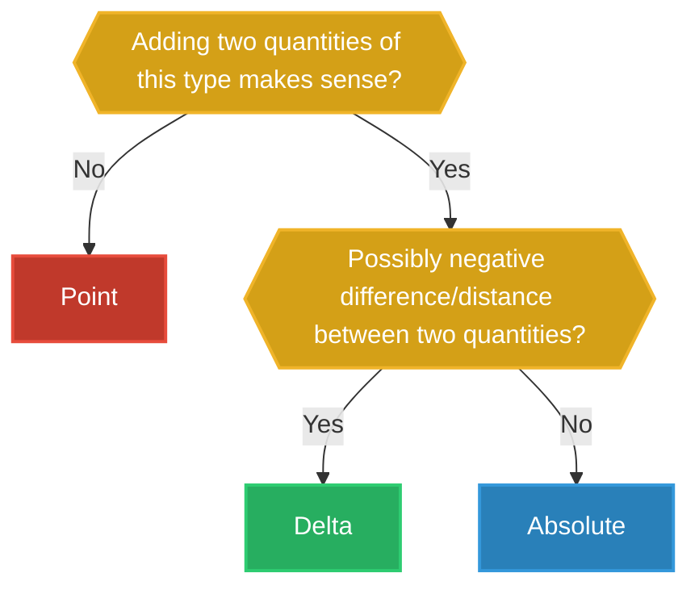

# Introducing Absolute Quantities

Until now, **mp-units** forced users to choose between points (no arithmetic) and deltas
(no physical semantics) — missing the most common case: a non-negative absolute amount.

An **absolute quantity** represents an **absolute amount** of a physical property —
measured from a true, physically meaningful zero. Examples include _mass_ in kilograms,
_temperature_ in Kelvin, or _length_ in meters (as a size, not a position). Such
quantities live on a **ratio scale** and are anchored at a physically meaningful zero;
negative values are typically meaningless.

Absolute quantities stand in contrast to:

- **Affine points** (e.g., $20\ \mathrm{°C}$, $100\ \mathrm{m}\ \mathrm{AMSL}$) — values
  measured relative to an arbitrary or conventional origin.
- **Deltas** (e.g., $10\ \mathrm{K}$, $–5\ \mathrm{kg}$) — differences between two values.

Arithmetic on absolute quantities behaves like ordinary algebra: addition, subtraction,
and scaling are well-defined and map naturally to physical reasoning. This article
proposes making absolute quantities the **default abstraction** in **mp-units V3**,
reflecting how scientists express equations in practice.

---

_Note: Revised on May 12, 2026 for clarity, accuracy, and completeness._

<!-- more -->

## Background

### Affine Space Recap

Until now, **mp-units** modeled two fundamental abstractions:

- **Points** – represented by `quantity_point` in V2
- **Deltas** – represented by `quantity`

!!! info

    More information on this subject can be found in
    [the Affine Space chapter](../../users_guide/framework_basics/the_affine_space.md).

This design works but is sometimes awkward: users often misuse `quantity_point` to
represent absolute magnitudes (e.g., total mass), losing arithmetic and printability.
Conversely, using deltas everywhere hides physical intent and allows nonsensical operations.

The new **absolute quantity** abstraction aims to bridge that gap.

### Quantity abstractions in physics

Below is a summary table comparing the three main quantity abstractions:

| Feature                  |                        Point                        |                    Absolute                     |                Delta                |
|--------------------------|:---------------------------------------------------:|:-----------------------------------------------:|:-----------------------------------:|
| **Physical Model**       |                   Interval Scale                    |                   Ratio Scale                   |             Difference              |
| **Example**              | $20\ \mathrm{°C}$, $100\ \mathrm{m}\ \mathrm{AMSL}$ |    $293.15\ \mathrm{K}$, $100\ \mathrm{kg}$     | $10\ \mathrm{K}$, $-5\ \mathrm{kg}$ |
| **Has True Zero?**       |             No (arbitrary/conventional)             |                 Yes (physical)                  |                 N/A                 |
| **Allows Negative?**     |            Yes (below arbitrary origin)             |                   No (opt-in)                   |       Yes (direction matters)       |
| **Addition (A + A)**     |    ❌ Error ($20\ \mathrm{°C} + 10\ \mathrm{°C}$)    | ✅ Absolute ($10\ \mathrm{kg} + 5\ \mathrm{kg}$) |               ✅ Delta               |
| **Subtraction (A − A)**  |    ✅ Delta ($30\ \mathrm{°C} - 10\ \mathrm{°C}$)    |  ✅ Delta ($50\ \mathrm{kg} - 5\ \mathrm{kg}$)   |               ✅ Delta               |
| **Multiplication (k×A)** |        ❌ Error ($2 \times 20\ \mathrm{°C}$)         |     ✅ Absolute ($2 \times 10\ \mathrm{kg}$)     | ✅ Delta ($-2 \times 5\ \mathrm{m}$) |
| **Division (A / A)**     |                       ❌ Error                       |  ✅ Scalar ($10\ \mathrm{kg} / 5\ \mathrm{kg}$)  |          ✅ Scalar (ratio)           |
| **A + Delta**            |                   ✅ Point (shift)                   |                   ✅ Absolute                    |               ✅ Delta               |
| **API**                  |               `quantity<point<...>>`                |                 `quantity<...>`                 |       `quantity<delta<...>>`        |

This table summarizes the key differences in semantics, API, and physical meaning for each
abstraction. Use it as a quick reference when deciding which concept to use in your code.


## Motivation

This section explains the driving reasons for introducing absolute quantities. It
highlights the practical pain points, limitations, and sources of confusion in the
current model, motivating the need for a new abstraction.

### Current Pain Points

1. **Limited arithmetic for points** – Points can’t be multiplied, divided, or accumulated.
   This often forces the users to convert the quantity point to a delta with either
   `qp.quantity_from_zero()` or `qp.quantity_from(some_origin)` member functions,
   which is at least cumbersome.
2. **No text output for points** – A point's textual representation depends on its origin,
   which is often implicit or user-defined. As of today, we do not have the means to
   provide a text symbol for the point origin. Moreover, points may contain both an
   absolute and a relative origin at the same time, which makes it harder to determine
   which origin to use for printing. Also, the same point may be represented in many ways
   (different deltas from various origins). Should such a point have the same or
   a different textual output for each representation?
3. **Error-prone simplifications** – Developers frequently replace points with deltas for
   convenience, losing safety and physical clarity. This is the most dangerous pain point,
   because it compiles silently. In V2, both `quantity<K>` and `quantity<deg_C>` are deltas
   and are numerically interchangeable. A function accepting `quantity<K>` will silently
   accept `20 * deg_C`, using the numeric value `20` instead of `293.15`. Thermodynamic
   expressions such as Carnot efficiency will then produce results that are off by a factor
   of roughly 15, with no compiler warning and no runtime error — the bug is invisible until
   you check the numbers.

### Example

!!! example "Mass Balance in Drying Process"

    A food technologist is drying several samples of a specific product to estimate its
    change in moisture content (on a wet basis) during the drying process.

    === "Simple but error-prone"

        ```cpp
        quantity<percent> moisture_content_change(quantity<kg> water_lost, // delta
                                                  quantity<kg> total)      // absolute
        {
          gsl_Expects(is_gt_zero(total));
          return water_lost / total;
        }

        quantity<kg> initial[] = { 2.34 * kg, 1.93 * kg, 2.43 * kg };
        quantity<kg> dried[] = { 1.89 * kg, 1.52 * kg, 1.92 * kg };

        quantity total_initial = std::reduce(std::cbegin(initial), std::cend(initial));
        quantity total_dried = std::reduce(std::cbegin(dried), std::cend(dried));

        std::cout << "Initial product mass: " << total_initial << "\n";
        std::cout << "Dried product mass: " << total_dried << "\n";
        std::cout << "Moisture content change: " << moisture_content_change(total_initial - total_dried, total_initial) << "\n";
        ```

    === "Safer but cumbersome"

        ```cpp
        quantity<percent> moisture_content_change(quantity<kg> water_lost,
                                                  quantity_point<kg> total)
        {
          gsl_Expects(is_gt_zero(total));
          return water_lost / total.quantity_from_zero();
        }

        quantity_point<kg> initial[] = { point<kg>(2.34), point<kg>(1.93), point<kg>(2.43) };
        quantity_point<kg> dried[] = { point<kg>(1.89), point<kg>(1.52), point<kg>(1.92) };

        auto point_plus = [](QuantityPoint auto a, QuantityPoint auto b){ return a + b.quantity_from_zero(); };
        quantity_point total_initial = std::reduce(std::cbegin(initial), std::cend(initial), point<kg>(0.), point_plus);
        quantity_point total_dried = std::reduce(std::cbegin(dried), std::cend(dried), point<kg>(0.), point_plus);

        std::cout << "Initial product mass: " << total_initial << "\n";
        std::cout << "Dried product mass: " << total_dried << "\n";
        std::cout << "Moisture content change: " << moisture_content_change(total_initial - total_dried, total_initial) << "\n";
        ```

In the above example:

- `water_lost` should be a delta (difference in _mass_),
- `total` should conceptually be non-negative absolute amount of _mass_, yet the type system
  doesn’t enforce it.

## Semantics

This section details the semantics of absolute quantities, their relationship to other
abstractions, and how they interact in code and mathematics. It clarifies the rules,
conversions, and algebraic properties that underpin the new model.

### Position of Absolute Quantities Among Abstractions

| Feature                     |      Point      |       Absolute        |   Delta   |
|-----------------------------|:---------------:|:---------------------:|:---------:|
| Interpolation               |        ✓        |           ✓           |     ✓     |
| Multiplication / Division   |        ✗        |           ✓           |     ✓     |
| Addition                    |        ✗        |           ✓           |     ✓     |
| Subtraction                 |        ✓        |           ✓           |     ✓     |
| May be non‑negative         |        ✓        |           ✓           |     ✗     |
| Zero reference              | Explicit origin | Anchored at true zero |    N/A    |
| Can use offset units        |        ✓        |           ✗           |     ✓     |
| Convertible to offset units |   Via offset    |           ✗           | No offset |
| Text output                 |        ✗        |           ✓           |     ✓     |

Absolute quantities sit logically between points and deltas: they behave like deltas
algebraically, yet conceptually reference a true zero. This design simplifies arithmetic,
improves printing, and preserves physical meaning.

As we can see above, absolute quantities have only two limitations, and both are connected
to the use of offset units. They can't use those because they must remain absolute
instead of being measured relative to some custom origin.


### Simplified API in V3

As I mentioned in my [previous post](bringing-quantity-safety-to-the-next-level.md#should-we-get-rid-of-a-quantity_point),
we are seriously considering removing the `quantity_point` class template and replacing it
with a `quantity_spec` point wrapper. For example, `quantity_point<isq::altitude[m]>` will
become `quantity<point<isq::altitude[m]>>`.

I initially planned `quantity<isq::mass>` to be the same as `quantity<delta<isq::mass>>`,
but it turns out that deltas probably should not be the default. It is consistent with how
we write physical expressions on paper, right? The delta symbol (∆) is always "verbose"
in physical equations. It would be nice for the C++ code to do the same. So, starting with
**mp-units** V3, deltas will always need to be explicit.

And this brings us to absolute quantities. As we stated in the previous chapter, they could
be considered:

- deltas against nothing, and
- points from a well-established zero.

This leads us to the observation that they are the perfect default we are looking for.
If we take any physics books, such quantities are the ones that we see in most of the
physical equations. This is why we will not need any specifier to denote them in
**mp-units** V3.

Here are some simple examples:

```cpp
quantity q1 = 20 * kg;        // absolute quantity (measured from true zero)
quantity q2 = delta<kg>(20);  // delta quantity (difference)
quantity q3 = point<kg>(20);  // point quantity (relative to an origin)
```

The above will produce the following types:

```cpp
static_assert(std::is_same_v<decltype(q1), quantity<kg>>);
static_assert(std::is_same_v<decltype(q2), quantity<delta<kg>>>);
static_assert(std::is_same_v<decltype(q3), quantity<point<kg>>>);
```

This mirrors the way physicists write equations: absolute values by default, with explicit
Δ when needed.


### Alignment with scientific practice

The proposed abstractions mirror the way quantities are treated in physics and
engineering textbooks:

- **Absolute quantities** (e.g., _mass_, _energy_, _length_) are always measured from
  a natural zero and are mostly non-negative.
- **Points** (e.g., _position_, _temperature_ on a relative scale) are always defined
  relative to an origin.
- **Deltas** (differences) are the result of subtracting two points or two absolutes.

The following table maps each abstraction to its measurement scale, mathematical structure,
physical meaning, and typical C++ representation:

| Concept      | Measurement Scale  | Mathematical Structure    | Physical Meaning                       | Example                                                                                                        |
|:-------------|:-------------------|:--------------------------|:---------------------------------------|:---------------------------------------------------------------------------------------------------------------|
| **Point**    | **Interval Scale** | **Affine Space**          | A location on a scale or in space.     | `point<mass>`, `point<time>`, `point<altitude>`, `point<position_vector>` (vector), `point<velocity>` (vector) |
| **Delta**    | —                  | **Vector Space**          | A change, displacement, or interval.   | `delta<mass>`, `delta<duration>`, `delta<height>`, `displacement` (vector), `velocity` (vector)                |
| **Absolute** | **Ratio Scale**    | **Convex Cone** ($\ge 0$) | A magnitude measured from a true zero. | `mass`, `duration`, `height`, `distance` (scalar), `speed` (scalar)                                            |

This correspondence ensures that code written with **mp-units** is not only type-safe,
but also directly maps to the equations and reasoning found in scientific literature.
This makes code easier to review, verify, and maintain.


### Scalar and Vector Quantities

Absolute quantities are always **scalar**. Vector quantities — those with direction —
are inherently signed and therefore always modeled as **deltas** in **mp-units**.
There is no such thing as an "absolute vector quantity".

Named vector quantities such as `displacement` and `velocity` are already deltas by
their physical nature, so the `delta<>` wrapper is neither needed nor used for them:

| Quantity     | Scalar                                            | Vector                                                     |
|:-------------|:--------------------------------------------------|:-----------------------------------------------------------|
| **Point**    | `point<time>`, `point<altitude>`, `point<mass>`   | `point<position_vector>`, `point<velocity>`                |
| **Delta**    | `delta<duration>`, `delta<height>`, `delta<mass>` | `displacement`, `velocity` *(no `delta<>` wrapper needed)* |
| **Absolute** | `duration`, `height`, `mass`                      | *(none — use `norm()` to obtain a scalar absolute)*        |

To obtain a scalar absolute from a vector delta, take its norm:

```cpp
quantity<displacement[m]> v = ...;     // vector delta
quantity<distance[m]>     d = norm(v); // scalar absolute
```

For signed scalar deltas, `abs()` (or equivalently `.absolute()`) converts a delta
to an absolute:

```cpp
quantity d1 = delta<height[m]>(-3);  // signed scalar delta
quantity d2 = abs(d1);               // scalar absolute — same as d1.absolute()
```


### Conversions Between Abstractions

As absolute quantities share properties of both deltas and points with implicit point
origins, they should be explicitly convertible to those:

```cpp
quantity<delta<kg>> q1(20 * kg);
quantity<point<kg>> q2(20 * kg);
```

or

```cpp
quantity<delta<kg>> q1 = (20 * kg).delta();
quantity<point<kg>> q2 = (20 * kg).point();
```

The opposite is not always true:

- not every delta will be a positive amount against nothing,
- not every point on the scale will be positive (e.g., _altitudes_).

This is why it is better only to expose named functions to convert points and deltas
to absolute quantities:

```cpp
quantity<kg> q3 = q1.absolute();  // may fail the pre-condition check if negative
quantity<kg> q4 = q2.absolute();  // may fail the pre-condition check if negative
```

It is important to note that conversions between absolute quantities and points should
be available only when there is no point origin specified for a point (the point uses
an implicit point origin — no explicit origin).

If the user provided an explicit origin, then such a quantity can only be used as a delta:

```cpp
inline constexpr struct nhn_sea_level : absolute_point_origin<isq::altitude> {} nhn_sea_level;

quantity<m> alt1 = 42 * m;
quantity<point<m>> alt2(alt1);                     // OK
// quantity<point<m>, nhn_sea_level> alt3(alt1);   // Compile-time error
quantity<point<m>, nhn_sea_level> alt4 = nhn_sea_level + alt1.delta();
```

If the user used an offset unit, then a conversion should work fine as long as the point
origin of the offset unit is defined in terms of the implicit point origin:

```cpp
quantity<K> temp1 = 300 * K;
quantity<point<K>> temp2(temp1);                   // OK
quantity<point<C>> temp3(temp1);                   // OK
```

To summarize:

|    From \ To |                            Point                            |                                                           Absolute                                                            |                         Delta                         |
|-------------:|:-----------------------------------------------------------:|:-----------------------------------------------------------------------------------------------------------------------------:|:-----------------------------------------------------:|
|    **Point** |  Identity;<br>`point_for(origin)` to change representation  | `.absolute()` (if not offset unit and the origin is `natural_point_origin`);<br>otherwise `(point - origin_or_qp).absolute()` | `point - origin_or_qp`;<br>`delta_from(origin_or_qp)` |
| **Absolute** | Explicit ctor (using `natural_point_origin`);<br>`.point()` |                                                           Identity                                                            |          Implicit construction;<br>.delta()           |
|    **Delta** |                   origin + delta → point                    |                 `.absolute()` (precondition: non-negative);<br>always safe: `abs()`, `norm()`, or `modulus()`                 |                       Identity                        |


### Arithmetic Semantics

Affine space arithmetic is well-defined and commonly used in physics and engineering.
With the introduction of absolute quantities, it is important to clarify the meaning
of arithmetic operations involving points, absolutes, and deltas.

#### Addition

**Adding two absolute quantities** (e.g., $10\ \mathrm{kg} + 5\ \mathrm{kg}$) produces
another absolute quantity. This is simply the sum of two non-negative amounts, both
measured from the true zero of the physical property.

**Adding a delta to an absolute quantity** (e.g., $10\ \mathrm{kg} + (-2\ \mathrm{kg})$)
yields an absolute quantity. The zero-anchor principle applies: a signed delta shifts the
value but does not destroy the true-zero anchor, so the result remains an absolute.
For quantity specs marked `non_negative` (e.g., `isq::mass`), a runtime contract check
fires if the result would be negative — the check fires at the arithmetic operation site,
not at a later conversion step.

**Adding an absolute quantity or delta to a point** yields a point shifted by the given
amount.

Here is the summary of all the addition operations:

|    Lhs \ Rhs |         Point          | Absolute |  Delta   |
|-------------:|:----------------------:|:--------:|:--------:|
|    **Point** | :material-close-thick: |  Point   |  Point   |
| **Absolute** |         Point          | Absolute | Absolute |
|    **Delta** |         Point          | Absolute |  Delta   |

!!! info

    Here are some numerical examples that present the available operations and their
    results:

    ```cpp
    quantity abs = isq::height(42 * m);
    quantity pt = point<isq::altitude[m]>(10);
    quantity d = delta<isq::height[m]>(2);
    quantity res1 = abs + abs;                 // Absolute
    quantity res2 = pt + abs;                  // Point
    quantity res3 = d + abs;                   // Absolute
    ```

#### Subtraction

Subtraction in the context of physical quantities is best understood as finding the
difference between two amounts.

**Subtracting two absolute quantities** (e.g., $50\ \mathrm{kg} - 5\ \mathrm{kg}$)
yields a delta (difference), which may be negative or positive. This is consistent
with the mathematical and physical meaning of subtraction.

If an absolute result is needed (e.g., remaining _mass_), it should be obtained
via an explicit conversion:

```cpp
quantity<kg> remaining = (total - used).absolute();
```

This rule prevents invalid negative absolutes while remaining explicit when needed.

**Subtracting a delta from an absolute quantity** (e.g., $10\ \mathrm{kg} - 2\ \mathrm{kg}$)
yields an absolute quantity. The zero-anchor principle applies: removing a signed change from
a zero-anchored value preserves the zero-anchor. For `non_negative` specs, a runtime contract
check fires at the subtraction site if the result would be negative. To intentionally obtain
a signed result that may go negative, demote the absolute to a delta first:
`abs.delta() - d`.

**Subtracting an absolute quantity from a point** yields a point, and
**subtracting a point from an absolute** quantity is not meaningful.

**Subtracting an absolute quantity from a delta** (e.g., $2\ \mathrm{kg} - 10\ \mathrm{kg}$)
also yields a delta. The result has no guarantee of positivity — the library cannot
determine at compile time whether the delta exceeds the absolute — so the type
conservatively remains a delta.

Here is a summary of all of the subtraction operations

|    Lhs \ Rhs |         Point          | Absolute |  Delta   |
|-------------:|:----------------------:|:--------:|:--------:|
|    **Point** |         Delta          |  Point   |  Point   |
| **Absolute** | :material-close-thick: |  Delta   | Absolute |
|    **Delta** | :material-close-thick: |  Delta   |  Delta   |

!!! info

    Here are some numerical examples that present the available operations and their
    results:

    ```cpp
    quantity abs = isq::height(42 * m);
    quantity pt = point<isq::altitude[m]>(10);
    quantity d = delta<isq::height[m]>(2);
    quantity res1 = pt - abs;                  // Point
    // quantity res2 = abs - pt;               // Compile-time error
    quantity res3 = abs - pt.absolute();       // Delta or quantity_difference
    quantity res4 = abs - d;                   // Absolute
    quantity res5 = d - abs;                   // Delta
    ```

#### Magnitude and Ratio Operations

Beyond addition and subtraction, the following table summarises the multiplication,
division, and magnitude operations involving absolute quantities and deltas:

| Operation                | Result   | Notes                                                                           |
|:-------------------------|:---------|:--------------------------------------------------------------------------------|
| `Absolute × Absolute`    | Absolute | A product of two absolute quantities (e.g., `energy = power × time`).           |
| `Absolute × Scalar`      | Absolute | Rescaling by a dimensionless factor (e.g., `2 × mass` stays absolute mass).     |
| `Absolute × Delta`       | Delta    | Absolute scaled by a displacement (e.g., `area × delta_height → delta_volume`). |
| `Delta × Absolute`       | Delta    | Same as `Absolute × Delta` — multiplication is commutative.                     |
| `Delta × Scalar`         | Delta    | Rescaling a signed difference (factor preserves delta category).                |
| `Absolute / Absolute`    | Absolute | A physical ratio (e.g., _efficiency_, _strain_, _density_).                     |
| `Absolute / Delta`       | Delta    | Rate of an absolute with respect to a signed step.                              |
| `Delta / Absolute`       | Delta    | A change scaled by a fixed magnitude.                                           |
| `Delta / Delta`          | Delta    | A rate of change (e.g., `velocity = displacement / duration`).                  |
| `abs(delta_scalar)`      | Absolute | Magnitude of a scalar delta. Equivalent to `delta.absolute()`.                  |
| `modulus(delta_complex)` | Absolute | Modulus of a complex scalar delta.                                              |
| `norm(delta_vector)`     | Absolute | Magnitude of a vector delta (e.g., `speed = norm(velocity)`).                   |

The last two rows highlight the two pathways from a **delta** to an **absolute**:

- For **scalar deltas**: `abs(d)` or equivalently `d.absolute()` — both check the
  non-negativity precondition at runtime.
- For **vector deltas**: `norm(v)` — the Euclidean norm, which is always non-negative
  by definition.

#### Interpolation

**Interpolation of absolute quantities** (e.g., finding a value between $a$ and $b$)
is well-defined and results in another absolute quantity. This is commonly used in
physics and engineering for averaging, blending, or estimating values between two known
points.


#### Non-negativity

Non-negativity of absolute quantities is meant to be an opt-in feature in the quantity
specification. For example, we can pass a `non_negative` tag type in quantity definition:

```cpp
inline constexpr struct mass : quantity_spec<dim_length, non_negative> {} mass;
```

With that, we will be able to mark any quantity as non-negative and this property will be
inherited by the subquantities in the quantity hierarchy tree of the same kind.

Deriving non-negativity automatically from equation factors is explicitly not done.
A defining equation captures only dimensional relationships, not the full sign domain
of a physical quantity. Many physically signed quantities have equations where every
factor is non-negative (e.g., thermal expansion coefficient, reactive power, Massieu
function), so inferring sign from the equation would silently misclassify them.
Instead, every non-negative root derived quantity carries an explicit `non_negative`
tag at its definition. Named children inherit the tag from their parent; ad-hoc
anonymous composed specs (e.g., `isq::length / isq::time`) are never non-negative
unless they resolve to a named quantity that carries the tag.

The `non_negative` precondition is checked at three sites:

1. **Construction** — building an absolute from a literal or from a delta value.
2. **`.absolute()` conversion** — promoting a delta or point to an absolute.
3. **`Absolute ± Delta` arithmetic** — at the arithmetic site, before the result is stored.

One important subtlety: `kind_of<QS>` is **never** `non_negative`, even when `QS` carries
the tag. Kind-erased quantities can represent any quantity of that kind — some of which are
signed — so the constraint is intentionally dropped.

Unary negation of a `non_negative` absolute is an open design question: the two candidate
behaviors are a compile-time error (safest) or implicit demotion to a delta (most
convenient). Either way, the result is never an absolute.


### Interesting Quantity Types

#### Time

Let's look closer at the quantity of _time_. There is no way to measure its absolute value
as we don't even know where (when?) the _time_ axis starts... Only _time_ points and
_time_ deltas (durations) make sense.

However it seems that the ISQ thought this through already. It does not define a quantity
of _time_ at all. It only provides _duration_ defined as:

!!! quote "ISO 80000-3:2019"

    **name:** duration

    **symbol:** $t$

    **Definition:** measure of the time difference between two events

    **Remarks:** Duration is often just called time. Time is one of the seven base
                 quantities in the International System of Quantities, ISQ
                (see ISO 80000-1). Duration is a measure of a time interval.

As long as absolute `quantity<isq::time[s]>` may seem off, `quantity<isq::duration[s]>`
is OK as an absolute quantity. Durations typically should be non-negative as well.
If we need a negative duration then `quantity<delta<isq::duration[s]>>` makes sense.

`isq::time` should be reserved for affine space point only
(e.g., `quantity<point<isq::time>[s]>`). You can find more about this in my
[Bringing Quantity-Safety To The Next Level](bringing-quantity-safety-to-the-next-level.md#affine-spaces-within-quantity-trees)
blog article.

The above does not mean that we should always use typed quantities for _time_. We can
still use simple quantities and the library will reason about them correctly:

- `quantity<s>` or `42 * s` -> absolute _duration_
- `quantity<delta<s>>` or `delta<s>(-3)` -> delta _duration_
- `quantity<point<s>>` or `point<s>(94573457438583)` -> _time_ point

#### Length

A somewhat similar case might be the _length_ quantity, as there is no one well-established
zero origin that serves as a reference for all _length_ measurements. However, asking the
users always to provide a `delta` specifier for _length_ would probably be overkill.
Everyone can imagine what no _length_/_radius_/_height_ means. Also, most of us are okay
with each object having its own _length_ measurement origin.

!!! note

    In the context of absolute quantities, `quantity<m>` always represents a size (such
    as the _length_, _width_, or _height_ of an object), not a _position_ in space.

    Positions are modeled using the `point<m>` abstraction, which always refers to
    a location relative to a defined origin.

    This distinction ensures that code using absolute quantities for size cannot be
    confused with code representing positions. For example, `quantity<m>` is used
    for the _length_ of a rod, not its _position_ in space.

#### Electric Current

_Electric current_ is the only ISQ base quantity that has a well defined zero point
(no _current_ flow in the wire), but its values can be both positive and negative
depending on the direction the current flows.

We could be tempted to model _electric current_ as the 1-dimensional vector quantity,
but probably it is not the best idea. It is officially defined as a signed scalar
quantity.

Absolute _electric current_ values should be available, but should not perform a
non-negative precondition check on construction and assignment.

#### Temperature

As we pointed out before, it will be possible to form absolute quantities of _temperature_,
but only when the unit is (potentially prefixed) Kelvin. For offset units like degree
Celsius, it will not be possible.

The reason runs deeper than a mere unit-system rule. Kelvin temperature encodes
_thermodynamic energy content_: the mean molecular kinetic energy of an ideal gas is
proportional to $k_B T$, where $T$ must be an absolute temperature. This makes Kelvin a
**ratio scale** quantity — ratios and products involving $T$ are physically meaningful
($T_h / T_c$ in the Carnot efficiency, $nRT$ in the ideal gas law). Degree Celsius, by
contrast, is an **interval scale**: only _differences_ of Celsius temperatures are
physically meaningful, not their ratios or products. A Celsius value of $20\ ^\circ\mathrm{C}$
is not "twice as hot" as $10\ ^\circ\mathrm{C}$.

This distinction is exactly what the Point/Absolute split captures:

- `quantity<K>` — **Absolute**: ratio-scale magnitude, safe in multiplicative expressions.
- `quantity<point<deg_C>>` — **Point**: interval-scale location, blocked in multiplicative
  expressions by the type system.

If the user has a temperature point in Celsius and wants to treat it as an absolute
quantity and pass it to some quantity equation, then such point first needs to
be converted to use Kelvin as its unit and then we need to create an absolute
quantity from it:

```cpp
quantity temp = point<deg_C>(21);
quantity kinetic_energy = 3 / 2 * si::boltzmann_constant * temp.in(K).absolute();
```

The explicit `.in(K).absolute()` chain is a **type-safety checkpoint**: it ensures the
programmer consciously acknowledges the shift from an interval-scale location to a
ratio-scale magnitude, preventing the silent `20` vs. `293.15` error described in the
[Current Pain Points](#current-pain-points) section above.

### Which Quantity Abstraction Should I Use?

The decision tree below provides guidance on choosing the appropriate quantity abstraction
for a specific use case. Start with the first question and follow the path based on your
answers:


```mermaid
flowchart TD
    ask_point{{Adding two quantities of this type makes sense?}}
    ask_point -- No --> Point[Point]
    ask_point -- Yes --> ask_delta{{Possibly negative difference/distance between two quantities?}}
    ask_delta -- Yes --> Delta[Delta]
    ask_delta -- No --> Absolute[Absolute]

    %% Styling
    classDef pointStyle fill:#c0392b,stroke:#e74c3c,stroke-width:2px,color:#fff
    classDef deltaStyle fill:#27ae60,stroke:#2ecc71,stroke-width:2px,color:#fff
    classDef absoluteStyle fill:#2980b9,stroke:#3498db,stroke-width:2px,color:#fff
    classDef questionStyle fill:#d4a017,stroke:#f0b429,stroke-width:2px,color:#fff

    class Point pointStyle
    class Delta deltaStyle
    class Absolute absoluteStyle
    class ask_point,ask_delta questionStyle
```

### Bug Prevention and Safety Benefits

The new model eliminates a class of subtle bugs that arise from conflating positions,
sizes, and differences. For example:

- **No accidental addition of positions**
    - the type system prevents adding two `point<m>` objects, which is physically
      meaningless
- **No silent sign errors**
    - subtracting two absolute quantities always yields a delta, so negative results are
      explicit and must be handled intentionally
- **No misuse of offset units**
    - absolute quantities cannot be constructed with offset units (like Celsius),
      preventing incorrect temperature calculations
- **Compile‑time enforcement**
    - most mistakes caught before runtime


### Revised Example

Let's revisit our initial example. Here is what it can look like with the absolute
quantities usage:

!!! example "Mass Balance in Drying Process"

    A food technologist is drying several samples of a specific product to estimate its
    change in moisture content (on a wet basis) during the drying process.

    ```cpp
    quantity<delta<percent>> // (1)!
    moisture_content_change(quantity<delta<kg>> water_lost, // (2)!
                            quantity<kg> total) // (3)!
    {
      // gsl_Expects(is_gt_zero(total)); (4)
      return water_lost / total;
    }

    quantity<kg> initial[] = { 2.34 * kg, 1.93 * kg, 2.43 * kg }; // (5)!
    quantity<kg> dried[] = { 1.89 * kg, 1.52 * kg, 1.92 * kg };

    quantity total_initial = std::reduce(std::cbegin(initial), std::cend(initial)); // (6)!
    quantity total_dried = std::reduce(std::cbegin(dried), std::cend(dried));

    std::cout << "Initial product mass: " << total_initial << "\n"; // (7)!
    std::cout << "Dried product mass: " << total_dried << "\n";
    std::cout << "Moisture content change: " << moisture_content_change(total_initial - total_dried, total_initial) << "\n"; // (8)!
    ```

    1. Theoretically a negative result is possible if the product gained water in the process of drying.
    2. Explicit delta.
    3. Absolute quantity.
    4. No longer needed as absolute quantities of mass will have a precondition of
       being non-negative.
    5. Simple initialization of absolute quantities.
    6. Arithmetic works.
    7. Test output works.
    8. Type safe!

This version is concise, physically sound, and type‑safe. Function arguments can't be reordered
and non‑negativity guarantees remove the need for manual runtime checks.


## Migration and Backward Compatibility

Although the theory in the chapters above may seem intimidating, users will not be
significantly affected by the changes in **mp-units** V3.

As we can see, the new code above does not differ much from our previously unsafe but
favored version. The only difference is that we spell `delta` explicitly now, and that we
can safely assume that absolute values of mass are non-negative. The rest looks and feels
the same, but the new solution is safer and more expressive.

The biggest migration challenge is related to the results of subtraction on two
quantities, points, or deltas. From now on, they will result in a different type
(i.e., `quantity<delta<...>>`) which is not implicitly convertible to an absolute
quantity.

=== "Before"

    ```cpp
    quantity<km / h> avg_speed(quantity<km> distance, quantity<h> duration)
    {
      return distance / duration;
    }

    quantity_point<km> odo1 = ...;
    quantity_point<s> ts1 = ...;
    quantity_point<km> odo2 = ...;
    quantity_point<s> ts2 = ...;
    // quantity res = avg_speed(odo2 - odo1, ts2 - ts1);  // Compile-time error
    ```

=== "After"

    ```cpp
    quantity<km / h> avg_speed(quantity<km> distance, quantity<h> duration)
    {
      return distance / duration;
    }

    quantity_point<km> odo1 = ...;
    quantity_point<s> ts1 = ...;
    quantity_point<km> odo2 = ...;
    quantity_point<s> ts2 = ...;
    quantity res = avg_speed((odo2 - odo1).absolute(), (ts2 - ts1).absolute());  // OK
    ```

In case of an invalid order of subtraction arguments, the precondition check will fail
at runtime only for the conversion to absolutes case. This increases the safety of our
code.

Another migration challenge may be related to the usage of negative values. All of the
ISQ base quantities besides _electric current_ could be defined to be non-negative
for absolute quantities. This means that if a user is dealing with a negative
delta today, such code will fail the precondition check in the absolute quantity
constructor. To fix that, the user will need to use explicit `delta` specifiers or
construction helpers in such cases:

```cpp
quantity<m> d1 = -2 * m;       // Precondition check failure at runtime
quantity<delta<m>> d2(-2 * m); // Precondition check failure at runtime
quantity d3 = delta<m>(-2);    // OK
```

Regarding temperature support, in the [Semantics](#semantics) chapter,
we said that a new abstraction will not work for offset units. However, it was
also the case in **mp-units** V2. If we check
[The Affine Space chapter](../../users_guide/framework_basics/the_affine_space.md#displacement-vector-is-modeled-by-quantity)
we will find a note that:

!!! quote

    The multiply syntax support is disabled for units that provide a point origin in
    their definition (i.e., units of temperature like `K`, `deg_C`, and `deg_F`).

We always found those confusing and required our users to be explicit about the intent
with `point` and `delta` construction helpers. So nothing changes here from the coding
point of view. From the design point of view, we replace some strange corner case design
constraint with a properly named abstraction that models that behavior.

Actually, V3 will improve temperature support significantly. Thanks to the new abstraction,
we will be able to multiply and divide absolute temperatures with other quantities, but
only if the temperature is measured in Kelvin. Also, the multiply syntax will work to
construct such absolute quantities (e.g., $300 \times \mathrm{K}$).

Last, but not least, the `quantity_point<...>` class template will be replaced with
`quantity<point<...>>` syntax.

### Key Migration Rules

| V2 Pattern                            | V3 Equivalent                                | Notes                                        |
|---------------------------------------|----------------------------------------------|----------------------------------------------|
| `quantity<kg>`                        | `quantity<kg>`                               | Before delta and now absolute                |
| `quantity<kg> m = m1 - m2;`           | `quantity<kg> m = (m1 - m2).absolute();`     | Explicit if you want abs                     |
| `quantity<kg> dm = m1 - m2;`          | `quantity<delta<kg>> dm = m1 - m2;`          | Explicit deltas when negative value possible |
| `quantity_point<kg> p = ...;`         | `quantity<point<kg>> p = ...`                | Use `point<kg>` wrapper                      |
| `quantity<kg> d = p - point<kg>(42);` | `quantity<delta<kg>> d = p - point<kg>(42);` | Deltas must be explicit                      |

Most user code will continue to compile after adding explicit `delta` or `.absolute()`
conversions where needed.


## Rationale

Here we discuss the rationale behind the proposed changes, including the design philosophy,
alignment with scientific practice, and the benefits for standardization and future
extensibility.

### Non-negativity in Physical Equations vs API Design

In most physical equations, the quantities we work with are expected to be
**_non-negative amounts_**. For example, _mass_, _energy_, _distance_, and _duration_
are all inherently non-negative in physical reality. While the mathematical abstraction
of a delta (difference) allows for negative values, in practice, negative deltas are
rare or even unphysical in many domains.

Consider the case of _speed_:

!!! quote

    _Speed_ is defined as the ratio of a change in _length_ (_distance_ traveled) to
    a change in _time_ (_duration_):

    $speed = \frac{\Delta length}{\Delta time}$

While the formula uses deltas, in almost all practical scenarios, both $\Delta length$
and $\Delta time$ are non-negative. A negative _duration_, for example, is not physically
meaningful and would indicate a logic error in most applications.

#### Prefer absolute quantities for non-negative deltas

This has important implications for API design. If a function like `avg_speed` accepts
deltas as arguments, users might inadvertently pass negative values, leading to
nonsensical results or subtle bugs:

```cpp
// Problematic: allows negative duration
quantity<m/s> avg_speed(quantity<delta<m>> distance, quantity<delta<s>> duration)
{
  return distance / duration;
}
```

Instead, it is safer and more physically correct to require *absolute* quantities for
such parameters, leveraging the fact that ISQ provides `distance` and `duration` as
non-negative quantities:

=== "Simple"

    ```cpp
    // Safer: enforces non-negativity
    quantity<m/s> avg_speed(quantity<m> distance, quantity<s> duration)
    {
      return distance / duration;
    }
    ```

=== "Typed"

    ```cpp
    // Safer: enforces non-negativity
    quantity<isq::speed[m/s]> avg_speed(quantity<isq::distance[m]> distance, quantity<isq::duration[s]> duration)
    {
      return distance / duration;
    }
    ```

This approach ensures that only non-negative values can be passed, preventing negative
_durations_ or _distances_ from entering your calculations. This reduces the risk of bugs,
makes your code more robust, and better reflects the intent of most physical equations.


### New opportunities

The new syntax allows us to model quantities that were impossible to express before
without some workarounds.

For example, we can now correctly calculate _Carnot engine efficiency_ with any of the
following:

```cpp
quantity temp_cold = 300. * K;
quantity temp_hot = 500. * K;
quantity carnot_eff_1 = 1. - temp_cold / temp_hot;
quantity carnot_eff_2 = (temp_hot - temp_cold) / temp_hot;
```

In the above code, we can easily create absolute or delta values of temperatures and perform
arithmetic on them. Previously, we had to create deltas from both points artificially
with:

```cpp
quantity temp_cold = point<K>(300.);
quantity temp_hot = point<K>(500.);
quantity carnot_eff_1 = 1. - temp_cold.quantity_from_zero() / temp_hot.quantity_from_zero();
quantity carnot_eff_2 = (temp_hot - temp_cold) / temp_hot.quantity_from_zero();
```

It worked, but was far from being physically pure and pretty.


### Why Obvious Workarounds Fall Short

Two workaround approaches exist, each with its own caveat.

#### Approach 1: `quantity_from_zero()`

`quantity_from_zero()` returns the displacement of a quantity point from its unit's
origin. For Kelvin this is `si::absolute_zero`, so the result is exactly the
thermodynamic temperature:

```cpp
point<K>(294.15).quantity_from_zero();  // 294.15 K ✓
```

For Celsius, however, the unit's origin is `si::ice_point` — the _ice point_.
The function therefore returns the displacement from the ice point, not from absolute
zero:

```cpp
point<deg_C>(21).quantity_from_zero();  // 21 ℃ — displacement from ice point, not 294.15 K!
```

This is a silent pitfall: the call compiles and returns a plausible-looking value for any
temperature unit, but is only thermodynamically meaningful when the point is already in
Kelvin. Explicit conversion before the call fixes it:

```cpp
point<deg_C>(21).in(K).quantity_from_zero();  // 294.15 K ✓
```

#### Approach 2: Subtract `si::absolute_zero`

Subtracting the absolute-zero origin always gives the correct thermodynamic temperature
regardless of the unit the point was stored in:

```cpp
quantity_point temp = point<deg_C>(21);
quantity T = temp - si::absolute_zero;  // always correct
```

The only thing to be aware of is the resulting unit. Because `si::ice_point` (the origin
of the Celsius scale) does not sit at an integral number of kelvins from `si::absolute_zero`,
the subtraction yields a fractional sub-multiple of `K` rather than `K` itself:

```text
T == 5883 (1/20 K)   // correct value, can be rescaled with .in(K)
```

The value is correct and rescales cleanly to any unit. In a physical equation like the
ideal gas law, `p` will come out in a scaled variant of `Pa` rather than `Pa` itself, but
it will convert automatically on the first assignment to a typed quantity such as
`quantity<Pa>`.

#### The bottom line

Both approaches work correctly when used with care. `quantity_from_zero()` is concise but
requires the point to already be in Kelvin; subtraction from `si::absolute_zero` is
always safe but carries an `mK` unit until rescaled. In either case, the right idiom —
`.in(K).quantity_from_zero()` — must be remembered and applied at every call site, and
there is no way to enforce it through the type system.

V3 Absolute Quantities address this: `300 * K` is already an Absolute Quantity, directly
usable in any multiplicative expression. When an offset-unit point must enter a
thermodynamic equation, the explicit `.in(K).absolute()` chain makes the conversion
visible and type-safe — exactly once, at the boundary.


### Design Philosophy and Standardization

Absolute quantities make physical semantics explicit while simplifying common use cases.
They expose existing conceptual complexity rather than adding new layers. The design is:

- **Consistent with ISQ** – mirrors the distinction between displacement, position, and
  difference.
- **Predictable** – clear subtraction and conversion rules.
- **Scalable** – a single `quantity` class handles all variants via wrappers.
- **Safe** – non‑negativity and offset‑unit rules prevent misuse.
- **Extensible** – additional quantity abstractions may be added in the future by simply
  introducing a new wrapper.

For standardization, this model brings three tangible benefits:

1. **Closer alignment with physical reasoning** used by scientists and engineers.
2. **Improved readability and verification** in generic C++ code.
3. **Zero runtime overhead** — all checks are compile‑time or lightweight preconditions.

#### Mathematical Grounding: Ratio Scale and Convex Sets

The term **Ratio Scale** used throughout this article comes from _measurement theory_
(Stevens, 1946) and is standard in metrology (VIM) and physics. A ratio scale has a true
physical zero so that ratios of values are meaningful: $2\ \mathrm{kg}$ is genuinely
twice as much as $1\ \mathrm{kg}$, whereas $40\ ^\circ\mathrm{C}$ is _not_ twice as hot
as $20\ ^\circ\mathrm{C}$.

**Convex Cone** is the corresponding _mathematical structure_: the set of all admissible
values of a ratio-scale quantity is the non-negative half-line $[0, +\infty)$, which is a
convex cone — it is closed under addition and under multiplication by a non-negative
scalar. Requests for a "validator" or "convex space" abstraction in quantities libraries
are describing exactly this property.

The two terms therefore describe the same thing from two complementary angles:
_Ratio Scale_ is the measurement-theory characterisation (what operations are physically
meaningful), while _Convex Cone_ is the algebraic-structure characterisation (what set the
values live in). Both appear in the literature and both are correct; the
[Alignment with scientific practice](#alignment-with-scientific-practice) table in the
Semantics section shows all three columns side-by-side.

The `.absolute()` conversion method is the explicit, type-safe crossing from an
Interval-Scale Affine Space (Points) or an unrestricted Vector Space (Deltas) into the
Ratio-Scale Convex Cone (Absolutes). Rather than relying on a separate validation layer or
runtime validators, the type system itself encodes the constraint — providing the
mathematical rigor that metrology and physics demand.


## Frequently Asked Questions: The V3 Physical Model

As **mp-units** moves toward a more rigorous modeling of physical spaces, several questions
arise regarding the distinction between **Points**, **Deltas**, and **Absolute Quantities**.
This Q&A addresses the most common technical and philosophical inquiries.

---

### 1. Why do we need "Absolute Quantities" if we already have "Delta Quantities"?

While both can share the same underlying representation (e.g., `double`), they represent
different **mathematical structures**.

- **Delta Quantities** belong to a **Vector Space**. They represent a displacement, can be
  negative, and lack a natural origin.
- **Absolute Quantities** belong to a **Ratio Scale**. They represent a magnitude measured
  from a unique, non-arbitrary physical zero (like $0\text{ K}$ or $0\text{ kg}$).

Without the Absolute abstraction, the library cannot distinguish between a
**Change in Temperature** ($\Delta 20\text{ K}$) and a **State of Temperature**
($20\text{ K}$ absolute). This leads to the "Offset Unit Trap," where a user might
accidentally plug $20^\circ\text{C}$ (a delta) into an ideal gas law equation, yielding
a result off by a factor of 15.

---

### 2. Is Velocity a Delta or an Absolute Quantity?

**Velocity is a Delta Quantity (Vector).** It represents a displacement over time and
carries direction (or a sign in 1-D).

**Speed is an Absolute Quantity (Scalar).** It is the magnitude (norm) of that velocity.

In V3, we use the type hierarchy to model this: `velocity` is a child of `speed`. When
you call `norm(velocity)`, the type "decays" from the Vector-Delta space to the
Absolute-Scalar space.

---

### 3. Why does `Absolute ± Delta` result in an `Absolute`?

One might expect that, since a delta can be negative, the result of `Absolute ± Delta`
should be conservatively typed as a `Delta`. This was the initial design — but it was
rejected in favour of the **zero-anchor principle**.

The key insight is that the category of a quantity describes _where it lives_, not _what
sign it has_. A delta has no fixed origin; an absolute is anchored at a physically
meaningful true zero. Adding or subtracting a signed displacement does not destroy that
anchor — the result is still measured from the same true zero:

- `tank(500 kg, absolute) + refuel(200 kg, delta)` → 700 kg (absolute)
- `tank(500 kg, absolute) - burn(600 kg, delta)` → −100 kg (absolute)

The second case is a **value-range violation**, not a type-category error. For quantity
specs marked `non_negative` (e.g., `isq::mass`), a runtime contract check fires at the `±`
operation site when the result would be negative. To intentionally work in the signed
domain — for example, to represent a deficit that may go negative — demote first:
`fuel.delta() - burn` produces `delta<mass>: −100 kg` with no check.

This rule is also consistent with `Absolute × Scalar → Absolute`: multiplying by a
negative scalar can drive an absolute below zero, yet no one questioned the result type
there. Both are value-range issues handled by runtime checks, not compile-time type
demotions.

---

### 4. Why is `Absolute × Delta` a Delta, but `Absolute ± Delta` an Absolute?

Both rules follow the same **zero-anchor principle**, which asks: does the operation
preserve the true-zero anchor?

**Addition/subtraction** — translating a zero-anchored value up or down does not move
the anchor. The result is still measured from the same physical zero, so it remains an
absolute:

$$\text{tank} + \Delta\text{refuel} = \text{new tank level, still measured from 0 kg}$$

**Multiplication** — when you multiply an absolute by a delta, you are combining _two
different quantities_ into a _third_ (e.g., `power × time → energy`, or
`area × delta_height → delta_volume`). The delta carries orientation-awareness (it can
be negative). The resulting derived quantity inherits that orientation-awareness:
the product can be negative simply because the delta is negative, and there is no single
physically meaningful true zero shared by both factors. The zero-anchor is not preserved,
so the result is a `Delta`.

In code:

```cpp
quantity fuel      = isq::mass(500 * kg);          // absolute
quantity burn      = delta<isq::mass[kg]>(600);    // delta (signed change)
quantity remaining = fuel - burn;                  // absolute: −100 kg (contract fires for non_negative)

quantity area      = isq::area(10 * m2);           // absolute
quantity dh        = delta<isq::height[m]>(3);     // delta
quantity vol_delta = area * dh;                    // delta: 30 m³ (delta, not absolute)
```

---

### 5. How do I handle a deficit without triggering the non-negativity contract?

For quantity specs marked `non_negative`, the contract fires whenever an `Absolute ± Delta`
result would go below zero. Two escape hatches exist:

**Demote before the operation** — convert the absolute to a delta first. The result is a
`delta` with no invariant, so the deficit is representable without a contract violation:

```cpp
quantity fuel        = isq::mass(500 * kg);        // non_negative absolute
quantity consumption = delta<isq::mass[kg]>(600);  // signed delta

quantity balance = fuel.delta() - consumption;     // delta<mass>: −100 kg, no contract
if (balance < delta<isq::mass[kg]>(0)) {
  // handle deficit: 100 kg short
}
```

**Model consumption as an absolute** — fuel consumption is a non-negative amount burned,
so it is physically better typed as an absolute. Subtracting two absolutes yields a delta
via `Absolute − Absolute → Delta` (the affine-space rule), with no check required:

```cpp
quantity fuel        = isq::mass(500 * kg);        // absolute
quantity consumption = isq::mass(600 * kg);        // absolute (non-negative burn amount)
quantity balance     = fuel - consumption;         // delta<mass>: −100 kg, no contract
if (balance < delta<isq::mass[kg]>(0)) {
  // handle deficit
}
```

The second approach is the stronger design: the type of `consumption` encodes the physical
invariant (burn amounts cannot be negative), and the `Absolute − Absolute → Delta` rule
delivers the signed balance naturally.

---

### 6. Should Time Points be treated the same as Position Points?

Mathematically, both are **Affine Spaces**. However, they differ in dimensionality:

- **Position** exists in a 3-D space; its "Deltas" are **Vectors** ($\vec{r}$).
- **Time** exists in a 1-D space; its "Deltas" are **Signed Scalars**.

V3 respects this by allowing 1-D deltas to carry a sign bit (direction), whereas
Absolute Quantities (like Age or Duration-amount) are strictly non-negative. Treating
a 1-D time-delta as a pure scalar is dangerous because it allows directionality to
propagate into equations where only magnitude is required.

For example, if you calculate the _Total Energy_ ($Q = P \times \Delta t$) during
a reverse-time simulation, a negative $\Delta t$ will result in a negative $Q$.
If that $Q$ is then used to calculate a required _Mass_ or _Volume_, you would get
a physically impossible negative result.

By distinguishing between a Delta (the step) and an Absolute (the duration magnitude),
V3 forces you to be explicit about whether the direction of time matters to your equation.

---

### 7. Does `a + b = c` imply the same types work for `a = c - b`?

Not necessarily. The category of `c - b` is determined by what `c` and `b` are, not by
what `a` was in the original equation. Specifically, `Absolute − Absolute → Delta`, so if
both `c` and `b` are absolutes, `c - b` is a delta even if `a` was an absolute.

This asymmetry is deliberate: the equation $a + b = c$ is a statement about _values_, not
about _categories_. Use `.absolute()` to convert back explicitly when the value is known to
be non-negative.

---

### 8. Why is `Quantity` the default for Absolute in V3?

It aligns the library with how physics is taught. In V2, the most "natural" syntax
(`quantity<K>`) was often used to represent deltas, forcing users to use more complex
syntax for absolute states. In V3, we align the library with physics textbooks:

- **Textbook:** $PV = nRT$ (Uses absolute temperature).
- **V3 Code:** `(P * V) / (n * T)` (Uses `quantity<K>`, which is Absolute by default).

By making **Absolute** the default, the most common physics equations become the easiest
to write and the safest to execute. If you need a point or a delta, you wrap it; if you
have a magnitude, you just use it.

---

### 9. Isn't `point.absolute()` just more boilerplate?

It is a **Type-Safety Checkpoint**. When you convert a `point<deg_C>` to an `absolute<K>`,
you are performing a non-trivial physical transformation (shifting the origin to absolute
zero). Forcing the user to call `.absolute()` ensures that this conversion is intentional.
It prevents the silent bug of dividing two "points" and getting a meaningless ratio.

---

### 10. Is the 3-category model too complex for users?

It has a learning curve, but it maps more closely to how we think. We don't think of
"The distance to the moon" as a "Delta of Position" in daily life; we think of it as
a magnitude. By providing the Absolute category, we give users a name for the
"buckets of stuff" they are actually measuring.


## Conclusion

Adding **absolute quantities** elevates **mp-units** from a dimensional analysis tool to
a true **physical reasoning framework**. The proposal clarifies semantics, improves
safety, and aligns code directly with equations found in textbooks. This is not extra
complexity—it's the formalization of the real structure of physical space in C++ types.

We plan to deliver this as part of **mp-units V3** and welcome community and WG21 feedback.
