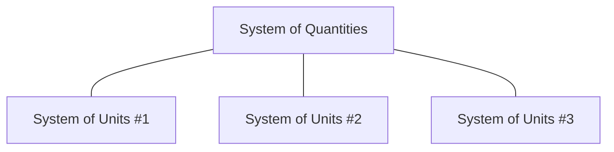

# International System of Quantities (ISQ): Part 1 - Introduction

This post starts a series of articles about the International System of Quantities (ISQ).
In this series, we will describe:

- What is ISQ?
- Which engineering problems does ISQ help to solve and how?
- How to model and implement it in the programming language?
- What is missing in the ISQ, and why is that a problem?

<!-- more -->

## Articles from this series

- Part 1 - Introduction
- [Part 2 - Problems when ISQ is not used](isq-part-2-problems-when-isq-is-not-used.md)
- [Part 3 - Modeling ISQ](isq-part-3-modeling-isq.md)
- [Part 4 - Implementing ISQ](isq-part-4-implemeting-isq.md)
- [Part 5 - Benefits](isq-part-5-benefits.md)

## Terms and Definitions

From our experience, many people, including experts in the domain, often tend to name things
differently, or sometimes they use the same term while having a different meaning in mind.
This is why it is essential to stick to one well-defined glossary of terms for metrology.

The **mp-units** project consistently uses the official metrology vocabulary defined by the ISO
and BIPM:

- [International Organization for Standardization (ISO)](https://www.iso.org/obp/ui#iso:std:iso-iec:guide:99:ed-1:v2:en),
- [International Bureau of Weights and Measures (BIPM)](https://jcgm.bipm.org/vim/en).

The above are identical and contain the same set of definitions. We provide both to point out that
the biggest institutions in standardizing metrology agree on the same vocabulary.

## Systems of Quantities vs Systems of Units

Here are the official definitions from our vocabulary:

!!! quote "[System of quantities](https://jcgm.bipm.org/vim/en/1.3.html)"

    A **system of quantities** is a set of quantities together with a set of noncontradictory
    equations relating those quantities.

!!! quote "[System of units](https://jcgm.bipm.org/vim/en/1.13.html)"

    A **system of units** is a set of base units and derived units, together with their multiples
    and submultiples, defined in accordance with given rules, for a given **system of quantities**.

From the definition above, we can find out that the systems of quantities and units form a hierarchy:

**System of quantities** defines quantities commonly used in engineering (e.g., _length_, _time_,
_mass_, _speed_, _energy_, _power_, etc.) and relations between them. It does not assign any
specific units to those quantities, though.

**Systems of units** are the ones that assign units of measurement to quantities from a specific
**system of quantities** they chose to model. Different **systems of units** are free to chose
whatever they find suitable for specific quantities and do not have to be consistent/compatible
with other such systems. For example:

- SI decided to measure _length_ in meters, _mass_ in kilograms, and _time_ in seconds,
- CGS decided to measure _length_ in centimeters, _mass_ in grams, and _time_ in seconds.

Both **systems of units** above agree on the unit of _time_, but chose different units for other
quantities. In the above example, SI chose a non-prefixed unit of metre for a base quantity of _length_
while CGS chose a scaled centimetre. On the other hand, SI chose a scaled kilogram over the gram used
in the CGS. Those decisions also result in a need for different [coherent units](https://jcgm.bipm.org/vim/en/1.12.html)
for derived quantities. For example:

| Quantity   | SI            | CGS             |
|------------|---------------|-----------------|
| _length_   | metre (m)     | centimetre (cm) |
| _mass_     | kilogram (kg) | gram (g)        |
| _time_     | second (s)    | second (s)      |
| _force_    | newton (N)    | dyne            |
| _energy_   | joule (J)     | erg             |
| _pressure_ | pascal (Pa)   | barye           |

Often, there is no way to state which one is correct or which one is wrong. Each
**system of units** has the freedom to choose whichever unit suits its engineering requirements
and constraints the best for a specific quantity.

## ISQ vs SI

Some of the systems of quantities and units have been used more over the years and have become more popular
than others. Here are the official descriptions of the most popular systems used in engineering
today:

!!! quote "[International System of Quantities (ISQ)](https://jcgm.bipm.org/vim/en/1.6.html)"

    The **International System of Quantities (ISQ)** is a system of quantities based on the seven base
    quantities: _length_, _mass_, _time_, _electric current_, _thermodynamic temperature_,
    _amount of substance_, and _luminous intensity_.

!!! quote "[International System of Units (SI)](https://jcgm.bipm.org/vim/en/1.16.html)"

    The **International System of Units (SI)** is a system of units, based on the **International
    System of Quantities**, their names and symbols, including a series of prefixes and their names
    and symbols, together with rules for their use, adopted by the General Conference on Weights
    and Measures (CGPM).

## The International System of Quantities (ISQ) standardization

The set of quantities constituting the ISQ is defined in the series of ISO 80000 and IEC 80000
standards under the general title "Quantities and units".

ISO 80000:

- Part 1: General
- Part 2: Mathematical signs and symbols to be used in the natural sciences and technology
- Part 3: Space and time
- Part 4: Mechanics
- Part 5: Thermodynamics
- Part 7: Light
- Part 8: Acoustics
- Part 9: Physical chemistry and molecular physics
- Part 10: Atomic and nuclear physics
- Part 11: Characteristic numbers
- Part 12: Condensed matter physics

IEC 80000:

- Part 6: Electromagnetism
- Part 13: Information science and technology
- Part 15: Logarithmic and related quantities, and their units
- Part 16: Printing and writing rules
- Part 17: Time dependency

## To be continued...

In the next part of this series, we will describe typical issues with libraries that do not
model systems of quantities.
