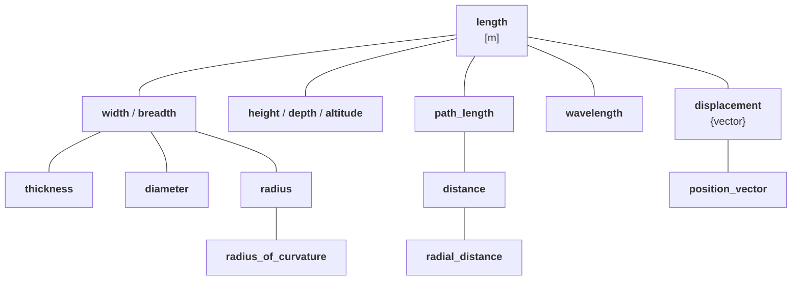

# International System of Quantities (ISQ): Part 3 - Modeling ISQ

The physical units libraries on the market typically only focus on modeling one or more systems
of units. However, as we have learned, this is not the only system kind to model. Another,
and maybe even more important, is a system of quantities. The most important example here is
the International System of Quantities (ISQ) defined by ISO/IEC 80000.

This article continues our series about the International System of Quantities. This time, we will
learn about the main ideas behind the ISQ and describe how it can be modelled in a programming
language.

<!-- more -->

## Articles from this series

- [Part 1 - Introduction](isq-part-1-introduction.md)
- [Part 2 - Problems when ISQ is not used](isq-part-2-problems-when-isq-is-not-used.md)
- Part 3 - Modeling ISQ
- [Part 4 - Implementing ISQ](isq-part-4-implemeting-isq.md)
- [Part 5 - Benefits](isq-part-5-benefits.md)
- [Part 6 - Challenges](isq-part-6-challenges.md)


## Dimension is not enough to describe a quantity

Most of the products on the market are aware of physical dimensions. However, a dimension is not
enough to describe a quantity. Let's repeat briefly some of the problems described in more detail
in the previous article. For example, let's see the following implementation:

```cpp
class Box {
  area base_;
  length height_;
public:
  Box(length l, length w, length h) : base_(l * w), height_(h) {}
  // ...
};

Box my_box(2 * m, 3 * m, 1 * m);
```

How do you like such an interface? It turns out that in most existing strongly-typed libraries
this is often the best we can do. :woozy_face:

Another typical question many users ask is how to deal with _work_ and _torque_.
Both of those have the same dimension but are distinct quantities.

A similar issue is related to figuring out what should be the result of:

```cpp
auto res = 1 * Hz + 1 * Bq + 1 * Bd;
```

where:

- `Hz` (hertz) - unit of _frequency_,
- `Bq` (becquerel) - unit of _activity_,
- `Bd` (baud) - unit of _modulation rate_.

All of those quantities have the same dimension, namely $\mathsf{T}^{-1}$, but probably it
is not wise to allow adding, subtracting, or comparing them, as they describe vastly different
physical properties.

If the above example seems too abstract, let's consider Gy (gray - unit of _absorbed dose_)
and Sv (sievert - unit of _dose equivalent_), or radian and steradian. All of those quantities
have the same dimensions.

Another example here is _fuel consumption_ (_fuel volume_ divided by _distance_, e.g.,
`6.7 l/100km`) and an _area_. Again, both have the same dimension $\mathsf{L}^{2}$, but probably
it wouldn't be wise to allow adding, subtracting, or comparing a _fuel consumption_ of a car
and the _area_ of a football field. Such an operation does not have any physical sense and should
fail to compile.

It turns out that the above issues can't be solved correctly without proper modeling of
a [system of quantities](../../appendix/glossary.md#system-of-quantities).


## Quantities of the same kind

As it was described in the previous article, dimension is not enough to describe a quantity.
We need a better abstraction to ensure the safety of our calculations. It turns out that
ISO/IEC 80000 comes with the answer:

!!! quote "ISO 80000-1:2009"

    - Quantities may be grouped together into categories of quantities that are
      **mutually comparable**.
    - Mutually comparable quantities are called **quantities of the same kind**.
    - Two or more quantities **cannot be added or subtracted unless they belong to the same category
      of mutually comparable quantities**.
    - Quantities of the **same kind** within a given system of quantities **have the same quantity
      dimension**.
    - Quantities of the **same dimension are not necessarily of the same kind**.

ISO Guide also explicitly states:

!!! quote "ISO Guide"

    **Measurement units of quantities of the same quantity dimension may be designated by the same
    name and symbol even when the quantities are not of the same kind**. For example,
    joule per kelvin and J/K are respectively the name and symbol of both a measurement unit of
    _heat capacity_ and a measurement unit of _entropy_, which are generally not considered to be
    quantities of the same kind. **However, in some cases special measurement unit names are
    restricted to be used with quantities of specific kind only**. For example, the measurement
    unit ‘second to the power minus one’ (1/s) is called hertz (Hz) when used for _frequencies_
    and becquerel (Bq) when used for _activities of radionuclides_. As another example, the joule
    (J) is used as a unit of _energy_, but never as a unit of _moment of force_,
    i.e. the newton metre (N · m).


The above quotes from ISO provide answers to all the issues mentioned above and in the previous
article.

More than one quantity may be defined for the same dimension:

- quantities of different kinds (e.g., _frequency_, _modulation rate_, _activity_).
- quantities of the same kind (e.g., _length_, _width_, _altitude_, _distance_, _radius_,
  _wavelength_, _position vector_).

Two quantities can't be added, subtracted, or compared unless they belong to
the same [kind](../../appendix/glossary.md#kind). As _frequency_, _activity_, and _modulation rate_
are of different kinds, the expression provided above should not compile.


## System of quantities is not only about kinds

ISO/IEC 80000 specifies hundreds of different quantities. Plenty of various kinds are provided,
and often, each kind contains more than one quantity. It turns out that such quantities form
a hierarchy of quantities of the same kind.

For example, here are all quantities of the kind length provided in the ISO 80000-3:



Each of the above quantities expresses some kind of _length_, and each can be measured with meters,
which is the unit defined by the SI for quantities of _length_. However, each has different
properties, usage, and sometimes even a different character (_position vector_ and _displacement_
are vector quantities).

Forming such a hierarchy helps us define arithmetics and conversion rules for various
quantities of the same kind.


## Converting between quantities of the same kind

Based on the hierarchy above, we can define the following quantity conversion rules:

1. **Implicit conversions**

    - Every _width_ is a _length_.
    - Every _radius_ is a _width_.

    ```cpp
    static_assert(implicitly_convertible(isq::width, isq::length));
    static_assert(implicitly_convertible(isq::radius, isq::length));
    static_assert(implicitly_convertible(isq::radius, isq::width));
    ```

    Implicit conversions are allowed on copy-initialization:

    ```cpp
    void foo(quantity<isq::length[m]> q);
    ```

    ```cpp
    quantity<isq::width[m]> q1 = 42 * m;
    quantity<isq::length[m]> q2 = q1;  // implicit quantity conversion
    foo(q1);                           // implicit quantity conversion
    ```

2. **Explicit conversions**

    - Not every _length_ is a _width_.
    - Not every _width_ is a _radius_.

    ```cpp
    static_assert(!implicitly_convertible(isq::length, isq::width));
    static_assert(!implicitly_convertible(isq::length, isq::radius));
    static_assert(!implicitly_convertible(isq::width, isq::radius));
    static_assert(explicitly_convertible(isq::length, isq::width));
    static_assert(explicitly_convertible(isq::length, isq::radius));
    static_assert(explicitly_convertible(isq::width, isq::radius));
    ```

    Explicit conversions are forced by passing the quantity to a call operator of a `quantity_spec`
    type:

    ```cpp
    void foo(quantity<isq::height[m]> q);
    ```

    ```cpp
    quantity<isq::length[m]> q1 = 42 * m;
    quantity<isq::height[m]> q2 = isq::height(q1);  // explicit quantity conversion
    foo(isq::height(q1));                           // explicit quantity conversion
    ```

3. **Explicit casts**

    - _height_ is never a _width_, and vice versa.
    - Both _height_ and _width_ are quantities of kind _length_.

    ```cpp
    static_assert(!implicitly_convertible(isq::height, isq::width));
    static_assert(!explicitly_convertible(isq::height, isq::width));
    static_assert(castable(isq::height, isq::width));
    ```

    Explicit casts are forced with a dedicated `quantity_cast` function:

    ```cpp
    void foo(quantity<isq::height[m]> q);
    ```

    ```cpp
    quantity<isq::width[m]> q1 = 42 * m;
    quantity<isq::height[m]> q2 = quantity_cast<isq::height>(q1);  // explicit quantity cast
    foo(quantity_cast<isq::height>(q1));                           // explicit quantity cast
    ```

4. **No conversion**

    - _time_ has nothing in common with _length_.

    ```cpp
    static_assert(!implicitly_convertible(isq::time, isq::length));
    static_assert(!explicitly_convertible(isq::time, isq::length));
    static_assert(!castable(isq::time, isq::length));
    ```

    Even the explicit casts will not force such a conversion:

    ```cpp
    void foo(quantity<isq::length[m]>);
    ```

    ```cpp
    quantity<isq::length[m]> q1 = 42 * s;    // Compile-time error
    foo(quantity_cast<isq::length>(42 * s)); // Compile-time error
    ```


## Comparing, adding, and subtracting quantities of the same kind

ISO/IEC 80000 explicitly states that _width_ and _height_ are quantities of the same kind,
and as such they:

- are mutually comparable,
- can be added and subtracted.

This means that we should be allowed to compare any quantities from the same tree (as long as
their underlying representation types are comparable):

```cpp
static_assert(isq::radius(1 * m) == isq::height(1 * m));
```

Also, based on our hierarchy above, the only reasonable result of `1 * width + 1 * height` is
`2 * length`, where the result of `length` is known as a **common quantity** type. A result
of such an equation is always the first common node in a hierarchy tree of the same kind.
For example:

```cpp
static_assert((isq::width(1 * m) + isq::height(1 * m)).quantity_spec == isq::length);
static_assert((isq::thickness(1 * m) + isq::radius(1 * m)).quantity_spec == isq::width);
static_assert((isq::distance(1 * m) + isq::path_length(1 * m)).quantity_spec == isq::path_length);
```


## Modeling a quantity kind

In the quantities and units library, we also need an abstraction describing an entire family of
quantities of the same kind. Such quantities have not only the same dimension but also
can be expressed in the same units.

To annotate a quantity to represent its kind (and not just a hierarchy tree's root quantity)
we introduced a `kind_of<>` specifier. For example, to express any quantity of _length_, we need
to type `kind_of<isq::length>`.

!!! important

    `isq::length` and `kind_of<isq::length>` are two different things.

Such an entity behaves as any quantity of its kind. This means that it is implicitly
convertible to any quantity in a tree.

```cpp
static_assert(!implicitly_convertible(isq::length, isq::height));
static_assert(implicitly_convertible(kind_of<isq::length>, isq::height));
```

Additionally, the result of operations on quantity kinds is also a quantity kind:

```cpp
static_assert(same_type<kind_of<isq::length> / kind_of<isq::time>, kind_of<isq::length / isq::time>>);
```

However, if at least one equation's operand is not a quantity kind, the result becomes a "strong"
quantity where all the kinds are converted to the hierarchy tree's root quantities:

```cpp
static_assert(!same_type<kind_of<isq::length> / isq::time, kind_of<isq::length / isq::time>>);
static_assert(same_type<kind_of<isq::length> / isq::time, isq::length / isq::time>);
```

!!! info

    Only a root quantity from the hierarchy tree or the one marked with `is_kind` specifier
    in the `quantity_spec` definition can be put as a template parameter to the `kind_of`
    specifier. For example, `kind_of<isq::width>` will fail to compile. However, we can call
    `get_kind(q)` to obtain a kind of any quantity:

    ```cpp
    static_assert(get_kind(isq::width) == kind_of<isq::length>);
    ```


## How do systems of units benefit from the ISQ and quantity kinds?

Modeling a system of units is the most essential feature and a selling point of every physical
units library. Thanks to that, the library can protect users from assigning, adding, subtracting,
or comparing incompatible units and provide automated conversion factors between various compatible
units.

Probably all the libraries in the wild model the SI (or at least most of it), and many of them
provide support for additional units belonging to various other systems (e.g., imperial).

### Systems of units are based on systems of quantities

Systems of quantities specify a set of quantities and equations relating to those quantities.
Those equations do not take any unit or a numerical representation into account at all. In order
to create a quantity, we need to add those missing pieces of information. This is where
a system of units kicks in.

The SI is explicitly stated to be based on the ISQ. Among others, it defines seven base units,
one for each base quantity of ISQ. In the library, this is expressed by associating a quantity
kind to a unit being defined:

```cpp
inline constexpr struct metre final : named_unit<"m", kind_of<isq::length>> {} metre;
```

The `kind_of<isq::length>` above states explicitly that this unit has an associated quantity
kind. In other words, `si::metre` (and scaled units based on it) can be used to express
the amount of any quantity of kind _length_.

!!! note

    For some systems of units (e.g., natural units), a unit may not have an associated quantity
    type. For example, if we define the speed of light constant as `c = 1`, we can define a system
    where both _length_ and _time_ will be measured in seconds, and _speed_ will be a quantity
    measured with the unit `one`. In such case, the definition will look as follows:

    ```cpp
    inline constexpr struct second final : named_unit<"s"> {} second;
    ```

### Constraining a derived unit to work only with a specific derived quantity

Some derived units are valid only for specific derived quantities. For example, SI specifies
both hertz and becquerel derived units with the same unit equation $s^{-1}$. However, it also
explicitly states:

!!! quote "SI"

    The hertz shall only be used for periodic phenomena and the becquerel shall only be used for
    stochastic processes in activity referred to a radionuclide.

This is why it is important for the library to allow constraining such units to be used only with
a specific quantity kind:

```cpp
inline constexpr struct hertz final : named_unit<"Hz", one / second, kind_of<isq::frequency>> {} hertz;
inline constexpr struct becquerel final : named_unit<"Bq", one / second, kind_of<isq::activity>> {} becquerel;
```

With the above, `hertz` can only be used for _frequencies_, while `becquerel` should only be used
for quantities of _activity_:

```cpp
quantity<isq::frequency[Hz]> q1 = 60 * Bq;   // Compile-time error
quantity<isq::activity[Hz]> q2;              // Compile-time error
quantity<isq::frequency[Hz]> q3 = 60 * Hz;   // OK
std::cout << q3.in(Bq) << "\n";              // Compile-time error
```

We know already that quantities of different kinds can't be compared, added, and subtracted.
The following equation will not compile thanks to constraining derived units to be valid for
specific kinds only:

```cpp
auto q = 1 * Hz + 1 * Bq;   // Fails to compile
```

All of the above features improve the safety of our library and the products that are using it.


## To be continued...

In the next part of this series, we will present how we can implement our ISQ model in a C++
programming language and we will point out some of the first issues that stand in our way.
