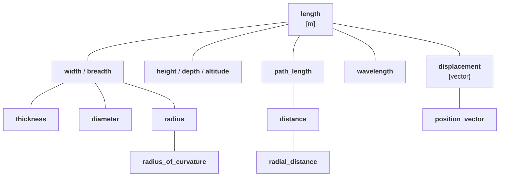
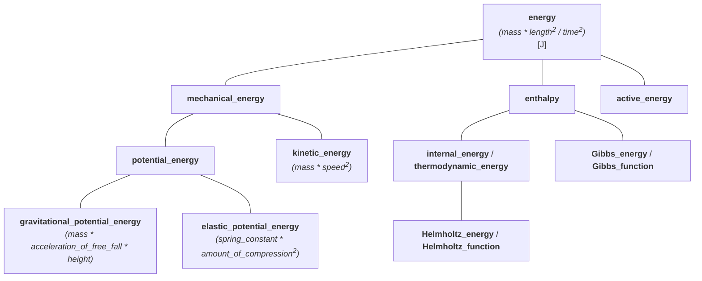
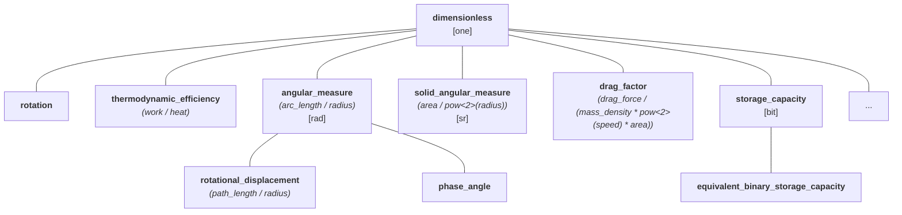

# International System of Quantities (ISQ): Part 4 - Implementing ISQ

Up until now, we have introduced the International System of Quantities and
described how we can model its main aspects. This article will present how to
implement those models in a programming language, and we will point out some of
the first issues that stand in our way.

<!-- more -->

In the previous article, we have already introduced a notion of quantity kind,
provided `kind_of<>` specifier, and described how it helps in the modeling of
the system of units (e.g., SI).

Now, it is time to see how we can implement hierarchies of quantities of the same kind.


## Articles from this series

- [Part 1 - Introduction](isq-part-1-introduction.md)
- [Part 2 - Problems when ISQ is not used](isq-part-2-problems-when-isq-is-not-used.md)
- [Part 3 - Modeling ISQ](isq-part-3-modeling-isq.md)
- Part 4 - Implementing ISQ
- [Part 5 - Benefits](isq-part-5-benefits.md)
- [Part 6 - Challenges](isq-part-6-challenges.md)


## Modeling a hierarchy of kind _length_

First, let's start with something easy - hierarchy of kind _length_. ISO
80000-3 does a good job of describing all relations between quantities in this
case.

We've seen this tree already:



This is how we can model it in C++:

```cpp
inline constexpr struct dim_length final          : base_dimension<"L"> {} dim_length;

inline constexpr struct length final              : quantity_spec<dim_length> {} length;
inline constexpr struct width final               : quantity_spec<length> {} width;
inline constexpr auto breadth = width;
inline constexpr struct height final              : quantity_spec<length> {} height;
inline constexpr auto depth = height;
inline constexpr auto altitude = height;
inline constexpr struct thickness final           : quantity_spec<width> {} thickness;
inline constexpr struct diameter final            : quantity_spec<width> {} diameter;
inline constexpr struct radius final              : quantity_spec<width> {} radius;
inline constexpr struct radius_of_curvature final : quantity_spec<radius> {} radius_of_curvature;
inline constexpr struct path_length final         : quantity_spec<length> {} path_length;
inline constexpr auto arc_length = path_length;
inline constexpr struct distance final            : quantity_spec<path_length> {} distance;
inline constexpr struct radial_distance final     : quantity_spec<distance> {} radial_distance;
inline constexpr struct wavelength final          : quantity_spec<length> {} wavelength;
inline constexpr struct displacement final        : quantity_spec<length, quantity_character::vector> {} displacement;
inline constexpr struct position_vector final     : quantity_spec<displacement> {} position_vector;
```

Thanks to the expressivity and power of C++ templates, we can specify all
quantity properties in one line of code. In the above code:

- `length` takes the base dimension to indicate that we are creating a base
    quantity that will serve as a root for a tree of quantities of the same kind,
- `width` and following quantities are branches and leaves of this tree with the parent always
  provided as the first argument to `quantity_spec` class template,
- `breadth` is an alias name for the same quantity as `width`.

!!! note

    Some quantities may be specified to have complex scalar, vector, or tensor character
    (e.g., `displacement`). The quantity character can be set with the last parameter of
    `quantity_spec`.


## Modeling a hierarchy of kind _energy_

Base quantities are simple. It is more complicated when we start modeling
derived quantities. Let's try to model the hierarchy for _energy_.

When we look into the ISO/IEC 80000 standards, this task immediately stops
being as easy as the previous one. Derived quantity equations often do not
automatically form a hierarchy tree, and ISO/IEC standards do not provide a
clear answer to inter-quantity dependencies. This is why it is often not
obvious what such a tree should look like.

Even more, ISO explicitly states:

!!! quote "ISO/IEC Guide 99"

    The division of ‘quantity’ according to ‘kind of quantity’ is, to some extent, arbitrary.

Let's try anyway. The below presents some arbitrary hierarchy of derived
quantities of kind _energy_:



As we can see above, besides what we've already seen for _length_ hierarchy,
derived quantities may provide specific recipes that can be used to create them
implicitly:

- _energy_ is the most generic one and thus can be created from base quantities
  of _mass_, _length_, and _time_. As those are also the roots of quantities of
  their kinds and all other quantities from their trees are implicitly
  convertible to them, it means that an _energy_ can be implicitly constructed
  from any quantity of _mass_, _length_, and _time_:

    ```cpp
    static_assert(implicitly_convertible(isq::mass * pow<2>(isq::length) / pow<2>(isq::time), isq::energy));
    static_assert(implicitly_convertible(isq::mass * pow<2>(isq::height) / pow<2>(isq::time), isq::energy));
    ```

- _mechanical energy_ is a more "specialized" quantity than _energy_ (not every
  _energy_ is a _mechanical energy_). It is why an explicit cast is needed to
  convert from either _energy_ or the results of its
  [quantity equation](../../appendix/glossary.md#quantity-equation):

    ```cpp
    static_assert(!implicitly_convertible(isq::energy, isq::mechanical_energy));
    static_assert(explicitly_convertible(isq::energy, isq::mechanical_energy));
    static_assert(!implicitly_convertible(isq::mass * pow<2>(isq::length) / pow<2>(isq::time),
                                          isq::mechanical_energy));
    static_assert(explicitly_convertible(isq::mass * pow<2>(isq::length) / pow<2>(isq::time),
                                         isq::mechanical_energy));
    ```

- _gravitational potential energy_ is not only even more specialized one but
  additionally, it is special in a way that it provides its own "constrained"
  [quantity equation](../../appendix/glossary.md#quantity-equation). Maybe not
  every `mass * pow<2>(length) / pow<2>(time)` is a _gravitational potential
  energy_, but every `mass * acceleration_of_free_fall * height` is.

    ```cpp
    static_assert(!implicitly_convertible(isq::mass * pow<2>(isq::length) / pow<2>(isq::time),
                                          gravitational_potential_energy));
    static_assert(explicitly_convertible(isq::mass * pow<2>(isq::length) / pow<2>(isq::time),
                                         gravitational_potential_energy));
    static_assert(implicitly_convertible(isq::mass * isq::acceleration_of_free_fall * isq::height,
                                         gravitational_potential_energy));
    ```

And here is the C++ code for it:

```cpp
inline constexpr struct energy final                         : quantity_spec<mass* pow<2>(length) / pow<2>(time)> {} energy;
inline constexpr struct mechanical_energy final              : quantity_spec<energy> {} mechanical_energy;                                                            // differs from ISO 80000
inline constexpr struct potential_energy final               : quantity_spec<mechanical_energy> {} potential_energy;                                                  // differs from ISO 80000
inline constexpr struct gravitational_potential_energy final : quantity_spec<potential_energy, mass * acceleration_of_free_fall * height> {} potential_energy;        // not in ISO 80000
inline constexpr struct elastic_potential_energy final       : quantity_spec<potential_energy, spring_constant * pow<2>(amount_of_compression)> {} potential_energy;  // not in ISO 80000
inline constexpr struct kinetic_energy final                 : quantity_spec<mechanical_energy, mass* pow<2>(speed)> {} kinetic_energy;                               // differs from ISO 80000
inline constexpr struct enthalpy final                       : quantity_spec<energy> {} enthalpy;                                                                     // differs from ISO 80000
inline constexpr struct internal_energy final                : quantity_spec<enthalpy> {} internal_energy;                                                            // differs from ISO 80000
inline constexpr auto thermodynamic_energy = internal_energy;
inline constexpr struct Helmholtz_energy final               : quantity_spec<internal_energy> {} Helmholtz_energy;
inline constexpr auto Helmholtz_function = Helmholtz_energy;
inline constexpr struct Gibbs_energy final                   : quantity_spec<enthalpy> {} Gibbs_energy;
inline constexpr auto Gibbs_function = Gibbs_energy;
```

Again, the first parameter of `quantity_spec` determines the position in the
tree. If a second argument is provided, it denotes a recipe for this quantity.

With the above simple definitions we've automatically addressed our
_energy_-related issues from the
[Various quantities of the same dimension and kinds](isq-part-2-problems-when-isq-is-not-used.md#various-quantities-of-the-same-dimension-and-kinds)
chapter of the "Part 2" article.


## Modeling a hierarchy of kind _dimensionless_

As the last example for this article, let's try to model and implement
quantities of dimension one, often also called dimensionless quantities. This
[quantity hierarchy](../../appendix/glossary.md#quantity-hierarchy) contains
more than one [quantity kind](../../appendix/glossary.md#kind) and more than one
unit in its tree:



To enable such support in the library, we provided an `is_kind` specifier that
can be appended to the quantity specification:

```cpp
inline constexpr struct dimensionless final            : quantity_spec<detail::derived_quantity_spec<>{}> {} dimensionless;
inline constexpr struct rotation final                 : quantity_spec<dimensionless> {} rotation;
inline constexpr struct thermodynamic_efficiency final : quantity_spec<dimensionless, work / heat> {} efficiency;
inline constexpr struct angular_measure final          : quantity_spec<dimensionless, arc_length / radius, is_kind> {} angular_measure;
inline constexpr struct rotational_displacement final  : quantity_spec<angular_measure, path_length / radius> {} rotational_displacement;
inline constexpr struct phase_angle final              : quantity_spec<angular_measure> {} phase_angle;
inline constexpr struct solid_angular_measure final    : quantity_spec<dimensionless, area / pow<2>(radius), is_kind> {} solid_angular_measure;
inline constexpr struct drag_factor final              : quantity_spec<dimensionless, drag_force / (mass_density * pow<2>(speed) * area)> {} drag_factor;
inline constexpr struct storage_capacity final         : quantity_spec<dimensionless, is_kind> {} storage_capacity;
```

With the above, we can constrain `radian`, `steradian`, and `bit` to be allowed for usage with
specific quantity kinds only:

```cpp
inline constexpr struct radian final    : named_unit<"rad", metre / metre, kind_of<isq::angular_measure>> {} radian;
inline constexpr struct steradian final : named_unit<"sr", square(metre) / square(metre), kind_of<isq::solid_angular_measure>> {} steradian;
inline constexpr struct bit final       : named_unit<"bit", one, kind_of<storage_capacity>> {} bit;
```

but still allow the usage of `one` and its scaled versions for such quantities.

!!! note

    `dimensionless` is a special quantity which serves as an identity element in quantity
    equations. It is predefined in the library's framework and there is no way for the user to
    define it or something similar to it.


## To be continued

In the next part of this series, we will present how our ISQ model helps to address the remaining
issues described in the [Part 2](isq-part-2-problems-when-isq-is-not-used.md) of our series.
