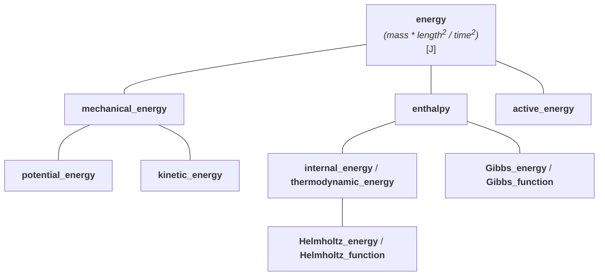
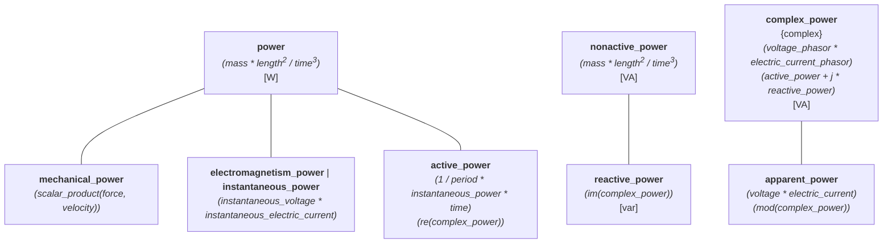
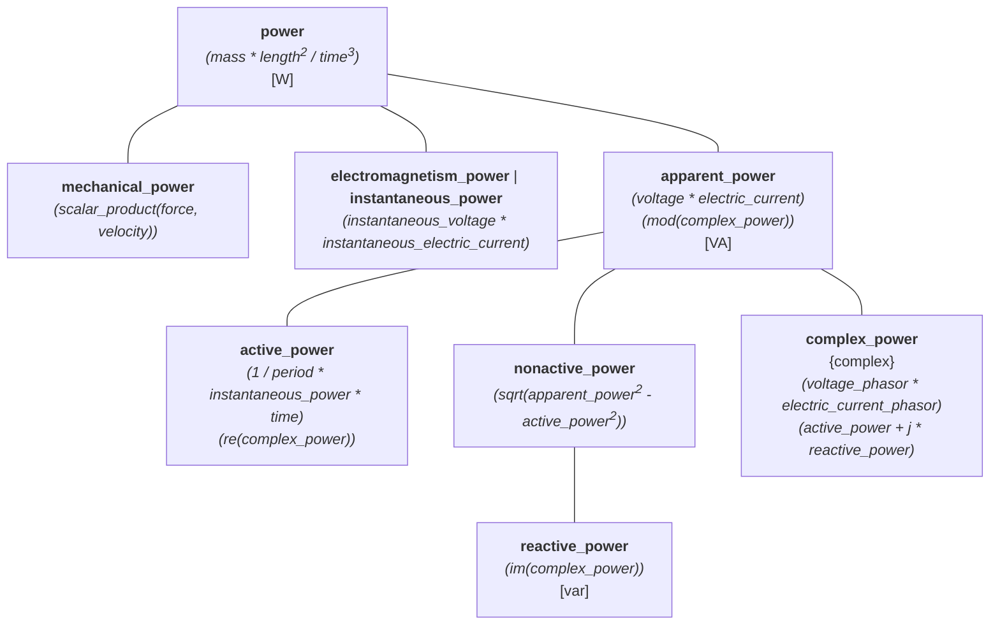

# International System of Quantities (ISQ): Part 6 - Challenges

This article might be the last one from our series. This time, we will discuss the challenges and
issues with modeling of the ISQ in software.

<!-- more -->

## Articles from this series

- [Part 1 - Introduction](isq-part-1-introduction.md)
- [Part 2 - Problems when ISQ is not used](isq-part-2-problems-when-isq-is-not-used.md)
- [Part 3 - Modeling ISQ](isq-part-3-modeling-isq.md)
- [Part 4 - Implementing ISQ](isq-part-4-implementing-isq.md)
- [Part 5 - Benefits](isq-part-5-benefits.md)
- Part 6 - Challenges


## Ambiguity

Some quantity names are ambiguous. It is not a problem of ISQ but of the English language and
the way we communicate things. When I say: "Every _width_ is a _length_, but not every _length_
is a _width_" most people understand this right away. However, the same people trying to model
[our 3D box problem](isq-part-2-problems-when-isq-is-not-used.md#various-quantities-of-the-same-dimension-and-kinds)
try to do it as follows:

```cpp
class Box {
  quantity<isq::length[m]> length_;
  quantity<isq::width[m]> width_;
  quantity<isq::height[m]> height_;
public:
  // ...
};
```

This looks correct at first sight. Only when we think about the sentence mentioned above will
we realize that this implementation has a problem. We intended to specify three orthogonal
dimensions of the box, each of which will be a strong quantity that is not convertible to others.
But we've failed.

When we look at the
[tree of quantities of length](isq-part-4-implementing-isq.md#modeling-a-hierarchy-of-kind-length)
we immediately see that both _width_ and _height_ are special _lengths_ so they are convertible to
it.

To implement our task correctly, we had to define and use a new quantity of kind _length_:

```cpp
inline constexpr struct horizontal_length final : quantity_spec<isq::length> {} horizontal_length;
```

We do not propose adding _horizontal length_ to ISO 80000-3. There are probably other similar
cases as well, but so far, this was the most common and obvious one we've encountered.


## No common quantities

ISO 80000-1:2009 explicitly states:

!!! quote

    Two or more quantities cannot be added or subtracted unless they belong to the same category
    of mutually comparable quantities.

This means that we should be able to add and subtract any quantities as long as they belong to
the same kind. However, ISO/IEC documents do not provide any rules or even hints about what should
be the result of such operations.

If it is possible to add _radius_ and _distance_, then what quantity should be provided
in return? Undoubtedly, the resulting quantity type can't be the same as any of the arguments.
It is not a _radius_ or _distance_. It is some closer unspecified _length_, though.

!!! info

    Finding the correct solution took us many months of experimentation and implementation.
    Based on the hierarchy tree of quantities, we can define
    [conversion rules](isq-part-3-modeling-isq.md#converting-between-quantities-of-the-same-kind)
    and what a [common quantity should be](isq-part-3-modeling-isq.md#comparing-adding-and-subtracting-quantities-of-the-same-kind).


## Lack of consistency

The documents of ISO/IEC 80000 are not 100% consistent, and programming languages do not like
inconsistencies.

For example:

- _time_ is mentioned as a base quantity of ISQ in ISO 80000-1 chapter 4.5.
- ISO 80000-3 "Space and time", does not define a quantity of _time_. It provides a _duration_
  quantity (item 3-9) with symbol _t_, and states in the Remarks section:

    !!! quote

        Duration is often just called time.

- Other parts (e.g., IEC 80000-6 "Electromagnetism") often say:

    !!! quote

        ... _t_ is time (ISO 80000-3)

To be consistent, ISO/IEC should either:

- change ISO 80000-1 chapter 4.5 and all references in other parts to use _duration_ (unlikely),
- or add _time_ as an alias name to _duration_ in the definition 3-9 of ISO 80000-3.


## Lack of definitions

ISQ defines derived quantities in terms of other quantities provided in the series. However, some
definitions mention quantities that are not defined in the ISQ at all.

For example, _weight_ is defined as $F_\textsf{g} = m\;g$, where $m$ is the _mass_ of the body
(item 4-1 of ISO 80000-4 "Mechanics"), and $g$ is the _local acceleration of free fall_ (ISO 80000-3).

The problem here is that ISO 80000-3 never defines a quantity with a symbol $g$ or named as a
_local acceleration of free fall_. The closest one we have is _acceleration_ (item 3-11) with
a symbol $a$.

!!! info

    To have a proper definition of _weight_ in **mp-units** that is not defined in terms of just
    any kind of _acceleration_, we have added `isq::acceleration_of_free_fall` in our definitions
    as an extension to the original ISQ set of quantities.


## Not engineering-friendly

Many quantities have proper physical definitions, but they are sometimes not engineering-friendly.

For example, _velocity_ is defined as a rate of change of _position vector_
$v = \frac{\textsf{d}r}{\textsf{d}t}$, where $r$ denotes the _position vector_ (item 3‑1.10) and
$t$ the _duration_ (item 3‑9).

Next, a _speed_ quantity is defined as the magnitude of _velocity_. Despite being
physically correct, requiring every _speed_ to be derived from the vector quantity of _velocity_
in software would be inconvenient. If this was the only case, people would always need to use
vector representations of _position vectors_ to talk about _speeds_, which differs from what we
do in practice. In practice, we divide any kind of _length_ by _time_ to get some kind of _speed_.

ISO 80000-3 provides _length_, _height_, _distance_ and other quantities of kind _length_ that when
divided by _duration_ can serve really well to calculate _speed_.

!!! info

    This is why in **mp-units**, we decided to divert from the official definition of _speed_ and
    define it as:

    ```cpp
    inline constexpr struct speed : quantity_spec<speed, length / time> {} speed;
    ```

    This allows us to create a quantity of kind _speed_ from any quantity of _length_ divided
    by _time_.

    Additionally, it is essential to note that for the needs of our library, defining _velocity_
    as `position_vector / duration` would be wrong. We miss the delta part here. Even though it is
    not mentioned in ISO 80000-3, the delta of _position vectors_ is actually a _displacement_.
    This is why our _velocity_ is defined as:

    ```cpp
    inline constexpr struct velocity : quantity_spec<speed, displacement / duration> {} velocity;
    ```

    Please also note that _velocity_ is defined as a more specialized quantity of _speed_.


## Affine space agnostic

[The affine space](../../users_guide/framework_basics/the_affine_space.md) is a powerful
abstraction, allowing us to model some problems safer or more accurately. It has two types of
entities:

- point - a position specified with coordinate values (e.g., location, address, etc.),
- displacement vector - the difference between two points (e.g., shift, offset, displacement,
  duration, etc.).

Vectors support all the arithmetics operations, but points have some limitations. It is not
possible to:

- add two _points_,
- subtract a _point_ from a _vector_,
- multiply nor divide _points_ with anything else.

ISO/IEC series does not acknowledge this abstraction even though it would be really useful in
some cases. Let's discuss the following two examples.

What does it mean to add two _altitudes_? It is not meaningful. On the other hand, subtracting
those should not result in an _altitude_, but in a quantity of _height_. Adding or
subtracting _height_ to/from _altitude_ results in _altitude_. Subtracting _altitude_ from
_height_ is meaningless again. Those quantities clearly model affine space. Maybe this is why
ISQ defines them as one quantity type _height_/_depth_/_altitude_?

What does it mean to add two _position vectors_? It is not meaningful again. However, subtracting
those results in a _displacement_ as we noted in the previous chapter. Adding or subtracting
_displacement_ to/from _position vector_ results in another _position vector_, and subtracting
_position vector_ from _displacement_ does not have physical sense. Again, those quantities
perfectly model affine space. However, this time, those are defined as separate and independent
quantities (i.e., displacement is not modeled as delta _position vector_ or _position vector_
is not modeled as a _displacement_ from the origin of a coordinate system).

!!! info

    Currently, **mp-units** does not enforce the affine space behavior for such quantities.
    Today, subtracting two _altitudes_ result in an _altitude_ and subtracting two
    _position vectors_ result in a _position vector_. However, we plan to support automatic
    conversion to a proper quantity type on subtraction and addition shortly.


## Non-negative quantities

Some quantities in the ISQ are defined as non-negative. This is a really interesting property that
may be checked at runtime to increase safety. However, the number of such quantities is minimal.
From a few hundred quantities provided by the ISO/IEC series, only the following have this property
mentioned explicitly:

- _width_/_breadth_,
- _thickness_,
- _diameter_,
- _radius_.

If _height_ was defined separately from _altitude_, it could probably also join this group.

Let's think a bit more about this. What does it mean that a quantity is non-negative? Indeed,
it is hard to imagine something of a negative _width_ or _radius_. However, if we subtract
two _widths_, the second one may be larger. This will result in a negative
quantity of _width_, violating our precondition. So, is it non-negative or not?

Again, we have to talk about the affine space abstractions. Every empirical measurement can be
expressed as a point. Such points for some quantities may be non-negative indeed.

Non-negative quantities do not end on the ones provided above. For example, _speed_ is a good
example here as well. In general, all magnitudes of vector quantities will also have this property.

When subtracting two points, we end up with a delta/displacement type, which may be negative
even for quantities listed as non-negative in the ISQ. As stated in the previous chapter,
having affine space abstractions acknowledged in ISQ would greatly help here.


## Lack of quantity recipes

Definition of many derived quantities provides their recipes in the form of
[quantity equations](../../appendix/glossary.md#quantity-equation) (e.g., _weight_ equation
in the previous chapter). However, some of them do not. Instead, they often provide a very
generic description.

For example, _force_ is defined as:

!!! quote

    vector (ISO 80000-2) quantity describing interaction between bodies or particles.

This is not helpful for programming languages that like explicit definitions. Different
vendors may interpret the above differently, which will result in different implementations that
will not be compatible with each other.

As the derived quantity of _force_ has to be a vector quantity, it has to be defined in terms of
at least one other vector quantity. We have a few to choose from:

- _displacement_ ($\Delta{r}$),
- _velocity_ ($v$),
- _acceleration_ ($a$).

It is not stated explicitly in ISQ which one of those should be used and how.

!!! info

    In **mp-units** we decided to define _force_ as $F = m\;a$.


## Lack of generic quantities and name conflicts

In the previous chapter, we complained about some definitions needing to be more complex or generic.
On the other hand, we also lack some generic quantities in ISQ that could serve as a root for
a quantity hierarchy tree.

For example:

- ISO 80000-4 "Mechanics" defines _power &lt;mechanics&gt;_ as $P = F\;v$ (scalar product of force $F$
  (item 4-9.1) acting to a body and its velocity $v$ (ISO 80000-3)),
- ISO 80000-6 "Electromagnetism" defines _power_ as $p = u\;i$ (scalar quantity given by the
  product of _instantaneous voltage_ $u$ (item 6-11.3) and _instantaneous electric current_ $i$
  (item 6-1)).

First, the above definitions have somehow conflicting names which makes it hard for the programming
languages to name them consistently by different vendors.

!!! info

    In **mp-units**, we chose `mechanical_power` and `electromagnetism_power` for those.

Second, we do not have any other more generic definition of _power_ to put above those in the tree.
Not having it makes it hard to answer what should be the result of:

```cpp
quantity q = isq::mechanical_power(42 * W) + isq::electromagnetism_power(60 * W);
```

!!! info

    To solve the above problem, we have added `isq::power` in **mp-units**, that has a really
    generic definition of:

    ```cpp
    inline constexpr struct power : quantity_spec<mass* pow<2>(length) / pow<3>(time)> {} power;
    ```


## Invalid definitions order

_Energy_ is defined a bit better than _power_, but still not without issues.

The first time ISQ mentions _energy_ is in the ISO 80000-4 "Mechanics". It defines
_potential energy_, _kinetic energy_, and a _mechanical energy_ as the sum of the first two.
Right after that a _mechanical work/work_ is defined.

Then ISO 80000-5 "Thermodynamics" defines _energy &lt;thermodynamics&gt;_ as:

!!! quote

    ability of a system to do work (ISO 80000-4).

Next, _internal energy/thermodynamic energy_ is defined in terms of the change of heat.

From the above, it seems that what is called _energy &lt;thermodynamics&gt;_ should actually be
the root of our tree and probably be provided in Part 4 before the _mechanical energy_ is defined.


## Hierarchies of derived quantities

Derived quantities of the same kind are often independently defined in the ISQ. The ISO/IEC 80000
series often does not suggest any hierarchy between those. Even more, it states:

!!! quote "ISO/IEC Guide 99"

    The division of ‘quantity’ according to ‘kind of quantity’ is, to some extent, arbitrary.

Because of this, it is unknown or ambiguous how to form a hierarchy tree for such quantities.

To get some sense of the complexity here, let's look again at our tree of quantities of a kind
_energy_:



Not being exact means that every vendor may implement it differently. This will result in:

- different convertibility rules among quantities:

    ```cpp
    static_assert(implicitly_convertible(isq::potential_energy, isq::mechanical_energy));
    static_assert(explicitly_convertible(isq::mechanical_energy, isq::potential_energy));
    ```

- different common quantities resulting from the arithmetics on various quantities of the same
  kind:

    ```cpp
    static_assert((isq::potential_energy(1 * J) + isq::kinetic_energy(1 * J)).quantity_spec == isq::mechanical_energy);
    ```

It would be great if ISQ could provide specific division of quantities into kinds and more
information about the position of each quantity within the hierarchy of quantities of
the same kind.

!!! important

    We can try to do this by ourselves, but it is tough. Probably no one, for sure we are
    not, is an expert in all the fields of ISO/IEC 80000 applicability.

    We need the help of subject matter experts who will help us build those trees for their domains
    and then verify that everything works as expected.


## The same or a different kind?

Some quantities are more complicated than others. For example, _power_ has:

- real scalar quantities expressed in:
    - W (watts) (e.g., _mechanical power_, _active power_),
    - VA (volt-ampere) (e.g., _apparent power_),
    - var (e.g., _reactive power_),
- complex scalar quantities expressed in VA (volt-ampere) (e.g., _complex power_).

How should we model this? Maybe those should be two or three independent trees of quantities, each
having its own unit?



This will mean that we will not be able to add or compare _active power_, _reactive power_, and
_apparent power_, which probably makes a lot of sense. However, it also means that the following
will fail to compile:

```cpp
quantity apparent = isq::apparent_power(100 * VA);
quantity active = isq::active_power(60 * W);
quantity<isq::nonactive_power[VA]> q = sqrt(pow<2>(apparent) - pow<2>(active)); // Compile-time error
```

Also the following will not work:

```cpp
quantity active = isq::active_power(60 * W);
quantity reactive = isq::reactive_power(40 * var);
quantity<isq::apparent_power[VA]> q = sqrt(pow<2>(active) + pow<2>(reactive)); // Compile-time error
```

If we want the above to work maybe we need to implement the tree as follows?



However, the above allows direct addition and comparison of _active power_ and _nonactive power_,
and also will not complain if someone will try to use watt (W) as a unit of _apparent power_ or
_reactive power_.

Again, ISQ does not provide a direct answer here.


## More base quantities?

Is ISQ really based on only seven base quantities? Let's look at the definition of
_traffic intensity_ in IEC 80000-13 "Information science and technology":

!!! quote

    number of simultaneously busy resources in a particular pool of resources.

It looks like a definition of a specialized dimensionless quantity or, more correctly, a quantity
of dimension one. This would not be the only such case. Even in the same Part 13, we can find
quantities like _storage capacity_ with a similar property.

Only when we look closer do we start to see differences. All dimensionless quantities, even if they
have their own dedicated units, can also be measured in a unit of one (1). This is true for
_storage capacity_ (also measured in bits), _angular measure_ (also measured in radians),
_solid angular measure (also measured in steradians), and more.

However, _traffic intensity_ can only be measured in erlangs (E), not in a unit one (1).
Does it mean that it is a "hidden" 8-th base quantity in ISQ? If so, should it have its own
dimension as well?

Angular quantities are another interesting case here. Scientists have written petitions and papers
for years to make them an additional dimension in ISQ and SI. More about this can be found in
our documentation's [Strong Angular System](../../users_guide/systems/strong_angular_system.md)
chapter.


## Summary

ISQ is tremendous and solves many problems we had in modeling various subjects for years in
software. As a result, we have more powerful tools in our hands that allow us to deliver safer
products.

Unfortunately, ISQ, contrarily to SI, is not widely recognized, and no libraries besides
**mp-units** model it in any programming language. Keeping it behind a paywall does not help
either. We hope that posts from this series will spread in the community, raise awareness
of ISQ and its benefits, and encourage authors of other libraries to implement it in their
products.

Despite all the benefits, it is essential to realize that ISQ has many problems. International
standards should be specified in such a way that there is no room for ambiguity in their
interpretation by different parties trying to use them. As described above, this is not the case
here.

ISQ is not ready to be unambiguously modeled in software by various vendors. Here are the most
important problems to solve to allow this:

1. ISQ needs to define basic operations on quantities:

    - what the result of addition and subtraction should be when arguments differ,
    - convertibility rules.

2. The exact quantity equation recipe needs to be included for many derived quantities.
3. Many ISQ quantities do not provide their exact relation versus other quantities of the same
   kind (no strict hierarchy).
4. Some missing quantities need to be included. Others would benefit from corrected names.

Additionally:

- extending ISQ with affine space abstractions,
- specifying more quantities as non-negative,
- adding more base quantities (i.e., _angle_)

could improve the safety of our programs and products that people depend on with their lives on
a daily basis.

I hope you enjoyed following this series and learned more about the International System
of Quantities. Please try it out in your domain and share feedback with us. We always love to
hear about the projects in which our library is being used and about use cases it helps
address.
