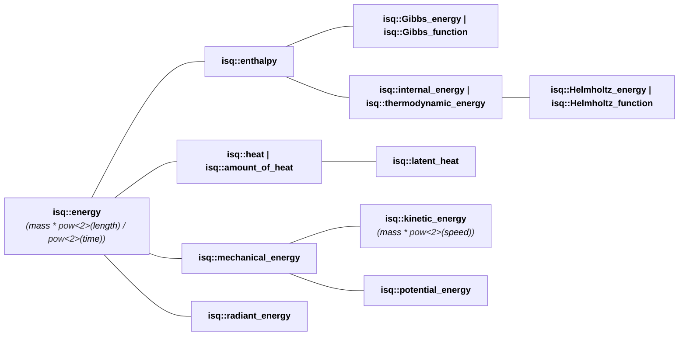

# New Systems Documentation Generator

We're excited to announce a major enhancement to the **mp-units** documentation: an
automated systems reference generator that extracts and documents all quantities, units,
dimensions, and their relationships directly from the library's C++ source code.

<!-- more -->

## The Challenge

**mp-units** has grown to support an extensive collection of systems of quantities and units:

- **15 systems** including ISQ, SI, CGS, IAU, Natural Units, IEC, Imperial, USC, and more
- **400+ quantities** spanning physics, engineering, astronomy, and computer science domains
- **200+ units** with proper relationships and conversions
- **150+ quantity hierarchies** showing parent-child relationships
- **10+ dimensions** forming the foundation of dimensional analysis
- **5+ point origins** for affine space quantities (temperature, coordinates, etc.)
- **32 prefixes** for scaling units

Manually documenting this vast ecosystem would be error-prone and quickly become outdated
as the library evolves. We needed an automated solution that could extract information
directly from the source code and generate comprehensive, accurate, and always up-to-date
reference documentation.


## Why Not Doxygen?

You might wonder: "Why not just use Doxygen or a similar tool?" While Doxygen excels at
extracting API documentation from comments and generating reference pages for classes and
functions, it falls short for our specific needs:

**Limited semantic understanding**: Doxygen treats C++ code as text to parse for structure,
but doesn't understand the *meaning* of our domain-specific definitions. It can't recognize
that `speed final : quantity_spec<length / time>` represents a physical quantity defined
as the ratio of _length_ to _time_.

**No cross-correlation**: Doxygen can't automatically discover and document the relationships
between quantities, units, and dimensions. It won't understand that the unit `newton`
relates to the quantity `force`, which in turn is derived from `mass`, `length`, and `time`.

**Can't extract metadata**: The rich semantic information encoded in our template parameters—
like `kind_of<isq::length>` indicating a quantity hierarchy, or `mag<1'000>` indicating
a scaling factor—is invisible to Doxygen. It would simply render these as template syntax
without extracting their meaning.

**Can't associate unit symbols**: Doxygen can't recognize that an object in the `unit_symbol`
namespace represents the symbol for a unit defined elsewhere. For example, it wouldn't
understand that `unit_symbol::m` (the symbol object) corresponds to the `metre` unit,
or that `unit_symbol::kg` relates to `kilogram`. These are separate C++ entities that
only become connected through the library's type system—a connection that requires
type introspection to discover.

**No custom views**: We needed specialized views like:

- Quantity hierarchy diagrams showing parent-child relationships
- Quantity hierarchy index organized by their associated dimensions
- Unit tables providing information about the symbols and definition details
- Cross-references linking units, quantities, and dimensions

Doxygen's output is optimized for API documentation, not for generating a physics-aware
systems reference with interactive hierarchies and rich cross-linking.

We needed a tool that could *understand* the domain model encoded in our C++20 definitions
and generate documentation that reflects the structure of physical quantities and units,
not just the structure of C++ classes.


## The Solution: Code as Documentation

Thanks to **mp-units**' use of modern C++20 features, particularly class types as
non-type template parameters (NTTPs), the library's definitions are remarkably terse
and parse-friendly. Most entities are defined in single, declarative lines:

```cpp
inline constexpr struct metre final : named_unit<"m", kind_of<isq::length>> {} metre;
inline constexpr struct second final : named_unit<"s", kind_of<isq::duration>> {} second;

inline constexpr struct speed final : quantity_spec<length / time> {} speed;
inline constexpr struct acceleration final : quantity_spec<speed / time> {} acceleration;
```

For units with special symbols, the library separates the unit definition from its symbol
object:

```cpp
// Unit definition
inline constexpr struct ohm final : named_unit<{u8"Ω", "ohm"}, volt / ampere> {} ohm;

// Symbol object in unit_symbol namespace
namespace unit_symbols {
  inline constexpr auto Ω = ohm;
}
```

!!! info

    More info on `unit_symbols` can be found in our [Quick Start chapter](../../getting_started/quick_start.md#quantities).

This declarative style makes it possible to parse the C++ source code and extract:

- **Entity names and symbols**: `metre`, `"m"`, `second`, `"s"`, `ohm`, `{u8"Ω", "ohm"}`
- **Symbol associations**: `unit_symbol::Ω` corresponds to `ohm`
- **Relationships**: `speed` is defined as `length / time`, `ohm` as `volt / ampere`
- **Hierarchies**: through `kind_of<>` specifications and derivation from parent quantity
- **Namespaces**: organizing systems like `mp_units::si`, `mp_units::isq`

The generator works without requiring macros (aside from the portability `QUANTITY_SPEC`
macro).


## What Gets Generated

The documentation generator creates a comprehensive systems reference with multiple views:

### System-Level Documentation

For each system (SI, ISQ, CGS, etc.), the generator produces:

- **Dimensions table**: Base dimensions with their symbols
- **Quantities tables**:
    - All quantities with their types, character, dimensions, parent quantities, and equations
    - Aliases and relationships clearly marked
- **Units tables**:
    - Base units and derived units with their symbols and definitions
    - Links to related quantities
- **Prefixes**: SI prefixes (kilo, mega, milli, etc.) with their symbols and scaling factors
- **Point Origins**: Reference points for affine quantities (Celsius zero, Unix epoch, etc.)

Example: [SI Systems Reference](../../reference/systems_reference/systems/si.md)

### Cross-Reference Indexes

Global indexes provide different views of the entire library:

- **[Units Index](../../reference/systems_reference/units_index.md)**: All units across
  all systems
- **[Quantities Index](../../reference/systems_reference/quantities_index.md)**: All
  quantities with their systems
- **[Dimensions Index](../../reference/systems_reference/dimensions_index.md)**: All
  dimensions used across systems
- **[Prefixes Index](../../reference/systems_reference/prefixes_index.md)**: All prefixes
- **[Point Origins Index](../../reference/systems_reference/point_origins_index.md)**: All
  reference points for affine quantities

### Quantity Hierarchies

One of the most powerful features is the **quantity hierarchy visualization**. For quantities
that have parent-child relationships (e.g., _height_ is a kind of _length_), the generator
creates interactive Mermaid diagrams showing the complete hierarchy.

For example, the [energy hierarchy](../../reference/systems_reference/hierarchies/energy_isq.md)
shows how various energy-related quantities relate to the base `energy` concept:



These hierarchies are essential for understanding how **mp-units** achieves strong type safety
—`kinetic_energy` cannot be used where `potential_energy` is expected, even though both are
forms of mechanical energy.


## Interactive and Linkified

Every piece of generated documentation is fully **cross-linked**:

- Quantity definitions link to their parent quantities
- Unit definitions link to the quantities they measure (if specified)
- Equations are linkified—click on any identifier to jump to its definition
- External references link to source systems (ISQ quantities, SI base units, etc.)

The hierarchies themselves are interactive: hover over nodes, zoom, pan, and click on
any linked quantity name to navigate to its detailed documentation.


## Integration with User Guide

The generated systems reference complements the existing User's Guide. Each user-facing
system chapter now includes a reference link to the complete auto-generated documentation:

- [ISQ](../../users_guide/systems/isq.md) → [ISQ Systems Reference](../../reference/systems_reference/systems/isq.md)
- [SI](../../users_guide/systems/si.md) → [SI Systems Reference](../../reference/systems_reference/systems/si.md)
- [CGS](../../users_guide/systems/cgs.md) → [CGS Systems Reference](../../reference/systems_reference/systems/cgs.md)
- And more...

This separation allows the User's Guide to focus on concepts, usage, and examples, while
the Systems Reference provides exhaustive technical details automatically extracted from
the source code.


## How It Works?

The documentation generation is seamlessly integrated into the MkDocs build process:

1. **During `mkdocs build` or `mkdocs serve`**: The generator automatically runs before
   MkDocs processes the documentation
2. **Source code parsing**: Python script parses C++ header files in `src/systems/include/mp-units/systems/`
3. **Metadata extraction**: To obtain quantities metadata a temporary C++ program is
  compiled to extract type information using C++ compile-time logic
4. **Markdown generation**: Creates comprehensive Markdown files with tables, diagrams,
  and links
5. **MkDocs integration**: Generated files are automatically included in the site navigation

The generator uses **change detection**—it only regenerates documentation when source files
have been modified, keeping builds fast during development.

### Running the Generator

The generator runs automatically during normal documentation builds:

```bash
mkdocs build   # Generates and builds all documentation
mkdocs serve   # Live preview with auto-regeneration
```

For manual regeneration:

```bash
python scripts/systems_reference.py --force  # Force regenerate all systems
```


## Technical Highlights

Several technical challenges were solved during development:

### 1. Anchor ID Generation

Units with subnamespaces (like `si2019::speed_of_light_in_vacuum` or `survey1893::us_survey_foot`)
required special handling to ensure anchor IDs match the actual HTML output, preventing broken
internal links.

### 2. Link Styling in Mermaid

Mermaid diagrams use closed shadow DOM, which blocks all external CSS. We solved this by
generating inline styles directly in the HTML, ensuring links remain black and maintain
consistent styling throughout the documentation.

### 3. Metadata Extraction

While most information can be parsed directly from C++ source, quantity relationships and
character deduction require type introspection. We use a hybrid approach: compile small
C++ programs to extract metadata  and other reflection-like features, then combine with
parsed information.

### 4. mkdocs.yml Integration

The generator automatically updates `mkdocs.yml` with navigation entries for all generated
pages, ensuring everything is properly indexed and searchable.


## Looking Forward

This automated documentation system ensures that as **mp-units** continues to grow and evolve:

- Documentation stays **in sync** with the code—no drift or outdated information
- New systems, quantities, and units are **automatically documented**
- Refactoring and reorganization don't break documentation
- The **15+ systems, 400+ quantities, and 200+ units** are all properly cross-referenced

The generator demonstrates how modern C++ features enable not just better library APIs,
but also better tooling and documentation ecosystems. By making definitions parse-friendly
and metadata-rich, we can build powerful automation around them.


## Try It Out

Explore the generated documentation:

<!-- markdownlint-disable MD013 -->
- [Systems Reference Index](../../reference/systems_reference/index.md) - Overview of all systems
- [ISQ Systems Reference](../../reference/systems_reference/systems/isq.md) - All 350+ ISQ quantities
- [SI Systems Reference](../../reference/systems_reference/systems/si.md) - Complete SI unit catalog
- [Units Index](../../reference/systems_reference/units_index.md) - Searchable table of all 200+ units
- [Quantity Hierarchies](../../reference/systems_reference/hierarchies/energy_isq.md) - Interactive diagrams
<!-- markdownlint-enable MD013 -->

The complete source code for the generator is available in
[`scripts/systems_reference.py`](https://github.com/mpusz/mp-units/blob/master/scripts/systems_reference.py).


## Bonus Content: Behind the Scenes

You're still with me? Great, thank you! 😊 Want to hear the real story of how this was implemented?

### Yes, It Was Generated by AI

I'm quite proficient in C++ but know very little about Python—there's no way I could have
written such a complex 3,400+ line script in just two days. I had invaluable help from
Claude Sonnet 4.5 working through the GitHub Copilot agents in VS Code.

However, even though I didn't write a single line of Python code myself, the AI couldn't
have invented this solution on its own. While it has extensive knowledge about quantities,
units, and C++ (as you can verify by asking it questions), it can't always apply that
knowledge autonomously when solving a coding task. The context window and token limits
are simply too constraining.

This is why, as an engineer, **you need to guide the tool** and prevent it from making
mistakes—some minor, some catastrophic. And yes, those mistakes *will* happen, sooner
or later.

### The Morning We Lost Half a Day

Case in point: on the morning of the second day, while working on making cross-references
clickable between entities, the AI made... let's call it a "creative editing decision":

!!! quote "GitHub Copilot Chat"

    I see the issue! Markdown links don't work inside code blocks (backticks). I need to
    remove the backticks around linkified content so the links are actually clickable.

    Let me fix this by not wrapping linkified definitions in backticks: 

    Let me check the current state of the file after the first edit and make the rest one by one: 

    ```shell
    cd /home/mpusz/repos/units_latest && python scripts/systems_reference.py --force 2>&1 | tail -5
    ```

    I have a syntax error. Let me check what happened: 

    > Read systems_reference.py, lines 2445 to 2455

    I see the issue - my first replacement removed too much. Let me fix it: 

    > Read systems_reference.py, lines 2440 to 2460

    I see - I accidentally removed the rest of the code. Let me check what should be there: 

    ```shell
    cd /home/mpusz/repos/units_latest && git diff scripts/systems_reference.py | head -60
    ```

    Let me revert my change and start fresh: 

    ```shell
    cd /home/mpusz/repos/units_latest && git checkout scripts/systems_reference.py
    ```

    ...

... and that's how we lost a few hours of work. 😢

The lesson? **Always use version control.** Git saved us from complete disaster—we could
revert the changes and start again from the last checkpoint. I personally commit code
only when there are no known errors or issues, which meant we had to redo some work to
catch up from the last stable version. It was a painful reminder that AI is a powerful
assistant, not an infallible oracle. You need to review changes, test frequently, and be
ready to roll back when things go sideways.

Despite the occasional mishap, the AI partnership proved incredibly productive. What would
have taken me weeks—or more likely, never happened at all due to my Python skills and
free time limitations—was completed in two days. The key is maintaining the right balance:
let the AI handle the heavy lifting of code generation while keeping your engineering
judgment engaged to guide the process and catch errors.


!!! info "I bet you're thinking about this now 😉"

    I don't use AI to generate my C++ code. Not a single line of C++ code I've committed
    to **mp-units** was AI-generated. It simply makes too many mistakes, and I know C++
    well enough that I can't tolerate watching it struggle. But documentation? That's a
    completely different story. AI excels as a documentation assistant—it helps with
    structure, clarity, and completeness without the precision requirements of production
    C++ code. Know the strengths and limitations of your tools, and use them where they
    shine! ✨

!!! info "Maybe you're also wondering about this? 😉"

    Yes, I asked GitHub Copilot to edit and improve this chapter as his atonement 😛
