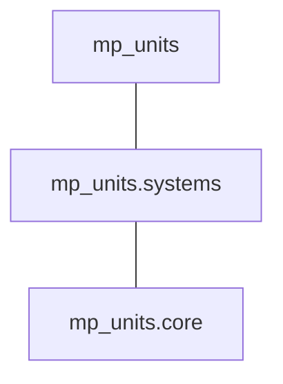

# Installation And Usage

This chapter provides all the necessary information to obtain and build the code using **mp-units**.
It also describes how to build or distribute the library and generate its documentation.


## Project structure

### Repository directory tree and dependencies

The [GitHub repository](https://github.com/mpusz/mp-units) contains three independent CMake-based
projects:

- **_./src_**

    - header-only project containing whole **mp-units** library
    - _./src/CMakeList.txt_ file is intended as an **entry point for library users**
    - in case this library becomes part of the C++ standard, it will have no external dependencies
      but until then, it depends on the following:

        - [gsl-lite](https://github.com/gsl-lite/gsl-lite) or [ms-gsl](https://github.com/microsoft/GSL)
          to verify runtime contracts (if contract checking is enabled),
        - [{fmt}](https://github.com/fmtlib/fmt) to provide text formatting of quantities
          (if `std::format` is not supported yet on a specific compiler).

- **_._**

    - project used as an **entry point for library development and CI/CD**
    - it wraps _./src_ project together with usage examples and tests
    - additionally to the dependencies of _./src_ project, it uses:

        - [Catch2](https://github.com/catchorg/Catch2) library as a unit tests framework,
        - [linear algebra](https://github.com/BobSteagall/wg21/tree/master/include)
          library based on proposal [P1385](https://wg21.link/P1385) used in some examples
          and tests.

- **_./test_package_**

    - CMake library installation and Conan package verification.


!!! important "Important: Library users should not use the top-level CMake file"

    Top level _CMakeLists.txt_ file should only be used by **mp-units** developers and contributors
    as an entry point for the project's development. We want to ensure that everyone will build **ALL**
    the code correctly before pushing a commit. Having such options would allow unintended issues to
    leak to PRs and CI.

    This is why our projects have two entry points:

    - _./CMakeLists.txt_ is **to be used by projects developers** to build **ALL** the project code
      with really restrictive compilation flags,
    - _./src/CMakeLists.txt_ contains only a pure library definition and **should be used by the
      customers** that prefer to use CMake's
      [`add_subdirectory()`](https://cmake.org/cmake/help/latest/command/add_subdirectory.html) to
      handle the dependencies.

    To learn more about the rationale, please check our
    [FAQ](faq.md#why-dont-we-have-cmake-options-to-disable-the-building-of-tests-and-examples).

### Modules

The **mp-units** library provides the following C++ modules:



| C++ Module         | CMake Target         | Contents                                                 |
|--------------------|----------------------|----------------------------------------------------------|
| `mp_units.core`    | `mp-units::core`     | Core library framework and systems-independent utilities |
| `mp_units.systems` | `mp-units::systems`  | All the systems of quantities and units                  |
| `mp_units`         | `mp-units::mp-units` | Core + Systems                                           |

!!! note

    C++ modules are provided within the package only when:

    - [`cxx_modules`](#cxx_modules) Conan option is set to `True`,
    - [`MP_UNITS_BUILD_CXX_MODULES`](#MP_UNITS_BUILD_CXX_MODULES) CMake option is set to `ON`.

### Header files

All of the project's header files can be found in the `mp-units/...` subdirectory.

#### Core library

- `mp-units/framework.h` contains the entire library's framework definitions,
- `mp-units/concepts.h` exposes only the library's concepts for generic code needs,
- `mp-units/format.h` provides text formatting support,
- `mp-units/ostream.h` enables streaming of the library's objects to the text output,
- `mp-units/math.h` provides overloads of common math functions for quantities,
- `mp-units/random.h` provides C++ pseudo-random number generators for quantities,
- `mp-units/compat_macros.h` provides macros for [wide compatibility](../users_guide/use_cases/wide_compatibility.md).

??? info "More details"

    More detailed header files can be found in subfolders which typically should not be
    included by the end users:

    - `mp-units/framework/...` provides all the public interfaces of the framework,
    - `mp-units/bits/...` provides private implementation details only (no public definitions),
    - `mp-units/ext/...` contains external dependencies that at some point in the future should
      be replaced with C++ standard library facilities.

#### Systems and associated utilities

The systems definitions can be found in the `mp-units/systems/...` subdirectory:

##### Systems of quantities

- `mp-units/systems/isq.h` provides
  [International System of Quantities (ISQ)](https://en.wikipedia.org/wiki/International_System_of_Quantities)
  definitions,

??? tip "Tip: Improving compile times"

    `mp-units/systems/isq.h` might be expensive to compile in every translation unit. There are
    some smaller, domain targeted files available for explicit inclusion in the
    `mp-units/systems/isq/...` subdirectory.

##### Systems of units

- `mp-units/systems/si.h` provides
  [International System of Units (SI)](https://en.wikipedia.org/wiki/International_System_of_Units)
  definitions and associated math functions,
- `mp-units/systems/angular.h` provides strong angular units and associated math functions,
- `mp-units/systems/international.h` provides
  [international yard and pound](https://en.wikipedia.org/wiki/International_yard_and_pound) units,
- `mp-units/systems/imperial.h` includes `international.h` and extends it with
  [imperial units](https://en.wikipedia.org/wiki/Imperial_units),
- `mp-units/systems/usc.h` includes `international.h` and extends it with
  [United States customary system of units](https://en.wikipedia.org/wiki/United_States_customary_units),
- `mp-units/systems/cgs.h` provides
  [centimetre-gram-second system of units](https://en.wikipedia.org/wiki/Centimetre%E2%80%93gram%E2%80%93second_system_of_units),
- `mp-units/systems/iau.h` provides
  [astronomical system of units](https://en.wikipedia.org/wiki/Astronomical_system_of_units),
- `mp-units/systems/hep.h` provides units used in
  [high-energy physics](https://en.wikipedia.org/wiki/Particle_physics),
- `mp-units/systems/typographic.h` provides units used in
  [typography or typesetting](https://en.wikipedia.org/wiki/Typographic_unit),
- `mp-units/systems/natural.h` provides an example implementation of
  [natural units](https://en.wikipedia.org/wiki/Natural_units).

??? tip "Tip: Improving compile times"

    `mp-units/systems/si.h` might be expensive to compile in every translation unit.
    There are some smaller files available for explicit inclusion in the
    `mp-units/systems/si/...` subdirectory.

    `mp-units/systems/si/unit_symbols.h` is the most expensive to include.


## Obtaining dependencies

This library assumes that most of the dependencies will be provided by the
[Conan Package Manager](https://conan.io/). If you want to obtain required
dependencies by other means, some modifications to the library's CMake files might be needed.
The rest of the dependencies responsible for documentation generation are provided by
`python3-pip`.


### Conan quick intro

In case you are not familiar with Conan, to install it (or upgrade) just do:

```shell
pip install -U conan
```

After that, you might need to add a custom profile file for your development environment
in _~/.conan2/profiles_ directory. An example profile can look as follows:

```ini hl_lines="5" title="~/.conan2/profiles/gcc12"
[settings]
arch=x86_64
build_type=Release
compiler=gcc
compiler.cppstd=20
compiler.libcxx=libstdc++11
compiler.version=12
os=Linux

[conf]
tools.build:compiler_executables={"c": "gcc-12", "cpp": "g++-12"}
```

!!! tip "Setting the language version"

    Please note that the **mp-units** library requires at least C++20 to be set in a Conan profile
    or forced via the Conan command line. If we do the former, we will not need to provide
    `-s compiler.cppstd=20` every time we run a Conan command line (as provided in the command
    line instructions below).

!!! tip "Using Ninja as a CMake generator for Conan"

    It is highly recommended to set Ninja as a CMake generator for Conan. To do so, we should
    create a _~/.conan2/global.conf_ file that will set `tools.cmake.cmaketoolchain:generator`
    to one of the Ninja generators. For example:

    ```text title="~/.conan2/global.conf"
    tools.cmake.cmaketoolchain:generator="Ninja Multi-Config"
    ```

!!! tip "Separate build folders for different configurations"

    _~/.conan2/global.conf_ file may also set `tools.cmake.cmake_layout:build_folder_vars` which
    [makes working with several compilers or build configurations easier](https://docs.conan.io/2/reference/tools/cmake/cmake_layout.html#multi-setting-option-cmake-layout).
    For example, the below line will force Conan to generate separate CMake presets and folders for
    each compiler and C++ standard version:

    ```text title="~/.conan2/global.conf"
    tools.cmake.cmake_layout:build_folder_vars=["settings.compiler", "settings.compiler.version", "settings.compiler.cppstd"]
    ```

    In such a case, we will need to use a configuration-specific preset name in the Conan instructions
    provided below rather than just `conan-default` and `conan-release`
    (e.g. `conan-gcc-13-23` and `conan-gcc-13-23-release`)


## Build options

!!! note

    Most of the below options are related to the C++ language features available in the compilers.
    Please refer to the [C++ compiler support](cpp_compiler_support.md) chapter to learn more
    about which C++ features are required and which compiler support them.

### Conan options

[`cxx_modules`](#cxx_modules){ #cxx_modules }

:   [:octicons-tag-24: 2.2.0][conan C++ modules support] · :octicons-milestone-24: `auto`/`True`/`False` (Default: `auto`)

    Configures CMake to add C++ modules to the list of default targets.

    [conan C++ modules support]: https://github.com/mpusz/mp-units/releases/tag/v2.2.0

[`std_format`](#std_format){ #std_format }

:   [:octicons-tag-24: 2.2.0][conan std::format support] · :octicons-milestone-24: `auto`/`True`/`False` (Default: `auto`)

    Enables the usage of [`std::format`](https://en.cppreference.com/w/cpp/utility/format/format)
    and associated facilities for text formatting. If it is not supported, then
    the [{fmt}](https://github.com/fmtlib/fmt) library is used instead.

    [conan std::format support]: https://github.com/mpusz/mp-units/releases/tag/v2.2.0

[`string_view_ret`](#string_view_ret){ #string_view_ret }

:   [:octicons-tag-24: 2.2.0][conan returning string_view] · :octicons-milestone-24: `auto`/`True`/`False` (Default: `auto`)

    Enables returning `std::string_view` from the
    [`unit_symbol()`](../users_guide/framework_basics/text_output.md#unit_symbol)
    and [`dimension_symbol()`](../users_guide/framework_basics/text_output.md#dimension_symbol)
    functions.  If this feature is not available, those functions will return
    `mp_units::basic_fixed_string<CharT, N>` instead.

    [conan returning string_view]: https://github.com/mpusz/mp-units/releases/tag/v2.2.0

[`no_crtp`](#no_crtp){ #no_crtp }

:   [:octicons-tag-24: 2.2.0][conan no crtp support] · :octicons-milestone-24: `auto`/`True`/`False` (Default: `auto`)

    Removes the need for the usage of the CRTP idiom in the
    [`quantity_spec` definitions](../users_guide/framework_basics/systems_of_quantities.md#defining-quantities).

    [conan no crtp support]: https://github.com/mpusz/mp-units/releases/tag/v2.2.0

[`contracts`](#contracts){ #contracts }

:   [:octicons-tag-24: 2.2.0][conan contracts] · :octicons-milestone-24: `none`/`gsl-lite`/`ms-gsl` (Default: `gsl-lite`)

    Enables checking of preconditions and additional asserts in the code.

    [conan contracts]: https://github.com/mpusz/mp-units/releases/tag/v2.2.0

[`freestanding`](#freestanding){ #freestanding }

:   [:octicons-tag-24: 2.2.0][conan freestanding] · :octicons-milestone-24: `True`/`False` (Default: `False`)

    Configures the library in the [freestanding](https://en.cppreference.com/w/cpp/freestanding)
    mode. When enabled, the library's source code should build with the compiler's
    [`-ffreestanding`](https://gcc.gnu.org/onlinedocs/gcc/C-Dialect-Options.html) compilation option
    without any issues.

    [conan freestanding]: https://github.com/mpusz/mp-units/releases/tag/v2.2.0

### Conan configuration properties

[`user.mp-units.build:all`](#user.mp-units.build-all){ #user.mp-units.build-all }

:   [:octicons-tag-24: 2.2.0][conan build all support] · :octicons-milestone-24: `True`/`False` (Default: `False`)

    Enables compilation of all the source code, including tests and examples. To support this, it requires some additional Conan build dependencies described in
    [Repository directory tree and dependencies](#repository-directory-tree-and-dependencies).
    It also runs unit tests during Conan build (unless
    [`tools.build:skip_test`](https://docs.conan.io/2/reference/commands/config.html?highlight=tools.build:skip_test#conan-config-list)
    configuration property is set to `True`).

    [conan build all support]: https://github.com/mpusz/mp-units/releases/tag/v2.2.0


[`user.mp-units.build:skip_la`](#user-skip-la){ #user-skip-la }

:   [:octicons-tag-24: 2.2.0][conan skip la support] · :octicons-milestone-24: `True`/`False` (Default: `False`)

    If `user.mp-units.build:all` is enabled, among others, Conan installs the external
    [wg21-linear_algebra](https://conan.io/center/recipes/wg21-linear_algebra)
    dependency and enables the compilation of linear algebra-based tests and usage examples.
    Such behavior can be disabled with this option.

    [conan skip la support]: https://github.com/mpusz/mp-units/releases/tag/v2.2.0


[`user.mp-units.analyze:clang-tidy`](#user.mp-units.analyze-clang-tidy){ #user.mp-units.analyze-clang-tidy }

:   [:octicons-tag-24: 2.2.0][conan clang-tidy support] · :octicons-milestone-24: `True`/`False` (Default: `False`)

    Enables clang-tidy analysis.

    [conan clang-tidy support]: https://github.com/mpusz/mp-units/releases/tag/v2.2.0

### CMake options

[`MP_UNITS_BUILD_AS_SYSTEM_HEADERS`](#MP_UNITS_BUILD_AS_SYSTEM_HEADERS){ #MP_UNITS_BUILD_AS_SYSTEM_HEADERS }

:   [:octicons-tag-24: 2.2.0][as system headers support] · :octicons-milestone-24: `ON`/`OFF` (Default: `OFF`)

    Exports library as system headers.

    [as system headers support]: https://github.com/mpusz/mp-units/releases/tag/v2.2.0

[`MP_UNITS_BUILD_CXX_MODULES`](#MP_UNITS_BUILD_CXX_MODULES){ #MP_UNITS_BUILD_CXX_MODULES }

:   [:octicons-tag-24: 2.2.0][build_cxx_modules support] · :octicons-milestone-24: `ON`/`OFF` (Default: `OFF`)

    Adds C++ modules to the list of default targets.

    [build_cxx_modules support]: https://github.com/mpusz/mp-units/releases/tag/v2.2.0

[`MP_UNITS_API_STD_FORMAT`](#MP_UNITS_API_STD_FORMAT){ #MP_UNITS_API_STD_FORMAT }

:   [:octicons-tag-24: 2.2.0][use fmtlib support] · :octicons-milestone-24: `AUTO`/`ON`/`OFF` (Default: `AUTO`)

    Enables the usage of [`std::format`](https://en.cppreference.com/w/cpp/utility/format/format)
    and associated facilities for text formatting. If it is not supported, then
    the [{fmt}](https://github.com/fmtlib/fmt) library is used instead.

    [use fmtlib support]: https://github.com/mpusz/mp-units/releases/tag/v2.2.0

[`MP_UNITS_API_STRING_VIEW_RET`](#MP_UNITS_API_STRING_VIEW_RET){ #MP_UNITS_API_STRING_VIEW_RET }

:   [:octicons-tag-24: 2.2.0][cmake returning string_view] · :octicons-milestone-24: `AUTO`/`ON`/`OFF` (Default: `AUTO`)

    Enables returning `std::string_view` from the
    [`unit_symbol()`](../users_guide/framework_basics/text_output.md#unit_symbol)
    and [`dimension_symbol()`](../users_guide/framework_basics/text_output.md#dimension_symbol)
    functions.  If this feature is not available, those functions will return
    `mp_units::basic_fixed_string<CharT, N>` instead.

    [cmake returning string_view]: https://github.com/mpusz/mp-units/releases/tag/v2.2.0

[`MP_UNITS_API_NO_CRTP`](#MP_UNITS_API_NO_CRTP){ #MP_UNITS_API_NO_CRTP }

:   [:octicons-tag-24: 2.2.0][cmake no crtp support] · :octicons-milestone-24: `AUTO`/`ON`/`OFF` (Default: `AUTO`)

    Removes the need for the usage of the CRTP idiom in the
    [`quantity_spec` definitions](../users_guide/framework_basics/systems_of_quantities.md#defining-quantities).

    [cmake no crtp support]: https://github.com/mpusz/mp-units/releases/tag/v2.2.0

[`MP_UNITS_API_CONTRACTS`](#MP_UNITS_API_CONTRACTS){ #MP_UNITS_API_CONTRACTS }

:   [:octicons-tag-24: 2.2.0][cmake contracts] · :octicons-milestone-24: `NONE`/`GSL-LITE`/`MS-GSL` (Default: `GSL-LITE`)

    Enables checking of preconditions and additional asserts in the code.

    [cmake contracts]: https://github.com/mpusz/mp-units/releases/tag/v2.2.0

[`MP_UNITS_API_FREESTANDING`](#MP_UNITS_API_FREESTANDING){ #MP_UNITS_API_FREESTANDING }

:   [:octicons-tag-24: 2.2.0][cmake freestanding] · :octicons-milestone-24: `ON`/`OFF` (Default: `OFF`)

    Configures the library in the [freestanding](https://en.cppreference.com/w/cpp/freestanding)
    mode. When enabled, the library's source code should build with the compiler's
    [`-ffreestanding`](https://gcc.gnu.org/onlinedocs/gcc/C-Dialect-Options.html) compilation option
    without any issues.

    [cmake freestanding]: https://github.com/mpusz/mp-units/releases/tag/v2.2.0

#### Options for mp-units project developers

[`MP_UNITS_DEV_BUILD_LA`](#MP_UNITS_DEV_BUILD_LA){ #MP_UNITS_DEV_BUILD_LA }

:   [:octicons-tag-24: 2.2.0][cmake build la support] · :octicons-milestone-24: `ON`/`OFF` (Default: `ON`)

    Enables building code depending on the linear algebra library.

    [cmake build la support]: https://github.com/mpusz/mp-units/releases/tag/v2.2.0

[`MP_UNITS_DEV_IWYU`](#MP_UNITS_DEV_IWYU){ #MP_UNITS_DEV_IWYU }

:   [:octicons-tag-24: 2.2.0][cmake iwyu support] · :octicons-milestone-24: `ON`/`OFF` (Default: `OFF`)

    Enables include-what-you-use analysis.

    [cmake iwyu support]: https://github.com/mpusz/mp-units/releases/tag/v2.2.0

[`MP_UNITS_DEV_CLANG_TIDY`](#MP_UNITS_DEV_CLANG_TIDY){ #MP_UNITS_DEV_CLANG_TIDY }

:   [:octicons-tag-24: 2.2.0][cmake clang-tidy support] · :octicons-milestone-24: `ON`/`OFF` (Default: `OFF`)

    Enables clang-tidy analysis.

    [cmake clang-tidy support]: https://github.com/mpusz/mp-units/releases/tag/v2.2.0


## CMake with presets support

It is recommended to use at least CMake 3.23 to build this project as this version introduced support
for CMake Presets schema version 4, used now by Conan to generate presets files. All build instructions
below assume that you have such support. If not, your CMake invocations have to be replaced with something
like:

```shell
mkdir build && cd build
cmake .. -G "Ninja Multi-Config" -DCMAKE_TOOLCHAIN_FILE=<path_to_generators_dir>/conan_toolchain.cmake
cmake --build . --config Release
```

!!! tip

    In case you can't use CMake 3.23 but you have access to CMake 3.20 or later, you can append
    `-c tools.cmake.cmaketoolchain.presets:max_schema_version=2` to the `conan install` command
    which will force Conan to use an older version of the CMake Presets schema.


## Installation and reuse

There are many different ways of installing/reusing **mp-units** in your project. Below we mention
only a few of many options possible.

!!! important "Important: Prefer using Conan if possible"

    The easiest and most recommended way to obtain **mp-units** is with the Conan package manager.
    See [Conan + CMake (release)](#conan-cmake-release) for a detailed instruction.


### Copy

As **mp-units** is a C++ header-only library you can simply copy all needed _src/*/include_ subdirectories
to your source tree.

!!! note

    In such a case, you are on your own to ensure all the dependencies are installed and their header
    files can be located during the build. Please also note that some compiler-specific flags are needed
    to make the code compile without issues.


### Copy + CMake

If you copy the whole **mp-units** repository to your project's file tree, you can reuse CMake targets
defined by the library. To do so, **you should use _CMakeLists.txt_ file from the _./src_ directory**:

```cmake
add_subdirectory(<path_to_units_folder>/src)
# ...
target_link_libraries(<your_target> <PUBLIC|PRIVATE|INTERFACE> mp-units::mp-units)
```

!!! note

    You are still on your own to make sure all the dependencies are installed and their header and CMake
    configuration files can be located during the build.


### Conan + CMake (release)

!!! tip

    If you are new to the Conan package manager, it is highly recommended to read
    [Obtaining Dependencies](#obtaining-dependencies) and refer to
    [Consuming packages](https://docs.conan.io/2/tutorial/consuming_packages.html)
    chapter of the official Conan documentation for more information.

**mp-units** releases are hosted on [Conan-Center](https://conan.io/center/recipes/mp-units).
The following steps may be performed to obtain an official library release:

1. Create Conan configuration file (either _conanfile.txt_ or _conanfile.py_) in your
   project's top-level directory and add **mp-units** as a dependency of your project.
   For example, the simplest file may look as follows:

    ```ini title="conanfile.txt"
    [requires]
    mp-units/2.1.0

    [options]
    mp-units:cxx_modules=True

    [layout]
    cmake_layout

    [generators]
    CMakeToolchain
    CMakeDeps
    ```

2. Import **mp-units** and its dependencies definitions to your project's build procedure
   with `find_package`:

    ```cmake
    find_package(mp-units REQUIRED)
    ```

3. Link your CMake targets with **mp-units**:

    ```cmake
    target_link_libraries(<your_target> <PUBLIC|PRIVATE|INTERFACE> mp-units::mp-units)
    ```

4. Download, build, and install Conan dependencies before running the CMake configuration step:

    ```shell
    conan install . -pr <your_conan_profile> -s compiler.cppstd=20 -b=missing
    cmake --preset conan-default
    cmake --build --preset conan-release
    ```

### Conan + CMake (Live At Head)

This chapter describes the procedure to Live At Head, which means using the latest stable version
of **mp-units** all the time.

!!! note

    Please note that even though the Conan packages that you will be using are generated **ONLY**
    for builds that are considered stable (passed our CI tests), some minor regressions may happen
    (our CI and C++20 build environment is not perfect yet). Also, please expect that the library
    interface might, and probably will, change occasionally. Even though we do our best, such
    changes might not be reflected in the project's documentation right away.

The procedure is similar to the one described in [Conan + CMake (release)](#conan-cmake-release)
with the following differences:

1. Before starting the previous procedure, add **mp-units** remote to your Conan configuration:

    ```shell
    conan remote add conan-mpusz https://mpusz.jfrog.io/artifactory/api/conan/conan-oss
    ```

2. In your Conan configuration file, provide the package identifier of the `mpusz/testing` stream:

    ```ini title="conanfile.txt" hl_lines="2"
    [requires]
    mp-units/2.2.0@mpusz/testing

    [options]
    mp-units:cxx_modules=True

    [layout]
    cmake_layout

    [generators]
    CMakeToolchain
    CMakeDeps
    ```

    !!! tip

        The identifiers of the latest packages can always be found in
        [the project's README file](https://github.com/mpusz/mp-units/blob/master/README.md) or on
        [the project's Artifactory](https://mpusz.jfrog.io/ui/packages/conan:%2F%2Fmp-units).

3. Force Conan to check for updated recipes with `-u`:

    ```shell
    conan install . -pr <your_conan_profile> -s compiler.cppstd=20 -b=missing -u
    ```


### Install

In case you don't want to use Conan in your project and just want to install the **mp-units**
library on your file system and use `find_package(mp-units)` from another repository to find it;
it is enough to perform the following steps:

```shell
conan install . -pr <your_conan_profile> -s compiler.cppstd=20 -b=missing
mv CMakeUserPresets.json src
cd src
cmake --preset conan-default -DCMAKE_INSTALL_PREFIX=<your_installation_path>
cmake --build --preset conan-release --target install
```


## Contributing (or just building all the tests and examples)

In case you would like to build all the **mp-units** source code (with unit tests and examples),
you should:

1. Use the _CMakeLists.txt_ from the top-level directory.
2. Run Conan with [`user.mp-units.build:all`](#user.mp-units.build-all) = `True`.

```shell
git clone https://github.com/mpusz/mp-units.git && cd units
conan build . -pr <your_conan_profile> -s compiler.cppstd=23 -o cxx_modules=True -c user.mp-units.build:all=True -b missing
```

The above will download and install all of the dependencies needed for the development of the library,
build all of the source code, and run unit tests.

If you prefer to build the project via CMake rather than Conan, then you should replace
the `conan build` with `conan install` command and then follow with a regular CMake build:

```shell
cmake --preset conan-default
cmake --build --preset conan-release
cmake --build --preset conan-release --target all_verify_interface_header_sets
cmake --build --preset conan-release --target test
```


## Building documentation

Starting from **mp-units 2.0** we are using [Material for MkDocs](https://squidfunk.github.io/mkdocs-material/)
to build our documentation. The easiest way to install all the required dependencies
is with `pip`:

```shell
pip install -U mkdocs-material mkdocs-rss-plugin
```

Additionally, a [Cairo Graphics library](https://www.cairographics.org/) is required by
Material for MkDocs. Please follow the
[official MkDocs documentation to install it](https://squidfunk.github.io/mkdocs-material/plugins/requirements/image-processing/#cairo-graphics).

After that, you can either:

- easily [start a live server to preview the documentation as you write](https://squidfunk.github.io/mkdocs-material/creating-your-site/#previewing-as-you-write)

    ```shell
    mkdocs serve
    ```

- [build the documentation](https://squidfunk.github.io/mkdocs-material/creating-your-site/#building-your-site)

    ```shell
    mkdocs build
    ```


## Packaging

To test CMake installation and Conan packaging or create a Conan package run:

```shell
conan create . --user <username> --channel <channel> -pr <your_conan_profile> -s compiler.cppstd=20 -o cxx_modules=True -c user.mp-units.build:all=True -b missing
```

The above will create a Conan package and run tests provided in _./test_package_ directory.


## Uploading **mp-units** package to the Conan server

```shell
conan upload -r <remote-name> --all mp-units/2.1.0@<user>/<channel>
```
