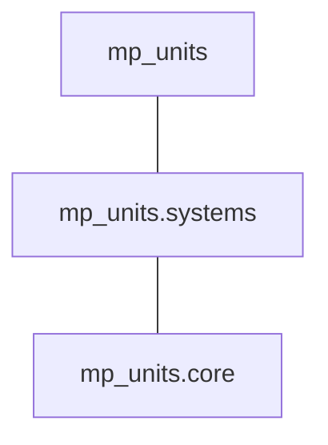

# Project structure

This chapter provides a high level overview of the project to make it easier to navigate,
build, and use.

## CMake projects and dependencies

The [GitHub repository](https://github.com/mpusz/mp-units) contains three independent
CMake-based projects:

- **_./src_**

    - header-only project containing whole **mp-units** library
    - _./src/CMakeLists.txt_ file is intended as an **entry point for library users**
    - in case this library becomes part of the C++ standard, it will have no external
      dependencies but until then, it depends on the following:

        - [gsl-lite](https://github.com/gsl-lite/gsl-lite) or
          [ms-gsl](https://github.com/microsoft/GSL) to verify runtime contracts (if contract
          checking is enabled),
        - [{fmt}](https://github.com/fmtlib/fmt) to provide text formatting of quantities (if
          `std::format` is not supported yet on a specific compiler).

- **_._**

    - project used as an **entry point for library development and CI/CD**
    - it wraps _./src_ project together with usage examples and tests
    - additionally to the dependencies of _./src_ project, it uses:

        - [Catch2](https://github.com/catchorg/Catch2) library as a unit tests framework.

- **_./test_package_**

    - CMake library installation and Conan package verification.

!!! important "Important: Library users should not use the top-level CMake file"

  Top level _CMakeLists.txt_ file should only be used by **mp-units** developers and
  contributors as an entry point for the project's development. We want to ensure that
  everyone will build **ALL** the code correctly before pushing a commit. Having such options
  would allow unintended issues to leak to PRs and CI.

    This is why our projects have two entry points:

    - _./CMakeLists.txt_ is **to be used by projects developers** to build **ALL** the project
      code with really restrictive compilation flags,
    - _./src/CMakeLists.txt_ contains only a pure library definition and **should be used by
      the customers** that prefer to use CMake's
      [`add_subdirectory()`](https://cmake.org/cmake/help/latest/command/add_subdirectory.html)
      to handle the dependencies.

    To learn more about the rationale, please check our
    [FAQ](faq.md#why-dont-we-have-cmake-options-to-disable-the-building-of-tests-and-examples).

## Modules

The **mp-units** library provides the following C++ modules:

| C++ Module         | CMake Target         | Contents                                                 |
|--------------------|----------------------|----------------------------------------------------------|
| `mp_units.core`    | `mp-units::core`     | Core library framework and systems-independent utilities |
| `mp_units.systems` | `mp-units::systems`  | All the systems of quantities and units                  |
| `mp_units`         | `mp-units::mp-units` | Core + Systems                                           |

!!! note

    C++ modules are provided within the package only when:

    - [`cxx_modules`](installation_and_usage.md#cxx_modules) Conan option is set to `True`,
    - [`MP_UNITS_BUILD_CXX_MODULES`](installation_and_usage.md#MP_UNITS_BUILD_CXX_MODULES)
      CMake option is set to `ON`.

## Header files

All of the project's header files can be found in the `mp-units/...` subdirectory.

### Core library

- `mp-units/framework.h` contains the entire library's framework definitions,
- `mp-units/concepts.h` exposes only the library's concepts for generic code needs,
- `mp-units/format.h` provides text formatting support,
- `mp-units/ostream.h` enables streaming of the library's objects to the text output,
- `mp-units/math.h` provides overloads of common math functions for quantities,
- `mp-units/random.h` provides C++ pseudo-random number generators for quantities,
- `mp-units/compat_macros.h` provides macros for
  [wide compatibility](../users_guide/use_cases/wide_compatibility.md).

??? info "More details"

  More detailed header files can be found in subfolders which typically should not be
  included by the end users:

    - `mp-units/framework/...` provides all the public interfaces of the framework,
    - `mp-units/bits/...` provides private implementation details only (no public definitions),
    - `mp-units/ext/...` contains external dependencies that at some point in the future
      should be replaced with C++ standard library facilities.

### Systems and associated utilities

The systems definitions can be found in the `mp-units/systems/...` subdirectory:

#### Systems of quantities

- `mp-units/systems/isq.h` provides
  [International System of Quantities (ISQ)](https://en.wikipedia.org/wiki/International_System_of_Quantities)
  definitions,
- `mp-units/systems/isq_angle.h` provides a modification of the ISQ based on
  [the proposals to make an angle a base quantity in the ISQ](../users_guide/systems/strong_angular_system.md),

??? tip "Tip: Improving compile times"

  `mp-units/systems/isq.h` might be expensive to compile in every translation unit. There
  are some smaller, domain targeted files available for explicit inclusion in the
  `mp-units/systems/isq/...` subdirectory.

#### Systems of units

- `mp-units/systems/si.h` provides
  [International System of Units (SI)](https://en.wikipedia.org/wiki/International_System_of_Units)
  definitions and associated math functions,
- `mp-units/systems/iec.h` provides units and prefixes defined by IEC (e.g., in the series
  of IEC 80000 standards),
- `mp-units/systems/angular.h` provides
  [strong angular units](../users_guide/systems/strong_angular_system.md) and associated
  math functions,
- `mp-units/systems/international.h` provides
  [international yard and pound](https://en.wikipedia.org/wiki/International_yard_and_pound)
  units,
- `mp-units/systems/imperial.h` includes `international.h` and extends it with
  [imperial units](https://en.wikipedia.org/wiki/Imperial_units),
- `mp-units/systems/usc.h` includes `international.h` and extends it with
  [United States customary system of units](https://en.wikipedia.org/wiki/United_States_customary_units),
- `mp-units/systems/cgs.h` provides
  [centimetre-gram-second system of units](https://en.wikipedia.org/wiki/Centimetre%E2%80%93gram%E2%80%93second_system_of_units),
- `mp-units/systems/iau.h` provides
  [astronomical system of units](https://en.wikipedia.org/wiki/Astronomical_system_of_units),
- `mp-units/systems/hep.h` provides units used in
  [high-energy physics](https://en.wikipedia.org/wiki/Particle_physics),
- `mp-units/systems/typographic.h` provides units used in
  [typography or typesetting](https://en.wikipedia.org/wiki/Typographic_unit),
- `mp-units/systems/natural.h` provides an example implementation of
  [natural units](https://en.wikipedia.org/wiki/Natural_units).

??? tip "Tip: Improving compile times"

  `mp-units/systems/si.h` might be expensive to compile in every translation unit. There
  are some smaller files available for explicit inclusion in the
  `mp-units/systems/si/...` subdirectory.

    `mp-units/systems/si/unit_symbols.h` is the most expensive to include.
