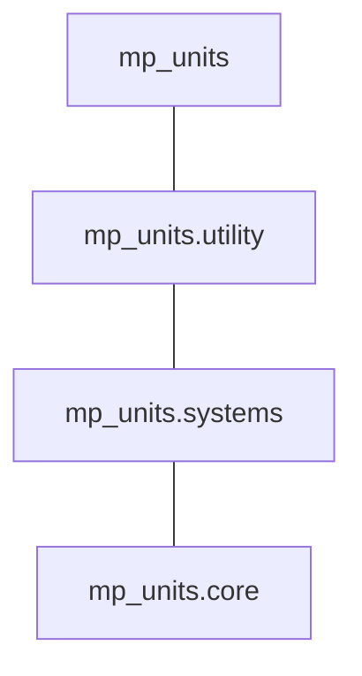

# Project structure

This chapter provides a high level overview of the project to make it easier to navigate,
build, and use.

## CMake projects and dependencies

The [GitHub repository](https://github.com/mpusz/mp-units) contains three independent
CMake-based projects:

- **_./src_**

    - header-only project containing whole **mp-units** library
    - _./src/CMakeLists.txt_ file is intended as an **entry point for library users**
    - in case this library becomes part of the C++ standard, it will have no external
      dependencies but until then, it depends on the following:

        <!-- markdownlint-disable MD013 -->
        - [gsl-lite](https://github.com/gsl-lite/gsl-lite) or
          [ms-gsl](https://github.com/microsoft/GSL) to verify runtime contracts (if contract
          checking is enabled),
        - [{fmt}](https://github.com/fmtlib/fmt) to provide text formatting of quantities (if
          `std::format` is not supported yet on a specific compiler).
        <!-- markdownlint-enable MD013 -->

- **_._**

    - project used as an **entry point for library development and CI/CD**
    - it wraps _./src_ project together with usage examples and tests
    - additionally to the dependencies of _./src_ project, it uses:

        - [Catch2](https://github.com/catchorg/Catch2) library as a unit tests framework.

- **_./test_package_**

    - CMake library installation and Conan package verification.

!!! important "Important: Library users should not use the top-level CMake file"

    Top level _CMakeLists.txt_ file should only be used by **mp-units** developers and
    contributors as an entry point for the project's development. We want to ensure that
    everyone will build **ALL** the code correctly before pushing a commit. Having such options
    would allow unintended issues to leak to PRs and CI.

    This is why our projects have two entry points:

    - _./CMakeLists.txt_ is **to be used by projects developers** to build **ALL** the project
      code with really restrictive compilation flags,
    - _./src/CMakeLists.txt_ contains only a pure library definition and **should be used by
      the customers** that prefer to use CMake's
      [`add_subdirectory()`](https://cmake.org/cmake/help/latest/command/add_subdirectory.html)
      to handle the dependencies.

    To learn more about the rationale, please check our
    [FAQ](faq.md#why-dont-we-have-cmake-options-to-disable-the-building-of-tests-and-examples).

## Modules

The **mp-units** library provides the following C++ modules:

```mermaid
flowchart TD
    mp_units --- mp_units.utility --- mp_units.systems --- mp_units.core
```

| C++ Module         | CMake Target         | Contents                                                        |
|--------------------|----------------------|-----------------------------------------------------------------|
| `mp_units.core`    | `mp-units::core`     | Core library framework, math, and systems-independent utilities |
| `mp_units.systems` | `mp-units::systems`  | All the systems of quantities and units                         |
| `mp_units.utility` | `mp-units::utility`  | Built-in representation types and other non-framework add-ons   |
| `mp_units`         | `mp-units::mp-units` | Core + Systems + Utility                                        |

The `mp_units.utility` module is layered on top of both `mp_units.core` and `mp_units.systems`.
It collects useful add-ons that are deliberately **not** part of the framework: the built-in
[`cartesian_vector`/`cartesian_tensor`](../users_guide/framework_basics/representation_types.md)
representation types and the random number generators.
The framework (`mp_units.core`) is the slice intended for C++ standardization, so anything
that will not be standardized lives in `mp_units.utility` instead. The umbrella `mp_units`
module keeps re-exporting all of it, so `import mp_units;` continues to expose everything.

!!! note

    C++ modules are provided within the package only when:

    - [`cxx_modules`](installation_and_usage.md#cxx_modules) Conan option is set to `True`,
    - [`MP_UNITS_BUILD_CXX_MODULES`](installation_and_usage.md#MP_UNITS_BUILD_CXX_MODULES)
      CMake option is set to `ON`.

In addition, `./src/integrations` hosts optional, self-contained **integrations with third-party
libraries**. Each component owns its `mp-units/integrations/<lib>.h` header and, in a C++
modules build, the matching `mp_units.integrations.<lib>` module:

| C++ Module                    | CMake Target                   | Third-party library                            |
|-------------------------------|--------------------------------|------------------------------------------------|
| `mp_units.integrations.eigen` | `mp-units::integrations-eigen` | [Eigen](https://eigen.tuxfamily.org)           |
| `mp_units.integrations.glm`   | `mp-units::integrations-glm`   | [GLM](https://github.com/g-truc/glm)           |
| `mp_units.integrations.blaze` | `mp-units::integrations-blaze` | [Blaze](https://bitbucket.org/blaze-lib/blaze) |

Each depends only on `mp_units.core` and is built solely when the matching third-party library
is found (the module is added on top in a C++ modules build). A component is **exported separately**
(`find_package(mp-units-integrations-<lib>)`), never through `mp-unitsTargets`, so that
`find_package(mp-units)` never gains a dependency on a third-party library. Because the
integration target pulls in only `mp_units.core` and the third-party library, link it
**alongside** your usual `mp-units::mp-units` (or `mp-units::systems`) target, not instead
of it. See
[Using a Linear Algebra Library](../how_to_guides/integration/using_linear_algebra_libraries.md)
for the CMake recipe.

## Namespaces

The library exposes three namespaces with distinct stability guarantees. The distinction is
by **purpose**, not by which component or module a name ships from:

- `mp_units` — the main public interface: the framework and math. This is the minimal, stable
  surface intended for C++ standardization, so it is kept deliberately small.
- `mp_units::utility` — a public extension and authoring tier for everything that is useful
  but not part of the standardization target: the `Real`, `Complex`, `RealScalar`,
  `ComplexScalar`, `Scalar`, `Vector`, `Tensor` representation concepts, the built-in
  `cartesian_vector` / `cartesian_tensor` types, the random number generators, and the
  `constrained` / `safe_int` wrappers. Keeping these in a separate namespace prevents the
  standard surface from accidentally depending on them. Some of these names ship from the
  `mp_units.utility` module and some (such as `constrained` / `safe_int`) ship from the core
  component, but they share this one namespace.
- `mp_units::detail` — private implementation details. Nothing here is part of the public
  API and it is never exported from the modules. Do not rely on it.

## Header files

All of the project's header files can be found in the `mp-units/...` subdirectory.

### Core library

- `mp-units/framework.h` contains the entire library's framework definitions,
- `mp-units/concepts.h` exposes only the library's concepts for generic code needs,
- `mp-units/format.h` provides text formatting support,
- `mp-units/ostream.h` enables streaming of the library's objects to the text output,
- `mp-units/math.h` provides overloads of common math functions for quantities,
- `mp-units/overflow_policies.h` provides the range and overflow policies (`check_in_range`,
  `clamp_to_range`, `wrap_to_range`, `reflect_in_range`, `check_non_negative`,
  `clamp_non_negative`),
- `mp-units/utility/constrained.h` provides the `constrained` range-validated value wrapper,
- `mp-units/utility/safe_int.h` provides the `safe_int` overflow-checked integer wrapper,
- `mp-units/compat_macros.h` provides macros for
  [wide compatibility](../how_to_guides/integration/wide_compatibility.md).

!!! note

    `constrained` and `safe_int` (and their error policies) are shipped from the core component
    because they reuse core internals, but they are add-ons rather than framework, so their public
    names live in the `mp_units::utility` namespace (see [Namespaces](#namespaces) below), not in
    `mp_units` directly. `overflow_policies.h` is genuine framework (it backs bounded quantity point
    origins) and stays in `mp_units`.

??? info "More details"

    More detailed header files can be found in subfolders which typically should not be
    included by the end users:

    - `mp-units/framework/...` provides all the public interfaces of the framework,
    - `mp-units/bits/...` provides private implementation details only (no public definitions),
    - `mp-units/ext/...` contains external dependencies that at some point in the future
      should be replaced with C++ standard library facilities.

### Utility types

Add-ons that build on the framework but are deliberately **not** part of it, so they ship
in the separate `mp_units.utility` [module](#modules). Their headers live under
`mp-units/utility/...`, so the include path mirrors the `mp_units::utility` namespace:

- `mp-units/utility/cartesian_vector.h` provides the built-in `cartesian_vector` type,
- `mp-units/utility/cartesian_tensor.h` provides the built-in `cartesian_tensor` type,
- `mp-units/utility/random.h` provides C++ pseudo-random number generators for quantities.

These live in the `mp_units::utility` namespace.

### Third-party library integrations

Optional, opt-in headers under `mp-units/integrations/` that adapt a third-party library
to **mp-units**. Each is guarded with `__has_include` (a harmless no-op when its library
is unavailable) and has a [module counterpart](#modules) (`mp_units.integrations.<lib>`).
Currently these adapt linear algebra libraries, letting their vector and matrix types be
used directly as quantity representations:

- `mp-units/integrations/eigen.h` integrates [Eigen](https://eigen.tuxfamily.org),
- `mp-units/integrations/glm.h` integrates [GLM](https://github.com/g-truc/glm),
- `mp-units/integrations/blaze.h` integrates [Blaze](https://bitbucket.org/blaze-lib/blaze).

See [Representation Types](../users_guide/framework_basics/representation_types.md#third-party-library-integrations)
for usage.

### Systems and associated utilities

The systems definitions can be found in the `mp-units/systems/...` subdirectory:

#### Systems of quantities

- `mp-units/systems/isq.h` provides
  [International System of Quantities (ISQ)](https://en.wikipedia.org/wiki/International_System_of_Quantities)
  definitions,
- `mp-units/systems/isq_angle.h` provides a modification of the ISQ based on
  [the proposals to make an angle a base quantity in the ISQ](../users_guide/systems/strong_angular_system.md),

??? tip "Tip: Improving compile times"

    `mp-units/systems/isq.h` might be expensive to compile in every translation unit. There
    are some smaller, domain targeted files available for explicit inclusion in the
    `mp-units/systems/isq/...` subdirectory.

#### Systems of units

- `mp-units/systems/si.h` provides
  [International System of Units (SI)](https://en.wikipedia.org/wiki/International_System_of_Units)
  definitions and associated math functions,
- `mp-units/systems/iec.h` provides units and prefixes defined by IEC (e.g., in the series
  of IEC 80000 standards),
- `mp-units/systems/angular.h` provides
  [strong angular units](../users_guide/systems/strong_angular_system.md) and associated
  math functions,
- `mp-units/systems/yard_pound.h` provides base units from the
  [1959 international yard and pound agreement](https://en.wikipedia.org/wiki/International_yard_and_pound),
- `mp-units/systems/imperial.h` includes `yard_pound.h` and extends it with
  [British Imperial units](https://en.wikipedia.org/wiki/Imperial_units),
- `mp-units/systems/usc.h` includes `yard_pound.h` and extends it with
  [United States customary system of units](https://en.wikipedia.org/wiki/United_States_customary_units),
- `mp-units/systems/cgs.h` provides
  [centimetre-gram-second system of units](https://en.wikipedia.org/wiki/Centimetre%E2%80%93gram%E2%80%93second_system_of_units),
- `mp-units/systems/iau.h` provides
  [astronomical system of units](https://en.wikipedia.org/wiki/Astronomical_system_of_units),
- `mp-units/systems/hep.h` provides units used in
  [high-energy physics](https://en.wikipedia.org/wiki/Particle_physics),
- `mp-units/systems/typographic.h` provides units used in
  [typography or typesetting](https://en.wikipedia.org/wiki/Typographic_unit),
- `mp-units/systems/natural.h` provides an example implementation of
  [natural units](https://en.wikipedia.org/wiki/Natural_units).

??? tip "Tip: Improving compile times"

    `mp-units/systems/si.h` might be expensive to compile in every translation unit. There
    are some smaller files available for explicit inclusion in the
    `mp-units/systems/si/...` subdirectory.

    `mp-units/systems/si/unit_symbols.h` is the most expensive to include.
