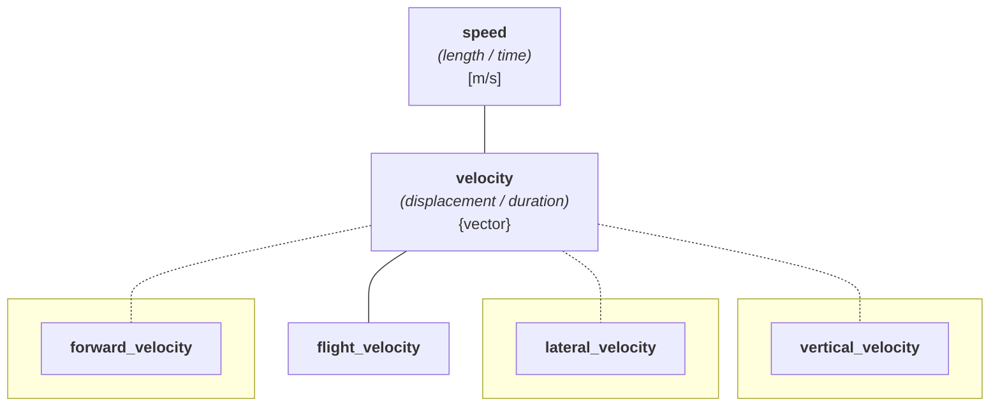

# Decompose a Vector Quantity into Components

This guide shows how to split a
[vector quantity](../../users_guide/framework_basics/character_of_a_quantity.md) into
named, strongly-typed 1D-vector component quantities, reachable by index (`get<Idx>`), by
quantity spec (`get<QS>`), and through structured bindings. It covers how the quantity
hierarchy must be formed, what the representation must provide, and the `tuple_size` /
`tuple_element` protocol for compile-time code.

A vector _quantity_ stores one physical vector, such as a drone's _velocity_, under a
single unit. Sooner or later you need to talk about its individual axes: the _forward
speed_, the _lateral drift_, the _rate of climb_. The unsafe way is to reach into the
representation and pull out `v[2]`, which gives you a bare number with no unit and no idea
which axis it came from. Swap two indices and the compiler says nothing.

For background on the concepts used here, see:

- [Character of a Quantity](../../users_guide/framework_basics/character_of_a_quantity.md) -
  scalar, vector, and tensor characters
- [Systems of Quantities](../../users_guide/framework_basics/systems_of_quantities.md) -
  the quantity hierarchy, `is_kind`, and quantity-kind safety
- [Representation Types](../../users_guide/framework_basics/representation_types.md) -
  what a type must provide to act as a representation


## The Problem: Components Lose Their Types

Consider a drone's body-frame _velocity_, modeled as a named `flight_velocity` quantity
(defined in full below) stored as a vector _quantity_:

```cpp
const quantity v = flight_velocity(cartesian_vector{30.0, 10.0, -2.0} * km / h);
```

The whole is type-safe. Suppose you want its third axis. The representation is indexable,
so you can reach through to it:

```cpp
const auto vertical = v.numerical_value_in(km / h)[2];   // a bare double: no unit, no axis
```

`vertical` is now a plain `double`. The fact that it is the drone's _rate of climb_ in
`km/h` lives only in a comment, and nothing stops you from adding it to the _forward
speed_.

A `quantity::operator[]` would not rescue this. At best `v[2]` could return the value
tagged with the *whole's* reference, never the specific axis kind, because a runtime index
is not known at compile time, so it cannot select between `forward_velocity`,
`lateral_velocity`, and `vertical_velocity`. The one piece of information you actually
want, which axis this is, is exactly what a runtime subscript cannot carry. That is why
the library does not provide `quantity::operator[]`, and why the access shown below selects
the axis at compile time instead.


## The Core Idea: Name the Axes

The fix is to give each axis its own _quantity spec_ and tell the library how the whole
decomposes into them. Access then returns a **1D-vector component quantity** of the right
axis type, in the whole's unit, with no manual indexing:

```cpp
const auto [forward, lateral, vertical] = v;   // three typed component quantities
```

Each binding is a `quantity` carrying its axis spec and unit. Because each axis is a
distinct kind, the type system now rejects the combinations that never made physical sense,
while same-axis arithmetic still works:

```cpp
const quantity total = forward + forward;    // OK: two forward velocities are the same kind
const quantity wrong = forward + vertical;   // error: a forward velocity is not a rate of climb
const bool aligned = forward == vertical;    // error: distinct kinds are not even comparable
```


## Forming the Quantity Hierarchy

Decomposition rests entirely on how you model the quantities. The whole and its axes must
satisfy a small set of rules, all checked at compile time:

1. **The whole is a vector quantity.** Its quantity spec has `vector` character.
2. **Each axis is a vector quantity** as well. A component of a 3D vector is a 1D vector,
   not a scalar, so the axes keep vector character.
3. **Every axis shares the whole's hierarchy root.** All axes, and the whole, descend from
   the same ancestor (here `isq::velocity`). This is what makes them the *same kind* of
   physical _quantity_.
4. **Each axis is a distinct kind.** Declaring an axis with `is_kind` starts a new kind, so
   the _forward_, _lateral_, and _vertical velocities_ cannot be substituted for one
   another.
5. **Each axis differs in kind from the whole.** The whole stays a plain child of the root,
   while the axes branch off as their own kinds.

Applied to the drone:

```cpp
// the whole: a plain child of isq::velocity (vector character, same kind as velocity)
inline constexpr struct flight_velocity : quantity_spec<isq::velocity> {} flight_velocity;

// the axes: each its own kind, all sharing the isq::velocity hierarchy root
inline constexpr struct forward_velocity : quantity_spec<isq::velocity, is_kind> {} forward_velocity;
inline constexpr struct lateral_velocity : quantity_spec<isq::velocity, is_kind> {} lateral_velocity;
inline constexpr struct vertical_velocity : quantity_spec<isq::velocity, is_kind> {} vertical_velocity;
```

These sit in the `isq::speed` kind as follows. The whole `flight_velocity` is a plain child
of `velocity`, so it stays in the `speed` kind. Each axis branches off as a kind of its
own, drawn as a separate box reached by a dashed edge, the same way the User's Guide marks
an `is_kind` boundary:



The three axes are siblings of `flight_velocity` in the type hierarchy, not its children.
The decomposition that pairs them with the whole is the `vector_components` specialization
below, not an inheritance relationship.

!!! info "Why `is_kind` on the axes"

    Without `is_kind`, all three axes would still belong to the `isq::velocity` kind, and
    the library would let you add a _forward velocity_ to a _vertical_ one. `is_kind` makes
    each axis a kind of its own, so cross-axis arithmetic is rejected, while same-axis
    arithmetic (adding two _forward velocities_, for example) still works. See
    [Systems of Quantities](../../users_guide/framework_basics/systems_of_quantities.md)
    for the full semantics.


## Declaring the Decomposition

Opt the whole into decomposition by specializing the `vector_components` customization point
and inheriting from `vector_axes`, listing the axes in **coordinate order** (axis 0 first):

```cpp
template<>
struct mp_units::vector_components<flight_velocity> :
    mp_units::vector_axes<forward_velocity, lateral_velocity, vertical_velocity> {};
```

`vector_axes` enforces the axis-intrinsic rules (2, 3, and 4 above) at the point of
definition: an axis list that mixes characters, spans different hierarchy roots, or repeats
a kind is ill-formed right here. The rules that also need the whole and the representation
(1 and 5, plus the representation requirements below) are checked when you actually
decompose a `quantity`.


## Accessing Components

### By index

`get<Idx>` returns the component at coordinate `Idx` as a 1D-vector _quantity_ of that
axis's spec:

```cpp
const quantity forward = get<0>(v);   // quantity<forward_velocity[km/h], double>
```

The index is bounds-checked against the number of declared axes. `get<3>(v)` does not
compile for a three-axis decomposition.

!!! question "Why `get<Idx>` and not `operator[]`?"

    `get<Idx>` takes the index as a compile-time template argument, so each call has a
    precise, distinct return type (`get<0>` a _forward velocity_, `get<2>` a _vertical
    velocity_). A runtime `operator[]` cannot, for the reason shown in
    [The Problem](#the-problem-components-lose-their-types) above. This mirrors the standard
    library. `std::tuple` is indexed only through `std::get<I>` (its elements have distinct
    types, like the axes here), and even the homogeneous `std::array` adds `std::get<I>` for
    the compile-time bounds checking that its `operator[]` cannot provide. `get<Idx>` here
    delivers both at once.

### By quantity spec

When you know the axis but not its position, index by the spec instead. This is
order-independent and reads better at the call site:

```cpp
const quantity climb = get<vertical_velocity>(v);   // same as get<2>(v) here
```

Passing a spec that is not one of the declared axes (`get<isq::acceleration>(v)`) does not
compile.

### Through structured bindings

Because a decomposable _quantity_ models the tuple protocol, structured bindings work
directly and are usually the most readable option:

```cpp
const auto [forward, lateral, vertical] = v;
```

Each name is bound to a `quantity` of the corresponding axis spec, copied out of the whole.


## A Component Is a 1D Vector

All of the above (`get<Idx>`, `get<QS>`, and structured bindings) yield a 1D-vector
_quantity_, not a scalar: a component keeps the whole's `vector` character, with the
vector's element type (such as `double`) as its representation. It holds a single value, so
read it with `numerical_value_in(unit)`:

```cpp
const double climb_rate = get<vertical_velocity>(v).numerical_value_in(km / h);
```


## What the Representation Must Satisfy

Decomposition reuses the same representation that already backs the vector _quantity_. On
top of the normal
[vector representation requirements](../../users_guide/framework_basics/representation_types.md)
(copyable, `bool`-returning equality, a Euclidean norm, and a `value_type`), the type needs
to be **element-accessible at a compile-time index**. The library accepts either form:

- a tuple-like `get<Idx>(rep)` found by argument-dependent lookup, or
- a subscript `rep[Idx]`.

`cartesian_vector`, `Eigen::Vector3d`, `glm::dvec3`, and `blaze::StaticVector<double, 3>`
all qualify through one or the other, so decomposition works against every backend the
[linear algebra example](../../examples/linear_algebra.md) uses.

The component _quantity's_ representation is the vector's element type, its `value_type`. A
component of a `cartesian_vector<double>` is therefore a `quantity<…, double>`: a 1D-vector
_quantity_ holding a single value.

!!! info "Optional: a compile-time size check"

    If the representation models `std::tuple_size` (as `cartesian_vector` does), the library
    also verifies at compile time that you did not declare more axes than the representation
    holds. Types that do not expose `std::tuple_size` (such as Eigen's vectors) simply skip
    that one check. Every other rule still applies.

    This is a separate bound from the per-access one. `get<Idx>` and `std::tuple_element<Idx>`
    always reject an `Idx` past the last declared axis (see [By index](#by-index) above),
    whether or not the representation exposes `std::tuple_size`. The check here instead guards
    the declaration: the axis count must not exceed what the representation can hold.


## Compile-Time Introspection

The tuple protocol is available for your own compile-time logic, not only for structured
bindings. `std::tuple_size_v` gives the axis count and `std::tuple_element_t` gives a
component's type:

```cpp
static_assert(std::tuple_size_v<decltype(v)> == 3);

using climb_t = std::tuple_element_t<2, decltype(v)>;
static_assert(QuantityOf<climb_t, vertical_velocity>);
```

`std::tuple_element_t` is bounded the same way `get` is: an out-of-range index is not a
valid specialization, so it never silently yields a wrong type.


## What Does Not Compile

Beyond the cross-axis arithmetic shown in [The Core Idea](#the-core-idea-name-the-axes),
access itself is constrained. An out-of-range index and a spec that is not one of the
declared axes are both rejected at compile time:

```cpp
get<3>(v);                  // error: only three axes exist
get<isq::acceleration>(v);  // error: not one of the declared axes
```


## See Also

- [Character of a Quantity](../../users_guide/framework_basics/character_of_a_quantity.md) -
  scalar, vector, and tensor characters and their operations
- [Systems of Quantities](../../users_guide/framework_basics/systems_of_quantities.md) -
  the quantity hierarchy, `is_kind`, and quantity-kind safety
- [Representation Types](../../users_guide/framework_basics/representation_types.md) -
  the requirements a representation must meet
- [Using a Linear Algebra Library as the Representation](../../examples/linear_algebra.md) -
  a runnable example that decomposes a drone velocity against four backends
