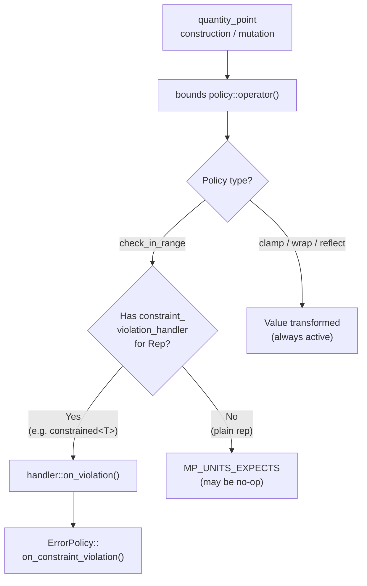

# Ensure Ultimate Safety

This guide shows how to combine **mp-units** safety features to get guaranteed,
always-on constraint enforcement for your quantities — independent of build mode
or compiler optimization level.

!!! tip "Background reading"

    For in-depth background on how bounds policies and overflow handling work, see
    [Range-Validated Quantity Points](../../blog/posts/range-validated-quantity-points.md).

## The Problem

By default, the library's bounds checking for quantity points uses
[`MP_UNITS_EXPECTS`](../integration/wide_compatibility.md#contract-checking-macros),
which may be compiled away in release builds. This is fine for catching logic errors
during development, but some domains need **guaranteed enforcement**:

- Safety-critical systems (aviation, medical, automotive)
- Input validation at system boundaries
- Financial calculations with strict ranges

## The Solution

The library provides building blocks that work together:

1. [**Bounds on point origins**](../../users_guide/framework_basics/the_affine_space.md#range-validated-quantity-points) —
   a bounds policy passed as a template parameter to a point origin, enforcing validation
   on every construction and mutation
2. **`constrained<T, ErrorPolicy>`** — a transparent wrapper that tags a representation
   type with an error policy
3. [**`constraint_violation_handler<Rep>`**](../../users_guide/framework_basics/representation_types.md#constraint-violation-handler) —
   a customization point that library features query to dispatch errors

The library ships [several overflow policies](../../users_guide/framework_basics/the_affine_space.md#available-overflow-policies)
to pass as bounds template parameters: `check_in_range`, `clamp_to_range`, `wrap_to_range`,
and `reflect_in_range`. For guaranteed enforcement, this guide uses `check_in_range`,
which delegates to the `constraint_violation_handler` when one is available for
the representation type.

### Step 1: Choose an Error Policy

The library ships two error policies in `<mp-units/constrained.h>`:

| Policy             | Availability | Behavior                   |
|--------------------|--------------|----------------------------|
| `throw_policy`     | Hosted only  | Throws `std::domain_error` |
| `terminate_policy` | Always       | Calls `std::abort()`       |

You can also write your own:

```cpp
struct log_and_continue_policy {
  static void on_constraint_violation(std::string_view msg) {
    spdlog::error("Constraint violation: {}", msg);
  }
};
```

### Step 2: Use `constrained<T, Policy>` as Your Representation Type

Wrap your numeric type with the desired policy:

```cpp
#include <mp-units/constrained.h>

using safe_double = mp_units::constrained<double, mp_units::throw_policy>;
```

`constrained<T>` is transparent: it implicitly converts to/from `T` and forwards all
arithmetic. But it carries the error policy as a compile-time tag that the library can detect.

The library automatically registers a `constraint_violation_handler` for every
`constrained<T, EP>` instantiation, forwarding violations to `EP::on_constraint_violation()`.

### Step 3: Pass Bounds to Your Origin

Pass a bounds policy as a template parameter to your origin.
For guaranteed enforcement, use `check_in_range`:

```cpp
#include <mp-units/overflow_policies.h>
#include <mp-units/framework.h>
#include <mp-units/systems/si.h>

using namespace mp_units;
using namespace mp_units::si::unit_symbols;

inline constexpr struct geo_latitude : quantity_spec<isq::angular_measure> {} geo_latitude;
inline constexpr struct equator :
    absolute_point_origin<geo_latitude, check_in_range{-90 * deg, 90 * deg}> {} equator;
```

### Step 4: Combine Them

Use `constrained<T>` as the representation type in your quantity point:

```cpp
using latitude = quantity_point<geo_latitude[deg], equator, safe_double>;

void process_coordinates(double raw_lat)
{
  try {
    latitude lat{raw_lat * deg, equator};  // throws if |raw_lat| > 90
    // ... use lat safely ...
  } catch (const std::domain_error& e) {
    // handle invalid input
  }
}
```

When `check_in_range` detects an out-of-bounds value, it finds the
`constraint_violation_handler<constrained<double, throw_policy>>` specialization and
calls `throw_policy::on_constraint_violation("value out of bounds")`, which throws
`std::domain_error`. This happens in **every** build mode — debug, release, or
release-with-debug-info.

!!! tip "Extensible policy interface"

    The origin bounds template parameter accepts any callable policy with the
    signature `V operator()(V)`. The library ships six built-in policies — `check_in_range`,
    `clamp_to_range`, `wrap_to_range`, `reflect_in_range`, `check_non_negative`, and
    `clamp_non_negative` — and the interface is fully extensible. `check_non_negative` and
    `clamp_non_negative` cover the common `[0, +∞)` halfline case; they are also applied
    automatically to natural origins of non-negative ISQ quantity specs. For a fully custom
    one-sided or asymmetric policy, see [Custom Policies](../../users_guide/framework_basics/the_affine_space.md#custom-policies-one-sided-bounds).

## How It Works



## Bringing Your Own Handler

You don't have to use `constrained<T>` — any representation type can opt in by specializing
`constraint_violation_handler`:

```cpp
// Your custom safe-double type
class my_safe_double { /* ... */ };

template<>
struct mp_units::constraint_violation_handler<my_safe_double> {
  static void on_violation(std::string_view msg)
  {
    throw std::domain_error(std::string(msg));
  }
};
```

Now any bounds policy that queries `constraint_violation_handler`
(such as `check_in_range`) will use your handler whenever a `quantity_point`
with `my_safe_double` rep goes out of bounds.

## Combining with `safe_int`

For integer quantities, the library provides `safe_int<T>` in `<mp-units/safe_int.h>`,
which detects arithmetic overflow. You can use both together:

```cpp
#include <mp-units/safe_int.h>

// Overflow-detecting integer for arithmetic operations
quantity distance = safe_int{42} * m;  // arithmetic overflow detected at runtime

// Bounded quantity point with overflow-detecting rep
using altitude = quantity_point<isq::height[m], msl_origin, safe_int<int>>;

// Convenience aliases are available for common integer types
quantity speed = safe_i32{100} * (m / s);
```

`safe_int` also specializes `constraint_violation_handler`, so `check_in_range` will
use its error policy for bounds violations.

## See Also

- [`safe_int<T>`](../../users_guide/framework_basics/safe_int.md) —
  overflow-safe integer arithmetic reference
- [Preventing Integer Overflow in Physical Computations](../../blog/posts/preventing-integer-overflow.md) —
  in-depth narrative on automatic scaling overflow, design tradeoffs, and comparison with Au
- [Representation Types](../../users_guide/framework_basics/representation_types.md) —
  `constraint_violation_handler` reference
- [Range-Validated Quantity Points](../../users_guide/framework_basics/the_affine_space.md#range-validated-quantity-points) —
  overflow policies reference
- [Using Custom Representation Types](../integration/using_custom_representation_types.md) —
  creating your own rep types
