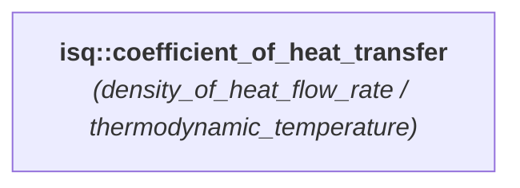

<!-- This file is auto-generated. Do not edit manually. -->
<!-- Run: python3 scripts/systems_reference.py --force -->

# coefficient_of_heat_transfer Hierarchy

**System:** ISQ

```mermaid
flowchart LR
    isq_coefficient_of_heat_transfer["<b>isq::coefficient_of_heat_transfer</b><br><i>(density_of_heat_flow_rate / thermodynamic_temperature)</i>"]
```
