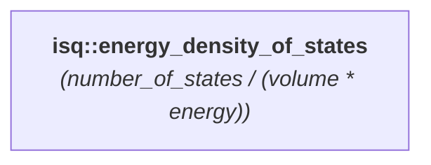

<!-- This file is auto-generated. Do not edit manually. -->
<!-- Run: python3 scripts/systems_reference.py --force -->

# energy_density_of_states Hierarchy

**System:** ISQ

```mermaid
flowchart LR
    isq_energy_density_of_states["<b><a href="../../systems/isq/#energy_density_of_states" style="color: var(--md-mermaid-label-fg-color); text-decoration: none;">isq::energy_density_of_states</a></b><br><i>(<a href="../../systems/isq/#number_of_states" style="color: var(--md-mermaid-label-fg-color); text-decoration: none;">number_of_states</a> / (<a href="../../systems/isq/#volume" style="color: var(--md-mermaid-label-fg-color); text-decoration: none;">volume</a> * <a href="../../systems/isq/#energy" style="color: var(--md-mermaid-label-fg-color); text-decoration: none;">energy</a>))</i>"]
```
