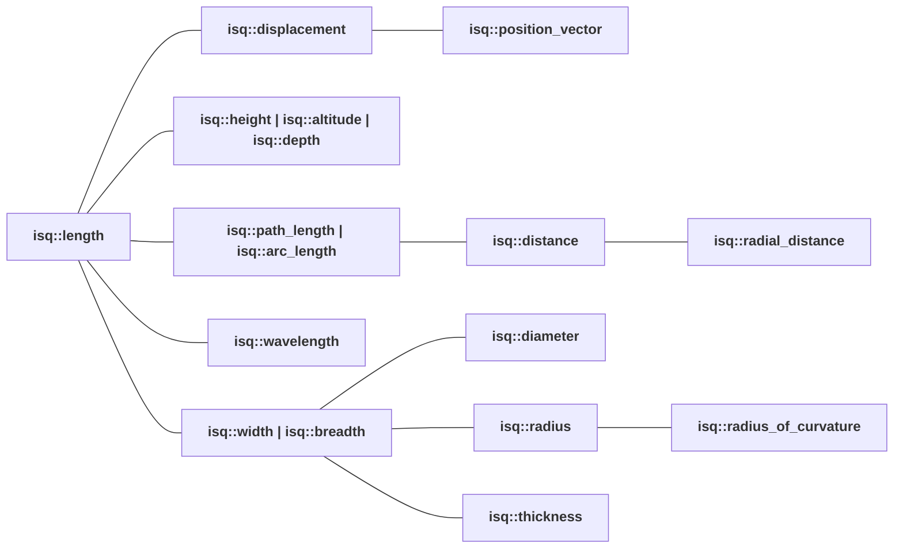

<!-- This file is auto-generated. Do not edit manually. -->
<!-- Run: python3 scripts/systems_reference.py --force -->

# length Hierarchy

**System:** ISQ

**Dimension:** dim_length

```mermaid
flowchart LR
    isq_length["<b>isq::length</b>"]
    isq_displacement["<b>isq::displacement</b>"]
    isq_length --- isq_displacement
    isq_position_vector["<b>isq::position_vector</b>"]
    isq_displacement --- isq_position_vector
    isq_height["<b>isq::height | isq::altitude | isq::depth</b>"]
    isq_length --- isq_height
    isq_path_length["<b>isq::path_length | isq::arc_length</b>"]
    isq_length --- isq_path_length
    isq_distance["<b>isq::distance</b>"]
    isq_path_length --- isq_distance
    isq_radial_distance["<b>isq::radial_distance</b>"]
    isq_distance --- isq_radial_distance
    isq_wavelength["<b>isq::wavelength</b>"]
    isq_length --- isq_wavelength
    isq_width["<b>isq::width | isq::breadth</b>"]
    isq_length --- isq_width
    isq_diameter["<b>isq::diameter</b>"]
    isq_width --- isq_diameter
    isq_radius["<b>isq::radius</b>"]
    isq_width --- isq_radius
    isq_radius_of_curvature["<b>isq::radius_of_curvature</b>"]
    isq_radius --- isq_radius_of_curvature
    isq_thickness["<b>isq::thickness</b>"]
    isq_width --- isq_thickness
```
