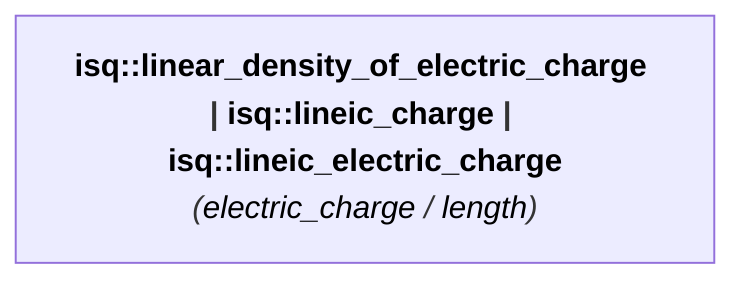

<!-- This file is auto-generated. Do not edit manually. -->
<!-- Run: python3 scripts/systems_reference.py --force -->

# linear_density_of_electric_charge Hierarchy

**System:** ISQ

```mermaid
flowchart LR
    isq_linear_density_of_electric_charge["<b><a href="../../systems/isq/#linear_density_of_electric_charge" style="color: black; text-decoration: none;">isq::linear_density_of_electric_charge</a> | <a href="../../systems/isq/#lineic_charge" style="color: black; text-decoration: none;">isq::lineic_charge</a> | <a href="../../systems/isq/#lineic_electric_charge" style="color: black; text-decoration: none;">isq::lineic_electric_charge</a></b><br><i>(<a href="../../systems/isq/#electric_charge" style="color: black; text-decoration: none;">electric_charge</a> / <a href="../../systems/isq/#length" style="color: black; text-decoration: none;">length</a>)</i>"]
```
