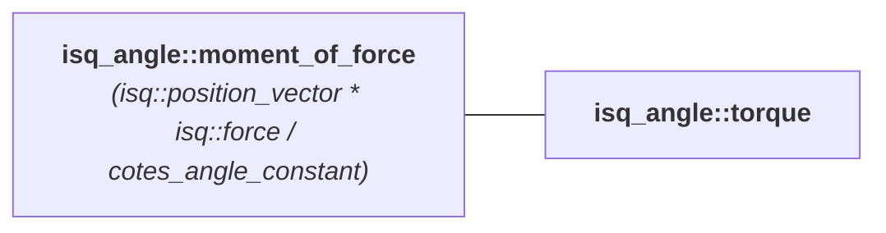

<!-- This file is auto-generated. Do not edit manually. -->
<!-- Run: python3 scripts/systems_reference.py --force -->

# moment_of_force Hierarchy

**System:** ISQ Angle

```mermaid
flowchart LR
    isq_angle_moment_of_force["<b><a href="../../systems/isq_angle/#moment_of_force" style="color: var(--md-mermaid-label-fg-color); text-decoration: none;">isq_angle::moment_of_force</a></b><br><i>(isq::position_vector * isq::force / <a href="../../systems/isq_angle/#cotes_angle_constant" style="color: var(--md-mermaid-label-fg-color); text-decoration: none;">cotes_angle_constant</a>)</i>"]
    isq_angle_torque["<b><a href="../../systems/isq_angle/#torque" style="color: var(--md-mermaid-label-fg-color); text-decoration: none;">isq_angle::torque</a></b>"]
    isq_angle_moment_of_force --- isq_angle_torque
```
