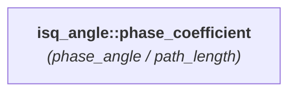

<!-- This file is auto-generated. Do not edit manually. -->
<!-- Run: python3 scripts/systems_reference.py --force -->

# phase_coefficient Hierarchy

**System:** ISQ Angle

```mermaid
flowchart LR
    isq_angle_phase_coefficient["<b>isq_angle::phase_coefficient</b><br><i>(phase_angle / path_length)</i>"]
```
