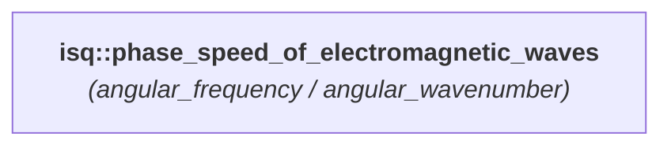

<!-- This file is auto-generated. Do not edit manually. -->
<!-- Run: python3 scripts/systems_reference.py --force -->

# phase_speed_of_electromagnetic_waves Hierarchy

**System:** ISQ

```mermaid
flowchart LR
    isq_phase_speed_of_electromagnetic_waves["<b>isq::phase_speed_of_electromagnetic_waves</b><br><i>(angular_frequency / angular_wavenumber)</i>"]
```
