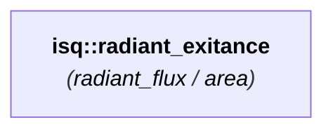

<!-- This file is auto-generated. Do not edit manually. -->
<!-- Run: python3 scripts/systems_reference.py --force -->

# radiant_exitance Hierarchy

**System:** ISQ

```mermaid
flowchart LR
    isq_radiant_exitance["<b><a href="../../systems/isq/#radiant_exitance" style="color: black; text-decoration: none;">isq::radiant_exitance</a></b><br><i>(<a href="../../systems/isq/#radiant_flux" style="color: black; text-decoration: none;">radiant_flux</a> / <a href="../../systems/isq/#area" style="color: black; text-decoration: none;">area</a>)</i>"]
```
