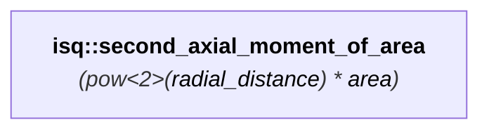

<!-- This file is auto-generated. Do not edit manually. -->
<!-- Run: python3 scripts/systems_reference.py --force -->

# second_axial_moment_of_area Hierarchy

**System:** ISQ

```mermaid
flowchart LR
    isq_second_axial_moment_of_area["<b><a href="../../systems/isq/#second_axial_moment_of_area" style="color: black; text-decoration: none;">isq::second_axial_moment_of_area</a></b><br><i>(pow<2>(<a href="../../systems/isq/#radial_distance" style="color: black; text-decoration: none;">radial_distance</a>) * <a href="../../systems/isq/#area" style="color: black; text-decoration: none;">area</a>)</i>"]
```
