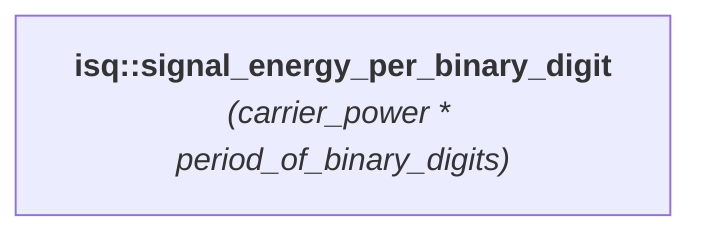

<!-- This file is auto-generated. Do not edit manually. -->
<!-- Run: python3 scripts/systems_reference.py --force -->

# signal_energy_per_binary_digit Hierarchy

**System:** ISQ

```mermaid
flowchart LR
    isq_signal_energy_per_binary_digit["<b><a href="../../systems/isq/#signal_energy_per_binary_digit" style="color: var(--md-mermaid-label-fg-color); text-decoration: none;">isq::signal_energy_per_binary_digit</a></b><br><i>(<a href="../../systems/isq/#carrier_power" style="color: var(--md-mermaid-label-fg-color); text-decoration: none;">carrier_power</a> * <a href="../../systems/isq/#period_of_binary_digits" style="color: var(--md-mermaid-label-fg-color); text-decoration: none;">period_of_binary_digits</a>)</i>"]
```
