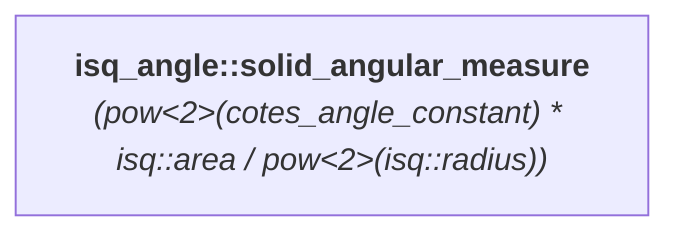

<!-- This file is auto-generated. Do not edit manually. -->
<!-- Run: python3 scripts/systems_reference.py --force -->

# solid_angular_measure Hierarchy

**System:** ISQ Angle

```mermaid
flowchart LR
    isq_angle_solid_angular_measure["<b>isq_angle::solid_angular_measure</b><br><i>(pow<2>(cotes_angle_constant) * isq::area / pow<2>(isq::radius))</i>"]
```
