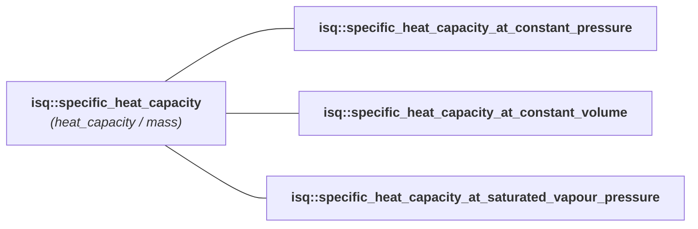

<!-- This file is auto-generated. Do not edit manually. -->
<!-- Run: python3 scripts/systems_reference.py --force -->

# specific_heat_capacity Hierarchy

**System:** ISQ

```mermaid
flowchart LR
    isq_specific_heat_capacity["<b>isq::specific_heat_capacity</b><br><i>(heat_capacity / mass)</i>"]
    isq_specific_heat_capacity_at_constant_pressure["<b>isq::specific_heat_capacity_at_constant_pressure</b>"]
    isq_specific_heat_capacity --- isq_specific_heat_capacity_at_constant_pressure
    isq_specific_heat_capacity_at_constant_volume["<b>isq::specific_heat_capacity_at_constant_volume</b>"]
    isq_specific_heat_capacity --- isq_specific_heat_capacity_at_constant_volume
    isq_specific_heat_capacity_at_saturated_vapour_pressure["<b>isq::specific_heat_capacity_at_saturated_vapour_pressure</b>"]
    isq_specific_heat_capacity --- isq_specific_heat_capacity_at_saturated_vapour_pressure
```
