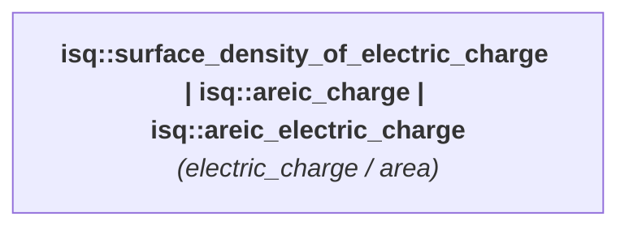

<!-- This file is auto-generated. Do not edit manually. -->
<!-- Run: python3 scripts/systems_reference.py --force -->

# surface_density_of_electric_charge Hierarchy

**System:** ISQ

```mermaid
flowchart LR
    isq_surface_density_of_electric_charge["<b>isq::surface_density_of_electric_charge | isq::areic_charge | isq::areic_electric_charge</b><br><i>(electric_charge / area)</i>"]
```
