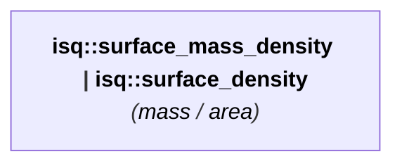

<!-- This file is auto-generated. Do not edit manually. -->
<!-- Run: python3 scripts/systems_reference.py --force -->

# surface_mass_density Hierarchy

**System:** ISQ

```mermaid
flowchart LR
    isq_surface_mass_density["<b><a href="../../systems/isq/#surface_mass_density" style="color: black; text-decoration: none;">isq::surface_mass_density</a> | <a href="../../systems/isq/#surface_density" style="color: black; text-decoration: none;">isq::surface_density</a></b><br><i>(<a href="../../systems/isq/#mass" style="color: black; text-decoration: none;">mass</a> / <a href="../../systems/isq/#area" style="color: black; text-decoration: none;">area</a>)</i>"]
```
