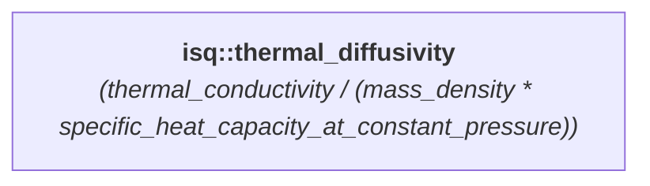

<!-- This file is auto-generated. Do not edit manually. -->
<!-- Run: python3 scripts/systems_reference.py --force -->

# thermal_diffusivity Hierarchy

**System:** ISQ

```mermaid
flowchart LR
    isq_thermal_diffusivity["<b><a href="../../systems/isq/#thermal_diffusivity" style="color: var(--md-mermaid-label-fg-color); text-decoration: none;">isq::thermal_diffusivity</a></b><br><i>(<a href="../../systems/isq/#thermal_conductivity" style="color: var(--md-mermaid-label-fg-color); text-decoration: none;">thermal_conductivity</a> / (<a href="../../systems/isq/#mass_density" style="color: var(--md-mermaid-label-fg-color); text-decoration: none;">mass_density</a> * <a href="../../systems/isq/#specific_heat_capacity_at_constant_pressure" style="color: var(--md-mermaid-label-fg-color); text-decoration: none;">specific_heat_capacity_at_constant_pressure</a>))</i>"]
```
