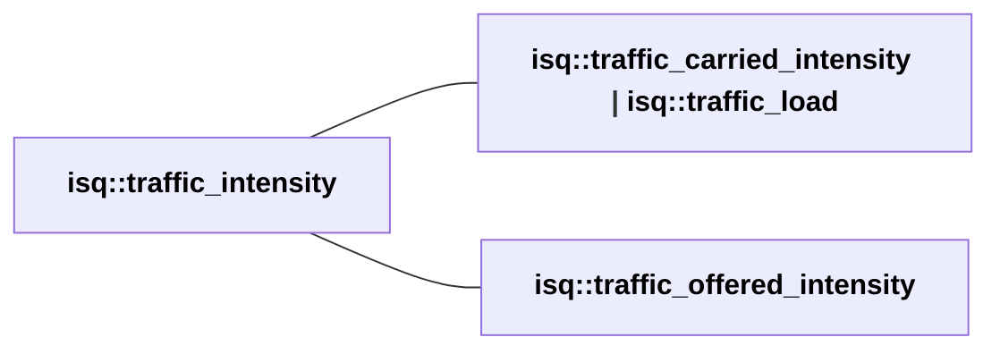

<!-- This file is auto-generated. Do not edit manually. -->
<!-- Run: python3 scripts/systems_reference.py --force -->

# traffic_intensity Hierarchy

**System:** ISQ

**Dimension:** dim_traffic_intensity

