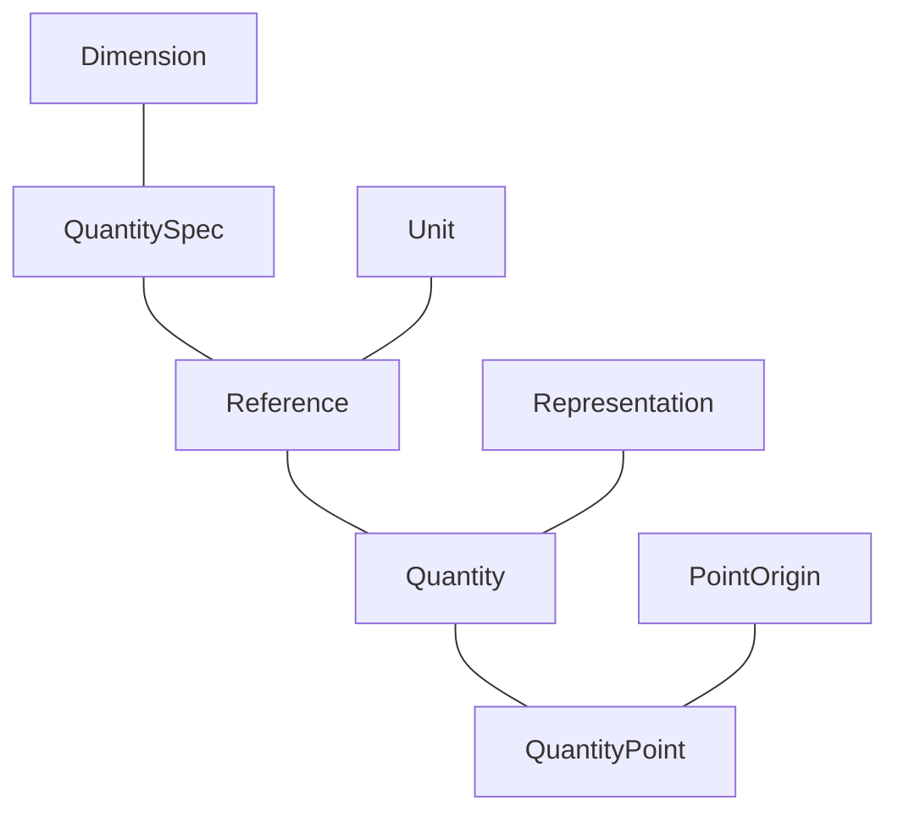

# Basic Concepts

The most important concepts in the **mp-units** library are `Dimension`, `QuantitySpec`, `Unit`,
`Reference`, `Representation`, `Quantity`, and `QuantityPoint`:




## `Dimension`

`Dimension` concept matches a [dimension](../../../appendix/glossary/#dimension) of either a base
or derived [quantity](../../../appendix/glossary/#quantity):

- [Base dimensions](../../../appendix/glossary/#base-dimension) are explicitly defined by a user
  by inheriting from the instantiation of a `base_dimension` class template. It should be instantiated with
  a unique symbol identifier describing this dimension in a specific
  [system of quantities](../../../appendix/glossary/#system-of-quantities).
- [Derived dimensions](../../../appendix/glossary/#derived-dimension) are implicitly created
  by the library's framework based on the [quantity equation](../../../appendix/glossary/#quantity-equation)
  provided in the [quantity specification](../../../appendix/glossary/#quantity_spec).

??? abstract "Examples"

    `isq::dim_length`, `isq::dim_mass`, `isq::dim_time`, `isq::dim_electric_current`,
    `isq::dim_thermodynamic_temperature`, `isq::dim_amount_of_substance`, and
    `isq::dim_luminous_intensity` are the dimensions of base quantities in the
    [ISQ](../../../appendix/glossary/#isq).

    IEC 80000 provides `iec80000::dim_traffic_intensity` base dimension to extend ISQ
    with information technology quantities.

    `derived_dimension<isq::dim_length, per<isq::dim_time>>` is a resulting dimension of
    `isq::dim_length / isq::dim_time`.

    A `Dimension` can be defined by the user in the following way:

    ```cpp
    inline constexpr struct dim_length : base_dimension<"L"> {} dim_length;
    ```


## `QuantitySpec`

`QuantitySpec` concept matches all the [quantity specifications](../../../appendix/glossary/#quantity_spec)
including:

- [Base quantities](../../../appendix/glossary/#base-quantity) defined by a user by inheriting from
  the `quantity_spec` class template instantiated with a [base dimension](../../../appendix/glossary/#base-dimension)
  argument.
- [Derived named quantities](../../../appendix/glossary/#derived-quantity) defined by a user by
  inheriting from the `quantity_spec` class template instantiated with a result of a
  [quantity equation](../../../appendix/glossary/#quantity-equation) passed as an argument.
- Other named quantities forming a [hierarchy of quantities](../../../appendix/glossary/#quantity-hierarchy)
  of the same [kind](../../../appendix/glossary/#kind) defined by a user by inheriting from the
  `quantity_spec` class template instantiated with another "parent" quantity specification passed as an
  argument.
- [Quantity kinds](../../../appendix/glossary/#kind) describing a family of mutually comparable quantities.
- Intermediate [derived quantity](../../../appendix/glossary/#derived-quantity) specifications being
  a result of a [quantity equations](../../../appendix/glossary/#quantity-equation) on other specifications.

??? abstract "Examples"

    `isq::length`, `isq::mass`, `isq::time`, `isq::electric_current`, `isq::thermodynamic_temperature`,
    `isq::amount_of_substance`, and `isq::luminous_intensity` are the specifications of base quantities
    in the [ISQ](../../../appendix/glossary/#isq).

    `isq::width`, `isq::height`, `isq::radius`, and `isq::position_vector` are only a few of many
    quantities of a kind length specified in the [ISQ](../../../appendix/glossary/#isq).

    `kind_of<isq::length>` behaves as any of the quantities of a kind length.

    `isq::area`, `isq::speed`, `isq::moment_of_force` are only a few of many derived quantities provided
    in the [ISQ](../../../appendix/glossary/#isq).

    `derived_quantity_spec<isq::length, per<isq::time>>` is a resulting quantity specification of
    `isq::length / isq::time`.

    `QuantitySpec` can be defined by the user in one of the following ways:

    === "C++20"

        ```cpp
        inline constexpr struct length : quantity_spec<length, dim_length> {} length;
        inline constexpr struct height : quantity_spec<height, length> {} height;
        inline constexpr struct speed : quantity_spec<speed, length / time> {} speed;
        ```

    === "C++23"

        ```cpp
        inline constexpr struct length : quantity_spec<dim_length> {} length;
        inline constexpr struct height : quantity_spec<length> {} height;
        inline constexpr struct speed : quantity_spec<length / time> {} speed;
        ```

    === "Portable"

        ```cpp
        QUANTITY_SPEC(length, dim_length);
        QUANTITY_SPEC(height, length);
        QUANTITY_SPEC(speed, length / time);
        ```


## `Unit`

`Unit` concept matches all the [units](../../../appendix/glossary/#unit) in the library including:

- [Base units](../../../appendix/glossary/#base-unit) defined by a user by inheriting from the `named_unit`
  class template instantiated with a unique symbol identifier describing this unit in a specific
  [system of units](../../../appendix/glossary/#system-of-units).
- Named scaled units defined by a user by inheriting from the `named_unit` class template instantiated
  with a unique symbol identifier and a product of multiplying another unit with some magnitude.
- Prefixed units defined by a user by inheriting from the `prefixed_unit` class template instantiated
  with a magnitude and a unit to be prefixed.
- [Derived named units](../../../appendix/glossary/#derived-unit) defined by a user by inheriting from the
  `named_unit` class template instantiated with a unique symbol identifier and a result of
  [unit equation](../../../appendix/glossary/#unit-equation) passed as an argument.
- [Derived unnamed units](../../../appendix/glossary/#derived-unit) being a result of a
  [unit equations](../../../appendix/glossary/#unit-equation) on other units.

!!! note

    In the **mp-units** library, physical constants are also implemented as units.

??? abstract "Examples"

    `si::second`, `si::metre`, `si::kilogram`, `si::ampere`, `si::kelvin`, `si::mole`, and `si::candela`
    are the base units of [SI](../../../appendix/glossary/#si).

    `si::kilo<si::metre>` is a prefixed unit on length.

    `si::radian`, `si::newton`, and `si::watt` are examples of named derived quantities within
    [SI](../../../appendix/glossary/#si).

    `derived_unit<si::metre, per<si::second>>` is a resulting derived unit of `si::metre / si::second`.

    `non_si::minute` is an example of a scaled unit of time.

    `si::si2019::speed_of_light_in_vacuum` is a physical constant standardized by the SI in 2019.

    `Unit` can be defined by the user in one of the following ways:

    ```cpp
    inline constexpr struct second : named_unit<"s", kind_of<isq::time>> {} second;
    inline constexpr struct gram : named_unit<"g", kind_of<isq::mass>> {} gram;
    inline constexpr struct minute : named_unit<"min", mag<60> * second> {} minute;
    inline constexpr struct kilogram : decltype(kilo<gram>) {} kilogram;
    inline constexpr struct newton : named_unit<"N", kilogram * metre / square(second)> {} newton;
    ```


### `AssociatedUnit`

`AssociatedUnit` concept describes a [unit with an associated quantity](../../../appendix/glossary/#associated-unit)
and is satisfied by:

- All units derived from a `named_unit` class template instantiated with a unique symbol identifier
  and a [`QuantitySpec`](#quantityspec).
- All units being a result of a [unit equations](../../../appendix/glossary/#unit-equation) on other
  associated units.

??? abstract "Examples"

    All units in the [SI](../../../appendix/glossary/#si) have associated quantities.

    Natural units typically do not have an associated quantity.


### `PrefixableUnit`

`PrefixableUnit` concept is satisfied by all units derived from a `named_unit` class template for
which a customization point `unit_can_be_prefixed<U>` was not explicitly set to `false`. Such
units can be passed as an argument to a `prefixed_unit` class template.

??? abstract "Examples"

    All units in the [SI](../../../appendix/glossary/#si) can be prefixed with SI-defined prefixes.

    Some [off-system units](../../../appendix/glossary/#off-system-unit) like `non_si::day`
    can't be prefixed.

### `UnitOf<QS>` { #unitof }

`UnitOf<QS>` concept is satisfied for all units matching an [`AssociatedUnit`](#associatedunit)
concept with an associated quantity type implicitly convertible to `QS`.


## `Reference`

`Reference` concept is satisfied by all [quantity reference types](../../../appendix/glossary/#reference)
types. Such types provide all the meta-information required to create a [`Quantity`](#quantity).
A `Reference` can be either:

- An [AssociatedUnit](#associatedunit)
- The instantiation of a `reference` class template with a [`QuantitySpec`](#quantityspec) passed as
  the first template argument and a [`Unit`](#unit) passed as the second one.

??? abstract "Examples"

    `si::metre` is defined in the [SI](../../../appendix/glossary/#si) as a unit of `isq::length`
    and thus can be used as a reference to instantiate a quantity of length.

    The expression `isq::height[m]` results with `reference<isq::height, si::metre>` which can be used to
    instantiate a quantity of `isq::height` with a unit of `si::metre`.


### `ReferenceOf<V>` { #referenceof }

`ReferenceOf<V>` concept is satisfied by references that match the following value `V`:

| `V`                  | Condition                                                    |
|----------------------|--------------------------------------------------------------|
| `Dimension`          | The dimension of a quantity specification is the same as `V` |
| `QuantitySpec`       | The quantity specification is implicitly convertible to `V`  |
| `quantity_character` | The quantity specification has a character of `V`            |


## `Representation`

`Representation` concept constraints a type of a number that stores the
[value of a quantity](../../../appendix/glossary/#quantity-value).


### `RepresentationOf<Ch>` { #representationof }

`RepresentationOf<Ch>` concept is satisfied by all `Representation` types that are of a specified
[quantity character](../../../appendix/glossary/#character). A user can declare a custom representation
type to be of a specific character by providing the specialization with `true` for one or more of
the following variable templates:

- `is_scalar<T>`
- `is_vector<T>`
- `is_tensor<T>`


## `Quantity`

`Quantity` concept matches every [quantity](../../../appendix/glossary/#quantity) in the library and is
satisfied by all types being or deriving from and instantiation of a `quantity` class template.

??? abstract "Examples"

    All of `42 * m`, `42 * si::metre`, `42 * isq::height[m]` create a quantity and thus satisfy
    a `Quantity` concept.

    A quantity type can also be specified explicitly (i.e. `quantity<si::metre, int>`,
    `quantity<isq::height[m]>`).

### `QuantityOf<V>` { #quantityof }

`QuantityOf<V>` concept is satisfied by all the quantities for which a [`ReferenceOf<V>`](#referenceof)
is `true`.

## `PointOrigin`

`PointOrigin` concept matches all [quantity point origins](../../../appendix/glossary/#point-origin) in
the library. It is satisfied by either:

- Compile-time known [`QuantityPoint`](#quantitypoint)
- All types derived from an `absolute_point_origin` class template.

??? abstract "Examples"

    The types of both definitions below satisfy a `PointOrigin` concept:

    ```cpp
    inline constexpr struct mean_sea_level : absolute_point_origin<isq::height> {} mean_sea_level;
    inline constexpr auto ice_point = quantity_point<isq::thermodynamic_temperature[K]>{273.15};
    ```


### `PointOriginFor<QS>` { #pointoriginfor }

`PointOriginFor<QS>` concept is satisfied by all [`PointOrigin`](#pointorigin) types that are defined using
a provided quantity specification.


## `QuantityPoint`

`QuantityPoint` concept is satisfied by all types being either a specialization or derived from `quantity_point`
class template.

??? abstract "Examples"

    The following specifies a quantity point defined in terms of an ice point provided in the previous example:

    ```cpp
    constexpr auto room_reference_temperature = quantity_point<isq::Celsius_temperature[deg_C], ice_point>{21};
    ```


### `QuantityPointOf<V>` { #quantitypointof }

`QuantityPointOf<V>` concept is satisfied by all the quantity points for which either:

- a [`ReferenceOf<V>`](#referenceof) is `true`.
- the type of `V` satisfies [`PointOrigin`](#pointorigin) concept and the quantity point's
  [absolute point origin](../../../appendix/glossary/#absolute-point-origin) is convertible to `V`.

## Interoperability concepts

### `QuantityLike`

`QuantityLike` concept is satisfied by a type `T` for which an instantiation of `quantity_like_traits`
type trait yields a valid type that provides:

- static member `reference` that matches the [`Reference`](#reference) concept
- `rep` type that matches [`RepresentationOf`](#representationof) concept with the character provided
  in `reference`
- `number(T)` static member function returning a type convertible to `rep`

??? abstract "Examples"

    This is how support for `std::chrono::seconds` can be provided:

    ```cpp
    template<>
    struct quantity_like_traits<std::chrono::seconds> {
      static constexpr auto reference = si::second;
      using rep = std::chrono::seconds::rep;
      [[nodiscard]] static constexpr rep number(const std::chrono::seconds& q) { return q.count(); }
    };
    ```

### `QuantityPointLike`

`QuantityPointLike` concept is satisfied by a type `T` for which an instantiation of
`quantity_point_like_traits` type trait yields a valid type that provides:

- static member `reference` that matches the [`Reference`](#reference) concept
- static member `point_origin` that matches the [`PointOrigin`](#pointorigin) concept
- `rep` type that matches [`RepresentationOf`](#representationof) concept with the character provided
  in `reference`
- `relative(T)` static member function returning a type that can be used to construct
  the [`QuantityPoint`](#quantitypoint) type

??? abstract "Examples"

    This is how support for a `std::chrono::time_point` of `std::chrono::seconds` can be provided:

    ```cpp
    template<typename C>
    struct quantity_point_like_traits<std::chrono::time_point<C, std::chrono::seconds>> {
      static constexpr auto reference = si::second;
      static constexpr auto point_origin = absolute_point_origin<isq::time>;
      using rep = Rep;
      [[nodiscard]] static constexpr auto relative(const std::chrono::time_point<C, std::chrono::seconds>& qp)
      {
        return std::chrono::duration_cast<std::chrono::seconds>(qp.time_since_epoch());
      }
    };
    ```
