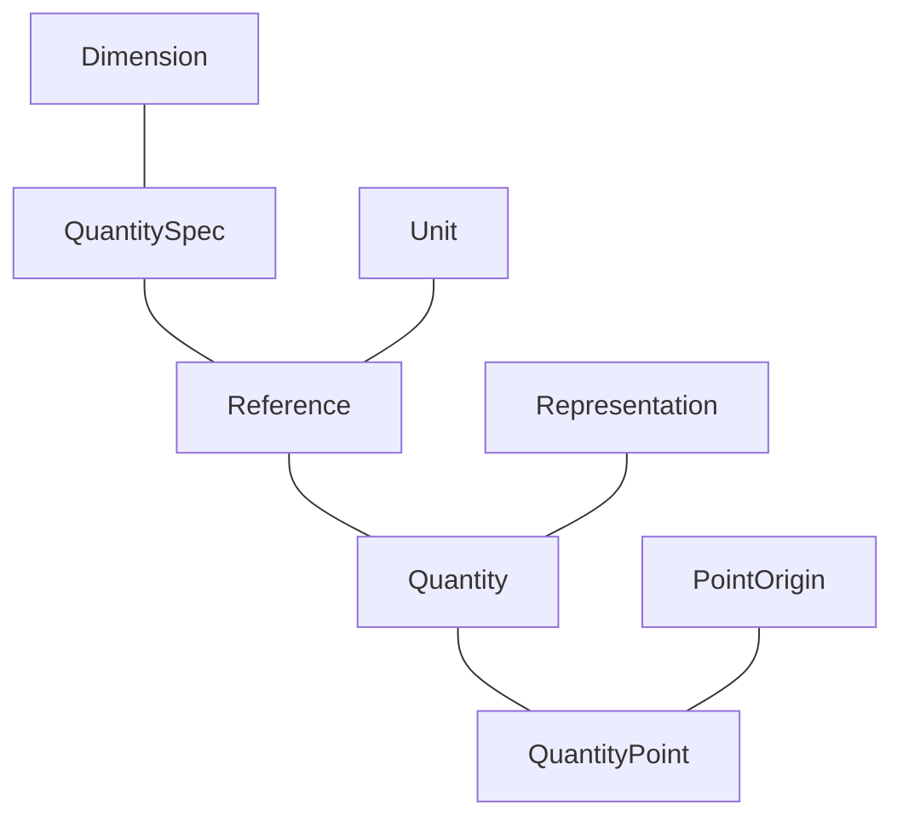

# Basic Concepts

The most important concepts in the **mp-units** library are `Dimension`, `QuantitySpec`, `Unit`,
`Reference`, `Representation`, `Quantity`, and `QuantityPoint`:




## `Dimension<T>` { #Dimension }

`Dimension` concept matches a [dimension](../../appendix/glossary.md#dimension) of either a base
or derived [quantity](../../appendix/glossary.md#quantity):

- [Base dimensions](../../appendix/glossary.md#base-dimension) are explicitly defined by a user
  by inheriting from the instantiation of a `base_dimension` class template. It should be instantiated with
  a unique symbol identifier describing this dimension in a specific
  [system of quantities](../../appendix/glossary.md#system-of-quantities).
- [Derived dimensions](../../appendix/glossary.md#derived-dimension) are implicitly created
  by the library's framework based on the [quantity equation](../../appendix/glossary.md#quantity-equation)
  provided in the [quantity specification](../../appendix/glossary.md#quantity_spec).

??? abstract "Examples"

    `isq::dim_length`, `isq::dim_mass`, `isq::dim_time`, `isq::dim_electric_current`,
    `isq::dim_thermodynamic_temperature`, `isq::dim_amount_of_substance`, and
    `isq::dim_luminous_intensity` are the dimensions of base quantities in the
    [ISQ](../../appendix/glossary.md#isq).

    IEC 80000 provides `iec80000::dim_traffic_intensity` base dimension to extend ISQ
    with information technology quantities.

    A `Dimension` can be defined by the user in the following way:

    ```cpp
    inline constexpr struct dim_length : base_dimension<"L"> {} dim_length;
    ```

    The division on quantity specifications also divides their dimensions:

    ```cpp
    static_assert((isq::length / isq::time).dimension == isq::dim_length / isq::dim_time);
    ```

    The [dimension equation](../../appendix/glossary.md#dimension-equation) of `isq::dim_length / isq::dim_time`
    results in the `derived_dimension<isq::dim_length, per<isq::dim_time>>` type.


### `DimensionOf<T, V>` { #DimensionOf }

`DimensionOf` concept is satisfied when both arguments satisfy a [`Dimension`](#Dimension) concept and
when they compare equal.


## `QuantitySpec<T>` { #QuantitySpec }

`QuantitySpec` concept matches all the [quantity specifications](../../appendix/glossary.md#quantity_spec)
including:

- [Base quantities](../../appendix/glossary.md#base-quantity) defined by a user by inheriting from
  the `quantity_spec` class template instantiated with a [base dimension](../../appendix/glossary.md#base-dimension)
  argument.
- [Derived named quantities](../../appendix/glossary.md#derived-quantity) defined by a user by
  inheriting from the `quantity_spec` class template instantiated with a result of a
  [quantity equation](../../appendix/glossary.md#quantity-equation) passed as an argument.
- Other named quantities forming a [hierarchy of quantities](../../appendix/glossary.md#quantity-hierarchy)
  of the same [kind](../../appendix/glossary.md#kind) defined by a user by inheriting from the
  `quantity_spec` class template instantiated with another "parent" quantity specification passed as an
  argument.
- [Quantity kinds](../../appendix/glossary.md#kind) describing a family of mutually comparable quantities.
- Intermediate [derived quantity](../../appendix/glossary.md#derived-quantity) specifications being
  a result of a [quantity equations](../../appendix/glossary.md#quantity-equation) on other specifications.

??? abstract "Examples"

    `isq::length`, `isq::mass`, `isq::time`, `isq::electric_current`, `isq::thermodynamic_temperature`,
    `isq::amount_of_substance`, and `isq::luminous_intensity` are the specifications of base quantities
    in the [ISQ](../../appendix/glossary.md#isq).

    `isq::width`, `isq::height`, `isq::radius`, and `isq::position_vector` are only a few of many
    quantities of a kind length specified in the [ISQ](../../appendix/glossary.md#isq).

    `kind_of<isq::length>` behaves as any of the quantities of a kind length.

    `isq::area`, `isq::speed`, `isq::moment_of_force` are only a few of many derived quantities provided
    in the [ISQ](../../appendix/glossary.md#isq).

    `QuantitySpec` can be defined by the user in one of the following ways:

    === "C++23"

        ```cpp
        inline constexpr struct length : quantity_spec<dim_length> {} length;
        inline constexpr struct height : quantity_spec<length> {} height;
        inline constexpr struct speed : quantity_spec<length / time> {} speed;
        ```

    === "C++20"

        ```cpp
        inline constexpr struct length : quantity_spec<length, dim_length> {} length;
        inline constexpr struct height : quantity_spec<height, length> {} height;
        inline constexpr struct speed : quantity_spec<speed, length / time> {} speed;
        ```

    === "Portable"

        ```cpp
        QUANTITY_SPEC(length, dim_length);
        QUANTITY_SPEC(height, length);
        QUANTITY_SPEC(speed, length / time);
        ```

    The [quantity equation](../../appendix/glossary.md#quantity-equation) of `isq::length / isq::time` results
    in the `derived_quantity_spec<isq::length, per<isq::time>>` type.


### `QuantitySpecOf<T, V>` { #QuantitySpecOf }

`QuantitySpecOf` concept is satisfied when both arguments satisfy a [`QuantitySpec`](#QuantitySpec) concept
and when `T` is implicitly convertible to `V`.

??? info "More details"

    Additionally:

    - `T` should not be a [nested quantity specification of `V`](dimensionless_quantities.md/#nested-quantity-kinds)
    - either `T` is quantity kind or `V` should not be a
      [nested quantity specification of `T`](dimensionless_quantities.md/#nested-quantity-kinds)

    Those additional conditions are required to make the following work:

    ```cpp
    static_assert(ReferenceOf<si::radian, isq::angular_measure>);
    static_assert(!ReferenceOf<si::radian, dimensionless>);
    static_assert(!ReferenceOf<isq::angular_measure[si::radian], dimensionless>);
    static_assert(ReferenceOf<one, isq::angular_measure>);
    static_assert(!ReferenceOf<dimensionless[one], isq::angular_measure>);
    ```


## `Unit<T> ` { #Unit }

`Unit` concept matches all the [units](../../appendix/glossary.md#unit) in the library including:

- [Base units](../../appendix/glossary.md#base-unit) defined by a user by inheriting from the `named_unit`
  class template instantiated with a unique symbol identifier describing this unit in a specific
  [system of units](../../appendix/glossary.md#system-of-units).
- Named scaled units defined by a user by inheriting from the `named_unit` class template instantiated
  with a unique symbol identifier and a product of multiplying another unit with some magnitude.
- Prefixed units defined by a user by inheriting from the `prefixed_unit` class template instantiated
  with a prefix symbol, a magnitude, and a unit to be prefixed.
- [Derived named units](../../appendix/glossary.md#derived-unit) defined by a user by inheriting from the
  `named_unit` class template instantiated with a unique symbol identifier and a result of
  [unit equation](../../appendix/glossary.md#unit-equation) passed as an argument.
- [Derived unnamed units](../../appendix/glossary.md#derived-unit) being a result of a
  [unit equations](../../appendix/glossary.md#unit-equation) on other units.

!!! note

    In the **mp-units** library, [physical constants are also implemented as units](faster_than_lightspeed_constants.md).

??? abstract "Examples"

    `si::second`, `si::metre`, `si::kilogram`, `si::ampere`, `si::kelvin`, `si::mole`, and `si::candela`
    are the base units of [SI](../../appendix/glossary.md#si).

    `si::kilo<si::metre>` is a prefixed unit on length.

    `si::radian`, `si::newton`, and `si::watt` are examples of named derived quantities within
    [SI](../../appendix/glossary.md#si).

    `non_si::minute` is an example of a scaled unit of time.

    `si::si2019::speed_of_light_in_vacuum` is a physical constant standardized by the SI in 2019.

    `Unit` can be defined by the user in one of the following ways:

    ```cpp
    template<PrefixableUnit auto U> struct kilo_ : prefixed_unit<"k", mag_power<10, 3>, U> {};
    template<PrefixableUnit auto U> inline constexpr kilo_<U> kilo;

    inline constexpr struct second : named_unit<"s", kind_of<isq::time>> {} second;
    inline constexpr struct gram : named_unit<"g", kind_of<isq::mass>> {} gram;
    inline constexpr struct minute : named_unit<"min", mag<60> * second> {} minute;
    inline constexpr struct kilogram : decltype(kilo<gram>) {} kilogram;
    inline constexpr struct newton : named_unit<"N", kilogram * metre / square(second)> {} newton;

    inline constexpr struct speed_of_light_in_vacuum : named_unit<"c", mag<299'792'458> * metre / second> {} speed_of_light_in_vacuum;
    ```

    The [unit equation](../../appendix/glossary.md#unit-equation) of `si::metre / si::second` results
    in the `derived_unit<si::metre, per<si::second>>` type.


### `AssociatedUnit<T>` { #AssociatedUnit }

`AssociatedUnit` concept describes a [unit with an associated quantity](../../appendix/glossary.md#associated-unit)
and is satisfied by:

- All units derived from a `named_unit` class template instantiated with a unique symbol identifier
  and a [`QuantitySpec`](#quantityspec).
- All units being a result of a [unit equations](../../appendix/glossary.md#unit-equation) on other
  associated units.

??? abstract "Examples"

    All units in the [SI](../../appendix/glossary.md#si) have associated quantities. For example,
    `si::second` is specified to measure `isq::time`.

    Natural units typically do not have an associated quantity. For example, if we assume `c = 1`,
    a `natural::second` unit can be used to measure both `time` and `length`. In such case `speed`
    would be a [dimensionless quantity](../../appendix/glossary.md#dimensionless-quantity).


### `PrefixableUnit<T>` { #PrefixableUnit }

`PrefixableUnit` concept is satisfied by all units derived from a `named_unit` class template for
which a customization point `unit_can_be_prefixed<T{}>` was not explicitly set to `false`. Such
units can be passed as an argument to a `prefixed_unit` class template.

??? abstract "Examples"

    All units in the [SI](../../appendix/glossary.md#si) can be prefixed with SI-defined prefixes.

    Some [off-system units](../../appendix/glossary.md#off-system-unit) like `non_si::day`
    can't be prefixed. To enforce that the following has to be provided:

    ```cpp
    template<> inline constexpr bool unit_can_be_prefixed<non_si::day> = false;
    ```


### `UnitOf<T, V>` { #UnitOf }

`UnitOf` concept is satisfied for all units `T` matching an [`AssociatedUnit`](#AssociatedUnit)
concept with an associated quantity type implicitly convertible to `V`.

??? info "More details"

    Additionally, the kind of `V` and the kind of quantity type associated with `T` must be the same,
    or the quantity type associated with `T` may not be derived from the kind of `V`.

    This condition is required to make `dimensionless[si::radian]` invalid as `si::radian` should
    be only used for `isq::angular_measure` which is a
    [nested quantity kind within the dimensionless quantities tree](dimensionless_quantities.md/#nested-quantity-kinds).


### `UnitCompatibleWith<T, V1, V2>` { #UnitCompatibleWith }

`UnitCompatibleWith` concept is satisfied for all units `T` when:

- `V1` is a [`Unit`](#Unit),
- `V2` is a [`QuantitySpec`](#QuantitySpec),
- `T` and `V1` are defined in terms of the same reference unit,
- if `T` is an [`AssociatedUnit`](#AssociatedUnit) it should satisfy [`UnitOf<V2>`](#UnitOf).


## `Reference<T>` { #Reference }

`Reference` concept is satisfied by all [quantity reference](../../appendix/glossary.md#reference)
types. Such types provide all the meta-information required to create a [`Quantity`](#Quantity).
A `Reference` can either be:

- An [`AssociatedUnit`](#AssociatedUnit).
- The instantiation of a `reference` class template with a [`QuantitySpec`](#QuantitySpec) passed as
  the first template argument and a [`Unit`](#Unit) passed as the second one.

??? abstract "Examples"

    `si::metre` is defined in the [SI](../../appendix/glossary.md#si) as a unit of `isq::length`
    and thus can be used as a reference to instantiate a quantity of length.

    The expression `isq::height[m]` results with `reference<isq::height, si::metre>` which can be used to
    instantiate a quantity of `isq::height` with a unit of `si::metre`.


### `ReferenceOf<T, V>` { #ReferenceOf }

`ReferenceOf` concept is satisfied by references `T` that match the following value `V`:

| `V`                  | Condition                                                                                     |
|----------------------|-----------------------------------------------------------------------------------------------|
| `Dimension`          | The dimension of a quantity specification satisfies [`DimensionOf<V>`](#DimensionOf) concept. |
| `QuantitySpec`       | The quantity specification satisfies [`QuantitySpecOf<V>`](#QuantitySpecOf) concept.          |
| `quantity_character` | The quantity specification has a character of `V`.                                            |


## `Representation<T>` { #Representation }

`Representation` concept constraints a type of a number that stores the
[value of a quantity](../../appendix/glossary.md#quantity-value).


### `RepresentationOf<T, Ch>` { #RepresentationOf }

`RepresentationOf` concept is satisfied by all `Representation` types that are of a specified
[quantity character](../../appendix/glossary.md#character) `Ch`.

A user can declare a custom representation type to be of a specific character by providing the specialization
with `true` for one or more of the following variable templates:

- `is_scalar<T>`
- `is_vector<T>`
- `is_tensor<T>`


??? abstract "Examples"

    If we want to use scalar types to express [vector quantities](character_of_a_quantity.md#defining-vector-and-tensor-quantities)
    (e.g. ignoring the "direction" of the vector) the following definition can be provided to enable such a behavior:

    ```cpp
    template<class T>
      requires mp_units::is_scalar<T>
    inline constexpr bool mp_units::is_vector<T> = true;
    ```


## `Quantity<T>` { #Quantity }

`Quantity` concept matches every [quantity](../../appendix/glossary.md#quantity) in the library and is
satisfied by all types being or deriving from and instantiation of a `quantity` class template.

??? abstract "Examples"

    All of `42 * m`, `42 * si::metre`, `42 * isq::height[m]`, and `isq::height(42 * m)` create a quantity
    and thus satisfy a `Quantity` concept.

    A quantity type can also be specified explicitly (e.g. `quantity<si::metre, int>`,
    `quantity<isq::height[m]>`).

### `QuantityOf<T, V>` { #QuantityOf }

`QuantityOf` concept is satisfied by all the quantities for which a [`ReferenceOf<V>`](#ReferenceOf)
is `true`.


## `PointOrigin<T>` { #PointOrigin }

`PointOrigin` concept matches all [quantity point origins](../../appendix/glossary.md#point-origin) in
the library. It is satisfied by either:

- All types derived from an `absolute_point_origin` class template.
- All types derived from an `relative_point_origin` class template.

??? abstract "Examples"

    The types of both definitions below satisfy a `PointOrigin` concept:

    ```cpp
    inline constexpr struct absolute_zero : absolute_point_origin<isq::thermodynamic_temperature> {} absolute_zero;
    inline constexpr struct ice_point : relative_point_origin<absolute_zero + 273.15 * kelvin> {} ice_point;
    ```

### `PointOriginFor<T, V>` { #PointOriginFor }

`PointOriginFor` concept is satisfied by all [`PointOrigin`](#PointOrigin) types that have quantity type
implicitly convertible from quantity specification `V`, which means that `V` must satisfy
[`QuantitySpecOf<T::quantity_spec>`](#QuantitySpecOf).

??? abstract "Examples"

    `ice_point` can serve as a point origin for _points_ of `isq::Celsius_temperature` because this quantity
    type implicitly converts to `isq::thermodynamic_temperature`.

    However, if we define `mean_sea_level` in the following way:

    ```cpp
    inline constexpr struct mean_sea_level : absolute_point_origin<isq::altitude> {} mean_sea_level;
    ```

    then it can't be used as a point origin for _points_ of `isq::length` or `isq::width` as none of them
    is implicitly convertible to `isq::altitude`:

    - not every "length" is an "altitude",
    - "width" is not compatible with "altitude".


## `QuantityPoint<T>` { #QuantityPoint }

`QuantityPoint` concept is satisfied by all types being either a specialization or derived from `quantity_point`
class template.

??? abstract "Examples"

    The following specifies a quantity point defined in terms of an `ice_point` quantity point origin
    provided in the previous example:

    ```cpp
    constexpr auto room_reference_temperature = ice_point + isq::Celsius_temperature(21 * deg_C);
    ```


### `QuantityPointOf<T, V>` { #QuantityPointOf }

`QuantityPointOf` concept is satisfied by all the quantity points `T` that match the following value `V`:

| `V`           | Condition                                                                        |
|---------------|----------------------------------------------------------------------------------|
| `Reference`   | The quantity point reference satisfies [`ReferenceOf<V>`](#ReferenceOf) concept. |
| `PointOrigin` | The _point_ and `V` have the same absolute point origin.                         |


## `QuantityLike<T>` { #QuantityLike }

`QuantityLike` concept provides interoperability with other libraries and is satisfied by a type `T`
for which an instantiation of `quantity_like_traits` type trait yields a valid type that provides:

- Static data member `reference` that matches the [`Reference`](#Reference) concept,
- `rep` type that matches [`RepresentationOf`](#RepresentationOf) concept with the character provided
  in `reference`,
- `to_numerical_value(T)` static member function returning a raw value of the quantity packed in
  either `convert_explicitly` or `convert_implicitly` wrapper that enables implicit conversion in
  the latter case,
- `from_numerical_value(rep)` static member function returning `T` packed in either `convert_explicitly`
  or `convert_implicitly` wrapper that enables implicit conversion in the latter case.


??? abstract "Examples"

    This is how support for `std::chrono::seconds` can be provided:

    ```cpp
    template<>
    struct mp_units::quantity_like_traits<std::chrono::seconds> {
      static constexpr auto reference = si::second;
      using rep = std::chrono::seconds::rep;

      [[nodiscard]] static constexpr convert_implicitly<rep> to_numerical_value(const std::chrono::seconds& q)
      {
        return q.count();
      }

      [[nodiscard]] static constexpr convert_implicitly<std::chrono::seconds> from_numerical_value(const rep& v)
      {
        return std::chrono::seconds(v);
      }
    };

    quantity q = 42s;
    std::chrono::seconds dur = 42 * s;
    ```


## `QuantityPointLike<T>` { #QuantityPointLike }

`QuantityPointLike` concept provides interoperability with other libraries and is satisfied by a type `T`
for which an instantiation of `quantity_point_like_traits` type trait yields a valid type that provides:

- Static data member `reference` that matches the [`Reference`](#Reference) concept
- Static data member `point_origin` that matches the [`PointOrigin`](#PointOrigin) concept
- `rep` type that matches [`RepresentationOf`](#RepresentationOf) concept with the character provided
  in `reference`
- `to_quantity(T)` static member function returning the `quantity` being the offset of the point
  from the origin packed in either `convert_explicitly` or `convert_implicitly` wrapper that enables
  implicit conversion in the latter case,
- `from_quantity(quantity<reference, rep>)` static member function returning `T` packed in either
  `convert_explicitly` or `convert_implicitly` wrapper that enables implicit conversion in the latter
  case.


??? abstract "Examples"

    This is how support for a `std::chrono::time_point` of `std::chrono::seconds` can be provided:

    ```cpp
    template<typename C>
    struct mp_units::quantity_point_like_traits<std::chrono::time_point<C, std::chrono::seconds>> {
      using T = std::chrono::time_point<C, std::chrono::seconds>;
      static constexpr auto reference = si::second;
      static constexpr struct point_origin : absolute_point_origin<isq::time> {} point_origin{};
      using rep = std::chrono::seconds::rep;

      [[nodiscard]] static constexpr convert_implicitly<quantity<reference, rep>> to_quantity(const T& qp)
      {
        return quantity{qp.time_since_epoch()};
      }

      [[nodiscard]] static constexpr convert_implicitly<T> from_quantity(const quantity<reference, rep>& q)
      {
        return T(q);
      }
    };

    quantity_point qp = time_point_cast<std::chrono::seconds>(std::chrono::system_clock::now());
    std::chrono::sys_seconds q = qp + 42 * s;
    ```
