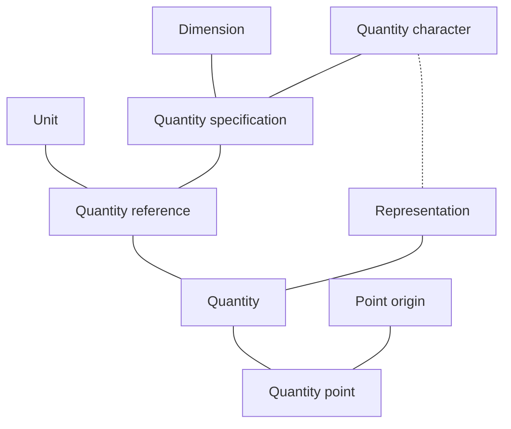

# Design Overview

The most important entities in the **mp-units** library are:

- [quantity](#quantity),
- [quantity point](#quantity-point),
- [unit](#unit),
- [dimension](#dimension),
- [quantity specification](#quantity-specification)
- [quantity reference](#quantity-reference),
- [quantity representation](#quantity-representation).

The graph provided below presents how those and a few other entities depend on each other:



## Dimension

[Dimension](../../appendix/glossary.md#dimension) specifies the dependence of a quantity on the base
quantities of a particular system of quantities. It is represented as a product of powers of factors
corresponding to the base quantities, omitting any numerical factor.

In the **mp-units** library, we use the terms:

- **base dimension** to refer to the dimension of a [base quantity](../../appendix/glossary.md#base-quantity),
- **derived dimension** to refer to the dimension of a [derived quantity](../../appendix/glossary.md#derived-quantity).

For example:

- _length_ ($\mathsf{L}$), _mass_ ($\mathsf{M}$), _time_ ($\mathsf{T}$), _electric current_ ($\mathsf{I}$),
  _thermodynamic temperature_ ($\mathsf{Θ}$), _amount of substance_ ($\mathsf{N}$), and
  _luminous intensity_ ($\mathsf{J}$) are the base dimensions of the [ISQ](../../appendix/glossary.md#isq).
- A derived dimension of _force_ in the [ISQ](../../appendix/glossary.md#isq) is denoted by
  $\textsf{dim }F = \mathsf{LMT}^{–2}$.
- The implementation of IEC 80000 in this library provides `iec80000::dim_traffic_intensity`
  base dimension to extend ISQ with strong information technology quantities.

[Base dimensions](../../appendix/glossary.md#base-dimension) can be defined by the user in
the following way:

```cpp
inline constexpr struct dim_length : base_dimension<"L"> {} dim_length;
inline constexpr struct dim_time : base_dimension<"T"> {} dim_time;
```

[Derived dimensions](../../appendix/glossary.md#derived-dimension) are implicitly created
by the library's framework based on the [quantity equation](../../appendix/glossary.md#quantity-equation)
provided in the [quantity specification](../../appendix/glossary.md#quantity_spec):

=== "C++23"

    ```cpp
    inline constexpr struct length : quantity_spec<dim_length> {} length;
    inline constexpr struct time : quantity_spec<dim_time> {} time;
    inline constexpr struct speed : quantity_spec<length / time> {} speed;

    static_assert(speed.dimension == dim_length / dim_time);
    ```

=== "C++20"

    ```cpp
    inline constexpr struct length : quantity_spec<length, dim_length> {} length;
    inline constexpr struct time : quantity_spec<time, dim_time> {} time;
    inline constexpr struct speed : quantity_spec<speed, length / time> {} speed;

    static_assert(speed.dimension == dim_length / dim_time);
    ```

=== "Portable"

    ```cpp
    QUANTITY_SPEC(length, dim_length);
    QUANTITY_SPEC(time, dim_time);
    QUANTITY_SPEC(speed, length / time);

    static_assert(speed.dimension == dim_length / dim_time);
    ```


!!! important

    Users should not explicitly define any derived dimensions. Those should always be implicitly
    created by the framework.

The multiplication/division on quantity specifications also multiplies/divides their dimensions:

```cpp
static_assert((length / time).dimension == dim_length / dim_time);
```

The [dimension equation](../../appendix/glossary.md#dimension-equation) of `isq::dim_length / isq::dim_time`
results in the `derived_dimension<isq::dim_length, per<isq::dim_time>>` type.


## Quantity character

[ISO 80000](../../appendix/references.md#ISO80000) explicitly states that quantities (even of the same kind) may have
different [characters](../../appendix/glossary.md#character):

- scalar,
- vector,
- tensor.

The quantity character in the **mp-units** library is implemented with the `quantity_character` enumeration:

```cpp
enum class quantity_character { scalar, vector, tensor };
```

!!! info

    You can read more on quantity characters in the ["Character of a Quantity"](character_of_a_quantity.md)
    chapter.


## Quantity specification

[Dimension is not enough to describe a quantity](systems_of_quantities.md#dimension-is-not-enough-to-describe-a-quantity).
This is why the [ISO 80000](../../appendix/references.md#ISO80000) provides hundreds of named quantity
types. It turns out that there are many more quantity types in the [ISQ](../../appendix/glossary.md#isq)
than the named units in the [SI](../../appendix/glossary.md#si).

This is why the **mp-units** library introduces a quantity specification entity that stores:

- [dimension](../../appendix/glossary.md#dimension),
- quantity type/name,
- [quantity character](../../appendix/glossary.md#character),
- the [quantity equation](../../appendix/glossary.md#quantity-equation) being the recipe to create this quantity
  (only for derived quantities that specify such a recipe).

!!! note

    We know that it might be sometimes confusing to talk about quantities, quantity types/names, and quantity
    specifications. However, it might be important to notice here that even the
    [ISO 80000](../../appendix/references.md#ISO80000) admits that:

    > It is customary to use the same term, "quantity", to refer to both general quantities, such as length,
    > mass, etc., and their instances, such as given lengths, given masses, etc. Accordingly, we are used to
    > saying both that length is a quantity and that a given length is a quantity by maintaining the specification
    > – "general quantity, $Q$" or "individual quantity, $Q_\textsf{a}$" – implicit and exploiting the linguistic
    > context to remove the ambiguity.

    In the **mp-units** library, we have a:

    - **quantity** - implemented as a `quantity` class template,
    - **quantity specification** - implemented with a `quantity_spec` class template that among others identifies
      a specific **quantity type/name**.

For example:

- `isq::length`, `isq::mass`, `isq::time`, `isq::electric_current`, `isq::thermodynamic_temperature`,
  `isq::amount_of_substance`, and `isq::luminous_intensity` are the specifications of base quantities
  in the [ISQ](../../appendix/glossary.md#isq).
- `isq::width`, `isq::height`, `isq::radius`, and `isq::position_vector` are only a few of many
   quantities of a kind length specified in the [ISQ](../../appendix/glossary.md#isq).
- `isq::area`, `isq::speed`, `isq::moment_of_force` are only a few of many derived quantities provided
  in the [ISQ](../../appendix/glossary.md#isq).

Quantity specification  can be defined by the user in one of the following ways:

=== "C++23"

    ```cpp
    inline constexpr struct length : quantity_spec<dim_length> {} length;
    inline constexpr struct height : quantity_spec<length> {} height;
    inline constexpr struct speed : quantity_spec<length / time> {} speed;
    ```

=== "C++20"

    ```cpp
    inline constexpr struct length : quantity_spec<length, dim_length> {} length;
    inline constexpr struct height : quantity_spec<height, length> {} height;
    inline constexpr struct speed : quantity_spec<speed, length / time> {} speed;
    ```

=== "Portable"

    ```cpp
    QUANTITY_SPEC(length, dim_length);
    QUANTITY_SPEC(height, length);
    QUANTITY_SPEC(speed, length / time);
    ```

The [quantity equation](../../appendix/glossary.md#quantity-equation) of `isq::length / isq::time` results
in the `derived_quantity_spec<isq::length, per<isq::time>>` type.


## Unit

A [unit](../../appendix/glossary.md#unit) is a concrete amount of a quantity that allows us to
measure the values of [quantities of the same kind](systems_of_quantities.md#quantities-of-the-same-kind)
and represent the result as a number being the ratio of the two quantities.

For example:

- `si::second`, `si::metre`, `si::kilogram`, `si::ampere`, `si::kelvin`, `si::mole`, and `si::candela`
  are the base units of the [SI](../../appendix/glossary.md#si).
- `si::kilo<si::metre>` is a prefixed unit of length.
- `si::radian`, `si::newton`, and `si::watt` are examples of named derived units within the
  [SI](../../appendix/glossary.md#si).
- `non_si::minute` is an example of a scaled unit of time.
- `si::si2019::speed_of_light_in_vacuum` is a physical constant standardized by the SI in 2019.

!!! note

    In the **mp-units** library, [physical constants are also implemented as units](faster_than_lightspeed_constants.md).

A unit can be defined by the user in one of the following ways:

```cpp
template<PrefixableUnit U> struct kilo_ : prefixed_unit<"k", mag_power<10, 3>, U{}> {};
template<PrefixableUnit auto U> inline constexpr kilo_<decltype(U)> kilo;

inline constexpr struct second : named_unit<"s", kind_of<isq::time>> {} second;
inline constexpr struct minute : named_unit<"min", mag<60> * second> {} minute;
inline constexpr struct gram : named_unit<"g", kind_of<isq::mass>> {} gram;
inline constexpr struct kilogram : decltype(kilo<gram>) {} kilogram;
inline constexpr struct newton : named_unit<"N", kilogram * metre / square(second)> {} newton;

inline constexpr struct speed_of_light_in_vacuum : named_unit<"c", mag<299'792'458> * metre / second> {} speed_of_light_in_vacuum;
```

The [unit equation](../../appendix/glossary.md#unit-equation) of `si::metre / si::second` results
in the `derived_unit<si::metre, per<si::second>>` type.


## Quantity reference

ISO defines a quantity as:

!!! quote

    property of a phenomenon, body, or substance, where the property has a magnitude
    that can be expressed as a number and a **_reference_**

After that, it says:

!!! quote

    A reference can be a **_measurement unit_**, a measurement procedure, a reference material,
    or a combination of such.

In the **mp-units** library, a quantity reference provides all the domain-specific metadata for the quantity
besides its [numerical value](../../appendix/glossary.md#numerical-value):

- all the data stored in the [quantity specification](#quantity-specification),
- [unit](#unit).

Together with the value of a [representation type](#quantity-representation), it forms a quantity.

In the library, we have two different ways to provide a reference:

- every unit with the associated [quantity kind](systems_of_quantities.md#quantities-of-the-same-kind)
  is a valid reference,
- providing a unit to an indexing operator of a quantity specification explicitly instantiates
  a `reference` class template with this quantity spec and a unit passed as arguments.

!!! note

    All the units of the [SI](../../appendix/glossary.md#si) have associated quantity kinds
    and may serve as a reference.

For example:

- `si::metre` is defined in the [SI](../../appendix/glossary.md#si) as a unit of `isq::length`
  and thus can be used as a reference to instantiate a quantity of length (e.g., `42 * m`).
- The expression `isq::height[m]` results with `reference<isq::height, si::metre>`, which can be used to
  instantiate a quantity of `isq::height` with a unit of `si::metre` (e.g., `42 * isq::height[m]`).


## Quantity representation

Quantity representation defines the type used to store the
[numerical value of a quantity](../../appendix/glossary.md#quantity-value). Such a type should be of
a specific [quantity character](#quantity-character) provided in the
[quantity specification](#quantity-specification).

!!! note

    By default, all floating-point and integral (besides `bool`) types are treated as scalars.


## Quantity

ISO defines a quantity as:

!!! quote

    property of a phenomenon, body, or substance, where the property has a magnitude
    that can be expressed as a **_number_** and a **_reference_**

This is why a `quantity` class template is defined in the library as:

```cpp
template<Reference auto R,
         RepresentationOf<get_quantity_spec(R).character> Rep = double>
class quantity;
```

Its value can be easily created by multiplying/dividing the [numerical value](#quantity-representation)
and a [reference](#quantity-reference).

For example:

- All of `42 * m`, `42 * si::metre`, `42 * isq::height[m]`, and `isq::height(42 * m)` create a quantity.
- A quantity type can also be specified explicitly (e.g., `quantity<si::metre, int>`,
  `quantity<isq::height[m]>`).


## Point origin

In [the affine space theory](the_affine_space.md), the point origin specifies where the "zero" of our
measurement's scale is.

In the **mp-units** library, we have two types of point origins:

- [absolute](the_affine_space.md#absolute-point-origin) - defines an absolute "zero" for our point,
- [relative](the_affine_space.md#relative-point-origin) - defines an origin that has some "offset" relative
  to an absolute point.

For example:

- the absolute point origin can be defined in the following way:

  ```cpp
  inline constexpr struct absolute_zero : absolute_point_origin<isq::thermodynamic_temperature> {} absolute_zero;
  ```

- the relative point origin can be defined in the following way:

  ```cpp
  inline constexpr struct ice_point : relative_point_origin<absolute_zero + 273'150 * milli<kelvin>> {} ice_point;
  ```


## Quantity point

Quantity point implements a _point_ in [the affine space theory](the_affine_space.md).

In the **mp-units** library, the quantity point is implemented as:

```cpp
template<Reference auto R,
         PointOriginFor<get_quantity_spec(R)> auto PO,
         RepresentationOf<get_quantity_spec(R).character> Rep = double>
class quantity_point;
```

Its value can be easily created by adding/subtracting the [quantity](#quantity) with
a [point origin](#point-origin).

For example:

- The following specifies a quantity point defined in terms of an `ice_point` provided in
  the previous example:

  ```cpp
  constexpr auto room_reference_temperature = ice_point + isq::Celsius_temperature(21 * deg_C);
  ```
