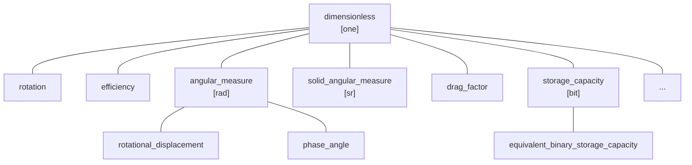

# Dimensionless Quantities

The quantities we discussed so far always had some specific type and physical dimension.
However, this is not always the case. While performing various computations, we sometimes end up with
so-called "dimensionless" quantities, which ISO defines as
[quantities of dimension one](../../appendix/glossary.md#dimensionless-quantity):

!!! quote "ISO/IEC Guide 99"

    - Quantity for which all the exponents of the factors corresponding to the base quantities in
      its quantity dimension are zero.
    - The measurement units and values of quantities of dimension one are numbers, but such quantities
      convey more information than a number.
    - Some quantities of dimension one are defined as the ratios of two quantities of the same kind.
    - Numbers of entities are quantities of dimension one.


## Dividing two quantities of the same kind

Dividing two quantities of the same kind always results in a
[quantity of dimension one](../../appendix/glossary.md#dimensionless-quantity).
However, depending on what type of quantities we divide or what their units are, we may end up
with slightly different results.

!!! note

    In **mp-units**, dividing two quantities of the same dimension always results in a quantity
    with the dimension being `dimension_one`. This is often different for other physical units
    libraries, which may return a raw representation type for such cases. A raw value is also always
    returned from the division of two `std::chrono::duration` objects.

    To read more about the reasoning for this design decision, please check our
    [FAQ](../../getting_started/faq.md#why-a-dimensionless-quantity-is-not-just-a-fundamental-arithmetic-type).


### Dividing quantities of the same type

First, let's analyze what happens if we divide two quantities of the same type:

```cpp
constexpr QuantityOf<dimensionless> auto q = isq::height(200 * m) / isq::height(50 * m);
```

In such a case, we end up with a dimensionless quantity that has the following properties:

```cpp
static_assert(q.quantity_spec == dimensionless);
static_assert(q.dimension == dimension_one);
static_assert(q.unit == one);
```

In case we would like to print its value, we would see a raw value of `4` in the output with no unit
being printed.


### Dividing quantities of different types

Now let's see what happens if we divide quantities of the same dimension and unit but which have
different quantity types:

```cpp
constexpr QuantityOf<dimensionless> auto q = isq::work(200 * J) / isq::heat(50 * J);
```

Again we end up with `dimension_one` and `one`, but this time:

```cpp
static_assert(q.quantity_spec == isq::work / isq::heat);
```

As shown above, the result is not of a `dimensionless` type anymore. Instead, we get a quantity type
derived from the performed [quantity equation](../../appendix/glossary.md#quantity-equation).
According to the [ISQ](../../appendix/glossary.md#isq), _work_ divided by _heat_ is the recipe for
the _thermodynamic efficiency_ quantity, thus:

```cpp
static_assert(implicitly_convertible(q.quantity_spec, isq::efficiency_thermodynamics));
```

!!! note

    The quantity of `isq::efficiency_thermodynamics` is of a kind `dimensionless`, so it is implicitly
    convertible to `dimensionless` and satisfies the `QuantityOf<dimensionless>` concept.


### Dividing quantities of different units

Now, let's see what happens when we divide two quantities of the same type but different units:

```cpp
constexpr QuantityOf<dimensionless> auto q = isq::height(4 * km) / isq::height(2 * m);
```

This time, we still get a quantity of the `dimensionless` type with a `dimension_one` as its dimension.
However, the resulting unit is not `one` anymore:

```cpp
static_assert(q.unit == mag_power<10, 3> * one);
```

In case we would print the text output of this quantity, we would not see a raw value of `2000`,
but `2 km/m`.

First, it may look surprising, but this is consistent with dividing quantities
of different dimensions. For example, if we divide `4 * km / 2 * s`, we do not expect `km` to be
"expanded" to `m` before the division, right? We would expect the result of `2 km/s`, which is
exactly what we get when we divide quantities of the same kind.

This is a compelling feature that allows us to express huge or tiny ratios without the need
for big and expensive representation types. With this, we can easily define things like
a [_Hubble's constant_](https://en.wikipedia.org/wiki/Hubble%27s_law#Dimensionless_Hubble_constant)
that uses a unit that is proportional to the ratio of kilometers per megaparsecs, which are both
units of _length_:

```cpp
inline constexpr struct hubble_constant :
    named_unit<{u8"H₀", "H_0"}, mag_ratio<701, 10> * si::kilo<si::metre> / si::second / si::mega<parsec>> {} hubble_constant;
```


## Counts of things

Another important use case for dimensionless quantities is to provide strong types for counts
of things. For example:

- ISO-80000-3 provides a _rotation_ quantity defined as the number of revolutions,
- IEC-80000-6 provides a _number of turns in a winding_ quantity,
- IEC-80000-13 provides a _Hamming distance_ quantity defined as the number of digit positions
  in which the corresponding digits of two words of the same length are different.

Thanks to assigning strong names to such quantities, later on, they can be explicitly used as
arguments in the [quantity equations](../../appendix/glossary.md#quantity-equation) of other
quantities deriving from them.


## Predefined units of the dimensionless quantity

As we observed above, the most common unit for dimensionless quantities is `one`. It has the
ratio of `1` and does not output any textual symbol.

!!! important "Important: `one` is an identity"

    A unit `one` is special in the entire type system of units as it is considered to be
    [an identity operand in the unit expression templates](interface_introduction.md#identities).
    This means that, for example:

    ```cpp
    static_assert(one * one == one);
    static_assert(one * si::metre == si::metre);
    static_assert(si::metre / si::metre == one);
    ```

    The same is also true for `dimension_one` and `dimensionless` in the domains of dimensions
    and quantity specifications.


Besides the unit `one`, there are a few other scaled units predefined in the library for usage
with dimensionless quantities:

```cpp
inline constexpr struct percent : named_unit<"%", mag_ratio<1, 100> * one> {} percent;
inline constexpr struct per_mille : named_unit<{u8"‰", "%o"}, mag_ratio<1, 1000> * one> {} per_mille;
inline constexpr struct parts_per_million : named_unit<"ppm", mag_ratio<1, 1'000'000> * one> {} parts_per_million;
inline constexpr auto ppm = parts_per_million;
```


## Angular quantities

Special, often controversial, examples of dimensionless quantities are an _angular measure_
and _solid angular measure_ quantities that are defined in the [ISQ](../../appendix/glossary.md#isq)
to be the result of a division of $arc\; length / radius$ and $area / radius^2$ respectively.
Moreover, [ISQ](../../appendix/glossary.md#isq) also explicitly states that both can be
expressed in the unit `one`. This means that both _angular measure_ and _solid angular measure_
should be of a [kind](../../appendix/glossary.md#kind) dimensionless.

On the other hand, [ISQ](../../appendix/glossary.md#isq) also specifies that a unit radian can
be used for _angular measure_, and a unit steradian can be used for _solid angular measure_.
Those should not be mixed or used to express other types of dimensionless quantities. This means
that both _angular measure_ and _solid angular measure_ should also be
[quantity kinds](../../appendix/glossary.md#kind) by themselves.

!!! note

    Many people claim that angle being a dimensionless quantity is a bad idea. There are
    proposals submitted to make an angle a base quantity and `rad` to become a base unit. More on this
    topic can be found in the ["Strong Angular System" chapter](../defining_systems/strong_angular_system.md).


## Nested quantity kinds

Angular quantities are not the only ones with such a "strange" behavior. Another but a similar case
is a _storage capacity_ quantity specified in IEC-80000-13 that again allows expressing it in both
`one` and `bit` units.

Those cases make dimensionless quantities an exceptional tree in the library. This is the only
[quantity hierarchy](../../appendix/glossary.md#quantity-hierarchy) that contains more than one
[quantity kind](../../appendix/glossary.md#kind) in its tree:



To provide such support in the library, we provided an `is_kind` specifier that can be appended
to the quantity specification:

=== "C++23"

    ```cpp
    inline constexpr struct angular_measure : quantity_spec<dimensionless, arc_length / radius, is_kind> {} angular_measure;
    inline constexpr struct solid_angular_measure : quantity_spec<dimensionless, area / pow<2>(radius), is_kind> {} solid_angular_measure;
    inline constexpr struct storage_capacity : quantity_spec<dimensionless, is_kind> {} storage_capacity;
    ```

=== "C++20"

    ```cpp
    inline constexpr struct angular_measure : quantity_spec<angular_measure, dimensionless, arc_length / radius, is_kind> {} angular_measure;
    inline constexpr struct solid_angular_measure : quantity_spec<solid_angular_measure, dimensionless, area / pow<2>(radius), is_kind> {} solid_angular_measure;
    inline constexpr struct storage_capacity : quantity_spec<storage_capacity, dimensionless, is_kind> {} storage_capacity;
    ```

=== "Portable"

    ```cpp
    QUANTITY_SPEC(angular_measure, dimensionless, arc_length / radius, is_kind);
    QUANTITY_SPEC(solid_angular_measure, dimensionless, area / pow<2>(radius), is_kind);
    QUANTITY_SPEC(storage_capacity, dimensionless, is_kind);
    ```

With the above, we can constrain `radian`, `steradian`, and `bit` to be allowed for usage with
specific quantity kinds only:

```cpp
inline constexpr struct radian : named_unit<"rad", metre / metre, kind_of<isq::angular_measure>> {} radian;
inline constexpr struct steradian : named_unit<"sr", square(metre) / square(metre), kind_of<isq::solid_angular_measure>> {} steradian;
inline constexpr struct bit : named_unit<"bit", one, kind_of<storage_capacity>> {} bit;
```

but still allow the usage of `one` and its scaled versions for such quantities.
