# Dimensionless Quantities

The quantities discussed so far always had specific types and physical dimensions.
However, this isn't always the case. Some computations produce "dimensionless" quantities.
ISO defines them as
[quantities of dimension one](../../reference/glossary.md#dimensionless-quantity):

!!! quote "ISO/IEC Guide 99"

    - Quantity for which all the exponents of the factors corresponding to the base quantities in
      its quantity dimension are zero.
    - The measurement units and values of quantities of dimension one are numbers, but such quantities
      convey more information than a number.
    - Some quantities of dimension one are defined as the ratios of two quantities of the same kind.
    - Numbers of entities are quantities of dimension one.


## Dividing two quantities of the same kind

Dividing two quantities of the same kind always results in a
[quantity of dimension one](../../reference/glossary.md#dimensionless-quantity).
However, depending on what type of quantities we divide or what their units are, we may
end up with slightly different results.

!!! note

    In **mp-units**, dividing two quantities of the same dimension always results in a quantity
    with the dimension being `dimension_one`. This is often different for other physical units
    libraries, which may return a raw representation type for such cases. A raw value is also always
    returned from the division of two `std::chrono::duration` objects.

    To read more about the reasoning for this design decision, please check our
    [FAQ](../../getting_started/faq.md#why-a-dimensionless-quantity-is-not-just-a-fundamental-arithmetic-type).


### Dividing quantities of the same type

First, let's analyze what happens if we divide two quantities of the same type:

```cpp
constexpr QuantityOf<dimensionless> auto q = isq::height(200 * m) / isq::height(50 * m);
```

In such a case, we end up with a dimensionless quantity that has the following properties:

```cpp
static_assert(q.quantity_spec == dimensionless);
static_assert(q.dimension == dimension_one);
static_assert(q.unit == one);
```

In case we would like to print its value, we would see a raw value of `4` in the output
with no unit being printed.


### Dividing quantities of different types

Now let's see what happens if we divide quantities of the same dimension and unit but
which have different quantity types:

```cpp
constexpr QuantityOf<dimensionless> auto q = isq::work(200 * J) / isq::heat(50 * J);
```

Again we end up with `dimension_one` and `one`, but this time:

```cpp
static_assert(q.quantity_spec == isq::work / isq::heat);
```

As shown above, the result is not of a `dimensionless` type anymore. Instead, we get a
quantity type derived from the performed [quantity equation](../../reference/glossary.md#quantity-equation).
According to the [ISQ](../../reference/glossary.md#isq), _work_ divided by _heat_ is the recipe
for the _thermodynamic efficiency_ quantity, thus:

```cpp
static_assert(implicitly_convertible(q.quantity_spec, isq::efficiency_thermodynamics));
```

!!! note

    The quantity of `isq::efficiency_thermodynamics` is of a kind `dimensionless`, so it is implicitly
    convertible to `dimensionless` and satisfies the `QuantityOf<dimensionless>` concept.


### Dividing quantities of different units

Now, let's see what happens when we divide two quantities of the same type but different units:

```cpp
constexpr QuantityOf<dimensionless> auto q = isq::height(4 * km) / isq::height(2 * m);
```

This time, we still get a quantity of the `dimensionless` type with a `dimension_one` as its
dimension. However, the resulting unit is not `one` anymore:

```cpp
static_assert(q.unit == mag_power<10, 3> * one);
```

In case we would print the text output of this quantity, we would not see a raw value of `2000`,
but `2 km/m`.

First, it may look surprising, but this is consistent with dividing quantities of different
dimensions. For example, if we divide `4 * km / 2 * s`, we do not expect `km` to be "expanded"
to `m` before the division, right? We would expect the result of `2 km/s`, which is exactly
what we get when we divide quantities of the same kind.

This is a compelling feature that allows us to express huge or tiny ratios without the need
for big and expensive representation types. With this, we can easily define things like a
[_Hubble's constant_](https://en.wikipedia.org/wiki/Hubble%27s_law#Dimensionless_Hubble_constant)
that uses a unit that is proportional to the ratio of kilometers per megaparsecs, which are
both units of _length_:

```cpp
inline constexpr struct hubble_constant final :
    named_unit<{u8"H₀", "H_0"}, mag_ratio<701, 10> * si::kilo<si::metre> / si::second / si::mega<parsec>> {} hubble_constant;
```


## Counts of things

Another important use case for dimensionless quantities is to provide strong types for counts
of things. For example:

- ISO-80000-3 provides a _rotation_ quantity defined as the number of revolutions,
- IEC-80000-6 provides a _number of turns in a winding_ quantity,
- IEC-80000-13 provides a _Hamming distance_ quantity defined as the number of digit positions
  in which the corresponding digits of two words of the same length are different.

Thanks to assigning strong names to such quantities, later on, they can be explicitly used
as arguments in the [quantity equations](../../reference/glossary.md#quantity-equation) of
other quantities deriving from them.


## Predefined units of the dimensionless quantity

As we observed above, the most common unit for dimensionless quantities is `one`. It has the
ratio of `1` and does not output any textual symbol.

!!! important "Important: `one` is an identity"

    A unit `one` is special in the entire type system of units as it is considered to be
    [an identity operand in the unit symbolic expressions](interface_introduction.md#identities).
    This means that, for example:

    ```cpp
    static_assert(one * one == one);
    static_assert(one * si::metre == si::metre);
    static_assert(si::metre / si::metre == one);
    ```

    The same is also true for `dimension_one` and `dimensionless` in the domains of dimensions
    and quantity specifications.


Besides the unit `one`, there are a few other scaled units predefined in the library for usage
with dimensionless quantities:

```cpp
inline constexpr struct percent final : named_unit<"%", mag_ratio<1, 100> * one> {} percent;
inline constexpr struct per_mille final : named_unit<{u8"‰", "%o"}, mag_ratio<1, 1000> * one> {} per_mille;
inline constexpr struct parts_per_million final : named_unit<"ppm", mag_ratio<1, 1'000'000> * one> {} parts_per_million;
inline constexpr auto ppm = parts_per_million;
```

!!! info

    Units defined in terms of `one` will be addable, subtractible, comparable, and
    convertible with `one`. If that is not your intent, you should instead base your
    units on `kind_of<dimensionless>`. This will make each such unit "independent" from
    other units.

### Superpowers of the unit `one`

Quantities implicitly convertible to `dimensionless` with the unit equivalent to `one` are
the only ones that are:

- implicitly constructible from the raw value,
- explicitly convertible to a raw value,
- comparable to a raw value.

```cpp
quantity<one> inc(quantity<one> q) { return q + 1; }
void legacy(double) { /* ... */ }

if (auto q = inc(42); q != 0)
  legacy(static_cast<int>(q));
```

This property also expands to usual arithmetic operators.

!!! note

    Those rules do not apply to all the dimensionless quantities. It would be unsafe and misleading
    to allow such operations on units with a magnitude different than `1` (e.g., `percent`) or
    for quantities that are not implicitly convertible to `dimensionless` (e.g., `angular_measure`).


## Angular quantities

Special, often controversial, examples of dimensionless quantities are an _angular measure_
and _solid angular measure_ quantities that are defined in the [ISQ](../../reference/glossary.md#isq)
to be the result of a division of $arc\; length / radius$ and $area / radius^2$ respectively.
Moreover, [ISQ](../../reference/glossary.md#isq) also explicitly states that both can be
expressed in the unit `one`. This means that both _angular measure_ and _solid angular measure_
should be of a [kind](../../reference/glossary.md#kind) dimensionless.

On the other hand, [ISQ](../../reference/glossary.md#isq) also specifies that a unit radian
can be used for _angular measure_, and a unit steradian can be used for _solid angular measure_.
Those should not be mixed or used to express other types of dimensionless quantities. This
means that both _angular measure_ and _solid angular measure_ should also be
[quantity kinds](../../reference/glossary.md#kind) by themselves.

!!! note

    Many people claim that angle being a dimensionless quantity is a bad idea. There are
    proposals submitted to make an angle a base quantity and `rad` to become a base unit. More on this
    topic can be found in the ["Strong Angular System" chapter](../systems/strong_angular_system.md).

### Radians and degrees support

Thanks to the usage of magnitudes the library provides efficient strong types for all angular
types. This means that with the built-in support for magnitudes of $\pi$ we can provide accurate
conversions between radians and degrees. The library also provides common trigonometric functions
for angular quantities:

```cpp
using namespace mp_units::si::unit_symbols;
using mp_units::angular::unit_symbols::rad;
using mp_units::angular::unit_symbols::deg;
using mp_units::angular::unit_symbols::grad;

quantity speed = 110 * km / h;
quantity rate_of_climb = -0.63657 * m / s;
quantity glide_ratio = speed / -rate_of_climb;
quantity glide_angle = angular::asin(1 / glide_ratio);

std::println("Glide ratio: {::N[.1f]}", glide_ratio.in(one));
std::println("Glide angle:");
std::println(" - {::N[.4f]}", glide_angle.in(rad));
std::println(" - {::N[.2f]}", glide_angle.in(deg));
std::println(" - {::N[.2f]}", glide_angle.in(grad));
```

The above program prints:

```text
Glide ratio: 48.0
Glide angle:
 - 0.0208 rad
 - 1.19°
 - 1.33ᵍ
```

!!! note

    In the production code the above `speed` and `rate_of_climb` quantities should probably be
    modelled as [separate typed quantities of the same kind](systems_of_quantities.md#system-of-quantities-is-not-only-about-kinds).

## Nested quantity kinds

Angular quantities are not the only ones with such a "strange" behavior. Another but
a similar case is a _storage capacity_ quantity specified in IEC-80000-13 that again
allows expressing it in both `one` and `bit` units.

Those cases make dimensionless quantities an exceptional tree in the library. This
[quantity hierarchy](../../reference/glossary.md#quantity-hierarchy) contains more than
one [quantity kind](../../reference/glossary.md#kind) and more than one unit in its tree:

```mermaid
flowchart TD
    dimensionless["<b>dimensionless</b><br>[one]"]
    dimensionless --- rotation["<b>rotation</b>"]
    dimensionless --- thermodynamic_efficiency["<b>thermodynamic_efficiency</b><br><i>(work / heat)</i>"]
    dimensionless --- angular_measure["<b>angular_measure</b>🔒<br><i>(arc_length / radius)</i><br>[rad]"]
    angular_measure --- rotational_displacement["<b>rotational_displacement</b><br><i>(path_length / radius)</i>"]
    angular_measure --- phase_angle["<b>phase_angle</b>"]
    dimensionless --- solid_angular_measure["<b>solid_angular_measure</b>🔒<br><i>(area / radius<sup>2</sup>)</i><br>[sr]"]
    dimensionless --- drag_factor["<b>drag_factor</b><br><i>(drag_force / (mass_density * speed<sup>2</sup> * area))</i>"]
    dimensionless --- storage_capacity["<b>storage_capacity</b>🔒<br>[bit]"] --- equivalent_binary_storage_capacity["<b>equivalent_binary_storage_capacity</b>"]
    dimensionless --- ...
```



To provide such support in the library, we use the `is_kind` specifier in the quantity
specification. This feature is not limited to dimensionless quantities—it can be used
with any dimension to create distinct quantity kinds. For a comprehensive explanation
of `is_kind` and how to use it with dimensional quantities, see
[Creating distinct quantity kinds with `is_kind`](systems_of_quantities.md#creating-distinct-quantity-kinds-with-is_kind).

For dimensionless quantities specifically, the `is_kind` specifier is applied as follows:

=== "C++23"

    ```cpp
    inline constexpr struct angular_measure final : quantity_spec<dimensionless, arc_length / radius, is_kind> {} angular_measure;
    inline constexpr struct solid_angular_measure final : quantity_spec<dimensionless, area / pow<2>(radius), is_kind> {} solid_angular_measure;
    inline constexpr struct storage_capacity final : quantity_spec<dimensionless, is_kind> {} storage_capacity;
    ```

=== "C++20"

    ```cpp
    inline constexpr struct angular_measure final : quantity_spec<angular_measure, dimensionless, arc_length / radius, is_kind> {} angular_measure;
    inline constexpr struct solid_angular_measure final : quantity_spec<solid_angular_measure, dimensionless, area / pow<2>(radius), is_kind> {} solid_angular_measure;
    inline constexpr struct storage_capacity final : quantity_spec<storage_capacity, dimensionless, is_kind> {} storage_capacity;
    ```

=== "Portable"

    ```cpp
    QUANTITY_SPEC(angular_measure, dimensionless, arc_length / radius, is_kind);
    QUANTITY_SPEC(solid_angular_measure, dimensionless, area / pow<2>(radius), is_kind);
    QUANTITY_SPEC(storage_capacity, dimensionless, is_kind);
    ```

With the above, we can constrain `radian`, `steradian`, and `bit` to be allowed for usage with
specific quantity kinds only:

```cpp
inline constexpr struct radian final : named_unit<"rad", metre / metre, kind_of<isq::angular_measure>> {} radian;
inline constexpr struct steradian final : named_unit<"sr", square(metre) / square(metre), kind_of<isq::solid_angular_measure>> {} steradian;
inline constexpr struct bit final : named_unit<"bit", one, kind_of<storage_capacity>> {} bit;
```

but still allow the usage of `one` and its scaled versions for such quantities.

!!! info

    It is worth mentioning here that converting up the hierarchy beyond a subkind requires an
    explicit conversion. For example:

    ```cpp
    static_assert(implicitly_convertible(isq::rotation, dimensionless));
    static_assert(!implicitly_convertible(isq::angular_measure, dimensionless));
    static_assert(explicitly_convertible(isq::angular_measure, dimensionless));
    ```

    This increases type safety and prevents accidental quantities with invalid units. For example,
    a result of a conversion from `isq::angular_measure[rad]` to `dimensionless` would be
    a reference of `dimensionless[rad]`, which contains an incorrect unit for a `dimensionless`
    quantity. Such a conversion must be explicit and be preceded by an explicit unit conversion:

    ```cpp
    quantity q1 = isq::angular_measure(42. * rad);
    quantity<dimensionless[one]> q2 = dimensionless(q1.in(one));
    ```


## Using dimensionless quantities as strongly-typed numeric types

For decades, the C++ community has sought ways to create strongly-typed wrappers for fundamental
types to prevent bugs that arise from accidentally mixing semantically different values. Consider
functions like `process(10, 20)` or `draw_point(x, y)`—when parameters have the same underlying
type (`int`, `double`), it's easy to swap them accidentally, leading to subtle bugs that compilers
cannot detect.

The C++ standard library provides no built-in support for creating such strong types. However,
several third-party libraries like [NamedType](https://github.com/joboccara/NamedType),
[type_safe](https://github.com/foonathan/type_safe), and
[PSsst](https://github.com/PeterSommerlad/PSsst) have emerged to fill this gap, providing
generic solutions for creating distinct types from primitives. These approaches typically
require manual definition of operators for each type or explicit opt-in for each
operation, and they don't inherently understand derived quantities or dimensional analysis.

**mp-units** offers a unique approach: leverage dimensionless quantities to create
strongly-typed numeric types that benefit from the library's built-in dimensional analysis
infrastructure. This isn't about physical dimensions or scaling by units factors—it's about
using the framework's type system to prevent mixing semantically different counts,
coordinates, or identifiers while maintaining zero-overhead and natural arithmetic
semantics.


### Type safety vs convenience trade-offs

#### Implicit construction: The convenience-first approach

The [Superpowers of the unit `one`](#superpowers-of-the-unit-one) described before
provide a convenient way to work with dimensionless quantities. Quantities implicitly
convertible to `dimensionless` with unit `one` can be implicitly constructed from raw values,
explicitly converted back to raw values, and compared with raw values. This makes them easy
to use with existing code and APIs.

This convenience comes at a cost: **such syntax behaves a bit like raw `int` or `double`
values when it comes to type safety**.

Consider the following example:

```cpp
inline constexpr struct item_count final : quantity_spec<dimensionless> {} item_count;
inline constexpr struct widget_count final : quantity_spec<dimensionless> {} widget_count;

void process(quantity<item_count[one]> items, quantity<widget_count[one]> widgets)
{
  /* ... */
}

process(10, 20);                       // Which is items? Which is widgets? Unclear!
process(10 * one, 20 * one);           // Which is items? Which is widgets? Unclear!

// With explicit types, the compiler checks the order
quantity<item_count[one]> items = 10;
quantity<widget_count[one]> widgets = 20;
process(items, widgets);    // OK
// process(widgets, items); // Compile-time error!
```

When you already have typed quantities, the compiler **does** enforce the correct order—swapping
them produces a compile error. However, the real problem is calling the function with raw
values like `process(10, 20)` where there's no indication which parameter is which.
This is better than raw `int` or `double` (at least functions can document their types),
but it's still unclear at the call site when using literal values.

Another drawback of such a hierarchy is that these types model `dimensionless` tagged
numbers which means they can be mixed in arithmetic operations and comparisons:

```cpp
quantity<item_count[one]> items = 10;
quantity<widget_count[one]> widgets = 20;

// These compile but may be semantically incorrect:
quantity total = items + widgets;    // Compiles! Both convert to dimensionless
if (items < widgets) {               // Compiles! Comparison through dimensionless
  // ...
}
```

While the compiler allows these operations, they may not make semantic sense—adding items
and widgets together, or comparing them directly, is likely a logic error in most domains.


#### Explicit construction with `is_kind`: Maximum type safety

To address the type safety concerns shown above, **mp-units** offers the `is_kind` specifier.
When you mark a quantity with `is_kind`, it becomes a distinct quantity kind that cannot be
implicitly mixed with other kinds (even with the parent kind). Such sub-kinds inherit
properties of the parent kind (dimension, character, unit, etc.). This also disables
the implicit conversion from raw values because those are now more than just tagged numbers.
They have strong semantical meaning and the library should respect that.

This however, creates an important trade-off:

=== "Without `is_kind` (implicit conversion)"

    ```cpp
    inline constexpr struct item_count final : quantity_spec<dimensionless> {} item_count;
    inline constexpr struct widget_count final : quantity_spec<dimensionless> {} widget_count;

    void process(quantity<item_count[one]> items, quantity<widget_count[one]> widgets)
    {
      /* ... */
    }

    // Can call with raw values - convenient but unclear
    process(10, 20);             // ⚠️ Which parameter is which? No way to tell!

    // With typed quantities, the compiler does enforce order
    quantity<item_count[one]> items = 10;
    quantity<widget_count[one]> widgets = 20;
    process(items, widgets);     // ✅ OK - correct order
    process(widgets, items);     // ❌ Compile error! Good.

    // Another problem: can mix semantically different types in arithmetic
    auto total = items + widgets;  // ⚠️ Compiles! Both convert to dimensionless
    if (items < widgets) {         // ⚠️ Compiles! Comparison through dimensionless
      // ...
    }
    ```

    **Pros**: Convenient—works with raw values, typed quantities enforce correct parameter order

    ```cpp
    void draw_rect(quantity<pixel_x[one]> x, quantity<pixel_y[one]> y,
                   quantity<pixel_x[one]> width, quantity<pixel_y[one]> height)
    {
      // ...
    }

    // All arguments may be passed as raw numbers (when we are sure what we are doing)
    draw_rect(10, 20, 100, 50);
    ```

    **Cons**: Using raw values at call sites lacks clarity; can mix different dimensionless
    types in arithmetic and comparisons because they share common `dimensionless` root

=== "With `is_kind` (explicit construction)"

    ```cpp
    inline constexpr struct item_count final : quantity_spec<dimensionless, is_kind> {} item_count;
    inline constexpr struct widget_count final : quantity_spec<dimensionless, is_kind> {} widget_count;

    void process(quantity<item_count[one]> items, quantity<widget_count[one]> widgets)
    {
      /* ... */
    }

    // Cannot call with raw values - must be explicit
    process(10, 20);             // ❌ Compile error! Good.

    // Must use typed quantities, and order is enforced
    quantity<item_count[one]> items(10);
    quantity<widget_count[one]> widgets(20);
    process(items, widgets);     // ✅ OK - correct order
    process(widgets, items);     // ❌ Compile error! Good.

    // Arithmetic operations also enforce type safety
    auto mixed = items + widgets;  // ❌ Compile error! Good.
    if (items < widgets) {         // ❌ Compile error! Good.
      // ...
    }
    ```

    **Pros**: Maximum type safety—distinct types cannot be accidentally mixed or reordered

    **Cons**: Less convenient—requires explicit construction everywhere, especially verbose
    for functions with multiple parameters:

    ```cpp
    void draw_rect(quantity<pixel_x[one]> x, quantity<pixel_y[one]> y,
                   quantity<pixel_x[one]> width, quantity<pixel_y[one]> height)
    {
      // ...
    }

    // All parameters need explicit construction
    draw_rect(quantity<pixel_x[one]>{10}, quantity<pixel_y[one]>{20},
              quantity<pixel_x[one]>{100}, quantity<pixel_y[one]>{50});
    // or to use quantity_spec as a quantity creation helper
    draw_rect(pixel_x(10), pixel_y(20), pixel_x(100), pixel_y(50));
    ```

**Choosing the right approach:**

- **Use `is_kind`** when type safety is paramount and you want to prevent any accidental mixing
  of semantically different counts or coordinates. Accept the verbosity of explicit construction.

- **Skip `is_kind`** for convenience when the types rarely interact and the risk of mixing them
  is low, or when you need to frequently pass raw values to functions.


### Comparison with traditional strong-type approaches

Traditional approaches to creating strong numeric types each face different trade-offs:

=== "Type aliases (unsafe)"

    ```cpp
    using PixelX = int;
    using PixelY = int;
    using PixelArea = int;

    void draw_point(PixelX x, PixelY y) { /* ... */ }

    PixelArea calculate_area(PixelX width, PixelY height)
    {
      return width * height;
    }

    PixelX x = 100;
    PixelY y = 200;
    draw_point(x, y);   // ✅ Good!
    draw_point(y, x);   // ⚠️ Compiles! Wrong order.

    // Can mix with unrelated types
    int random = 42;
    draw_point(random, random);  // ⚠️ Compiles!

    PixelX width = 1920;
    PixelY height = 1080;
    PixelArea area = calculate_area(width, height);      // ✅ Good!
    PixelArea bad_area = calculate_area(height, width);  // ⚠️ Compiles! Wrong order.

    std::cout << "Area: " << area << " = " << area / 2073600.0 << " FHD = " << area / 8294400.0 << " 4K\n";
    ```

    **Problem**: No type safety—all errors compile. Manual scaling requires magic numbers.

=== "Wrapper classes (verbose)"

    ```cpp
    struct PixelX { int value; };
    struct PixelY { int value; };
    struct PixelArea { int value; };

    void draw_point(PixelX x, PixelY y) { /* ... */ }

    PixelArea calculate_area(PixelX width, PixelY height)
    {
      return PixelArea{width.value * height.value};  // Manual unwrap & wrap
    }

    PixelX x{100};
    PixelY y{200};
    draw_point(x, y);   // ✅ Good!
    draw_point(y, x);   // ❌ Compile error! Good.

    PixelX width{1920};
    PixelY height{1080};
    PixelArea area = calculate_area(width, height);      // ✅ Good!
    PixelArea bad_area = calculate_area(height, width);  // ❌ Compile error! Good.
    // But: no help with derived quantities - must manually manage relationships
    // Need PixelArea / PixelX = PixelY? Define more operators manually!

    std::cout << "Area: " << area.value << " = " << area.value / 2073600.0 << " FHD = " << area.value / 8294400.0 << " 4K\n";
    ```

    **Problem**: Type safety requires boilerplate. No dimensional analysis or derived quantities.

=== "Generic libraries (NamedType, type_safe, PSsst)"

    ```cpp
    using PixelX = fluent::NamedType<int, struct PixelXTag, fluent::Addable>;
    using PixelY = fluent::NamedType<int, struct PixelYTag, fluent::Addable>;
    using PixelArea = fluent::NamedType<int, struct PixelAreaTag, fluent::Addable>;

    void draw_point(PixelX x, PixelY y) { /* ... */ }

    PixelArea calculate_area(PixelX width, PixelY height)
    {
      return PixelArea{width.get() * height.get()};  // Manual unwrap & wrap
    }

    PixelX x{100};
    PixelY y{200};
    draw_point(x, y);   // ✅ Good!
    draw_point(y, x);   // ❌ Compile error! Good.

    PixelX width{1920};
    PixelY height{1080};
    PixelArea area = calculate_area(width, height);      // ✅ Good!
    PixelArea bad_area = calculate_area(height, width);  // ❌ Compile error! Good.
    // But: no automatic understanding that PixelX × PixelY → PixelArea

    std::cout << "Area: " << area.get() << " = " << area.get() / 2073600.0 << " FHD = " << area.get() / 8294400.0 << " 4K\n";
    ```

    **Problem**: Strong types but no dimensional analysis. Must manually extract, compute, and wrap.

    Examples: [NamedType](https://github.com/joboccara/NamedType),
    [type_safe](https://github.com/foonathan/type_safe),
    [PSsst](https://github.com/PeterSommerlad/PSsst)

=== "mp-units (specialized for numeric types)"

    ```cpp
    inline constexpr struct pixel_x final : quantity_spec<dimensionless, is_kind> {} pixel_x;
    inline constexpr struct pixel_y final : quantity_spec<dimensionless, is_kind> {} pixel_y;
    inline constexpr struct pixel_area final : quantity_spec<dimensionless, pixel_x * pixel_y, is_kind> {} pixel_area;

    inline constexpr struct fhd final : named_unit<"FHD", mag<1920 * 1080> * one, kind_of<pixel_area>> {} fhd;
    inline constexpr struct uhd_4k final : named_unit<"4K", mag<3840 * 2160> * one, kind_of<pixel_area>> {} uhd_4k;

    void draw_point(quantity<pixel_x[one], int> x>, quantity<pixel_y[one], int> y>) { /* ... */ }

    quantity<pixel_area[one], int> calculate_area(quantity<pixel_x[one], int> width,
                                                  quantity<pixel_y[one], int> height)
    {
      return width * height;
    }

    quantity x = pixel_x(100);
    quantity y = pixel_y(200);
    draw_point(x, y);   // ✅ Good!
    draw_point(y, x);   // ❌ Compile error! Good.

    quantity width = pixel_x(1920);
    quantity height = pixel_y(1080);
    quantity area = calculate_area(width, height);      // ✅ Good!
    quantity bad_area = calculate_area(height, width);  // ❌ Compile error! Good.

    std::cout << "Area: " << area << " = " << area.in<double>(fhd) << " = " << area.in<double>(uhd_4k) << '\n';
    ```

    **Advantages**: Type safety + dimensional analysis + automatic derived quantities.
    Custom units with automatic conversions. Zero overhead, minimal boilerplate.

**Key comparison:**

| Feature              | Type Alias | Wrapper Class | Generic Library | **mp-units dimensionless** |
|----------------------|------------|---------------|-----------------|----------------------------|
| Type safety          | ❌          | ✅             | ✅               | ✅                          |
| Zero overhead        | ✅          | ✅             | ✅               | ✅                          |
| Arithmetic operators | ✅          | Manual        | Manual          | ✅                          |
| Derived quantities   | ❌          | Manual        | ❌               | ✅                          |
| Dimensional analysis | ❌          | Manual        | ❌               | ✅                          |
| Unit conversions     | ❌          | Manual        | ❌               | ✅                          |
| Boilerplate per type | Minimal    | High          | Medium          | Minimal                    |

**mp-units** specializes in numeric types, enabling automatic arithmetic and dimensional
analysis that generic strong-type libraries cannot provide.


### Why dimensionless instead of custom dimensions?

Dimensionless quantities with `is_kind` automatically work with unit `one` and its scaled
versions, support explicit conversions to/from raw types, and participate in ISQ for
derived quantities. Custom dimensions are better for physically distinct concepts
(see [Workshop: Custom Base Dimensions](../../workshops/extensions/custom_base_dimensions.md)).

For a comprehensive example of using dimensionless quantities as strongly-typed numeric types,
see [Workshop: Strongly-Typed Counts](../../workshops/advanced/strongly_typed_counts.md).
