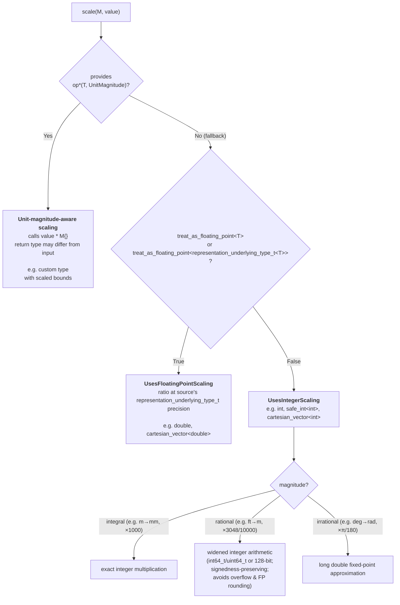

# Representation Types

Every quantity in **mp-units** has a **representation type** that stores the numerical value.
While the library works seamlessly with fundamental arithmetic types (except `bool`) and
`std::complex`, you can also use custom representation types to model domain-specific
requirements—such as range-validated values, vectors, or specialized numeric types.

The representation type determines what kind of mathematical operations are available and
how the quantity behaves in calculations. To ensure type safety, the library verifies that
your representation type has the capabilities required for the quantity's
[character](character_of_a_quantity.md).


## Representation Requirements

To be used as a representation type in **mp-units**, a type must satisfy the
[`RepresentationOf`](concepts.md#RepresentationOf) concept. The library supports different
types of representations corresponding to different quantity characters.

**Why verify representation capabilities?** The same unit can represent fundamentally different
physical concepts requiring different mathematical operations. For example:

- _speed_ (scalar, magnitude only) vs. _velocity_ (vector, magnitude and direction) both
  use m/s,
- _mass_ (scalar) uses kg while _weight force_ (vector, pointing downward) uses N.

The library tracks **character in the quantity specification** (what the quantity represents)
and verifies that your **representation type provides the required capabilities** (can it
handle the operations?). This dual approach provides **compile-time type safety** for the
mathematical nature of physical quantities—preventing, for example, using a scalar type where
vector operations like cross product are needed.

The requirements split along the two independent axes of a quantity's
[character](character_of_a_quantity.md): the **field** (real or complex) and the **order**
(scalar, vector, or tensor). A representation type must satisfy a common baseline, then the
requirements of its field and of its order.

### Common baseline (every representation type)

Independent of character, a representation type must be:

- **copyable** (`std::copyable`) and **equality comparable** (`==`),
- support **addition and subtraction** (`+`, `-`, unary `-`),
- **[`UnitMagnitudeScalable`](#how-scaling-works)**, so the library can apply a unit magnitude
  ratio to it during unit conversion,
- **not opted out** through [`disable_representation<T>`](#disable_representation) (a quantity
  or [quantity-like](concepts.md#QuantityLike) type, a container of either, and `bool` are
  opted out by default).

On top of that baseline, the type's two character axes each add their own requirements. The
field is reported by [`numeric_field<T>`](#numeric_field) and the order by
[`tensor_order<T>`](#tensor_order).

### Order axis — [`tensor_order<T>`](#tensor_order)

The orders are ranked: a lower-order representation also fills a higher-order slot, so
a scalar backs a vector or tensor quantity and a vector backs a tensor quantity. Override
the detected order by specializing `tensor_order<T>`.

| Requirement                                                                 |               Scalar (0)                |              Vector (1)               |              Tensor (2)               |
|-----------------------------------------------------------------------------|:---------------------------------------:|:-------------------------------------:|:-------------------------------------:|
| Element access (drives default `tensor_order` detection)                    |                    -                    |                `t[i]`                 |        `t(i, j)` or `t[i, j]`         |
| Self-scalable (`T * T`, `T / T`)                                            |                    ✅                    |                   -                   |                   -                   |
| [`mp_units::magnitude()`](#character-determination) CPO (`norm()` fallback) |                    -                    |                   ✅                   |                   ✅                   |
| Examples                                                                    | `int`, `double`, `std::complex<double>` | `cartesian_vector`, `Eigen::Vector3d` | `cartesian_tensor`, `Eigen::Matrix3d` |

### Field axis — [`numeric_field<T>`](#numeric_field)

The field is matched exactly: a real quantity needs a real representation and a complex one
a complex representation. It is reported by [`numeric_field<T>`](#numeric_field) of the
representation type itself, never by inspecting a vector's or tensor's elements. The
requirements below are what a *scalar* representation provides for each field.
Override the detected field by specializing `numeric_field<T>`.

| Requirement (on a scalar representation)                           |                    Real                     |                             Complex                              |
|--------------------------------------------------------------------|:-------------------------------------------:|:----------------------------------------------------------------:|
| Totally ordered (`<`, `>`, `<=`, `>=`)                             |                      ✅                      |                                -                                 |
| Construction from parts (`T{real, imag}`)                          |                      -                      |                                ✅                                 |
| `mp_units::real()`, `mp_units::imag()`, `mp_units::modulus()` CPOs |                      -                      |                                ✅                                 |
| Examples                                                           | `int`, `double`, `cartesian_vector<double>` | `std::complex<double>`, `cartesian_vector<std::complex<double>>` |

??? note "Weakly Regular Types"

    All representation types must be **weakly regular**, which means they satisfy the
    `std::regular` concept except for the default-constructibility requirement. Specifically,
    they must be:

    - **Copyable** (`std::copyable`)
    - **Equality comparable** (`std::equality_comparable`)

    This ensures that representation types have value semantics suitable for use in quantities.
    Default construction is not required, allowing types like range-validated representations
    that may not have a meaningful default value.

??? note "Constructing Complex Scalars"

    Complex scalars **must** be constructible from real and imaginary parts: `T{real_value, imag_value}`.
    This requirement is essential for operations that combine real-valued quantities into complex results.
    For example, combining _active power_ and _reactive power_ into _complex power_:

    ```cpp
    quantity active = isq::active_power(100.0 * W);
    quantity reactive = isq::reactive_power(50.0 * W);
    // Library needs to construct: std::complex<double>{active.numerical_value(), reactive.numerical_value()}
    ```

??? note "Why Different CPO Names?"

    **Complex scalars use `modulus()`, Vectors and Tensors use `magnitude()`**

    While mathematically related, these represent different domain conventions:

    - **`modulus()`**: Traditional complex analysis terminology for the magnitude of a complex number;
      the library CPO for complex scalar types
    - **`magnitude()`**: Physics education terminology for the magnitude of a vector;
      the library CPO for vector types

    To integrate zero-friction with linear algebra libraries (Eigen, NumPy, MATLAB, Armadillo) that
    conventionally name this operation `norm()`, the `magnitude()` CPO also recognizes `norm()` as a
    fallback for genuine vector types (i.e. types that are neither real nor complex scalars). This means
    existing types with a `norm()` member or free function work without any adaptation.

??? note "Arithmetic Types Satisfy Multiple Characters"

    **Scalars work as 1D vectors and scalar tensor measures**

    Arithmetic types like `int` and `double` satisfy requirements for:

    - Real scalar character (primary use)
    - Vector character (representing 1-dimensional vectors)
    - Tensor character (representing scalar measures like von Mises stress, principal stress)

    This is intentional and extremely common in engineering practice:

    ```cpp
    // All valid uses of double:
    quantity m = isq::mass(5.0 * kg);           // Scalar
    quantity v = isq::velocity(10.0 * m/s);     // 1D vector
    quantity sigma = isq::stress(100.0 * Pa);   // Scalar tensor measure
    ```

    The type safety comes from **`quantity_character`** matching in the quantity specification,
    not from mutually exclusive representation concepts. The `RepresentationOf` concept ensures
    your representation type has the capabilities needed for the quantity's character.

    The same rank-ordering applies to a complex scalar (such as `std::complex`): it is a valid
    1-dimensional *complex* vector, and its magnitude is the modulus `|z|` of its single component,
    symmetric with `double` standing in as a real 1-D vector above.

    **Engineering practice with tensors:**

    For the full second-order tensor, the library provides the built-in `cartesian_tensor` (a fixed
    3×3 representation). Most engineering, however, does not work with full 3×3 matrices. Instead,
    scalar measures are extracted from the tensor field and used for analysis:

    - **_Von Mises stress_**: Single scalar derived from _stress tensor_ (used for failure prediction)
    - **_Principal stresses_**: Three eigenvalues from _stress tensor_
    - **_Shear stress_ components**: Individual tensor elements
    - **_Hydrostatic stress_**: Average of diagonal elements

    This is why arithmetic types remain useful for tensor quantities. They represent these scalar
    measures commonly used in finite element analysis, structural engineering, and materials science,
    without paying for a full matrix. The rank-ordering also lets a `cartesian_vector` stand in for a
    tensor quantity, since a vector is a tensor of the first order.


## Customization Points

The library provides several customization mechanisms for representation types.
For a complete implementation guide and code examples for custom types, see
[Using Custom Representation Types](../../how_to_guides/integration/using_custom_representation_types.md).

These mechanisms fall into two categories: **Character determination** (what kind of
representation type you have) and **Behavior and values** (how the library interacts with
your type).

!!! note

    Every customization point in this section is keyed on the **representation type**. One further
    customization point, `vector_components`, is keyed on the **quantity spec** instead: it opts a
    vector quantity into [decomposition into named components](#decomposing-a-vector-quantity).
    Because it parameterizes on the quantity rather than its representation, it is documented in
    [its own section below](#decomposing-a-vector-quantity) rather than listed here.

### Character Determination

#### Customization Point Objects (CPOs)

The library uses several CPOs to support different representation types. Providing these CPOs
determines the **character** of your representation type. Each CPO checks for implementations
in the following priority order:

**`mp_units::real(c)`** - Returns the real part of a complex number:

1. `c.real()` member function
2. `real(c)` free function found via ADL

**`mp_units::imag(c)`** - Returns the imaginary part of a complex number:

1. `c.imag()` member function
2. `imag(c)` free function found via ADL

**`mp_units::modulus(c)`** - Returns the magnitude of a complex number:

1. `c.modulus()` member function
2. `modulus(c)` free function found via ADL
3. `c.abs()` member function
4. `abs(c)` free function found via ADL

**`mp_units::magnitude(v)`** - Returns the magnitude (norm) of a vector or tensor as a scalar:

1. `v.magnitude()` member function
2. `magnitude(v)` free function found via ADL
3. For non-scalar types: `v.norm()` member function
4. For non-scalar types: `norm(v)` free function found via ADL
5. For arithmetic types: `std::abs(v)`
6. For complex scalar types: `modulus(v)`
7. For real scalar types: `v.abs()` member function
8. For real scalar types: `abs(v)` free function found via ADL

!!! info "Why `norm()` and `abs()` are also checked?"

    **Vectors and Tensors: `norm()` fallback**

    Linear algebra libraries (Eigen, NumPy, MATLAB, Armadillo) conventionally name the
    Euclidean norm `norm()`. Recognizing `norm()` as a fallback (steps 3–4) means existing
    vector types integrate without any adaptation. The fallback is guarded to non-scalar
    types (neither real nor complex scalars) for two reasons: `std::norm(double)` (from
    `<complex>`) returns `x²`, not `|x|`; and `std::norm(complex)` returns `|z|²`, not
    `|z|`. Both would produce silently wrong magnitudes if `norm()` were called on scalar
    types. If `norm` were ever promoted to a proper CPO, this guarding would make its
    semantics unambiguous.

    **Vectors and Tensors: `abs()` fallback for arithmetic types**

    Allows real scalar types (like `int`, `double`) to represent:

    - **1-dimensional vectors** (very common in engineering for linear motion)
    - **Scalar tensor measures** (von Mises stress, principal stress, etc.)

    This enables seamless use of arithmetic types for scalar, vector, AND tensor quantities,
    which accurately reflects real engineering practice where most calculations use scalar
    values rather than full vector/tensor representations.

    **Complex scalars as 1-D complex vectors: `modulus()` (step 6)**

    Symmetrically, a complex scalar (such as `std::complex`) stands in for a 1-dimensional
    *complex* vector, whose magnitude is the modulus `|z|` of its single component. So the
    `magnitude()` CPO routes a complex scalar through `modulus()`, mirroring the arithmetic
    `abs()` case above.

    **Complex Scalars: `abs()` fallback**

    Provides compatibility with `std::complex` and similar types that use `abs()` as the
    function name for returning the modulus value. This is checked as a fallback if
    `modulus()` is not provided.

---

#### `disable_representation<T>` { #disable_representation }

A specializable variable template to opt a type out of being a quantity representation, regardless
of character:

```cpp
template<typename T>
constexpr bool mp_units::disable_representation = /* true if T is, or its elements are, a quantity or quantity-like type */;
```

**Purpose:** Bars `T` from satisfying any of the representation concepts, even when it
structurally looks like a valid scalar, vector, or tensor. This is the single,
character-agnostic escape hatch: the field and order are answered by the `numeric_field` and
`tensor_order` traits, and this trait answers the orthogonal question "should `T` be a
representation at all?".

**Default:** A type is opted out when it is, or its elements are, a quantity or a
[quantity-like](concepts.md#QuantityLike) type. So a bare `quantity`, a `std::chrono::duration`,
and a container of either are all rejected. The library also opts out `bool`,
which is totally ordered and supports arithmetic yet is not a meaningful representation.

**When to specialize:** When a type accidentally satisfies a representation concept but must
never store a quantity:

```cpp
template<>
constexpr bool mp_units::disable_representation<my_type> = true;
```

---

#### `numeric_field<T>` { #numeric_field }

A specializable variable template that reports the **field** of a representation type,
real or complex. It is the single source of truth for the field axis:

```cpp
template<typename T>
constexpr quantity_field mp_units::numeric_field =
  /* complex if the mp_units::real()/imag() CPOs are valid for T, real otherwise */;
```

**Default:** A type is complex exactly when it satisfies the `mp_units::real()` and
`mp_units::imag()` CPOs (by providing them as member or ADL free functions), and real
otherwise. This is why `std::complex<double>` is treated as a complex scalar and `double`
as a real one, with no extra wiring.

**When to specialize:** When a type's API does not follow the "expose `real()`/`imag()`
if and only if complex" convention. The prominent example is a linear algebra library.
Eigen and Blaze expose `real()` and `imag()` on their **real** matrices and vectors
(a real value is a degenerate complex one), so the default would misread a real Eigen
matrix as complex. The integration adapter declares the field from the element type instead:

```cpp
template<typename T>
  requires /* T is an Eigen type */
constexpr quantity_field mp_units::numeric_field<T> = numeric_field<typename T::Scalar>;
```

Field matching is **exact**: a real quantity requires a real representation and a complex
quantity a complex one. A `double` does not satisfy a complex slot, and a
`std::complex<double>` does not satisfy a real one. This prevents silently dropping the
imaginary part when a complex value is assigned where a real one is expected.

---

#### `tensor_order<T>` { #tensor_order }

A specializable variable template that reports the intrinsic **order** of a representation
type: `0` for a scalar, `1` for a vector, `2` for a second-order tensor.

```cpp
template<typename T>
constexpr std::size_t mp_units::tensor_order = /* detected from the type's structure */;
```

**Default:** The order is detected structurally from the type's element access. Two-index
access (the call operator `t(i, j)` or the C++23 multidimensional subscript `t[i, j]`) is
order `2`, one-index access (`t[i]`) is order `1`, and anything else is order `0`.

**When to specialize:** When the structural default reads the wrong order. The prominent
example is again Eigen. An Eigen column vector is an `N×1` matrix, so it exposes a two-index
`operator()(i, j)` that would otherwise make it look like an order-2 tensor. The adapter
reads Eigen's compile-time shape instead:

```cpp
template<typename T>
  requires /* T is an Eigen type */
constexpr std::size_t mp_units::tensor_order<T> =
  (T::RowsAtCompileTime == 1 || T::ColsAtCompileTime == 1) ? 1 : 2;
```

Order matching is **rank-ordered**: a representation fills a slot of equal or higher order.
A scalar can back a vector or a tensor quantity (very common in engineering, where `double`
models a one-dimensional vector or a scalar tensor measure), and a `cartesian_vector` can
back a tensor quantity. The reverse never holds, so a `cartesian_tensor` (order `2`) does
not satisfy a vector or scalar quantity.

---

### Behavior and Values

#### `representation_underlying_type<T>` { #representation_underlying_type }

A specializable class template that describes the underlying arithmetic/element type of
a representation type. It is **the** extension point for exposing this information to
the library, and is used for:

- Determining the scaling factor type (what type to multiply/divide your type by)
- Checking if the type should be treated as floating-point

```cpp
template<typename T>
struct mp_units::representation_underlying_type;  // primary — empty

template<typename T>
using mp_units::representation_underlying_type_t = representation_underlying_type<T>::type;
```

**Default detection** (via partial specializations provided by the library, mirroring
the shape of `std::indirectly_readable_traits` for its `value_type` / `element_type`
cases):

- nested `T::value_type`, else
- nested `T::element_type`;
- a top-level `const` on `T` is passed through to the unqualified type;
- the detected alias has its cv-qualification removed;
- if `T` provides both `value_type` and `element_type` whose underlying types differ
  after ignoring top-level cv-qualification, the trait is empty — the user must
  disambiguate explicitly;
- for scoped enumeration types, the underlying integer type is used (via
  `std::underlying_type_t`) — a representation-model extension not present in the
  standard's iterator-oriented trait. Unscoped enumerations are deliberately excluded
  because they already implicitly convert to their underlying type.

**For your own types:** provide a `value_type` member type so the library detects the
underlying type automatically:

```cpp
template<typename T>
class my_wrapper {
public:
  using value_type = T;  // Exposes the underlying type
  // ...
};
```

**For third-party types** you cannot modify, specialize the trait directly:

```cpp
// Third-party type MyFloat wraps long double internally
template<>
struct mp_units::representation_underlying_type<MyFloat> {
  using type = long double;
};
```

This makes `representation_underlying_type_t<MyFloat>` resolve to `long double`, giving
the library the correct precision for scaling and ensuring the right `common_type` is
used in mixed conversions.

!!! warning "Don't provide both `value_type` and `element_type`"

    If your type provides both `value_type` and `element_type` whose underlying
    types differ after ignoring top-level cv-qualification, the trait is empty and
    the library treats the type as a leaf. If both are present and name the same
    underlying type, that type is used.

    **Recommendation:** Provide only `value_type` unless you have a specific reason to provide both
    (e.g., satisfying iterator concepts), in which case ensure they refer to the same type.

!!! question "Why not `std::indirectly_readable_traits`?"

    `std::indirectly_readable_traits` answers "what does `*t` yield?" — it is the
    standard's extension point for iterators, smart pointers, and other
    indirectly-readable types. Specializing it for a non-iterator representation
    type is a semantic misuse: it tells every other standard-library component
    that your type is iterator-like, which it usually is not.

    Pointer and array specializations from `std::indirectly_readable_traits` are
    intentionally **not** mirrored in `representation_underlying_type` — those are
    part of the standard's iterator machinery, not of this library's representation
    model.

---

#### `representation_canonical_type<T>` { #representation_canonical_type }

A specializable class template that maps a representation **value type** to the
concrete type a `quantity` should *store*. The primary template simply decays the type:

```cpp
template<typename T>
struct mp_units::representation_canonical_type {
  using type = std::remove_cvref_t<T>;
};

template<typename T>
using mp_units::representation_canonical_type_t = /* ... decays a top-level const ... */;
```

**Why it exists:** expression-template linear algebra libraries (e.g. Eigen, Blaze)
return lazy proxy types from their arithmetic operators. Such a proxy keeps references
to its operands and must be evaluated to a concrete type before being stored inside a
`quantity`; otherwise the `quantity` would retain dangling references once the operands
(often temporaries) go out of scope. The `quantity` deduction guides and the concepts
that compute the representation type resulting from an arithmetic operation consult this
trait, so the stored representation is always a materialized concrete type.

**When to specialize:** to teach the library how to evaluate a specific
expression-template type. The ready-made
[third-party integration plugins](#third-party-library-integrations) do this for you
(e.g. mapping Eigen's `PlainObject` and Blaze's `ResultType`). For a type whose operators
already return a concrete value (arithmetic types, `cartesian_vector`, GLM) the default
is correct and no specialization is needed.

---

#### Scaling operators { #scaling-operators }

The library scales a representation value by calling `value * factor` and `value / factor`,
where `factor` is of type `representation_underlying_type_t<T>` (or a wider integer type
for the rational integer path — see [widened integers](#how-scaling-works) for details).
These operators must be provided so that the built-in scaling paths can apply the unit
magnitude ratio during unit conversions.

Alternatively (or additionally), a type may provide `operator*(T, UnitMagnitude)` to
receive the full compile-time unit magnitude instead of a numeric factor. When present,
this operator is called **first** and the underlying-type-based operators serve as a
fallback. The unit-magnitude-aware operator may return a **different type** — see
[Unit-magnitude-aware scaling](#unit-magnitude-aware-scaling) for the full pattern.

**For your own types**, provide these as hidden friends (defined inside the class
body, found only via ADL):

```cpp
template<typename T>
class my_wrapper {
  T value_;
public:
  using value_type = T;

  // Hidden friends — preferred over non-member overloads
  friend constexpr my_wrapper operator*(my_wrapper v, T factor) { return my_wrapper{v.value_ * factor}; }
  friend constexpr my_wrapper operator/(my_wrapper v, T factor) { return my_wrapper{v.value_ / factor}; }

  // Optional: unit-magnitude-aware scaling (return type may differ from my_wrapper)
  // template<mp_units::UnitMagnitude M>
  // friend constexpr auto operator*(const my_wrapper& v, M m) { /* ... */ }
};
```

**For third-party types you cannot modify**, place non-member operators in the same namespace
as the type so that ADL finds them:

```cpp
namespace third_party {

// Non-member scaling operators for a type you do not own.
// Must be in the same namespace as the type so ADL finds them.
inline ThirdPartyVec operator*(ThirdPartyVec v, double f) { return v.scale(f); }
inline ThirdPartyVec operator/(ThirdPartyVec v, double f) { return v.scale(1.0 / f); }

}  // namespace third_party
```

See [How Scaling Works](#how-scaling-works) for the full built-in scaling algorithm, concept
definitions, and design rationale.

---

#### `treat_as_floating_point<Rep>` { #treat_as_floating_point }

A specializable variable template that tells the library whether a type should be treated
as floating-point for the purpose of allowing implicit conversions:

```cpp
template<typename Rep>
constexpr bool mp_units::treat_as_floating_point = /* implementation-defined */;
```

**Default behavior:**

- In hosted environments: uses `std::chrono::treat_as_floating_point_v` on the
  (recursively-unwrapped) underlying type of `Rep`
- In freestanding: uses `std::is_floating_point_v` on the (recursively-unwrapped)
  underlying type of `Rep`

**When to specialize:** If you have a custom type that wraps a floating-point value but the
automatic detection doesn't work correctly:

```cpp
template<>
constexpr bool mp_units::treat_as_floating_point<my_fixed_point_type> = true;
```

**Impact:** When `treat_as_floating_point<Rep>` is `true`, the type is treated as
floating-point for conversion purposes. See
[Value Conversions](value_conversions.md#value-conversions) for details on how this
affects implicit conversions between quantities.

---

#### `implicitly_scalable<FromUnit, FromRep, ToUnit, ToRep>` { #implicitly_scalable }

!!! note "Advanced use case"

    Most users will never need to specialize `implicitly_scalable`. The defaults handle
    all standard numeric types correctly. Only specialize when you have a custom
    representation type with non-standard implicit-conversion semantics.

A specializable variable template that controls **whether** a conversion from
`quantity<FromUnit, FromRep>` to `quantity<ToUnit, ToRep>` is implicit or requires an
explicit cast via `value_cast`/`force_in`. It is the policy layer built on top of
`treat_as_floating_point`: the default formula derives the implicit-conversion decision
from it, and a specialization overrides that decision for types where the derived rule
is incorrect:

```cpp
template<auto FromUnit, typename FromRep, auto ToUnit, typename ToRep>
constexpr bool mp_units::implicitly_scalable =
  treat_as_floating_point<ToRep> ||
   (!treat_as_floating_point<FromRep> && is_integral_scaling(FromUnit, ToUnit));
```

`mp_units::is_integral_scaling(from, to)` is a `consteval` predicate you can also use
in your own specializations to distinguish the integral-factor case (e.g. `m → mm` (×1000))
from fractional ones (e.g. `mm → m` (÷1000), `ft → m`, `deg → rad`).

The default rules are:

- `ToRep` is floating-point → always implicit (floating-point absorbs any ratio without truncation)
- Both are integer-like and the unit ratio is an integer multiplier → implicit
  (exact, no information loss)
- Everything else (fractional or irrational ratio with an integer rep) → explicit
  (truncation possible)

**When to specialize:** Consider two scenarios where the defaults are wrong for your type:

**Scenario 1 — A decimal type that represents fractions exactly**

Suppose you have a fixed-point decimal type `safe_decimal` that can represent any rational
scaling factor (e.g. ×1/1000 for mm→m) without truncation. The default rejects this
implicitly because the ratio is fractional and `safe_decimal` is not a floating-point type.
You can opt in:

```cpp
// safe_decimal handles fractional ratios exactly — allow all unit conversions implicitly.
template<auto FromUnit, auto ToUnit>
constexpr bool mp_units::implicitly_scalable<FromUnit, safe_decimal, ToUnit, safe_decimal> =
  true;

// Before specialization:
quantity<si::millimetre, safe_decimal> a = safe_decimal{500} * mm;
// quantity<si::metre, safe_decimal> b = a;  // ❌ Error without specialization
quantity<si::metre, safe_decimal> b = a;     // ✅ Implicit after specialization
```

**Scenario 2 — Asymmetric precision between two types**

Suppose `my_decimal` has higher precision than `double`, so a `double` value can always be
represented in `my_decimal` without loss, but not vice versa:

```cpp
// double → my_decimal is always lossless: allow it implicitly.
template<auto FromUnit, auto ToUnit>
constexpr bool mp_units::implicitly_scalable<FromUnit, double, ToUnit, my_decimal> = true;

// my_decimal → double may lose precision: keep it explicit (this is also the default,
// shown here for clarity).
template<auto FromUnit, auto ToUnit>
constexpr bool mp_units::implicitly_scalable<FromUnit, my_decimal, ToUnit, double> = false;

// Usage:
quantity<si::metre, double>     qd  = 1.5 * m;
quantity<si::metre, my_decimal> qdm = qd;       // ✅ Implicit (double fits in my_decimal)

quantity<si::metre, my_decimal> qm  = my_decimal{1.5} * m;
// quantity<si::metre, double> qdb = qm;        // ❌ Error — requires value_cast
quantity<si::metre, double>     qdb = value_cast<double>(qm);  // ✅ Explicit
```

You can also reuse the library's own predicate in your specialization:

```cpp
// Permit implicit conversion only when the unit ratio is an integer multiplier.
// This mirrors the default for integer types but opts my_special_int in explicitly.
template<auto FromUnit, auto ToUnit>
constexpr bool mp_units::implicitly_scalable<FromUnit, my_special_int, ToUnit, my_special_int> =
  mp_units::is_integral_scaling(FromUnit, ToUnit);
```

**Impact:** Controls whether conversions between quantity types are implicit or require
`value_cast`/`force_in`. See [Value Conversions](../../users_guide/framework_basics/value_conversions.md)
for the full picture.

---

#### `representation_values<Rep>` { #representation_values }

A specializable class template that provides special values for a representation type:

```cpp
template<typename Rep>
struct mp_units::representation_values {
  static constexpr Rep zero() noexcept;  // Required for quantity::zero()
  static constexpr Rep one() noexcept;   // Required for quantity operations
  static constexpr Rep min() noexcept;   // Required for quantity::min()
  static constexpr Rep max() noexcept;   // Required for quantity::max()
};
```

**Default behavior:**

- In hosted environments: inherits from `std::chrono::duration_values<Rep>`
- `zero()`: returns `Rep(0)` if Rep is constructible from `int`
- `one()`: returns `Rep(1)` if Rep is constructible from `int`
- `min()`: returns `std::numeric_limits<Rep>::lowest()` if available
- `max()`: returns `std::numeric_limits<Rep>::max()` if available

**When to specialize:** If your type needs custom special values:

```cpp
template<typename T>
struct mp_units::representation_values<my_custom_type<T>> {
  static constexpr my_custom_type<T> zero() noexcept
  {
    return my_custom_type<T>{T{0}};
  }

  static constexpr my_custom_type<T> one() noexcept
  {
    return my_custom_type<T>{T{1}};
  }

  static constexpr my_custom_type<T> min() noexcept
  {
    return my_custom_type<T>{std::numeric_limits<T>::lowest()};
  }

  static constexpr my_custom_type<T> max() noexcept
  {
    return my_custom_type<T>{std::numeric_limits<T>::max()};
  }
};
```

**Usage:** These values are used by:

- `quantity::zero()`, `quantity::min()`, `quantity::max()` static member functions
- Mathematical operations like `floor()`, `ceil()`, `round()`
- Division by zero checks

---

#### `constraint_violation_handler<Rep>` { #constraint-violation-handler }

A specializable class template that defines how constraint violations are reported for
a representation type. For usage and code examples, see
[Ensure Ultimate Safety](../../how_to_guides/advanced_usage/ultimate_safety.md).


## Character-Specific Operations

The library enforces character at compile-time: vector quantities require
`scalar_product()` or `vector_product()` instead of `*`; complex quantities restrict
`real()`, `imag()`, and `modulus()` to quantities of the correct character. See
[Character of a Quantity](character_of_a_quantity.md#character-specific-operations) for
full details and examples.


## Decomposing a Vector Quantity { #decomposing-a-vector-quantity }

A vector _quantity_ can be split into named, strongly-typed 1D-vector component _quantities_,
reachable by index (`get<Idx>`), by _quantity spec_ (`get<QS>`), and through structured bindings.
The whole opts in by specializing the `vector_components` customization point.

Decomposition adds one requirement on top of the vector representation requirements above:
the representation must be **indexable by a compile-time constant index**, through either
a tuple-like `get<Idx>(rep)` (found by argument-dependent lookup) or a subscript
`rep[Idx]`. The built-in `cartesian_vector` and the supported third-party vectors all
qualify. If the representation also models `std::tuple_size`, the library checks at
compile time that the declared axis count does not exceed what the representation holds.

See [Decompose a Vector Quantity into Components](../../how_to_guides/advanced_usage/decompose_vector_quantity.md)
for the full recipe, including how the quantity hierarchy must be formed.


## How Scaling Works

Every representation type must be **unit-conversion scalable** — the library must be able
to apply a unit magnitude ratio to it internally. This is captured by the `UnitMagnitudeScalable`
concept, which directly names the three built-in scaling paths:

```cpp
concept UnitMagnitudeScalable =
  WeaklyRegular<T> && (UsesUnitMagnitudeAwareScaling<T> || UsesFloatingPointScaling<T> || UsesIntegerScaling<T>);
```

!!! tip "Unit-magnitude-aware scaling"

    A representation type may additionally (or instead of `UnitMagnitudeScalable`) provide an
    `operator*(T, UnitMagnitude)` hidden friend. When present, this operator is used **first**
    and the built-in paths act as a fallback. The return type may differ from the input type —
    for example, a range-validated representation can return a new type with scaled bounds,
    so that a conversion from degrees to radians adjusts the valid range from
    [-180, 180] to [-π, π]. See [Unit-magnitude-aware scaling](#unit-magnitude-aware-scaling) for details.

`UsesFloatingPointScaling` matches any type — or container thereof — whose underlying
type satisfies `treat_as_floating_point`, is constructible from `long double` (the
precision at which magnitude constants are evaluated), and supports `operator*` and
`operator/` with that underlying type, returning a weakly-regular result:

```cpp
concept UsesFloatingPointScaling =
  (treat_as_floating_point<T> || treat_as_floating_point<representation_underlying_type_t<T>>) &&
  std::constructible_from<representation_underlying_type_t<T>, long double> &&
  requires(T value, representation_underlying_type_t<T> f) {
    { value * f } -> WeaklyRegular;
    { value / f } -> WeaklyRegular;
  };
```

`UsesIntegerScaling` matches any type whose underlying type satisfies `detail::integral`
(the scaling engine uses `get_value<wider_t>`, `wider_int_for<element_t>`, and
`fixed_point<element_t>` internally, all of which require an integer element type).
Scaling is routed through the type's own `operator*` and `operator/`, so wrappers can
check for overflow and containers can scale element-wise. The factor type is
`wider_int_for<element_t>` — a wider integer of matching sign (e.g. `int64_t` for
`int16_t`, `uint64_t` for `uint16_t`) — to prevent intermediate overflow in
rational-magnitude conversions:

```cpp
concept UsesIntegerScaling =
  detail::integral<representation_underlying_type_t<T>> &&
  requires(T value, wider_int_for<representation_underlying_type_t<T>> wf) {
    { value * wf };
    { value / wf };
  };
```

!!! note "Why `detail::integral` and not `std::integral`?"

    On GCC in strict mode (`-std=c++20`), `std::integral<__int128>` is `false` because
    the standard traits (`std::is_integral`, `std::is_arithmetic`) are not specialized
    for `__int128` outside of GNU extensions (`-std=gnu++20`). When the platform lacks
    `__SIZEOF_INT128__` entirely, `int128_t` and `uint128_t` are `double_width_int<>`
    software-emulation types that also do not satisfy `std::integral`.

    `detail::integral` patches both gaps:

    ```cpp
    template<typename T>
    concept detail::integral =
      std::integral<T> ||
      std::same_as<std::remove_cv_t<T>, int128_t> ||
      std::same_as<std::remove_cv_t<T>, uint128_t>;
    ```

    The scaling engine internals (`get_value`, `wider_int_for`, `fixed_point`) are all
    specialized for `int128_t` / `uint128_t`, so the full integer scaling pipeline
    works correctly for 128-bit element types on all supported compilers.

Most standard types satisfy `UnitMagnitudeScalable` automatically. See
[Scaling operators](#scaling-operators) in the Customization Points section for how to
provide `operator*` and `operator/` for your own types.

### Built-in scaling algorithm

When two quantities of convertible units are combined or converted, the library applies the
unit magnitude `M` to the representation value via `scale<To>(M, value)`. The
built-in decision tree is:



The unit-magnitude-aware path (`operator*(T, UnitMagnitude)`) is checked first—before any
of the built-in paths. If a representation type provides this operator, it has full control
over how scaling is performed and what type is returned. The built-in paths are only used
as a fallback when this operator is not available.

The integer path (`UsesIntegerScaling`) never promotes
values to floating-point, even for the rational and irrational sub-paths. This is
intentional: the user explicitly chose an integer representation type, opting out of
floating-point arithmetic. Their platform may lack FP hardware (embedded systems, DSPs),
rely on software-emulated FP (slow and unpredictable), or enforce a no-FP policy. The
library respects that choice throughout unit conversion.

??? question "Why fixed-point arithmetic for integer representations?"

    1. **Lossless conversions must stay exact**

        `42 * m` converted to `mm` must give exactly `42000 * mm`. Integer multiplication
        achieves this; going via `double` would produce correct results for small values
        but lose exactness near the precision limit (53-bit mantissa ≈ 9×10¹⁵).

    2. **Rational factors remain exactly representable**

        The library multiplies by the numerator, then divides by the denominator
        using integer arithmetic. The result is exact whenever the integer is
        divisible by the denominator. Requiring an explicit cast signals that
        truncation might occur.

    3. **Irrational factors are an unavoidable last resort**

        π/180 (deg→rad), √2, etc. cannot be represented exactly in any integer arithmetic.
        The library falls back to a `long double` approximation and rounds the result
        to the target integer type ("fixed-point approximation").

    The design preference order is therefore:
    **exact integer > exact rational > approximate irrational**.

<!-- markdownlint-disable-next-line MD042 -->
[](){ #why-widened-integers-for-the-rational-path }

??? question "Why widened integers for the rational path?"

    The library computes `value * numerator / denominator` entirely in integer
    arithmetic. Without extra width, the intermediate product
    `value * numerator` can overflow even when the final result fits — for example,
    converting feet to metres multiplies by 3048 before dividing by 10000, which
    overflows a 64-bit integer for values above ~3×10¹⁵.

    **mp-units uses widened integers to absorb that intermediate growth:**

    - For signed types up to 32 bits (`int8_t`, `int16_t`, `int32_t`): widens to `int64_t`
    - For unsigned types up to 32 bits (`uint8_t`, `uint16_t`, `uint32_t`): widens to `uint64_t`
    - For `int64_t`: widens to signed 128-bit arithmetic (`__int128` or custom emulation)
    - For `uint64_t`: widens to unsigned 128-bit arithmetic (`unsigned __int128` or custom emulation)

    This approach provides maximum safety headroom for smaller types (with no performance
    cost on modern 64-bit systems), while 128-bit arithmetic handles the vast majority
    of real-world `int64_t` conversions. Using `long double` instead would violate the
    no-FP principle above and introduce rounding (`0.3048` is not exactly representable
    in binary floating-point), and on ARM / Apple Silicon `long double == double` anyway,
    giving no extra range.

    !!! tip "Detecting overflow in the final result"

        While double-width arithmetic avoids UB during the intermediate scaling multiplication,
        it cannot prevent overflow in the final result when that result doesn't fit in the
        target type. For runtime overflow detection, use
        [`safe_int<T>`](safe_int.md), which wraps the representation type and checks all
        arithmetic operations for overflow.

If different internal fields need different scale factors, encode that logic in
`operator*` and `operator/` — the library routes scaling through them via the
appropriate built-in path. For an example of integrating a third-party floating-point
type, see the
[`MyFloat` example](../../how_to_guides/integration/using_custom_representation_types.md#scale)
in the how-to guide.

### Unit-magnitude-aware scaling { #unit-magnitude-aware-scaling }

Some representation types need to transform not just their **value** but also their
**type** during unit conversion. For example, a range-validated representation that
constrains values to [-180, 180] (degrees) should produce a type constrained to
[-π, π] when converted to radians — otherwise the bounds would be meaningless or
overly restrictive in the target unit.

To support this, provide an `operator*(T, UnitMagnitude)` hidden friend. It receives the
exact compile-time unit magnitude and can return a **different type** (e.g. the same
template with different bounds):

```cpp
// Example custom type (not provided by the library)
template<mp_units::treat_as_floating_point T, auto Min, auto Max, typename Policy>
class bounded_value : /* ... */ {
public:
  template<mp_units::UnitMagnitude M>
  [[nodiscard]] friend constexpr auto operator*(const bounded_value& val, M m)
  {
    constexpr T new_lo = mp_units::scale<T>(M{}, T{Min});
    constexpr T new_hi = mp_units::scale<T>(M{}, T{Max});

    const T scaled = mp_units::scale<T>(m, val.value());

    if constexpr (new_lo <= new_hi)
      return bounded_value<T, new_lo, new_hi, Policy>(scaled);
    else
      return bounded_value<T, new_hi, new_lo, Policy>(scaled);
  }
};
```

The `scale` function handles precision optimization automatically — when the
magnitude's inverse is integral (e.g. degree-to-radian with π/180), it divides by the
inverse instead of multiplying, avoiding FP rounding errors.

The library calls `value * M{}` in `scale()` before trying the built-in paths.
Because the return type may differ from the input, `quantity::in(unit)` propagates
the new representation type through `sudo_cast`, and the resulting `quantity` (or
`quantity_point`) automatically uses the scaled-bounds representation.

!!! note "Bounded Quantity Points"

    For bounded `quantity_point` types, the library provides a different mechanism:
    overflow policies can be passed directly as template parameters to point origins.
    See [Range-Validated Quantity Points](the_affine_space.md#range-validated-quantity-points).


## Built-in Support

All fundamental arithmetic types except `bool` satisfy the real scalar and 1-D vector
representation requirements:

```cpp
quantity<si::metre, int> length1 = 42 * m;
quantity<si::metre, double> length2 = 3.14 * m;
quantity<si::metre, long double> length3 = 2.718L * m;
```

!!! note "Why is `bool` excluded?"

    Although `bool` technically satisfies the syntactic requirements (it is copyable, totally
    ordered, and supports arithmetic operations), it is excluded via
    `disable_representation<bool> = true` because using boolean values as physical quantities
    rarely makes sense and can lead to confusing code.

The library also supports `std::complex` for complex-valued quantities:

```cpp
#include <complex>

std::complex<double> impedance{50.0, 30.0};
quantity z = impedance * si::ohm;  // Complex impedance
```

For vector and tensor quantities, the library ships two built-in representation types:
`cartesian_vector<T>` (a 3-D Cartesian vector) and `cartesian_tensor<T>` (a fixed 3×3 second-order
Cartesian tensor). Each provides the ISO 80000-2 operations for its character:

```cpp
#include <mp-units/cartesian_tensor.h>  // also pulls in cartesian_vector.h

quantity v = cartesian_vector{1., 2., 3.} * isq::velocity[m / s];
quantity sigma = cartesian_tensor{1., 0., 0., 0., 1., 0., 0., 0., 1.} * isq::stress[Pa];
```

Beyond these built-in types, **any custom type** works as a representation as long as it
satisfies the [`RepresentationOf`](concepts.md#RepresentationOf) concept for the desired
character. At minimum this means:

- providing `value_type` (or `element_type`) so the library knows the underlying scalar type,
- providing `operator*` and `operator/` with `representation_underlying_type_t<T>` so the
  library can scale it during unit conversions (and optionally `operator*(T,
  UnitMagnitude)` for [unit-magnitude-aware scaling](#unit-magnitude-aware-scaling)),
- satisfying the character-specific requirements from the table above (copyable, equality
  comparable, arithmetic operators, CPOs, etc.).

See [Using Custom Representation Types](../../how_to_guides/integration/using_custom_representation_types.md)
for a step-by-step walkthrough, including the complete set of customization points and working
examples.


## Third-Party Library Integrations { #third-party-library-integrations }

You usually do not need to wire up the customization points yourself for a mainstream
third-party library. **mp-units** ships opt-in integration plugins, each available as a header
(header mode) and as a named module (module mode). The currently available plugins adapt linear
algebra libraries, so their vector and matrix types can be used **directly** as vector/tensor
representations (the same mechanism can adapt other kinds of libraries — e.g. safe numeric
types — in the future):

| Header                            | Module                        | Library                                        |
|-----------------------------------|-------------------------------|------------------------------------------------|
| `<mp-units/integrations/eigen.h>` | `mp_units.integrations.eigen` | [Eigen](https://eigen.tuxfamily.org)           |
| `<mp-units/integrations/glm.h>`   | `mp_units.integrations.glm`   | [GLM](https://github.com/g-truc/glm)           |
| `<mp-units/integrations/blaze.h>` | `mp_units.integrations.blaze` | [Blaze](https://bitbucket.org/blaze-lib/blaze) |

```cpp
#include <Eigen/Core>
#include <mp-units/integrations/eigen.h>  // header mode; or: import mp_units.integrations.eigen;
#include <mp-units/systems/si.h>

using namespace mp_units;
using namespace mp_units::si::unit_symbols;

quantity v = Eigen::Vector3d{30, 40, 0} * isq::velocity[km / h];
quantity speed = magnitude(v);  // 50 km/h (a vector quantity supports magnitude() directly)
```

Each header is guarded with `__has_include`, so it is a harmless no-op when its library is
not available — it is always safe to include. The matching module is built only when C++
modules and the library are both available. See the
[linear algebra example](../../examples/linear_algebra.md) for the same scenario compiled
against all three libraries in both modes.

!!! note "Expression templates"

    Eigen and Blaze evaluate lazily: their arithmetic operators return proxy expression types
    that reference their operands. The plugin headers map each such proxy to its evaluated
    concrete type (via [`representation_canonical_type`](#representation_canonical_type)) so a
    `quantity` never stores a dangling proxy.

!!! warning "Armadillo is not supported"

    [Armadillo](https://arma.sourceforge.net)'s `operator==` returns an element-wise mask rather
    than a `bool`, so its vector/matrix types are not `std::equality_comparable` and therefore do
    not satisfy the [weakly-regular](#representation-requirements) requirement that every
    representation must meet.

!!! warning "V2 limitation: vector-operation result types"

    A vector quantity supports `magnitude()` directly, but the result drops the precise quantity
    spec down to the unit's kind — V2 cannot yet express a dedicated scalar-magnitude quantity
    spec. As a result the magnitude keeps `vector` character whenever the unit is tied to a vector
    quantity spec (e.g. `N` is `kind_of<isq::force>`), and only collapses to scalar character for
    units built from scalar base units (e.g. `km/h`). For the same reason quantity-level
    `scalar_product()` / `vector_product()` (dot/cross) are **not** provided in V2 — they must
    return a *different* quantity kind, which V2 references cannot name. Compute those on the raw
    representation and re-attach the reference yourself.


## See Also

<!-- markdownlint-disable MD013 -->
- [Character of a Quantity](character_of_a_quantity.md) - Understanding quantity characters
- [Value Conversions](value_conversions.md) - How `treat_as_floating_point` affects conversions
- [Concepts](concepts.md#RepresentationOf) - The `RepresentationOf` concept definition
- [Using Custom Representation Types](../../how_to_guides/integration/using_custom_representation_types.md) - Step-by-step guide to creating custom representation types
- [Tutorial: Custom Contract Handlers](../../tutorials/affine_space/custom_contract_handlers.md) - Implementing custom error policies for `constrained` types
- [Ensure Ultimate Safety](../../how_to_guides/advanced_usage/ultimate_safety.md) - Combining `constrained` reps with bounded quantity points
<!-- markdownlint-enable MD013 -->
