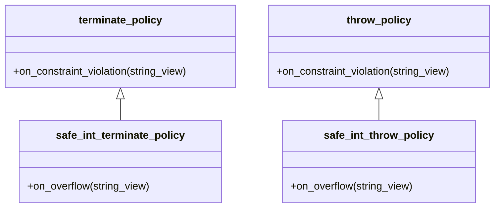

# `safe_int<T>` — Overflow-Safe Integer Arithmetic

## Overview

`safe_int<T>` is a thin wrapper around an integral type `T` that **detects all arithmetic
overflow at runtime**. It participates in the ordinary C++ arithmetic system and satisfies
all the concepts that **mp-units** requires of a
[representation type](representation_types.md) — making it a true drop-in replacement for
plain integers.

```cpp
#include <mp-units/utility/safe_int.h>
using namespace mp_units;
using namespace mp_units::utility;

// Just change the representation type — everything else stays the same
quantity<mm, safe_i32> distance{1'500 * km};
quantity<mm, safe_i32> doubled = distance + distance;  // throws — 3×10⁹ > INT32_MAX
```

!!! info "Motivation"

    **mp-units**' [built-in scaling algorithm](representation_types.md#built-in-scaling-algorithm)
    uses widened intermediate arithmetic (e.g. `int64_t`/`uint64_t` for types up to
    `int32_t`/`uint32_t`, 128-bit for 64-bit types) to avoid undefined behavior during
    unit conversions. This handles the vast
    majority of real-world scenarios, but the **final result** must still fit in the target
    type — and that narrowing can overflow silently.

    `safe_int<T>` closes this gap: it checks **every** arithmetic operation, including
    the final narrowing, so overflow is never silent.


## Checked operations

Every arithmetic operation on `safe_int<T>` is checked before it executes:

| Operation | Overflow condition checked                                               |
|-----------|--------------------------------------------------------------------------|
| `a + b`   | signed: both-same-sign sum crosses boundary; unsigned: `lhs > max - rhs` |
| `a - b`   | symmetric to addition                                                    |
| `a * b`   | widened multiplication; result outside `[min, max]`                      |
| `a / b`   | divide-by-zero; signed: `INT_MIN / -1`                                   |
| `-a`      | signed: `INT_MIN`; unsigned: any non-zero                                |

The multiplication check uses widened intermediate arithmetic (e.g., `int32_t` promotes to
`int64_t` for the product), so there is no dependency on undefined behavior.


## Where Overflow Is Caught

Because `safe_int` hooks into the fundamental C++ arithmetic operators, every operation
is checked — regardless of context:

=== "Construction"

    ```cpp
    int value = 40'000;

    // Constructing a safe_int quantity from a plain integer that doesn't fit the rep type
    quantity<si::metre, safe_i16> q{value * si::metre};  // throws — 40,000 > INT16_MAX
    ```

=== "Conversion"

    ```cpp
    quantity q = 40'000 * si::metre;

    // Converting from a quantity with too large numerical value for the rep type
    quantity<si::metre, safe_i16> q_safe{q};  // throws — 40,000 > INT16_MAX
    ```

=== "Arithmetic"

    ```cpp
    // Same-unit addition — no unit conversion, plain safe_int arithmetic
    quantity<mm, safe_i32> dist{1'500 * km};
    quantity<mm, safe_i32> total = dist + dist;  // throws — 3×10⁹ > INT32_MAX

    // Cross-quantity multiplication: speed × time
    quantity speed = safe_i32{50'000} * si::metre / si::second;
    quantity time  = safe_i32{50'000} * si::second;
    quantity distance = speed * time;     // throws — 2.5×10⁹ overflows int32_t
    ```

=== "Explicit unit conversion"

    ```cpp
    quantity dist = safe_i32{2'200'000} * si::metre;
    quantity huge = dist.in(si::micro<si::metre>);  // throws — ×1,000,000 factor overflows int32_t
    ```

=== "Automatic common-unit scaling"

    ```cpp
    quantity dist_m  = safe_i32{1'500'000'000} * si::metre;
    quantity dist_km = safe_i32{1'000'000} * si::kilo<si::metre>;
    quantity total = dist_m + dist_km;    // throws — scaling 10⁶ km → m overflows int32_t
    ```


## Policy-based error handling

What happens when overflow is detected is controlled by the `ErrorPolicy` template
parameter:

```cpp
template<std::integral T, typename ErrorPolicy = /* see below */>
class safe_int;
```

**mp-units** ships two policies:

| Policy                      | Behaviour                    | Environment           |
|-----------------------------|------------------------------|-----------------------|
| `safe_int_terminate_policy` | `std::abort()` immediately   | freestanding + hosted |
| `safe_int_throw_policy`     | throws `std::overflow_error` | hosted only           |

The default policy is `safe_int_throw_policy` on hosted platforms and
`safe_int_terminate_policy` on freestanding platforms.

### Convenience aliases

All standard fixed-width integer aliases are provided with the default policy:

```cpp
using safe_i8  = mp_units::utility::safe_int<std::int8_t>;
using safe_i16 = mp_units::utility::safe_int<std::int16_t>;
using safe_i32 = mp_units::utility::safe_int<std::int32_t>;
using safe_i64 = mp_units::utility::safe_int<std::int64_t>;
using safe_u8  = mp_units::utility::safe_int<std::uint8_t>;
using safe_u16 = mp_units::utility::safe_int<std::uint16_t>;
using safe_u32 = mp_units::utility::safe_int<std::uint32_t>;
using safe_u64 = mp_units::utility::safe_int<std::uint64_t>;
```

For explicit policy control, use the full template:

```cpp
safe_int<std::int32_t, safe_int_throw_policy> explicit_throw;
safe_int<std::int32_t, safe_int_terminate_policy> explicit_terminate;
```

### Custom error policies

You can define your own error policy to integrate with custom logging or diagnostics
systems:

```cpp
#include <mp-units/utility/safe_int.h>

struct logging_policy {
  [[noreturn]] static void on_overflow(std::string_view msg)
  {
    log_critical_error("Arithmetic overflow", msg);
    std::abort();
  }
};

using logged_int = mp_units::utility::safe_int<std::int32_t, logging_policy>;
```

The policy must provide a `static void on_overflow(std::string_view)` member function.

!!! tip "Shared policies with `constrained<T>`"

    The built-in `safe_int_throw_policy` and `safe_int_terminate_policy` already inherit
    from `throw_policy` / `terminate_policy`, so they satisfy both `OverflowPolicy` and
    `ConstraintPolicy` out of the box. When writing a custom policy, add both
    `on_overflow(std::string_view)` and `on_constraint_violation(std::string_view)` to the
    same struct, and it will work with `safe_int` and `constrained` alike. See
    [Relation to `constrained<T, Policy>`](#relation-to-constrainedt-policy) and
    [Ensure Ultimate Safety](../../how_to_guides/advanced_usage/ultimate_safety.md) for
    a complete example.


## Drop-in replacement

`safe_int<T>` satisfies all the same [representation concepts](concepts.md#RepresentationOf)
as `T`. Only the representation type changes — everything else stays identical:

=== "plain int16_t"

    ```cpp
    quantity<si::metre, std::int16_t> q{30'000 * si::metre};
    quantity<si::metre, std::int16_t> doubled{q + q};  // ⚠️ overflows silently
    ```

=== "safe_int<T>"

    ```cpp
    quantity<si::metre, safe_i16> q{30'000 * si::metre};
    quantity<si::metre, safe_i16> doubled{q + q};  // throws std::overflow_error ✓
    ```

The overflow is caught because `q + q` promotes to `safe_int<int>` via integral promotion
(just as `int16_t + int16_t → int`), and the `quantity<si::metre, safe_i16>` constructor
narrows the result back to `int16_t` — that narrowing is where `safe_int` detects that
60,000 doesn't fit and throws.


## `constexpr` support

`safe_int<T>` arithmetic is fully `constexpr`. In C++, any overflow that occurs during
constant expression evaluation is always a compile-time hard error — for both `safe_int`
and plain integers. The difference emerges only at **runtime**, where `safe_int` catches
overflows that plain integers silently ignore.


## Arithmetic result types

The result type of any `safe_int` arithmetic expression is fully determined by the operand
types. The subsections below cover all supported combinations; unsupported pairings are
**compile-time errors**.

### Integral promotion rules

`safe_int<T>` preserves C++ integral promotion behavior — this applies to both the
homogeneous case (two `safe_int<T>` operands) and the scalar case (one `safe_int<T>` and
one plain integral):

```cpp
// Underlying types: int16_t + int16_t → int (integral promotion)
static_assert(std::is_same_v<decltype(std::int16_t{1} + std::int16_t{1}), int>);

// Homogeneous: safe_int<int16_t> + safe_int<int16_t> → safe_int<int>
static_assert(std::is_same_v<decltype(safe_i16{1} + safe_i16{1}), safe_int<int>>);

// Scalar path: safe_int<int16_t> + int16_t → safe_int<int>  (same promotion)
static_assert(std::is_same_v<decltype(safe_i16{1} + std::int16_t{1}), safe_int<int>>);

// This propagates through quantity arithmetic:
static_assert(std::is_same_v<decltype(safe_i16{1} * si::metre + safe_i16{1} * si::metre),
                             quantity<si::metre, safe_int<int>>>);
```

This ensures that `safe_int` acts as a **transparent wrapper** — it adds overflow detection
without changing the fundamental arithmetic behavior.

### Arithmetic operators (`+`, `-`, `*`, `/`, `%`)

The following tables use this notation:

- `S<T, EP>` — `safe_int<T, EP>`, where `EP` is the policy of the `safe_int` operand
- `C<U, CP>` — `constrained<U, CP>`, where `CP` is the policy of the `constrained` operand
- *promote(T, U)* — the type produced by `T{} + U{}` under C++ usual arithmetic
  conversions (integral promotion + common type), as illustrated above

| Left operand | Right operand                            | Condition                             | Result type                | Overflow check                                    |
|--------------|------------------------------------------|---------------------------------------|----------------------------|---------------------------------------------------|
| `S<T, EP>`   | `S<T, EP>`                               | same `T`, same `EP`                   | `S<promote(T,T), EP>`      | yes — every operation                             |
| `S<T, EP>`   | `S<U, EP>`                               | same-sign, different width, same `EP` | `S<promote(T,U), EP>`      | yes — narrower widens implicitly, then checked    |
| `S<T, EP>`   | `S<U, EP>`                               | **opposite signedness**               | **ill-formed**             | —                                                 |
| `S<T, EP1>`  | `S<T, EP2>`                              | **different `EP`**                    | **ill-formed**             | —                                                 |
| `S<T, EP>`   | integral `U`                             | same-signedness                       | `S<promote(T,U), EP>`      | yes — every operation                             |
| `S<T, EP>`   | integral `U`                             | **opposite signedness**               | **ill-formed**             | —                                                 |
| `S<T, EP>`   | floating-point `U`                       | —                                     | plain `U` (floating-point) | no — `safe_int` wrapper is lost                   |
| `S<T, EP>`   | `C<U, CP>` (`U` integral, same-sign)     | —                                     | `S<promote(T,U), EP>`      | yes — `safe_int` wins; policy `CP` is dropped     |
| `S<T, EP>`   | `C<U, CP>` (`U` non-integral / floating) | —                                     | `C<U, CP>`                 | no — `constrained` wins; policy `CP` is preserved |

!!! warning "safe_int + float loses overflow protection"

    When a `safe_int` operand is combined with a floating-point type, the result is a
    plain floating-point value — the `safe_int` wrapper is **not** preserved. This is
    intentional: floating-point arithmetic has its own overflow semantics (infinity / NaN)
    that are incompatible with the binary-integer overflow model.

!!! info "`safe_int` wins over `constrained<integral>`"

    When a `safe_int` meets a `constrained<U>` wrapping an **integral** `U`, the result
    is `safe_int` and the `constrained` policy `CP` is dropped. The rationale is that
    `constrained` is a transparent policy-carrying tag — it performs no checks itself;
    `safe_int` is the type that actively checks arithmetic, so it is the more meaningful
    wrapper to preserve.

    When `U` is a **non-integral** type (e.g. `double` inside `constrained`), the result
    is `constrained` because the `safe_int` overflow model does not apply to floating-point.

### Mixed-signedness arithmetic

Arithmetic between opposite signedness is **intentionally ill-formed** — a compile-time
error. This applies to **both** `safe_int×safe_int` and `safe_int×scalar` combinations.
The rationale is the same in both cases: mixed-signedness arithmetic under C++ usual
arithmetic conversions reinterprets the signed value as unsigned before operating, silently
producing counterintuitive results (e.g., `safe_int<int>{-1} * 2u` → `UINT_MAX - 1`).
`safe_int` rejects these outright rather than hiding the problem behind an overflow check.

Comparisons between mixed-signedness values remain allowed — both when the right-hand side
is a raw integral scalar and when it is another `safe_int` of opposite signedness. The
comparison operators use `std::cmp_equal` / `std::cmp_less` etc., which correctly handle
mixed-signedness without reinterpretation.

```cpp
safe_int<int>      si{1};
safe_int<unsigned> su{2u};

// Compile-time error — two safe_int of opposite signedness:
// auto x = si + su;

// Compile-time error — safe_int<signed> × unsigned scalar:
// auto y = si * 2u;

// Explicit mixed-signedness arithmetic — use .value() and cast deliberately:
auto x = safe_int<unsigned>{static_cast<unsigned>(si.value())} + su;  // explicit and auditable

// Comparison is allowed for both safe_int pairs and scalars (uses std::cmp_less):
bool b1 = si < su;   // OK — safe_int × safe_int cross-sign comparison
bool b2 = si < 2u;   // OK — safe_int × scalar cross-sign comparison
```

## Comparisons

Comparison operators never overflow — they produce a `bool`, not a numeric value, so there
is nothing to overflow. `safe_int` therefore adds no overflow-detection benefit for
comparisons; its contribution is elsewhere: the mixed-signedness operators use `std::cmp_*`
instead of C++ usual arithmetic conversions, which gives the correct result where raw
integers would silently mislead.

### Comparison operators (`==`, `!=`, `<`, `>`, `<=`, `>=`)

| Left operand  | Right operand      | Condition                         | Result         | Notes                                                                           |
|---------------|--------------------|-----------------------------------|----------------|---------------------------------------------------------------------------------|
| `S<T, EP>`    | `S<T, EP>`         | same `T`, same `EP`               | `bool`         | direct value comparison                                                         |
| `S<T, EP>`    | `S<U, EP>`         | same-sign, same `EP`              | `bool`         | narrower widens implicitly, then compared                                       |
| `S<T, EP1>`   | `S<U, EP2>`        | same-sign, **different `EP`**     | `bool`         | comparisons yield `bool` — no result policy to propagate                        |
| `S<signed T>` | `S<unsigned U>`    | **opposite signedness**, any `EP` | `bool`         | uses `std::cmp_equal` / `std::cmp_less` — cross-sign is **correct and allowed** |
| `S<T, EP>`    | integral `U`       | **any** sign combination          | `bool`         | uses `std::cmp_equal` / `std::cmp_less` — cross-sign is **correct and allowed** |
| `S<T, EP>`    | floating-point `U` | —                                 | `bool`         | standard floating-point comparison                                              |
| `S<T, EP>`    | `C<U, CP>`         | —                                 | `bool`         | compares underlying values directly                                             |

!!! tip "Cross-sign comparison is intentionally allowed"

    All `safe_int` comparison operators — whether comparing against a raw integral scalar or
    against another `safe_int` of opposite signedness — use `std::cmp_equal` / `std::cmp_less`
    (and friends) rather than C++ usual arithmetic conversions. This gives the mathematically
    correct result regardless of signedness, unlike the raw `int < unsigned int` which silently
    reinterprets the signed value.

    This asymmetry (arithmetic: ill-formed; comparison: allowed and correct) is
    deliberate: arithmetic under mixed-sign UAC produces wrong *values*, while
    comparisons using `std::cmp_*` produce the *correct* `bool`.


## Relation to `constrained<T, Policy>`

`safe_int<T, EP>` follows the same policy-based design as
[`constrained<T, EP>`](the_affine_space.md#range-validated-quantity-points), the wrapper
used for `quantity_point` domain bounds. They address complementary concerns:

| Wrapper              | Purpose                                                           |
|----------------------|-------------------------------------------------------------------|
| `constrained<T, EP>` | **Value domain** — is this value within the declared bounds?      |
| `safe_int<T, EP>`    | **Arithmetic correctness** — does this operation fit in the type? |

Both share the same base error policies (`throw_policy`, `terminate_policy`) — and the
relationship is explicit inheritance:



This means `safe_int_throw_policy` and `safe_int_terminate_policy` satisfy **both**
`OverflowPolicy` and `ConstraintPolicy`. As a result, swapping `constrained<T, EP>` for
`safe_int<T, EP>` using one of the built-in policies preserves any `quantity_point` bounds
checking that was already in place — the `on_constraint_violation` handler is inherited and
still fires when a domain bound is violated.

```cpp
// A bounded, overflow-safe latitude representation
using safe_double   = constrained<double, throw_policy>;
using safe_latitude = quantity_point<geo_latitude[deg], equator, safe_double>;

// A raw-integral distance type where overflow is caught at runtime
using safe_i32_m = quantity<isq::length[si::metre], safe_int<std::int32_t>>;
```

For a complete walkthrough of combining both wrappers, see
[Ensure Ultimate Safety](../../how_to_guides/advanced_usage/ultimate_safety.md).
