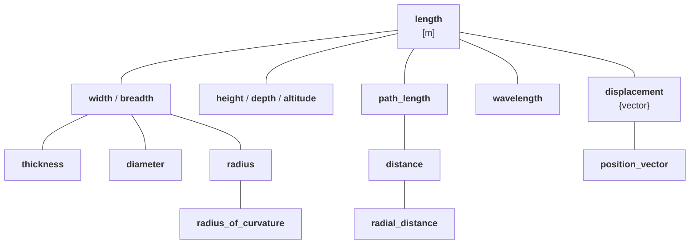
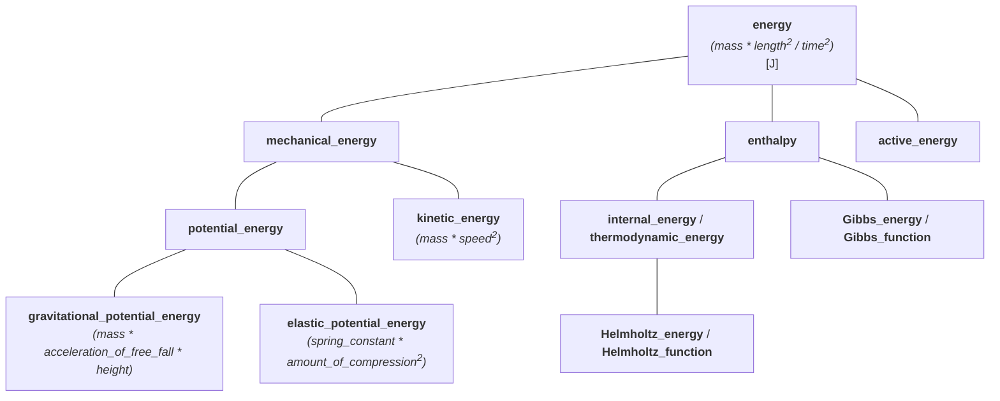

# Systems of Quantities

Most physical units libraries focus on modeling one or more
[systems of units](../../reference/glossary.md#system-of-units). However an equally (or more)
important abstraction is the
[system of quantities](../../reference/glossary.md#system-of-quantities).

!!! info

    **mp-units** is likely the first Open Source library (in any language) that models the
    [ISQ](../../reference/glossary.md#isq) with the full ISO 80000 definition set. Feedback
    is welcome.


## Dimension is not enough to describe a quantity

Most libraries understand dimensions, yet a dimension alone does not fully describe a
quantity. Consider:

```cpp
class Box {
  area base_;
  length height_;
public:
  Box(length l, length w, length h) : base_(l * w), height_(h) {}
  // ...
};

Box my_box(2 * m, 3 * m, 1 * m);
```

This interface is ambiguous. Many strongly typed libraries cannot do better :woozy_face:

Another common question: how to differentiate _work_ and _torque_? They share a dimension
yet differ semantically.

A similar issue is related to figuring out what should be the result of:

```cpp
auto res = 1 * Hz + 1 * Bq + 1 * Bd;
```

where:

- `Hz` (hertz) - unit of _frequency_
- `Bq` (becquerel) - unit of _activity_
- `Bd` (baud) - unit of _modulation rate_

All have the same dimension $\mathsf{T}^{-1}$, but adding or comparing them is meaningless.

Consider _fuel consumption_ (fuel _volume_ divided by _distance_, e.g. `6.7 l/km`) vs an _area_.
Both have dimension $\mathsf{L}^{2}$ yet adding them is nonsensical and should fail.

!!! important

    More than one quantity may be defined for the same dimension:

    - quantities of **different kinds** (e.g. _frequency_, _modulation rate_, _activity_, ...)
    - quantities of **the same kind** (e.g. _length_, _width_, _altitude_, _distance_, _radius_,
      _wavelength_, _position vector_, ...)

These issues require proper modeling of a
[system of quantities](../../reference/glossary.md#system-of-quantities).


## Quantities of the same kind

!!! quote "ISO 80000-1"

    - Quantities may be grouped together into categories of quantities that are
      **mutually comparable**
    - Mutually comparable quantities are called **quantities of the same kind**
    - Two or more quantities **cannot be added or subtracted unless they belong to the same category
      of mutually comparable quantities**
    - Quantities of the **same kind** within a given system of quantities **have the same quantity
      dimension**
    - Quantities of the **same dimension are not necessarily of the same kind**

ISO 80000 answers the earlier questions: two quantities cannot be added, subtracted, or
compared unless they are of the same [kind](../../reference/glossary.md#kind). Thus
_frequency_, _activity_, and _modulation rate_ are incompatible.


## System of quantities is not only about kinds

ISO 80000 specifies hundreds of quantities in many kinds; kinds often contain multiple
quantities forming a hierarchy.

For example, here are all quantities of the kind length provided in the ISO 80000:



Each quantity above expresses some kind of _length_ and can be measured with `si::metre`.
Each has different semantics and sometimes a distinct representation (e.g. `position_vector`
and `displacement` are vector quantities).

The hierarchy guides valid arithmetic and conversion rules for quantities of the same kind.


## Defining quantities

All quantity information resides in `quantity_spec`. To define a quantity inherit a strong
type from a suitable instantiation.

!!! tip

    Quantity specification definitions benefit from an
    [explicit object parameter](https://en.cppreference.com/w/cpp/language/member_functions#Explicit_object_parameter)
    added in C++23 to remove the need for CRTP idiom, which significantly simplifies the code.
    However, as C++23 is far from being mainstream today,
    a [portability macro `QUANTITY_SPEC()`](../../how_to_guides/wide_compatibility.md#QUANTITY_SPEC)
    is provided and used consistently through the library to allow the code to compile with C++20
    compilers, thanks to the CRTP usage under the hood.

    See more in the
    [C++ compiler support](../../getting_started/cpp_compiler_support.md#explicit-this-parameter)
    chapter.

    *[CRTP]: Curiously Recurring Template Parameter

For example, here is how the above quantity kind tree can be modeled in the library:

=== "C++23"

    ```cpp
    inline constexpr struct length final : quantity_spec<dim_length> {} length;
    inline constexpr struct width final : quantity_spec<length> {} width;
    inline constexpr auto breadth = width;
    inline constexpr struct height final : quantity_spec<length> {} height;
    inline constexpr auto depth = height;
    inline constexpr auto altitude = height;
    inline constexpr struct thickness final : quantity_spec<width> {} thickness;
    inline constexpr struct diameter final : quantity_spec<width> {} diameter;
    inline constexpr struct radius final : quantity_spec<width> {} radius;
    inline constexpr struct radius_of_curvature final : quantity_spec<radius> {} radius_of_curvature;
    inline constexpr struct path_length final : quantity_spec<length> {} path_length;
    inline constexpr auto arc_length = path_length;
    inline constexpr struct distance final : quantity_spec<path_length> {} distance;
    inline constexpr struct radial_distance final : quantity_spec<distance> {} radial_distance;
    inline constexpr struct wavelength final : quantity_spec<length> {} wavelength;
    inline constexpr struct displacement final : quantity_spec<length, quantity_character::vector> {} displacement;
    inline constexpr struct position_vector final : quantity_spec<displacement> {} position_vector;
    ```

=== "C++20"

    ```cpp
    inline constexpr struct length final : quantity_spec<length, dim_length> {} length;
    inline constexpr struct width final : quantity_spec<width, length> {} width;
    inline constexpr auto breadth = width;
    inline constexpr struct height final : quantity_spec<height, length> {} height;
    inline constexpr auto depth = height;
    inline constexpr auto altitude = height;
    inline constexpr struct thickness final : quantity_spec<thickness, width> {} thickness;
    inline constexpr struct diameter final : quantity_spec<diameter, width> {} diameter;
    inline constexpr struct radius final : quantity_spec<radius, width> {} radius;
    inline constexpr struct radius_of_curvature final : quantity_spec<radius_of_curvature, radius> {} radius_of_curvature;
    inline constexpr struct path_length final : quantity_spec<path_length, length> {} path_length;
    inline constexpr auto arc_length = path_length;
    inline constexpr struct distance final : quantity_spec<distance, path_length> {} distance;
    inline constexpr struct radial_distance final : quantity_spec<radial_distance, distance> {} radial_distance;
    inline constexpr struct wavelength final : quantity_spec<wavelength, length> {} wavelength;
    inline constexpr struct displacement final : quantity_spec<displacement, length, quantity_character::vector> {} displacement;
    inline constexpr struct position_vector final : quantity_spec<position_vector, displacement> {} position_vector;
    ```

=== "Portable"

    ```cpp
    QUANTITY_SPEC(length, dim_length);
    QUANTITY_SPEC(width, length);
    inline constexpr auto breadth = width;
    QUANTITY_SPEC(height, length);
    inline constexpr auto depth = height;
    inline constexpr auto altitude = height;
    QUANTITY_SPEC(thickness, width);
    QUANTITY_SPEC(diameter, width);
    QUANTITY_SPEC(radius, width);
    QUANTITY_SPEC(radius_of_curvature, radius);
    QUANTITY_SPEC(path_length, length);
    inline constexpr auto arc_length = path_length;
    QUANTITY_SPEC(distance, path_length);
    QUANTITY_SPEC(radial_distance, distance);
    QUANTITY_SPEC(wavelength, length);
    QUANTITY_SPEC(displacement, length, quantity_character::vector);
    QUANTITY_SPEC(position_vector, displacement);
    ```

!!! note

    More information on how to define a system of quantities can be found in the
    ["International System of Quantities (ISQ)"](../systems/isq.md) chapter.


## Comparing, adding, and subtracting quantities

ISO 80000 states that _width_ and _height_ are quantities of the same kind; therefore they:

- are mutually comparable,
- can be added and subtracted.

If we take the above for granted, the only reasonable result of `1 * width + 1 * height` is
`2 * length`, where the result of `length` is known as a **common quantity** type.
A result of such an equation is always the first common node in a hierarchy tree of the same
kind. For example:

```cpp
static_assert(get_common_quantity_spec(isq::width, isq::height) == isq::length);
static_assert(get_common_quantity_spec(isq::thickness, isq::radius) == isq::width);
static_assert(get_common_quantity_spec(isq::distance, isq::path_length) == isq::path_length);
```


## Converting between quantities

Based on the same hierarchy of quantities of kind length, we can define quantity conversion
rules.

1. **Implicit conversions**

    - every _width_ is a _length_
    - every _radius_ is a _width_

    ```cpp
    static_assert(implicitly_convertible(isq::width, isq::length));
    static_assert(implicitly_convertible(isq::radius, isq::width));
    static_assert(implicitly_convertible(isq::radius, isq::length));
    ```

    Implicit conversions are allowed on copy-initialization:

    ```cpp
    void foo(quantity<isq::length[m]> q);
    ```

    ```cpp
    quantity<isq::width[m]> q1 = 42 * m;
    quantity<isq::length[m]> q2 = q1;  // implicit quantity conversion
    foo(q1);                           // implicit quantity conversion
    ```

2. **Explicit conversions**

    - not every _length_ is a _width_
    - not every _width_ is a _radius_

    ```cpp
    static_assert(!implicitly_convertible(isq::length, isq::width));
    static_assert(!implicitly_convertible(isq::width, isq::radius));
    static_assert(!implicitly_convertible(isq::length, isq::radius));
    static_assert(explicitly_convertible(isq::length, isq::width));
    static_assert(explicitly_convertible(isq::width, isq::radius));
    static_assert(explicitly_convertible(isq::length, isq::radius));
    ```

    Explicit conversions are forced by passing the quantity to a call operator of a `quantity_spec`
    type or by calling `quantity`'s explicit constructor:

    ```cpp
    void foo(quantity<isq::height[m]> q);
    ```

    ```cpp
    quantity<isq::length[m]> q1 = 42 * m;
    quantity<isq::height[m]> q2 = isq::height(q1);  // explicit quantity conversion
    quantity<isq::height[m]> q3(q1);                // direct initialization
    foo(isq::height(q1));                           // explicit quantity conversion
    ```

3. **Explicit casts**

    - _height_ is not a _width_
    - both _height_ and _width_ are quantities of kind _length_

    ```cpp
    static_assert(!implicitly_convertible(isq::height, isq::width));
    static_assert(!explicitly_convertible(isq::height, isq::width));
    static_assert(castable(isq::height, isq::width));
    ```

    Explicit casts are forced with a dedicated `quantity_cast` function:

    ```cpp
    void foo(quantity<isq::height[m]> q);
    ```

    ```cpp
    quantity<isq::width[m]> q1 = 42 * m;
    quantity<isq::height[m]> q2 = quantity_cast<isq::height>(q1);  // explicit quantity cast
    foo(quantity_cast<isq::height>(q1));                           // explicit quantity cast
    ```

4. **No conversion**

    - _time_ has nothing in common with _length_

    ```cpp
    static_assert(!implicitly_convertible(isq::duration, isq::length));
    static_assert(!explicitly_convertible(isq::duration, isq::length));
    static_assert(!castable(isq::duration, isq::length));
    ```

    Even the explicit casts will not force such a conversion:

    ```cpp
    void foo(quantity<isq::length[m]>);
    ```

    ```cpp
    quantity<isq::length[m]> q1 = 42 * s;    // Compile-time error
    foo(quantity_cast<isq::length>(42 * s)); // Compile-time error
    ```


## Hierarchies of derived quantities

Derived quantity equations often do not automatically form a hierarchy tree. This is why it
is sometimes not obvious what such a tree should look like. Also, ISO explicitly states:

!!! quote "ISO/IEC Guide 99"

    The division of ‘quantity’ according to ‘kind of quantity’ is, to some extent, arbitrary.

The below presents some arbitrary hierarchy of derived quantities of kind _energy_:



Notice, that even though all of those quantities have the same dimension and can be expressed
in the same units, they have different [quantity equations](../../reference/glossary.md#quantity-equation)
that can be used to create them implicitly:

- _energy_ is the most generic one and thus can be created from base quantities of _mass_,
  _length_, and _time_. As those are also the roots of quantities of their kinds and all other
  quantities from their trees are implicitly convertible to them (we agreed on that "every
  _width_ is a _length_" already), it means that an _energy_ can be implicitly constructed
  from any quantity of _mass_, _length_, and _time_:

    ```cpp
    static_assert(implicitly_convertible(isq::mass * pow<2>(isq::length) / pow<2>(isq::duration), isq::energy));
    static_assert(implicitly_convertible(isq::mass * pow<2>(isq::height) / pow<2>(isq::duration), isq::energy));
    ```

- _mechanical energy_ is a more "specialized" quantity than _energy_ (not every _energy_ is
  a _mechanical energy_). It is why an explicit cast is needed to convert from either
  _energy_ or the results of its [quantity equation](../../reference/glossary.md#quantity-equation):

    ```cpp
    static_assert(!implicitly_convertible(isq::energy, isq::mechanical_energy));
    static_assert(explicitly_convertible(isq::energy, isq::mechanical_energy));
    static_assert(!implicitly_convertible(isq::mass * pow<2>(isq::length) / pow<2>(isq::duration),
                                          isq::mechanical_energy));
    static_assert(explicitly_convertible(isq::mass * pow<2>(isq::length) / pow<2>(isq::duration),
                                         isq::mechanical_energy));
    ```

- _gravitational potential energy_ is not only even more specialized one but additionally,
  it is special in a way that it provides its own "constrained"
  [quantity equation](../../reference/glossary.md#quantity-equation). Maybe not every
  `mass * pow<2>(length) / pow<2>(time)` is a _gravitational potential energy_, but every
  `mass * acceleration_of_free_fall * height` is.

    ```cpp
    static_assert(!implicitly_convertible(isq::energy, gravitational_potential_energy));
    static_assert(explicitly_convertible(isq::energy, gravitational_potential_energy));
    static_assert(!implicitly_convertible(isq::mass * pow<2>(isq::length) / pow<2>(isq::duration),
                                          gravitational_potential_energy));
    static_assert(explicitly_convertible(isq::mass * pow<2>(isq::length) / pow<2>(isq::duration),
                                         gravitational_potential_energy));
    static_assert(implicitly_convertible(isq::mass * isq::acceleration_of_free_fall * isq::height,
                                         gravitational_potential_energy));
    ```


## Modeling a quantity kind

In the physical units library, we also need an abstraction describing an entire family of
quantities of the same kind. Such quantities have not only the same dimension but also
can be expressed in the same units.

To annotate a quantity to represent its kind (and not just a hierarchy tree's root quantity)
we introduced a `kind_of<>` specifier. For example, to express any quantity of _length_,
we need to type `kind_of<isq::length>`.

!!! important

    `isq::length` and `kind_of<isq::length>` are two different things.

Such an entity behaves as any quantity of its kind. This means that it is implicitly
convertible to any quantity in a tree.

```cpp
static_assert(!implicitly_convertible(isq::length, isq::height));
static_assert(implicitly_convertible(kind_of<isq::length>, isq::height));
```

Additionally, the result of operations on quantity kinds is also a quantity kind:

```cpp
static_assert(same_type<kind_of<isq::length> / kind_of<isq::duration>, kind_of<isq::length / isq::duration>>);
```

However, if at least one equation's operand is not a quantity kind, the result becomes a "strong"
quantity where all the kinds are converted to the hierarchy tree's root quantities:

```cpp
static_assert(!same_type<kind_of<isq::length> / isq::duration, kind_of<isq::length / isq::duration>>);
static_assert(same_type<kind_of<isq::length> / isq::duration, isq::length / isq::duration>);
```

!!! info

    Only a root quantity from the hierarchy tree or the one marked with `is_kind` specifier
    in the `quantity_spec` definition can be put as a template parameter to the `kind_of`
    specifier. For example, `kind_of<isq::width>` will fail to compile. However, we can call
    `get_kind(q)` to obtain a kind of any quantity:

    ```cpp
    static_assert(get_kind(isq::width) == kind_of<isq::length>);
    ```


## Creating distinct quantity kinds with `is_kind`

While dimension-based type safety prevents many errors, sometimes quantities share the same
dimension but represent fundamentally incompatible physical concepts. The `is_kind` specifier
allows creating distinct quantity types that cannot be mixed even though they share the same
dimension and quantity hierarchy tree.


### When to use `is_kind`?

Use `is_kind` to create **distinct subkinds within an existing quantity hierarchy** when:

1. **Multiple incompatible concepts** need to share the **same parent quantity's properties**
   (unit or quantity type)
2. These concepts **cannot be meaningfully added or compared** to each other without explicit
   conversion
3. They represent **different reference frames** or measurement contexts, but derive from
   the same physical basis

The key insight: use `is_kind` when quantities need to **inherit** from a parent
(quantity type, unit) but must be **isolated** from each other.

Common examples of subkinds within existing trees include:

- _Angular measure_ (rad), _solid angular measure_ (sr), _storage capacity_ (bit) —
  subkind of _dimensionless_
- _Fluid head_ and _water head_ in hydraulic engineering — subkinds of _height_
  (dimension of _length_)


### Defining a distinct kind

!!! important

    The `is_kind` specifier creates **subkinds within an existing quantity hierarchy tree**,
    not independent trees. This allows the subkind to **inherit properties** from its parent:

    - **Unit of measure**: _fluid head_ and _water head_ inherit metre from _height_;
      _angular measure_ inherits one from _dimensionless_
    - **Quantity type**: Subkinds inherit their parent's quantity type, which is crucial
      when they appear in derived quantities involving this quantity (e.g., _sampling rate_,
      _tempo_ can use Hz because they properly model the dimensionless component divided
      by _duration_)

    For quantities that should be completely independent (different dimension trees),
    define separate root quantities instead (e.g., _frequency_ and _activity_ are
    independent roots, not subkinds).

To create a distinct quantity kind as a subkind, add the `is_kind` specifier to the
`quantity_spec` definition:

=== "C++23"

    ```cpp
    inline constexpr struct fluid_head final : quantity_spec<isq::height, is_kind> {} fluid_head;
    inline constexpr struct water_head final : quantity_spec<isq::height, is_kind> {} water_head;
    // Both inherit metre as unit and length as dimension from isq::height
    ```

=== "C++20"

    ```cpp
    inline constexpr struct fluid_head final : quantity_spec<fluid_head, isq::height, is_kind> {} fluid_head;
    inline constexpr struct water_head final : quantity_spec<water_head, isq::height, is_kind> {} water_head;
    // Both inherit metre as unit and length as dimension from isq::height
    ```

=== "Portable"

    ```cpp
    QUANTITY_SPEC(fluid_head, isq::height, is_kind);
    QUANTITY_SPEC(water_head, isq::height, is_kind);
    // Both inherit metre as unit and length as dimension from isq::height
    ```

Both `fluid_head` and `water_head` are subkinds of _height_ (inheriting its dimension of _length_
and unit of metre), but marking them with `is_kind` makes them distinct incompatible kinds that
require explicit conversion.


### Behavior of `is_kind` quantities

Quantities marked with `is_kind` behave differently from regular hierarchy members:

1. **Cannot be implicitly converted to each other**:

    ```cpp
    static_assert(!implicitly_convertible(fluid_head, water_head));
    static_assert(!explicitly_convertible(fluid_head, water_head));
    static_assert(!castable(fluid_head, water_head));
    ```

2. **Cannot be added or compared directly**:

    ```cpp
    quantity h_fluid = fluid_head(2 * m);
    quantity h_water = water_head(10 * m);

    // auto sum = h_fluid + h_water;  // Compile-time error!
    // bool cmp = h_fluid < h_water;  // Compile-time error!
    ```

3. **Require explicit conversion to base quantity**:

    To perform generic operations or conversions between kinds, explicit conversion to the
    base quantity is required:

    ```cpp
    // Convert to base quantity explicitly
    quantity h1 = isq::height(h_fluid);  // explicit conversion required
    quantity h2 = isq::height(h_water);  // explicit conversion required

    // Now generic operations are possible
    auto sum = h1 + h2;  // OK: both are isq::height
    ```

    !!! warning

        Implicit conversion from `is_kind` quantities to their base is **not allowed**:

        ```cpp
        quantity<isq::height[m]> h = h_fluid;  // Compile-time error!
        ```

4. **Can be used with `kind_of`**:

    Unlike regular hierarchy members, `is_kind` quantities can be used with `kind_of`:

    ```cpp
    static_assert(get_kind(fluid_head) == kind_of<fluid_head>);
    static_assert(get_kind(water_head) == kind_of<water_head>);
    static_assert(get_kind(isq::height) == kind_of<isq::length>);
    // static_assert(get_kind(isq::height) == kind_of<isq::height>);  // Compile-time error!

    // Both are kinds of height, but different kinds
    static_assert(get_kind(fluid_head) != get_kind(water_head));
    static_assert(get_kind(fluid_head) != get_kind(isq::height));
    ```


### Implementing physics-based conversions

When quantities are distinct kinds, domain-specific conversion functions should be provided
to perform the correct physics-based transformations (if applicable):

```cpp
// Define specific gravity as dimensionless
inline constexpr struct specific_gravity final : quantity_spec<dimensionless> {} specific_gravity;

// Physics: H_water = H_fluid * SG
constexpr QuantityOf<water_head> auto to_water_head(QuantityOf<fluid_head> auto h_fluid,
                                                    QuantityOf<specific_gravity> auto sg)
{
  return water_head(isq::height(h_fluid) * sg);
}

// Physics: H_fluid = H_water / SG
constexpr QuantityOf<fluid_head> auto to_fluid_head(QuantityOf<water_head> auto h_water,
                                                    QuantityOf<specific_gravity> auto sg)
{
  return fluid_head(isq::height(h_water) / sg);
}
```

This pattern:

- **Makes conversions explicit and visible** in the code
- **Encodes the physics** (specific gravity conversion formula)
- **Provides type-safe boundaries** via `QuantityOf` constraints
- **Documents the relationship** between different quantity kinds


### Guidelines for using `is_kind`

**Use `is_kind` when:**

- Quantities share a parent but have **fundamentally different physical meanings**
- Adding or comparing them **is physically nonsensical** (e.g., _plane angles_ + _solid angles_,
  _fluid head_ + _water head_)
- You need **compile-time prevention** of a known category of errors
- Conversions between kinds either don't exist (_plane_ vs _solid angles_) or require
  domain-specific formulas (_fluid head_ ↔ _water head_ via _specific gravity_)

**Don't use `is_kind` when:**

- Quantities are naturally part of the same hierarchy (use regular `quantity_spec` hierarchy)
- Conversions are just unit changes (use regular unit conversions)
- The distinction is purely semantic without different physics (document in comments instead)

!!! tip

    For a complete practical example demonstrating how `is_kind` prevents catastrophic
    engineering errors in hydraulic systems, see
    [Tutorial 11: Preventing Confusion with Distinct Kinds](../../tutorials/distinct_quantity_kinds.md).

!!! note

    Special dimensionless quantity kinds like _angular measure_, _solid angular measure_,
    and _storage capacity_ are discussed in detail in the
    [Dimensionless Quantities](dimensionless_quantities.md#nested-quantity-kinds) chapter.
