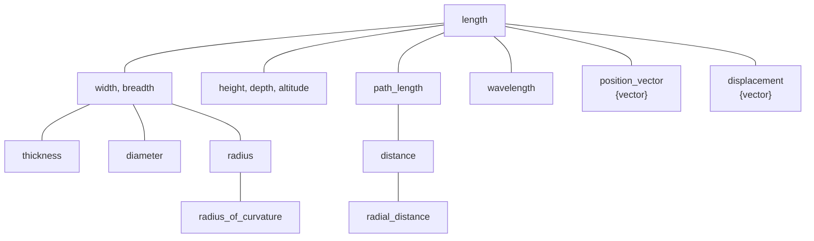
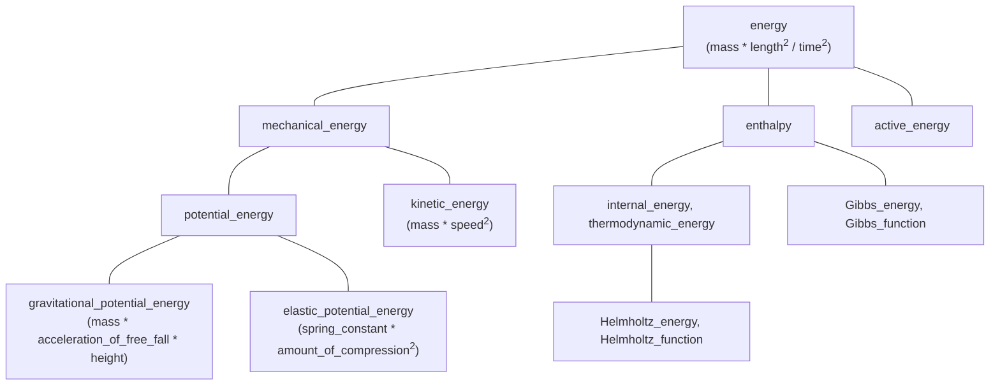

# Systems of Quantities

The physical units libraries on the market typically only scope on modeling one or more
[systems of units](../../appendix/glossary.md#system-of-units). However, this is not the
only system kind to model. Another, and maybe even more important, system kind is a
[system of quantities](../../appendix/glossary.md#system-of-quantities).

!!! info

    Please note that the **mp-units** is probably the first library on the Open Source market
    (in any programming language) that models the [ISQ](../../appendix/glossary.md#isq)
    with all its definitions provided in ISO 80000. Please provide feedback if something
    looks odd or could be improved.


## Dimension is not enough to describe a quantity

Most of the products on the market are aware of physical dimensions. However, a dimension is not
enough to describe a quantity. For example, let's see the following implementation:

```cpp
class Box {
  area base_;
  length height_;
public:
  Box(length l, length w, length h) : base_(l * w), height_(h) {}
  // ...
};

Box my_box(2 * m, 3 * m, 1 * m);
```

How do you like such an interface? It turns out that in most existing strongly-typed libraries
this is often the best we can do :woozy_face:

Another typical question many users ask is how to deal with _work_ and _torque_.
Both of those have the same dimension but are different quantities.

A similar issue is related to figuring out what should be the result of:

```cpp
auto res = 1 * Hz + 1 * Bq + 1 * Bd;
```

where:

- `Hz` (hertz) - unit of _frequency_
- `Bq` (becquerel) - unit of _activity_
- `Bd` (baud) - unit of _modulation rate_

All of those quantities have the same dimension, namely $\mathsf{T}^{-1}$, but probably it
is not wise to allow adding, subtracting, or comparing them, as they describe vastly different
physical properties.

If the above example seems too abstract, let's consider a _fuel consumption_ (fuel _volume_
divided by _distance_, e.g., `6.7 l/km`) and an _area_. Again, both have the same dimension
$\mathsf{L}^{2}$, but probably it wouldn't be wise to allow adding, subtracting, or comparing
a _fuel consumption_ of a car and the _area_ of a football field. Such an operation does not
have any physical sense and should fail to compile.

!!! important

    More than one quantity may be defined for the same dimension:

    - quantities of **different kinds** (e.g. _frequency_, _modulation rate_, _activity_, ...)
    - quantities of **the same kind** (e.g. _length_, _width_, _altitude_, _distance_, _radius_,
      _wavelength_, _position vector_, ...)

It turns out that the above issues can't be solved correctly without proper modeling of
a [system of quantities](../../appendix/glossary.md#system-of-quantities).


## Quantities of the same kind

!!! quote "ISO 80000-1"

    - Quantities may be grouped together into categories of quantities that are
      **mutually comparable**
    - Mutually comparable quantities are called **quantities of the same kind**
    - Two or more quantities **cannot be added or subtracted unless they belong to the same category
      of mutually comparable quantities**
    - Quantities of the **same kind** within a given system of quantities **have the same quantity
      dimension**
    - Quantities of the **same dimension are not necessarily of the same kind**

The above quotes from ISO 80000 provide answers to all the issues above. Two quantities can't be
added, subtracted, or compared unless they belong to the same [kind](../../appendix/glossary.md#kind).
As frequency, activity, and modulation rate are different kinds, the expression provided above should
not compile.


## System of quantities is not only about kinds

ISO 80000 specify hundreds of different quantities. There are plenty of different kinds provided
and often each kind contains more than one quantity. In fact, it turns out that such quantities
form a hierarchy of quantities of the same kind.

For example, here are all quantities of the kind length provided in the ISO 80000:



Each of the above quantities expresses some kind of _length_, and each can be measured with `si::metre`.
However, each of them has different properties, usage, and sometimes even requires a different
representation type (notice that `position_vector` and `displacement` are vector quantities).

Such a hierarchy helps us in defining arithmetics and conversion rules for various quantities of
the same kind.


## Defining quantities

In the **mp-units** library all the information about the quantity is provided with the `quantity_spec`
class template. In order to define a specific quantity a user should inherit a strong type
from such an instantiation.

!!! tip

    Quantity specification definitions benefit from an
    [explicit object parameter](https://en.cppreference.com/w/cpp/language/member_functions#Explicit_object_parameter)
    added in C++23 to remove the need for CRTP idiom, which significantly simplifies the code.
    However, as C++23 is far from being mainstream today,
    a [portability macro `QUANTITY_SPEC()`](../use_cases/wide_compatibility.md#QUANTITY_SPEC)
    is provided and used consistently through the library to allow the code to compile with C++20
    compilers, thanks to the CRTP usage under the hood.

    See more in the
    [C++ compiler support](../../getting_started/cpp_compiler_support.md#explicit-this-parameter)
    chapter.

    *[CRTP]: Curiously Recurring Template Parameter

For example, here is how the above quantity kind tree can be modeled in the library:

=== "C++23"

    ```cpp
    inline constexpr struct length : quantity_spec<dim_length> {} length;
    inline constexpr struct width : quantity_spec<length> {} width;
    inline constexpr auto breadth = width;
    inline constexpr struct height : quantity_spec<length> {} height;
    inline constexpr auto depth = height;
    inline constexpr auto altitude = height;
    inline constexpr struct thickness : quantity_spec<width> {} thickness;
    inline constexpr struct diameter : quantity_spec<width> {} diameter;
    inline constexpr struct radius : quantity_spec<width> {} radius;
    inline constexpr struct radius_of_curvature : quantity_spec<radius> {} radius_of_curvature;
    inline constexpr struct path_length : quantity_spec<length> {} path_length;
    inline constexpr auto arc_length = path_length;
    inline constexpr struct distance : quantity_spec<path_length> {} distance;
    inline constexpr struct radial_distance : quantity_spec<distance> {} radial_distance;
    inline constexpr struct wavelength : quantity_spec<length> {} wavelength;
    inline constexpr struct position_vector : quantity_spec<length, quantity_character::vector> {} position_vector;
    inline constexpr struct displacement : quantity_spec<length, quantity_character::vector> {} displacement;
    ```

=== "C++20"

    ```cpp
    inline constexpr struct length : quantity_spec<length, dim_length> {} length;
    inline constexpr struct width : quantity_spec<width, length> {} width;
    inline constexpr auto breadth = width;
    inline constexpr struct height : quantity_spec<height, length> {} height;
    inline constexpr auto depth = height;
    inline constexpr auto altitude = height;
    inline constexpr struct thickness : quantity_spec<thickness, width> {} thickness;
    inline constexpr struct diameter : quantity_spec<diameter, width> {} diameter;
    inline constexpr struct radius : quantity_spec<radius, width> {} radius;
    inline constexpr struct radius_of_curvature : quantity_spec<radius_of_curvature, radius> {} radius_of_curvature;
    inline constexpr struct path_length : quantity_spec<path_length, length> {} path_length;
    inline constexpr auto arc_length = path_length;
    inline constexpr struct distance : quantity_spec<distance, path_length> {} distance;
    inline constexpr struct radial_distance : quantity_spec<radial_distance, distance> {} radial_distance;
    inline constexpr struct wavelength : quantity_spec<wavelength, length> {} wavelength;
    inline constexpr struct position_vector : quantity_spec<position_vector, length, quantity_character::vector> {} position_vector;
    inline constexpr struct displacement : quantity_spec<displacement, length, quantity_character::vector> {} displacement;
    ```

=== "Portable"

    ```cpp
    QUANTITY_SPEC(length, dim_length);
    QUANTITY_SPEC(width, length);
    inline constexpr auto breadth = width;
    QUANTITY_SPEC(height, length);
    inline constexpr auto depth = height;
    inline constexpr auto altitude = height;
    QUANTITY_SPEC(thickness, width);
    QUANTITY_SPEC(diameter, width);
    QUANTITY_SPEC(radius, width);
    QUANTITY_SPEC(radius_of_curvature, radius);
    QUANTITY_SPEC(path_length, length);
    inline constexpr auto arc_length = path_length;
    QUANTITY_SPEC(distance, path_length);
    QUANTITY_SPEC(radial_distance, distance);
    QUANTITY_SPEC(wavelength, length);
    QUANTITY_SPEC(position_vector, length, quantity_character::vector);
    QUANTITY_SPEC(displacement, length, quantity_character::vector);
    ```

!!! note

    More information on how to define a system of quantities can be found in the
    ["International System of Quantities (ISQ)"](../defining_systems/isq.md) chapter.


## Comparing, adding, and subtracting quantities

ISO 80000 explicitly states that _width_ and _height_ are quantities of the same kind, and as such they:

- are mutually comparable,
- can be added and subtracted.

If we take the above for granted, the only reasonable result of `1 * width + 1 * height` is `2 * length`,
where the result of `length` is known as a **common quantity** type. A result of such an equation is always
the first common node in a hierarchy tree of the same kind. For example:

```cpp
static_assert(common_quantity_spec(isq::width, isq::height) == isq::length);
static_assert(common_quantity_spec(isq::thickness, isq::radius) == isq::width);
static_assert(common_quantity_spec(isq::distance, isq::path_length) == isq::path_length);
```


## Converting between quantities

Based on the same hierarchy of quantities of kind length, we can define quantity conversion rules.

1. **Implicit conversions**

    - every _width_ is a _length_
    - every _radius_ is a _width_

    ```cpp
    static_assert(implicitly_convertible(isq::width, isq::length));
    static_assert(implicitly_convertible(isq::radius, isq::width));
    static_assert(implicitly_convertible(isq::radius, isq::length));
    ```

2. **Explicit conversions**

    - not every _length_ is a _width_
    - not every _width_ is a _radius_

    ```cpp
    static_assert(!implicitly_convertible(isq::length, isq::width));
    static_assert(!implicitly_convertible(isq::width, isq::radius));
    static_assert(!implicitly_convertible(isq::length, isq::radius));
    static_assert(explicitly_convertible(isq::length, isq::width));
    static_assert(explicitly_convertible(isq::width, isq::radius));
    static_assert(explicitly_convertible(isq::length, isq::radius));
    ```

3. **Explicit casts**

    - _height_ is not a _width_
    - both _height_ and _width_ are quantities of kind _length_

    ```cpp
    static_assert(!implicitly_convertible(isq::height, isq::width));
    static_assert(!explicitly_convertible(isq::height, isq::width));
    static_assert(castable(isq::height, isq::width));
    ```

4. **No conversion**

    - _time_ has nothing in common with _length_

    ```cpp
    static_assert(!implicitly_convertible(isq::time, isq::length));
    static_assert(!explicitly_convertible(isq::time, isq::length));
    static_assert(!castable(isq::time, isq::length));
    ```


## Hierarchies of derived quantities

Derived quantity equations often do not automatically form a hierarchy tree. This is why it is
sometimes not obvious what such a tree should look like. Also, ISO explicitly states:

!!! quote "ISO/IEC Guide 99"

    The division of ‘quantity’ according to ‘kind of quantity’ is, to some extent, arbitrary.

The below presents some arbitrary hierarchy of derived quantities of kind energy:



Notice, that even though all of those quantities have the same dimension and can be expressed
in the same units, they have different [quantity equations](../../appendix/glossary.md#quantity-equation)
that can be used to create them implicitly:

- _energy_ is the most generic one and thus can be created from base quantities of _mass_, _length_,
  and _time_. As those are also the roots of quantities of their kinds and all other quantities from their
  trees are implicitly convertible to them (we agreed on that "every _width_ is a _length_" already),
  it means that an _energy_ can be implicitly constructed from any quantity of _mass_, _length_, and _time_:

    ```cpp
    static_assert(implicitly_convertible(isq::mass * pow<2>(isq::length) / pow<2>(isq::time), isq::energy));
    static_assert(implicitly_convertible(isq::mass * pow<2>(isq::height) / pow<2>(isq::time), isq::energy));
    ```

- _mechanical energy_ is a more "specialized" quantity than _energy_ (not every _energy_ is
  a _mechanical energy_). It is why an explicit cast is needed to convert from either _energy_ or
  the results of its [quantity equation](../../appendix/glossary.md#quantity-equation):

    ```cpp
    static_assert(!implicitly_convertible(isq::energy, isq::mechanical_energy));
    static_assert(explicitly_convertible(isq::energy, isq::mechanical_energy));
    static_assert(!implicitly_convertible(isq::mass * pow<2>(isq::length) / pow<2>(isq::time),
                                          isq::mechanical_energy));
    static_assert(explicitly_convertible(isq::mass * pow<2>(isq::length) / pow<2>(isq::time),
                                         isq::mechanical_energy));
    ```

- _gravitational potential energy_ is not only even more specialized one but additionally,
  it is special in a way that it provides its own "constrained"
  [quantity equation](../../appendix/glossary.md#quantity-equation). Maybe not every
  `mass * pow<2>(length) / pow<2>(time)` is a _gravitational potential energy_, but every
  `mass * acceleration_of_free_fall * height` is.

    ```cpp
    static_assert(!implicitly_convertible(isq::energy, gravitational_potential_energy));
    static_assert(explicitly_convertible(isq::energy, gravitational_potential_energy));
    static_assert(!implicitly_convertible(isq::mass * pow<2>(isq::length) / pow<2>(isq::time),
                                          gravitational_potential_energy));
    static_assert(explicitly_convertible(isq::mass * pow<2>(isq::length) / pow<2>(isq::time),
                                         gravitational_potential_energy));
    static_assert(implicitly_convertible(isq::mass * isq::acceleration_of_free_fall * isq::height,
                                         gravitational_potential_energy));
    ```


## Modeling a quantity kind

In the physical units library, we also need an abstraction describing an entire family of
quantities of the same kind. Such quantities have not only the same dimension but also
can be expressed in the same units.

To annotate a quantity to represent its kind (and not just a hierarchy tree's root quantity)
we introduced a `kind_of<>` specifier. For example, to express any quantity of length, we need
to type `kind_of<isq::length>`.

!!! important

    `isq::length` and `kind_of<isq::length>` are two different things.

Such an entity behaves as any quantity of its kind. This means that it is implicitly
convertible to any quantity in a tree.

```cpp
static_assert(!implicitly_convertible(isq::length, isq::height));
static_assert(implicitly_convertible(kind_of<isq::length>, isq::height));
```

Additionally, the result of operations on quantity kinds is also a quantity kind:

```cpp
static_assert(same_type<kind_of<isq::length> / kind_of<isq::time>, kind_of<isq::length / isq::time>>);
```

However, if at least one equation's operand is not a quantity kind, the result becomes a "strong"
quantity where all the kinds are converted to the hierarchy tree's root quantities:

```cpp
static_assert(!same_type<kind_of<isq::length> / isq::time, kind_of<isq::length / isq::time>>);
static_assert(same_type<kind_of<isq::length> / isq::time, isq::length / isq::time>);
```

!!! info

    Only a root quantity from the hierarchy tree or the one marked with `is_kind` specifier
    in the `quantity_spec` definition can be put as a template parameter to the `kind_of`
    specifier. For example, `kind_of<isq::width>` will fail to compile. However, we can call
    `get_kind(q)` to obtain a kind of any quantity:

    ```cpp
    static_assert(get_kind(isq::width) == kind_of<isq::length>);
    ```
