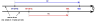
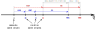
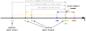

# The Affine Space

The affine space has two types of entities:

- **_Point_** - a position specified with coordinate values (e.g., location, address, etc.)
- **_Displacement vector_** - the difference between two points (e.g., shift, offset,
  displacement, duration, etc.)

In the following subchapters, we will often refer to _displacement vectors_ simply as
_vectors_ for brevity.

!!! note

    The _displacement vector_ described here is specific to the affine space theory and is not the same
    thing as the quantity of a vector character that we discussed in the
    ["Scalars, vectors, and tensors" chapter](character_of_a_quantity.md#scalars-vectors-and-tensors)
    (although, in some cases, those terms may overlap).


## Operations in the affine space

Here are the primary operations one can do in the affine space:

- _vector_ + _vector_ -> _vector_
- _vector_ - _vector_ -> _vector_
- -_vector_ -> _vector_
- _vector_ * scalar -> _vector_
- scalar * _vector_ -> _vector_
- _vector_ / scalar -> _vector_
- _point_ - _point_ -> _vector_
- _point_ + _vector_ -> _point_
- _vector_ + _point_ -> _point_
- _point_ - _vector_ -> _point_

!!! important

    It is not possible to:

    - add two _points_,
    - subtract a _point_ from a _vector_,
    - multiply nor divide _points_ with anything else.


## _Points_ are more common than most of us imagine

_Point_ abstractions should be used more often in the C++ software.
They are not only about _temperature_ or _time_. _Points_ are everywhere around us and
should become more popular in the products we implement. They can be used to implement:

- _temperature_ points,
- timestamps,
- daily _mass_ readouts from the scale,
- _altitudes_ of mountain peaks on a map,
- current _path length_ measured by the car's odometer,
- today's _price_ of instruments on the market,
- and many more.

Improving the affine space's _Points_ intuition will allow us to write better and safer
software.


## _Displacement vector_ is modeled by `quantity`

Up until now, each time we used a `quantity` in our code, we were modeling some kind of a
difference between two things:

- the _distance_ between two points,
- _duration_ between two time points,
- the difference in _speed_ (even if relative to zero).

As we already know, a `quantity` type provides all operations required for a
_displacement vector_ abstraction in the affine space. It can be constructed with:

- the multiply syntax (works for most of the units),
- `delta<Reference>` construction helper (e.g., `delta<isq::height[m]>(42)`, `delta<deg_C>(3)`),
- two-parameter constructor taking a number and a quantity reference/unit.

!!! note

    The multiply syntax support is disabled for units that provide a point origin in their
    definition (i.e., units of temperature like `K`, `deg_C`, and `deg_F`).


## _Point_ is modeled by `quantity_point` and `PointOrigin`

In the **mp-units** library, the _Point_ abstraction is modelled by:

- [`PointOrigin` concept](concepts.md#PointOrigin) that specifies measurement origin, and
- `quantity_point` class template that specifies a _Point_ relative to a specific
  predefined origin.


### `quantity_point`

The `quantity_point` class template specifies an absolute quantity measured from a predefined
origin:

```cpp
template<Reference auto R,
         PointOriginFor<get_quantity_spec(R)> auto PO = default_point_origin(R),
         RepresentationOf<get_quantity_spec(R)> Rep = double>
class quantity_point;
```

As we can see above, the `quantity_point` class template exposes one additional parameter compared
to `quantity`. The `PO` parameter satisfies a [`PointOriginFor` concept](concepts.md#PointOriginFor)
and specifies the origin of our measurement scale.

Each `quantity_point` internally stores a `quantity` object, which represents a
_displacement vector_ from the predefined origin. Thanks to this, an instantiation of
a `quantity_point` can be considered as a model of a vector space from such an origin.

Forcing the user to manually predefine an origin for every domain may be cumbersome and
discourage users from using such abstractions at all. This is why, by default, the `PO`
template parameter is initialized with the `default_point_origin(R)` that provides the
quantity points' scale origin using the following rules:

- if the measurement unit of a quantity specifies its point origin in its definition
  (e.g., degree Celsius), then this origin is being used,
- otherwise, an instantiation of `natural_point_origin<QuantitySpec>` is being used which
  provides a well-established natural origin for a specific quantity type.

Quantity points with default point origins may be constructed with the `point` construction
helper or forcing an explicit conversion from the `quantity`:

```cpp
// quantity_point qp1 = 42 * m;           // Compile-time error
// quantity_point qp2 = 42 * K;           // Compile-time error
// quantity_point qp3 = delta<deg_C>(42); // Compile-time error
quantity_point qp4(42 * m);
quantity_point qp5(42 * K);
quantity_point qp6(delta<deg_C>(42));
quantity_point qp7 = point<m>(42);
quantity_point qp8 = point<K>(42);
quantity_point qp9 = point<deg_C>(42);
```

!!! tip

    The `quantity_point` definition can be found in the `mp-units/quantity_point.h` header file.


#### `natural_point_origin<QuantitySpec>`

`natural_point_origin<QuantitySpec>` is meant to be used in cases where the specific domain
has a well-established, non-controversial, and unique natural origin on the measurement scale.
This saves the user from the need to write a boilerplate code that would predefine such a type
for this domain.

{style="width:80%;display: block;margin: 0 auto;"}

```cpp
quantity_point<isq::distance[si::metre]> qp1(100 * m);
quantity_point<isq::distance[si::metre]> qp2 = point<m>(120);

assert(qp1.quantity_from_unit_zero() == 100 * m);
assert(qp2.quantity_from_unit_zero() == 120 * m);
assert(qp2.quantity_from(qp1) == 20 * m);
assert(qp1.quantity_from(qp2) == -20 * m);

assert(qp2 - qp1 == 20 * m);
assert(qp1 - qp2 == -20 * m);

// auto res = qp1 + qp2;   // Compile-time error
```

In the above code `100 * m` and `120 * m` still create two quantities that serve as
_displacement vectors_ here. Quantity point objects can be explicitly constructed from
such quantities only when their origin is an instantiation of the `natural_point_origin<QuantitySpec>`.

It is really important to understand that even though we can use `.quantity_from_unit_zero()`
to obtain the _displacement vector_ of a point from the origin, the point by itself does
not represent or have any associated physical value. It is just a point in some space.
The same point can be expressed with different _displacement vectors_ from different origins.

It is also worth mentioning that simplicity comes with a safety cost here. For some users,
it might be surprising that the usage of `natural_point_origin<QuantitySpec>` makes various
quantity point objects compatible as long as quantity types used in the origin and reference
are compatible:

```cpp
quantity_point<si::metre> qp1{isq::distance(100 * m)};
quantity_point<si::metre> qp2 = point<isq::height[m]>(120);

assert(qp2.quantity_from(qp1) == 20 * m);
assert(qp1.quantity_from(qp2) == -20 * m);
assert(qp2 - qp1 == 20 * m);
assert(qp1 - qp2 == -20 * m);
```


### Absolute _point_ origin

In cases where we want to implement an isolated independent space in which points are not
compatible with other spaces, even of the same quantity type, we should manually predefine
an absolute point origin.

{style="width:80%;display: block;margin: 0 auto;"}

```cpp
inline constexpr struct origin final : absolute_point_origin<isq::distance> {} origin;

// quantity_point<si::metre, origin> qp1{100 * m};        // Compile-time error
// quantity_point<si::metre, origin> qp2{delta<m>(120)};  // Compile-time error
quantity_point<si::metre, origin> qp1 = origin + 100 * m;
quantity_point<si::metre, origin> qp2 = 120 * m + origin;

// assert(qp1.quantity_from_unit_zero() == 100 * m);   // Compile-time error
// assert(qp2.quantity_from_unit_zero() == 120 * m);   // Compile-time error
assert(qp1.quantity_from(origin) == 100 * m);
assert(qp2.quantity_from(origin) == 120 * m);
assert(qp2.quantity_from(qp1) == 20 * m);
assert(qp1.quantity_from(qp2) == -20 * m);

assert(qp1 - origin == 100 * m);
assert(qp2 - origin == 120 * m);
assert(qp2 - qp1 == 20 * m);
assert(qp1 - qp2 == -20 * m);

assert(origin - qp1 == -100 * m);
assert(origin - qp2 == -120 * m);

// assert(origin - origin == 0 * m);   // Compile-time error
```

We can't construct a quantity point directly from the quantity anymore when a custom,
named origin is used. To prevent potential safety and maintenance issues, we always need
to explicitly provide both a compatible origin and a quantity measured from it to construct
a quantity point.

Said otherwise, a quantity point defined in terms of a specific origin is the result of
adding the origin and the _displacement vector_ measured from it to the point we create.

!!! info

    A rationale for this longer construction syntax can be found in the
    [Why can't I create a quantity by passing a number to a constructor?](../../getting_started/faq.md#why-cant-i-create-a-quantity-by-passing-a-number-to-a-constructor)
    chapter.

Similarly to [creation of a quantity](../../getting_started/quick_start.md#quantities),
if someone does not like the operator-based syntax to create a `quantity_point`, the same results
can be achieved with a two-parameter constructor:

```cpp
quantity_point qp1{100 * m, origin};
```

Again, CTAD always helps to use precisely the type we need in a current case.

Additionally, if a quantity point is defined in terms of a custom, named origin, then we
can't use a `quantity_from_unit_zero()` member function anymore. This is to prevent surprises,
as our origin may not necessarily be perceived as an absolute zero in the domain we model.
Also, as we will learn soon, we can define several related origins in one space, and then
it gets harder to understand which one is the zero one. This is why, to be specific and
always correct about the points we use, a `quantity_from(QP)` member function can be used
(where `QP` can either be an origin or another quantity point).

Finally, please note that it is not allowed to subtract two point origins defined in terms
of `absolute_point_origin` (e.g., `origin - origin`) as those do not contain information
about the unit, so we cannot determine a resulting `quantity` type.

#### Modeling independent spaces in one domain

Absolute point origins are also perfect for establishing independent spaces even if the
same quantity type and unit is being used:

{style="width:80%;display: block;margin: 0 auto;"}

```cpp
inline constexpr struct origin1 final : absolute_point_origin<isq::distance> {} origin1;
inline constexpr struct origin2 final : absolute_point_origin<isq::distance> {} origin2;

quantity_point qp1 = origin1 + 100 * m;
quantity_point qp2 = origin2 + 120 * m;

assert(qp1.quantity_from(origin1) == 100 * m);
assert(qp2.quantity_from(origin2) == 120 * m);

assert(qp1 - origin1 == 100 * m);
assert(qp2 - origin2 == 120 * m);
assert(origin1 - qp1 == -100 * m);
assert(origin2 - qp2 == -120 * m);

// assert(qp2 - qp1 == 20 * m);                    // Compile-time error
// assert(qp1 - origin2 == 100 * m);               // Compile-time error
// assert(qp2 - origin1 == 120 * m);               // Compile-time error
// assert(qp2.quantity_from(qp1) == 20 * m);       // Compile-time error
// assert(qp1.quantity_from(origin2) == 100 * m);  // Compile-time error
// assert(qp2.quantity_from(origin1) == 120 * m);  // Compile-time error
```


### Relative _Point_ origin

We often do not have only one ultimate "zero" point when we measure things. Often, we have
one common scale, but we measure various quantities relative to different points and expect
those points to be compatible. There are many examples here, but probably the most common are
temperatures, timestamps, and altitudes.

For such cases, relative point origins should be used:

{style="width:80%;display: block;margin: 0 auto;"}

```cpp
inline constexpr struct A final : absolute_point_origin<isq::distance> {} A;
inline constexpr struct B final : relative_point_origin<A + 10 * m> {} B;
inline constexpr struct C final : relative_point_origin<B + 10 * m> {} C;
inline constexpr struct D final : relative_point_origin<A + 30 * m> {} D;

quantity_point qp1 = C + 100 * m;
quantity_point qp2 = D + 120 * m;

assert(qp1.quantity_ref_from(qp1.point_origin) == 100 * m);
assert(qp2.quantity_ref_from(qp2.point_origin) == 120 * m);

assert(qp2.quantity_from(qp1) == 30 * m);
assert(qp1.quantity_from(qp2) == -30 * m);
assert(qp2 - qp1 == 30 * m);
assert(qp1 - qp2 == -30 * m);

assert(qp1.quantity_from(A) == 120 * m);
assert(qp1.quantity_from(B) == 110 * m);
assert(qp1.quantity_from(C) == 100 * m);
assert(qp1.quantity_from(D) == 90 * m);
assert(qp1 - A == 120 * m);
assert(qp1 - B == 110 * m);
assert(qp1 - C == 100 * m);
assert(qp1 - D == 90 * m);

assert(qp2.quantity_from(A) == 150 * m);
assert(qp2.quantity_from(B) == 140 * m);
assert(qp2.quantity_from(C) == 130 * m);
assert(qp2.quantity_from(D) == 120 * m);
assert(qp2 - A == 150 * m);
assert(qp2 - B == 140 * m);
assert(qp2 - C == 130 * m);
assert(qp2 - D == 120 * m);

assert(B - A == 10 * m);
assert(C - A == 20 * m);
assert(D - A == 30 * m);
assert(D - C == 10 * m);

assert(B - B == 0 * m);
// assert(A - A == 0 * m);  // Compile-time error
```

!!! note

    Even though we can't subtract two absolute point origins from each other, it is possible to
    subtract relative ones or relative and absolute ones.


### Converting between different representations of the same _point_

As we might represent the same _point_ with _displacement vectors_ from various origins, the
library provides facilities to convert the same _point_ to the `quantity_point` class templates
expressed in terms of different origins.

{style="width:80%;display: block;margin: 0 auto;"}

For this purpose, we can use either:

- A converting constructor:

    ```cpp
    quantity_point<si::metre, C> qp2C = qp2;
    assert(qp2C.quantity_ref_from(qp2C.point_origin) == 130 * m);
    ```

- A dedicated conversion interface:

    ```cpp
    quantity_point qp2B = qp2.point_for(B);
    quantity_point qp2A = qp2.point_for(A);

    assert(qp2B.quantity_ref_from(qp2B.point_origin) == 140 * m);
    assert(qp2A.quantity_ref_from(qp2A.point_origin) == 150 * m);
    ```

It is important to understand that all such translations still describe exactly the same point
(e.g., all of them compare equal):

```cpp
assert(qp2 == qp2C);
assert(qp2 == qp2B);
assert(qp2 == qp2A);
```

!!! important

    It is only allowed to convert between various origins defined in terms of the same
    `absolute_point_origin`. Even if it is possible to express the same _point_ as a
    _displacement vector_ from another `absolute_point_origin`, the library will not provide such
    a conversion. A custom user-defined conversion function will be needed to add such a
    functionality.

    Said another way, in the library, there is no way to spell how two distinct `absolute_point_origin`
    types relate to each other.


## Range-Validated Quantity Points { #range-validated-quantity-points }

!!! tip "Background reading"

    For a deeper discussion of the motivation, design trade-offs, and open questions,
    see the blog article
    [Range-Validated Quantity Points](../../blog/posts/range-validated-quantity-points.md).

In many domains, quantity points must stay within specific bounds. For example:

- Geographic coordinates: latitude ∈ [-90°, 90°], longitude ∈ [-180°, 180°)
- Temperature sensors: operating range [−40°C, 85°C]
- Control systems: valid input range [0, 100] units

The library provides four overflow policies that can be passed as template parameters to
point origins. These policies enforce bounds during construction, unit conversion, and
arithmetic operations.

??? info "Production Use Case: Geographic Coordinate Systems"

    This feature was specifically designed to support production requirements for
    geographic/navigation systems, where different angle types require different wrapping
    behaviors:

    - **_Latitude_** (symmetric): reflects at ±90° boundaries (can't go past poles)
    - **_Longitude_** (mirrored): wraps circularly at -180° to +180°
    - **_Elevation_** (symmetric): reflects at ±90° like _latitude_
    - **_Geometric Azimuth_** (mirrored): 0° = East, counter-clockwise, wraps [-180°, 180°)
    - **_Heading_** (mirrored): 0° = North, counter-clockwise, wraps [-180°, 180°)
        - Conversion: `heading = geometric_azimuth - 90°` (simple offset)
        - Uses `relative_point_origin<east + delta<geometric_azimuth[degree]>(-90.)>`
    - **_Bearing_** (mirrored): 0° = North, clockwise, wraps [-180°, 180°)
        - Conversion: `bearing = 90° - geometric_azimuth` (involves negation)
        - Cannot use `relative_point_origin` (requires separate `absolute_point_origin`)

    These requirements came from companies working with coordinate reference systems (CRS),
    navigation, and geodesy. See the complete discussion in
    [GitHub #782](https://github.com/mpusz/mp-units/discussions/782).

    **Key Insight**: `relative_point_origin` can only model offset transformations (addition/subtraction).
    Transformations involving negation or sign flips (like bearing ↔ azimuth) require separate
    `absolute_point_origin` types with explicit conversion functions. This ensures type safety
    while allowing the framework to handle appropriate coordinate transformations automatically.

    **Type Safety with `is_kind`**: All geographic quantity specs use `is_kind` to prevent
    accidental mixing of different angle types (e.g., `latitude + longitude`, `bearing + heading`).
    This requires explicit conversion when using trigonometric functions:

    ```cpp
    // Convert to plain angular_measure for trig functions
    const quantity<angular_measure> lat_angle = isq::angular_measure(lat.quantity_from(geographic::equator));
    const quantity result = sin(lat_angle);  // Works with angular_measure
    ```

    The current framework handles all wrapping schemes and coordinate transformations expressible
    as offsets. Advanced geodetic calculations (ellipsoid parameters, distance formulas for WGS84,
    etc.) require additional domain-specific extensions beyond the core library. For a complete
    working example, see [`geographic.h`](https://github.com/mpusz/mp-units/blob/master/example/include/geographic.h)
    and the [UAV: Multiple Altitude Reference Systems](../../examples/unmanned_aerial_vehicle.md)
    example, which demonstrates multiple point origins, bounds checking policies, overflow handling,
    and coordinate reference conversions.

### Available Overflow Policies

| Policy               | Behavior                                                                   | Error Handling       | Use Case                                                   |
|----------------------|----------------------------------------------------------------------------|----------------------|------------------------------------------------------------|
| `check_in_range`     | Reports violation via `constraint_violation_handler` or `MP_UNITS_EXPECTS` | Depends on rep type  | Bounds checking with customizable error behavior           |
| `clamp_to_range`     | Clamps to nearest boundary: `clamp(value, min, max)`                       | Silent correction    | Saturating arithmetic, sensor limits, UI controls          |
| `wrap_to_range`      | Wraps circularly to `[min, max)`: modulo arithmetic                        | Value transformation | Periodic quantities (_angles_, _time-of-day_, _longitude_) |
| `reflect_in_range`   | Reflects at boundaries (like a bouncing ball)                              | Value transformation | Geographic _elevation angle_, physical boundaries          |
| `check_non_negative` | Reports violation if `value < 0`                                           | Depends on rep type  | Inherently non-negative quantities (_length_, _mass_)      |
| `clamp_non_negative` | Clamps negative values to zero                                             | Silent correction    | FP rounding noise in non-negative domains                  |

!!! important

    The four bounded-range policies (`check_in_range`, `clamp_to_range`, `wrap_to_range`,
    `reflect_in_range`) expose public `min` and `max` data members, enabling `std::numeric_limits`
    specializations to reflect the constrained bounds. `check_non_negative` and
    `clamp_non_negative` are halfline policies with no upper bound and therefore do not
    expose `max`. See the `std::numeric_limits` note below for details.

!!! info "Error behavior of `check_in_range`"

    `check_in_range` delegates error reporting to the representation type:

    - If the rep has a [`constraint_violation_handler`](representation_types.md#constraint-violation-handler)
      specialization (e.g. `constrained<double, throw_policy>`), the handler's `on_violation()` is called,
      providing **guaranteed enforcement** regardless of build mode.
    - Otherwise, falls back to [`MP_UNITS_EXPECTS`](../../how_to_guides/integration/wide_compatibility.md#contract-checking-macros),
      which may be disabled in release builds.

    See [Tutorial: Custom Contract Handlers](../../tutorials/affine_space/custom_contract_handlers.md)
    for a step-by-step guide to implementing custom error policies, or
    [How to: Ensure Ultimate Safety](../../how_to_guides/advanced_usage/ultimate_safety.md) for a
    complete example of combining `check_in_range` with `constrained` rep types.

### Example Usage

```cpp
// Define quantity specifications and origins
inline constexpr struct geo_latitude final : quantity_spec<isq::angular_measure> {} geo_latitude;
inline constexpr struct geo_longitude final : quantity_spec<isq::angular_measure> {} geo_longitude;

inline constexpr struct equator final :
    absolute_point_origin<geo_latitude, reflect_in_range{-90 * si::degree, 90 * si::degree}> {} equator;
inline constexpr struct prime_meridian final :
    absolute_point_origin<geo_longitude, wrap_to_range{-180 * si::degree, 180 * si::degree}> {} prime_meridian;

// Define bounded quantity point types
template<typename T = double> using latitude = quantity_point<si::degree, equator, T>;
template<typename T = double> using longitude = quantity_point<si::degree, prime_meridian, T>;

void example()
{
  latitude lat = equator + 45.0 * deg;           // Valid: within [-90, 90]
  lat = equator + 95.0 * deg;                    // Reflects to 85° (reflect_in_range mirrors at boundary)

  longitude lon = prime_meridian + 270.0 * deg;  // Wraps to -90° (wrap_to_range treats range as circular)
  lon += 200.0 * deg;                            // Result wraps: -90 + 200 = 110°
}
```

!!! tip "Simplified"

    True geodetic _latitude_ reflection also requires shifting _longitude_ by 180° (crossing a pole puts
    you on the opposite side of the globe).


### How It Works

Bounds are enforced at these points:

1. **Construction** from a quantity: `quantity_point{value * unit, origin}`
2. **Unit conversion**: `qp.in(other_unit)`, `qp.force_in(other_unit)`
3. **Arithmetic operations**: `operator+=`, `operator-=`, `operator++`, `operator--`
4. **Origin conversion**: `qp.point_for(new_origin)`

After each mutation the library transparently applies the bounds policy specified on the origin.

### Origin Inheritance

A `relative_point_origin` that defines **no own bounds** automatically inherits the parent
origin's enforcement. Bounds translate through the chain at compile time — the relative
value is translated to the owning ancestor's frame, the policy is applied there, and the
result is translated back:

```cpp
inline constexpr struct sea_level final :
    absolute_point_origin<isq::altitude, clamp_to_range{-500 * m, 12'000 * m}> {} sea_level;

// Relative origin — no own bounds; inherits clamping from sea_level.
inline constexpr struct airport_elevation final :
    relative_point_origin<sea_level + 200 * m> {} airport_elevation;

// 11'900 m above airport = 12'100 m MSL → exceeds 12'000 m cap → clamped to 11'800 m from airport.
quantity_point takeoff = airport_elevation + 11'900.0 * m;
```

This applies to all bound policies — including the `check_non_negative` bounds that are
automatically attached to `natural_point_origin` of a non-negative quantity spec.  A relative
origin *above* the ground floor may therefore hold negative values, as long as the absolute
position stays ≥ 0:

```cpp
inline constexpr struct height_spec final : quantity_spec<isq::height> {} height_spec;

// natural_point_origin<height_spec> auto-gets check_non_negative (isq::height is non_negative).
inline constexpr struct average_height_origin final :
    relative_point_origin<natural_point_origin<height_spec> + 1700.0 * m> {} average_height_origin;

// −1500 m relative = 200 m absolute (≥ 0) → valid, unchanged.
quantity_point low = average_height_origin - 1500.0 * m;

// −1701 m relative = −1 m absolute → check_non_negative fires.
// quantity_point bad = average_height_origin - 1701.0 * m;  // ❌
```

When a `relative_point_origin` defines its **own bounds**, they are additionally checked at
compile time to nest within the parent's bounds (see the _Hierarchical bounds validation_
note in the [Custom Policies](#custom-policies-one-sided-bounds) section below).

!!! info "`std::numeric_limits` integration"

    When a `quantity_point` has a bounds policy on its origin, the
    `std::numeric_limits` specialization automatically reflects the constrained bounds:

    ```cpp
    // prime_meridian defined with wrap_to_range{-180 * deg, 180 * deg}
    using longitude = quantity_point<geo_longitude[deg], prime_meridian>;

    quantity lon_min = std::numeric_limits<longitude>::min();  // prime_meridian - 180°
    quantity lon_max = std::numeric_limits<longitude>::max();  // prime_meridian + 180°
    ```

    This works because the policy struct exposes public `min` and `max` data members, which
    `quantity_point::min()` and `max()` access to provide meaningful bounds. Without a
    bounds policy, `std::numeric_limits` delegates to the representation type's limits.

### Custom Policies (One-Sided Bounds)

The library ships two built-in one-sided halfline policies for `[0, +∞)` domains:
`check_non_negative` (reports a violation when the value is negative) and
`clamp_non_negative` (silently clamps negative values to zero). These are automatically
applied to any `quantity_point` whose origin is a `natural_point_origin` of a non-negative
quantity spec (such as `isq::length`, `isq::mass`, or `isq::duration`).

For other one-sided constraints, you can create a fully custom policy:

```cpp
template<Quantity Q>
struct clamp_bottom {
  Q min;  // Public member enables std::numeric_limits support

  template<Quantity V>
  constexpr V operator()(V v) const { return v < min ? min : v; }
};

// Usage: hydraulic system with minimum operating pressure
inline constexpr struct atmospheric_pressure final :
    absolute_point_origin<isq::pressure, clamp_bottom{1000 * si::kilo<si::pascal>}> {} atmospheric_pressure;

using hydraulic_pressure = quantity_point<si::kilo<si::pascal>, atmospheric_pressure>;
hydraulic_pressure p1 = atmospheric_pressure + 2000 * kPa;  // OK: 2000 kPa
hydraulic_pressure p2 = atmospheric_pressure + 500 * kPa;   // Clamped to 1000 kPa (min operating pressure)
```

!!! important "Hierarchical bounds validation"

    When a `relative_point_origin` defines bounds and its parent origin also has bounds, the
    library enforces at **compile time** that the child's bounds fit within the parent's bounds
    (after translating to the parent's reference frame).

    This hierarchical validation ensures semantic correctness: if you model origin `B` as
    relative to origin `A`, and `A` has operational constraints, then `B` inheriting those
    constraints is physically and logically appropriate (e.g., a room's temperature range
    shouldn't exceed the building HVAC system's capability, a drone's altitude above launch
    point shouldn't exceed airspace authorization limits).

    **Absolute origin bounds** represent physical constraints (e.g., temperature can't go below
    absolute zero) and are always enforced—this is non-negotiable.

    **Relative origin bounds** hierarchical enforcement represents our current design decision
    based on typical use cases. If you encounter scenarios where nested relative origins need
    independent bounds (not constrained by their parent), please [share your feedback](https://github.com/mpusz/mp-units/discussions)
    so we can evaluate adding opt-in flexibility.

??? note "Implementation reference"

    See [`geographic.h`](https://github.com/mpusz/mp-units/blob/master/example/include/geographic.h)
    and [`overflow_policies.h`](https://github.com/mpusz/mp-units/blob/master/src/core/include/mp-units/overflow_policies.h)
    for complete examples.


## Temperature support

Support for temperature quantity points is probably one of the most common examples of relative
point origins in action that we use in daily life.

The [SI](../../reference/bibliography.md#SIBrochure) definition in the library provides a few
predefined point origins for this purpose:

```cpp
namespace si {

inline constexpr struct absolute_zero final : absolute_point_origin<isq::thermodynamic_temperature> {} absolute_zero;

inline constexpr struct ice_point final : relative_point_origin<point<milli<kelvin>>(273'150)}> {} ice_point;

}

namespace usc {

inline constexpr struct fahrenheit_zero final :
  relative_point_origin<point<mag_ratio<5, 9> * si::degree_Celsius>(-32)> {} fahrenheit_zero;

}
```

The above is a great example of how point origins can be stacked on top of each other:

- `usc::fahrenheit_zero` is defined relative to `si::ice_point`
- `si::ice_point` is defined relative to `si::absolute_zero`.

!!! note

    Notice that while stacking point origins, we can use different representation types and units
    for origins and a _point_. In the above example, the relative point origin for degree Celsius
    is defined in terms of `si::kelvin`, while the quantity point for it will use
    `si::degree_Celsius` as a unit.

The temperature point origins defined above are provided explicitly in the respective units'
definitions:

```cpp
namespace si {

inline constexpr struct kelvin final :
    named_unit<"K", kind_of<isq::thermodynamic_temperature>, absolute_zero> {} kelvin;
inline constexpr struct degree_Celsius final :
    named_unit<{u8"℃", "`C"}, kelvin, ice_point> {} degree_Celsius;

}

namespace usc {

inline constexpr struct degree_Fahrenheit final :
    named_unit<{u8"℉", "`F"}, mag_ratio<5, 9> * si::degree_Celsius,
               fahrenheit_zero> {} degree_Fahrenheit;

}
```

As it was described above, `default_point_origin(R)` returns a `natural_point_origin<QuantitySpec>`
when a unit does not provide any origin in its definition. As of today, the units of temperature
are the only ones in the entire **mp-units** library that provide such origins.

Now, let's see how we can benefit from the above definitions. We have quite a few alternatives
to choose from here. Depending on our needs or tastes, we can:

- be explicit about the unit and origin:

    ```cpp
    quantity_point<si::degree_Celsius, si::ice_point> q1 = si::ice_point + delta<deg_C>(20.5);
    quantity_point<si::degree_Celsius, si::ice_point> q2{delta<deg_C>(20.5), si::ice_point};
    quantity_point<si::degree_Celsius, si::ice_point> q3{delta<deg_C>(20.5)};
    quantity_point<si::degree_Celsius, si::ice_point> q4 = point<deg_C>(20.5);
    ```

- specify a unit and use its point origin implicitly:

    ```cpp
    quantity_point<si::degree_Celsius> q5 = si::ice_point + delta<deg_C>(20.5);
    quantity_point<si::degree_Celsius> q6{delta<deg_C>(20.5), si::ice_point};
    quantity_point<si::degree_Celsius> q7{delta<deg_C>(20.5)};
    quantity_point<si::degree_Celsius> q8 = point<deg_C>(20.5);
    ```

- benefit from CTAD:

    ```cpp
    quantity_point q9 = si::ice_point + delta<deg_C>(20.5);
    quantity_point q10{delta<deg_C>(20.5), si::ice_point};
    quantity_point q11{delta<deg_C>(20.5)};
    quantity_point q12 = point<deg_C>(20.5);
    ```

In all of the above cases, we end up with the `quantity_point` of the same type and value.

To play a bit more with temperatures, we can implement a simple room AC temperature controller
in the following way:

{style="width:80%;display: block;margin: 0 auto;"}

Now that the `Range-Validated Quantity Points` infrastructure is available, we can attach
a `clamp_to_range` policy so the controller silently enforces the comfort band:

```cpp
constexpr struct room_reference_temp final :
    relative_point_origin<point<deg_C>(21), clamp_to_range{delta<deg_C>(-3), delta<deg_C>(3)}> {} room_reference_temp;
using room_temp = quantity_point<deg_C, room_reference_temp>;

constexpr auto step_delta = delta<deg_C>(0.5);
constexpr int number_of_steps = 6;

room_temp room_ref{};
room_temp room_low  = room_ref - number_of_steps * step_delta;  // −3 °C: exactly at lower bound
room_temp room_high = room_ref + number_of_steps * step_delta;  // +3 °C: exactly at upper bound

// Any attempt to exceed the ±3 °C comfort range is silently clamped
room_temp clamped = room_ref + delta<deg_C>(10.0);              // → auto-clamped to +3 °C from reference

std::println("Room reference temperature: {} ({}, {::N[.2f]})\n",
             room_ref.quantity_from_unit_zero(),
             room_ref.in(usc::degree_Fahrenheit).quantity_from_unit_zero(),
             room_ref.in(si::kelvin).quantity_from_unit_zero());

std::println("| {:<18} | {:^18} | {:^18} | {:^18} |",
             "Temperature delta", "Room reference", "Ice point", "Absolute zero");
std::println("|{0:=^20}|{0:=^20}|{0:=^20}|{0:=^20}|", "");

auto print_temp = [&](std::string_view label, auto v) {
  std::println("| {:<18} | {:^18} | {:^18} | {:^18:N[.2f]} |", label,
               v - room_reference_temp, (v - si::ice_point).in(deg_C), (v - si::absolute_zero).in(deg_C));
};

print_temp("Lowest", room_low);
print_temp("Default", room_ref);
print_temp("Highest", room_high);
print_temp("Clamped to max", clamped);
```

The above prints:

```text
Room reference temperature: 21 ℃ (69.8 ℉, 294.15 K)

| Temperature delta  |   Room reference   |     Ice point      |   Absolute zero    |
|====================|====================|====================|====================|
| Lowest             |       -3 ℃        |       18 ℃        |     291.15 ℃      |
| Default            |        0 ℃        |       21 ℃        |     294.15 ℃      |
| Highest            |        3 ℃        |       24 ℃        |     297.15 ℃      |
| Clamped to max     |        3 ℃        |       24 ℃        |     297.15 ℃      |
```


## No text output for _Points_

The library does not provide a text output for quantity points. The quantity stored inside
is just an implementation detail of this type. It is a vector from a specific origin.
Without the knowledge of the origin, the vector by itself is useless as we can't determine
which point it describes.

In the current library design, point origin does not provide any text in its definition.
Even if we could add such information to the point's definition, we would not
know how to output it in the text. There may be many ways to do it. For example, should we
prepend or append the origin part to the quantity text?

For example, the text output of $42\ \mathrm{m}$ for a quantity point may mean many
things. It may be an offset from the mountain top, sea level, or maybe the center of Mars.
Printing $42\ \mathrm{m}\ \mathrm{AMSL}$ for altitudes above mean sea level is a much
better solution, but the library does not have enough information to print it that way
by itself.


## The affine space is about type-safety

The following operations are not allowed in the affine space:

- **adding** two `quantity_point` objects
    - It is physically impossible to add positions of home and Denver airports.
- **subtracting** a `quantity_point` from a `quantity`
    - What would it mean to subtract the DEN airport location from the distance to it?
- **multiplying/dividing** a `quantity_point` with a scalar
    - What is the position of `2 *` DEN airport location?
- **multiplying/dividing** a `quantity_point` with a quantity
    - What would multiplying the distance with the DEN airport location mean?
- **multiplying/dividing** two `quantity_point` objects
    - What would multiplying home and DEN airport location mean?
- **mixing** `quantity_points` of different quantity kinds
    - It is physically impossible to subtract time from length.
- **mixing** `quantity_points` of inconvertible quantities
    - What does subtracting a distance point to DEN airport from the Mount Everest base
      camp altitude mean?
- **mixing** `quantity_points` of convertible quantities but with unrelated origins
    - How do we subtract a point on our trip to CppCon measured relatively to our home
      location from a point measured relative to the center of the Solar System?

!!! important "Important: The affine space improves safety"

    The usage of `quantity_point` and affine space types, in general, improves expressiveness and
    type-safety of the code we write.
