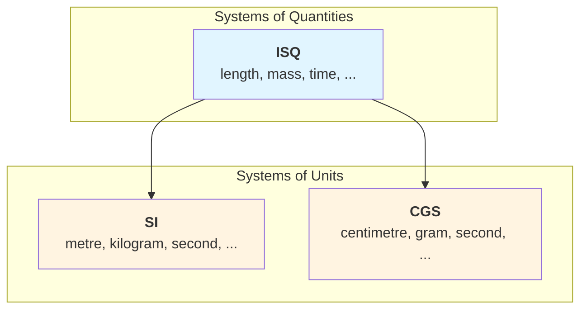

# Introduction

This section provides detailed documentation for the most commonly used systems of quantities
and units available in **mp-units**. While the library supports many systems through its
flexible framework, we focus here on systems that are widely adopted in scientific and
engineering applications.

## About Systems in mp-units

As discussed in the Framework Basics, understanding both
[Systems of Quantities](../framework_basics/systems_of_quantities.md) and
[Systems of Units](../framework_basics/systems_of_units.md) is crucial for effective use
of the library.

### System Architecture

!!! important

    **Systems of units are based on systems of quantities.** A system of quantities
    specifies quantities and their relationships through equations, without reference to
    specific units or numerical values. A system of units then provides concrete measurement
    units for those quantities.

    For example, both SI and CGS are built upon ISQ—they share the same quantity types
    (_length_, _mass_, _time_) but use different base units (metre vs centimetre, kilogram vs gram).

!!! note "Selective Include for Performance"

    Systems of units like SI don't include the entire ISQ. They only bring in the quantities
    needed for their definitions (base quantities and commonly used derived quantities).
    The full ISQ contains hundreds of quantities, which could increase compile times
    significantly if included when not needed.

### What Systems Provide

Systems provide:

- **Type Safety**: Prevent mixing incompatible quantities and units
- **Dimensional Analysis**: Automatic verification of equation correctness
- **Automatic Unit Conversions**: Eliminate magic numbers, scaling factors, and conversion
  macros (no more multiplying by 3.6 or dividing by 1000—the library handles it correctly)
- **Domain Modeling**: Express physical relationships in type-checked code
- **Standardization**: Use well-established scientific and engineering conventions

## Documented Systems

This User's Guide provides in-depth documentation for the following systems:

- **[International System of Quantities (ISQ)](isq.md)** - The foundation for SI and other
  systems, defining quantities and their relationships
- **[International System of Units (SI)](si.md)** - The modern metric system, most widely
  used
- **[IAU Astronomical Units](iau.md)** - International Astronomical Union standardized
  conversion constants for solar and planetary parameters
- **[Centimetre-Gram-Second (CGS) System](cgs.md)** - Still used in some areas of physics
  and chemistry
- **[Yard-Pound Systems](yard_pound.md)** - Family of measurement systems used primarily in
  the United States and historically throughout the British Commonwealth:
    - **`yard_pound`** - Foundation system based on the 1959 international agreement
    - **`imperial`** - British Imperial system extending yard-pound with UK-specific units
    - **`usc`** - United States customary system extending yard-pound with US-specific units
- **[Strong Angular Systems](strong_angular_system.md)** - Experimental extensions treating
  angle as a dimensional quantity:
    - **`angular`** - Standalone system with strong angular dimensions and units
    - **`isq_angle`** - ISQ amendment incorporating strong angular definitions
- **[Natural Units](natural_units.md)** - High-energy physics system where fundamental constants
  equal unity

!!! tip "Complete Catalog"

    For a comprehensive list of all available systems (including IEC, Typographic, HEP,
    and the `astronomy` utility system for commonly used astronomy units like light-years,
    jansky, sidereal days, etc.), see the [Supported Systems Overview](../../reference/systems_overview.md)
    in the Reference section.

## Choosing the Right System

The choice of system depends on your application domain and requirements:

- Use **SI** for most engineering and scientific applications - it's the international standard
- Use **ISQ + SI** when you need strong quantity type safety and hierarchy (e.g., distinguishing
  _length_, _width_, _height_, _radius_)
- Use **`angular`** when working with rotational mechanics and you want explicit angle dimensions
  without the full ISQ hierarchy
- Use **`isq_angle`** when you need both the ISQ quantity hierarchy and strong angular dimensions
  (e.g., for physically-correct _torque_ units)
- Use **IAU** for professional astronomy/astrophysics requiring official IAU standardized
  constants (nominal solar/planetary values, CODATA masses); use **`astronomy`** utilities
  for common astronomy units like light-years, jansky, sidereal days not standardized by IAU
- Use **Natural Units** for particle physics and cosmology calculations
- Use **CGS** when interfacing with legacy physics code or specific scientific domains where
  it's standard
- Use **`yard_pound`**, **`imperial`**, or **`usc`** when required by industry standards or
  regulations (e.g., aviation uses nautical miles and knots; US construction uses feet and
  inches; UK recipes use stones and imperial pints) - see [Yard-Pound Systems](yard_pound.md)
  for details on choosing between these related systems
