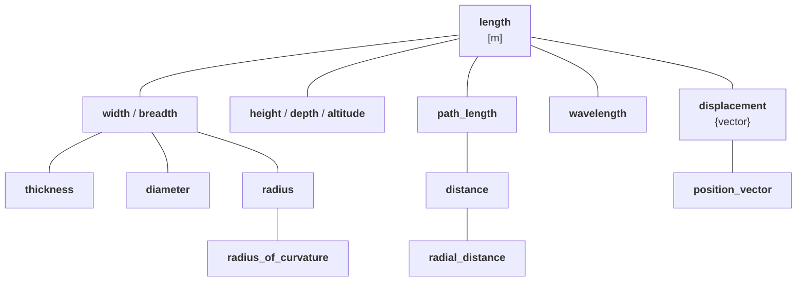

# International System of Quantities (ISQ)

## Overview

The **International System of Quantities (ISQ)** is the system of quantities used as the basis
for the International System of Units (SI) and other systems of units.

The ISQ is defined across the ISO/IEC 80000 series, which currently includes parts 1-17
covering quantities and units in various domains.

!!! info

    For a general introduction to systems of quantities and their importance, see
    [Systems of Quantities](../framework_basics/systems_of_quantities.md) in the
    Framework Basics section.

**mp-units** provides comprehensive support for the ISQ, likely making it the first
library (in any programming language) to model the complete ISO/IEC 80000 quantity
specification.


## Base Quantities and Dimensions

The ISQ defines seven base quantities, each with its own dimension. According to the SI Brochure:

!!! quote "SI Brochure (9th edition)"

    Physical quantities can be organized in a system of dimensions, where the system used is
    decided by convention. Each of the seven base quantities used in the SI is regarded as
    having its own dimension.

The **mp-units** library defines these base dimensions as follows:

```cpp
namespace mp_units::isq {

inline constexpr struct dim_length final : base_dimension<"L"> {} dim_length;
inline constexpr struct dim_mass final : base_dimension<"M"> {} dim_mass;
inline constexpr struct dim_time final : base_dimension<"T"> {} dim_time;
inline constexpr struct dim_electric_current final : base_dimension<"I"> {} dim_electric_current;
inline constexpr struct dim_thermodynamic_temperature final : base_dimension<symbol_text{u8"Θ", "O"}> {} dim_thermodynamic_temperature;
inline constexpr struct dim_amount_of_substance final : base_dimension<"N"> {} dim_amount_of_substance;
inline constexpr struct dim_luminous_intensity final : base_dimension<"J"> {} dim_luminous_intensity;

}
```

| Base Quantity             | Dimension Symbol | **mp-units** Identifier              |
|---------------------------|------------------|--------------------------------------|
| length                    | L                | `isq::dim_length`                    |
| mass                      | M                | `isq::dim_mass`                      |
| time                      | T                | `isq::dim_time`                      |
| electric current          | I                | `isq::dim_electric_current`          |
| thermodynamic temperature | Θ                | `isq::dim_thermodynamic_temperature` |
| amount of substance       | N                | `isq::dim_amount_of_substance`       |
| luminous intensity        | J                | `isq::dim_luminous_intensity`        |

These dimension symbols are consistently defined by both the SI Brochure and ISO/IEC 80000.


## Base and Derived Quantities

For each base dimension, the ISQ defines corresponding base quantities:

```cpp
namespace mp_units::isq {

inline constexpr struct length final : quantity_spec<dim_length> {} length;
inline constexpr struct mass final : quantity_spec<dim_mass> {} mass;
inline constexpr struct time final : quantity_spec<dim_time> {} time;
inline constexpr struct electric_current final : quantity_spec<dim_electric_current> {} electric_current;
inline constexpr struct thermodynamic_temperature final : quantity_spec<dim_thermodynamic_temperature> {} thermodynamic_temperature;
inline constexpr struct amount_of_substance final : quantity_spec<dim_amount_of_substance> {} amount_of_substance;
inline constexpr struct luminous_intensity final : quantity_spec<dim_luminous_intensity> {} luminous_intensity;

}
```


## Derived Quantities

The SI Brochure states:

!!! quote "SI Brochure (9th edition)"

    Since the number of quantities is without limit, it is not possible to provide a complete
    list of derived quantities and derived units.

However, ISO/IEC 80000 defines hundreds of standardized quantities across many domains.
The **mp-units** library provides definitions for all quantities specified in
the ISO/IEC 80000 series, organized by part:

- **Part 3**: Space and time (e.g., `velocity`, `acceleration`, `area`, `volume`)
- **Part 4**: Mechanics (e.g., `force`, `energy`, `power`, `pressure`)
- **Part 5**: Thermodynamics (e.g., `entropy`, `heat_capacity`)
- **Part 6**: Electromagnetism (e.g., `voltage`, `resistance`, `capacitance`)
- **Part 7**: Light and radiation (partial support)
- **Part 8**: Acoustics (TBD)
- **Part 9**: Physical chemistry and molecular physics (TBD)
- **Part 10**: Atomic and nuclear physics (TBD)
- **Part 11**: Characteristic numbers (TBD)
- **Part 12**: Condensed matter physics (TBD)
- **Part 13**: Information science and technology (e.g., `traffic_intensity`, `storage_capacity`, `transfer_rate`)
- **Part 14**: Telebiometrics related to human physiology (TBD)

### Example: Derived Quantities in Mechanics

```cpp
namespace mp_units::isq {

// Kinematics
inline constexpr struct speed final : quantity_spec<length / duration> {} speed;
inline constexpr struct velocity final : quantity_spec<speed, displacement / duration> {} velocity;
inline constexpr struct acceleration final : quantity_spec<velocity / duration> {} acceleration;

// Dynamics
inline constexpr struct force final : quantity_spec<mass * acceleration> {} force;
inline constexpr struct pressure final : quantity_spec<force / area, quantity_character::real_scalar> {} pressure;
inline constexpr struct energy final : quantity_spec<mass* pow<2>(length) / pow<2>(time)> {} energy;
inline constexpr struct power final : quantity_spec<mass* pow<2>(length) / pow<3>(time)> {} power;

// Many more...

}
```


## Quantity Hierarchies

As described in [Systems of Quantities](../framework_basics/systems_of_quantities.md#system-of-quantities-is-not-only-about-kinds),
the ISQ organizes quantities of the same kind into hierarchies. For example, quantities of
kind _length_:



In code:

```cpp
inline constexpr struct length final : quantity_spec<dim_length> {} length;
inline constexpr struct width final : quantity_spec<length> {} width;
inline constexpr auto breadth = width;
inline constexpr struct height final : quantity_spec<length> {} height;
inline constexpr auto depth = height;
inline constexpr auto altitude = height;
inline constexpr struct thickness final : quantity_spec<width> {} thickness;
inline constexpr struct diameter final : quantity_spec<width> {} diameter;
inline constexpr struct radius final : quantity_spec<width> {} radius;
inline constexpr struct radius_of_curvature final : quantity_spec<radius> {} radius_of_curvature;
inline constexpr struct path_length final : quantity_spec<length> {} path_length;
inline constexpr auto arc_length = path_length;
inline constexpr struct distance final : quantity_spec<path_length> {} distance;
inline constexpr struct radial_distance final : quantity_spec<distance> {} radial_distance;
inline constexpr struct wavelength final : quantity_spec<length> {} wavelength;
inline constexpr struct displacement final : quantity_spec<length, quantity_character::vector> {} displacement;
inline constexpr struct position_vector final : quantity_spec<displacement> {} position_vector;
```

This hierarchy enables strong type safety:

```cpp
using namespace mp_units::si::unit_symbols;

quantity<isq::height[m]> tower_height = 42 * m;
quantity<isq::distance[m]> walking_distance = 500 * m;

// quantity<isq::width[m]> w = tower_height;  // Compile-time error!
quantity<isq::length[m]> some_length = tower_height;  // OK: height is-a length
```


## Usage with Units

ISQ quantities are typically paired with SI units (or other compatible unit systems):

```cpp
using namespace mp_units;
using namespace mp_units::si::unit_symbols;

// Using the ISQ-SI pairing
quantity<isq::length[m]> distance = 100 * m;
quantity<isq::speed[m / s]> velocity = distance / (10 * s);
quantity<isq::force[N]> force = isq::mass(5 * kg) * isq::acceleration(9.81 * m / s2);
```

The library automatically ensures dimensional consistency and provides meaningful error
messages when incompatible operations are attempted.


## Using `QuantityOf` Concept

The `QuantityOf` concept allows constraining function parameters to accept quantities
of a specific kind, leveraging the hierarchy for type safety:

```cpp
using namespace mp_units;
using namespace mp_units::si::unit_symbols;

// Function accepting any length quantity
void process_length(QuantityOf<isq::length> auto length)
{
  std::cout << "Length: " << length << "\n";
}

// Function specifically for height measurements
void set_height(QuantityOf<isq::height> auto h)
{
  std::cout << "Height set to: " << h << "\n";
}

// Function for distances only
double unsafe_travel_time_in_s(QuantityOf<isq::distance> auto d, QuantityOf<isq::speed> auto v)
{
  return (d / v).numerical_value_in(s);
}

// Usage
quantity tower = isq::height(42 * m);
quantity road = isq::distance(500 * m);
quantity river = 10 * isq::width[m];

process_length(tower);   // OK: height is-a length
process_length(road);    // OK: distance is-a length
process_length(river);   // OK: width is-a length

set_height(tower);       // OK: height matches exactly
// set_height(road);     // Compile-time error: distance is not a height
// set_height(river);    // Compile-time error: width is not a height

double time = unsafe_travel_time_in_s(road, 50. * km / h);  // OK
// unsafe_travel_time_in_s(river, 50. * km / h);  // Compile-time error: width is not a distance
```

This provides powerful compile-time checking that enforces the semantic meaning of quantities,
not just their dimensions. A width cannot be used where a height is required, even though
both are lengths.


## References

- [ISO/IEC 80000 series](https://www.iso.org/standard/76921.html)
- [SI Brochure (9th edition)](https://www.bipm.org/en/publications/si-brochure)
- [Systems of Quantities](../framework_basics/systems_of_quantities.md) - Framework basics
- [Systems of Units](../framework_basics/systems_of_units.md) - Framework basics
