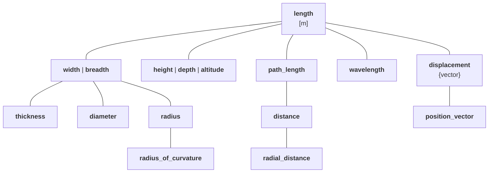

# International System of Quantities (ISQ)

The **International System of Quantities (ISQ)** is the system of quantities used as the basis
for the International System of Units (SI) and other systems of units.

!!! info

    For a general introduction to systems of quantities and their importance, see
    [Systems of Quantities](../framework_basics/systems_of_quantities.md) in the
    Framework Basics section.

The ISQ is defined across the ISO/IEC 80000 series, which currently includes parts 1-17
covering quantities and units in various domains.

**mp-units** provides comprehensive support for the ISQ, likely making it the first
library (in any programming language) to model the complete ISO/IEC 80000 quantity
specification.


## Base Quantities and Dimensions

The ISQ defines seven base quantities, each with its own dimension. According to the SI Brochure:

!!! quote "SI Brochure (9th edition)"

    Physical quantities can be organized in a system of dimensions, where the system used is
    decided by convention. Each of the seven base quantities used in the SI is regarded as
    having its own dimension.

The **mp-units** library defines these base dimensions as follows:

```cpp
namespace mp_units::isq {

inline constexpr struct dim_length : base_dimension<"L"> {} dim_length;
inline constexpr struct dim_mass : base_dimension<"M"> {} dim_mass;
inline constexpr struct dim_time : base_dimension<"T"> {} dim_time;
inline constexpr struct dim_electric_current : base_dimension<"I"> {} dim_electric_current;
inline constexpr struct dim_thermodynamic_temperature : base_dimension<symbol_text{u8"Θ", "O"}> {} dim_thermodynamic_temperature;
inline constexpr struct dim_amount_of_substance : base_dimension<"N"> {} dim_amount_of_substance;
inline constexpr struct dim_luminous_intensity : base_dimension<"J"> {} dim_luminous_intensity;

}
```

| Base Quantity             | Dimension Symbol | **mp-units** Identifier              |
|---------------------------|------------------|--------------------------------------|
| length                    | L                | `isq::dim_length`                    |
| mass                      | M                | `isq::dim_mass`                      |
| time                      | T                | `isq::dim_time`                      |
| electric current          | I                | `isq::dim_electric_current`          |
| thermodynamic temperature | Θ                | `isq::dim_thermodynamic_temperature` |
| amount of substance       | N                | `isq::dim_amount_of_substance`       |
| luminous intensity        | J                | `isq::dim_luminous_intensity`        |

These dimension symbols are consistently defined by both the SI Brochure and ISO/IEC 80000.


## Base and Derived Quantities

For each base dimension, the ISQ defines corresponding base quantities:

```cpp
namespace mp_units::isq {

inline constexpr struct length : quantity_spec<dim_length, non_negative> {} length;
inline constexpr struct mass : quantity_spec<dim_mass, non_negative> {} mass;
inline constexpr struct time : quantity_spec<dim_time, non_negative> {} time;
inline constexpr struct electric_current : quantity_spec<dim_electric_current> {} electric_current;
inline constexpr struct thermodynamic_temperature : quantity_spec<dim_thermodynamic_temperature, non_negative> {} thermodynamic_temperature;
inline constexpr struct amount_of_substance : quantity_spec<dim_amount_of_substance, non_negative> {} amount_of_substance;
inline constexpr struct luminous_intensity : quantity_spec<dim_luminous_intensity, non_negative> {} luminous_intensity;

}
```


## Derived Quantities

The SI Brochure states:

!!! quote "SI Brochure (9th edition)"

    Since the number of quantities is without limit, it is not possible to provide a complete
    list of derived quantities and derived units.

However, ISO/IEC 80000 defines hundreds of standardized quantities across many domains.
The **mp-units** library provides definitions for all quantities specified in
the ISO/IEC 80000 series, organized by part:

- **Part 3**: Space and time (e.g., `velocity`, `acceleration`, `area`, `volume`)
- **Part 4**: Mechanics (e.g., `force`, `energy`, `power`, `pressure`)
- **Part 5**: Thermodynamics (e.g., `entropy`, `heat_capacity`)
- **Part 6**: Electromagnetism (e.g., `voltage`, `resistance`, `capacitance`)
- **Part 7**: Light and radiation (partial support)
- **Part 8**: Acoustics (TBD)
- **Part 9**: Physical chemistry and molecular physics (TBD)
- **Part 10**: Atomic and nuclear physics (TBD)
- **Part 11**: Characteristic numbers (TBD)
- **Part 12**: Condensed matter physics (TBD)
- **Part 13**: Information science and technology (e.g., `traffic_intensity`,
  `storage_capacity`, `transfer_rate`)
- **Part 14**: Telebiometrics related to human physiology (TBD)

### Example: Derived Quantities in Mechanics

```cpp
namespace mp_units::isq {

// Kinematics
inline constexpr struct speed : quantity_spec<length / duration> {} speed;
inline constexpr struct velocity : quantity_spec<speed, displacement / duration> {} velocity;
inline constexpr struct acceleration : quantity_spec<velocity / duration> {} acceleration;

// Dynamics
inline constexpr struct force : quantity_spec<mass * acceleration> {} force;
inline constexpr struct pressure : quantity_spec<force / area, quantity_tensor_order::scalar> {} pressure;
inline constexpr struct energy : quantity_spec<mass* pow<2>(length) / pow<2>(time)> {} energy;
inline constexpr struct power : quantity_spec<mass* pow<2>(length) / pow<3>(time)> {} power;

// Many more...

}
```


## Quantity Hierarchies

As described in [Systems of Quantities](../framework_basics/systems_of_quantities.md#system-of-quantities-is-not-only-about-kinds),
the ISQ organizes quantities of the same kind into hierarchies. For example, quantities of
kind _length_:


```mermaid
flowchart TD
    length["<b>length</b><br>[m]"]
    length --- width["<b>width</b> | <b>breadth</b>"]
    length --- height["<b>height</b> | <b>depth</b> | <b>altitude</b>"]
    width --- thickness["<b>thickness</b>"]
    width --- diameter["<b>diameter</b>"]
    width --- radius["<b>radius</b>"]
    length --- path_length["<b>path_length</b>"]
    path_length --- distance["<b>distance</b>"]
    distance --- radial_distance["<b>radial_distance</b>"]
    length --- wavelength["<b>wavelength</b>"]
    length --- displacement["<b>displacement</b><br>{vector}"]
    displacement --- position_vector["<b>position_vector</b>"]
    radius --- radius_of_curvature["<b>radius_of_curvature</b>"]
```

In code:

```cpp
inline constexpr struct length : quantity_spec<dim_length, non_negative> {} length;
inline constexpr struct width : quantity_spec<length> {} width;
inline constexpr auto breadth = width;
inline constexpr struct height : quantity_spec<length> {} height;
inline constexpr auto depth = height;
inline constexpr auto altitude = height;
inline constexpr struct thickness : quantity_spec<width> {} thickness;
inline constexpr struct diameter : quantity_spec<width> {} diameter;
inline constexpr struct radius : quantity_spec<width> {} radius;
inline constexpr struct radius_of_curvature : quantity_spec<radius> {} radius_of_curvature;
inline constexpr struct path_length : quantity_spec<length> {} path_length;
inline constexpr auto arc_length = path_length;
inline constexpr struct distance : quantity_spec<path_length> {} distance;
inline constexpr struct radial_distance : quantity_spec<distance> {} radial_distance;
inline constexpr struct wavelength : quantity_spec<length> {} wavelength;
inline constexpr struct displacement : quantity_spec<length, quantity_tensor_order::vector> {} displacement;
inline constexpr struct position_vector : quantity_spec<displacement> {} position_vector;
```

This hierarchy enables strong type safety:

```cpp
using namespace mp_units::si::unit_symbols;

quantity<isq::height[m]> tower_height = 42 * m;
quantity<isq::distance[m]> walking_distance = 500 * m;

// quantity<isq::width[m]> w = tower_height;  // Compile-time error!
quantity<isq::length[m]> some_length = tower_height;  // OK: height is-a length
```


## Usage with Units

ISQ quantities are typically paired with SI units (or other compatible unit systems):

```cpp
using namespace mp_units;
using namespace mp_units::si::unit_symbols;

// Using the ISQ-SI pairing
quantity<isq::length[m]> distance = 100 * m;
quantity<isq::speed[m / s]> velocity = distance / (10 * s);
quantity<isq::force[N]> force = isq::mass(5 * kg) * isq::acceleration(9.81 * m / s2);
```

The library automatically ensures dimensional consistency and provides meaningful error
messages when incompatible operations are attempted.


## Using `QuantityOf` Concept

The `QuantityOf` concept allows constraining function parameters to accept quantities
of a specific kind, leveraging the hierarchy for type safety:

```cpp
using namespace mp_units;
using namespace mp_units::si::unit_symbols;

// Function accepting any length quantity
void process_length(QuantityOf<isq::length> auto length)
{
  std::cout << "Length: " << length << "\n";
}

// Function specifically for height measurements
void set_height(QuantityOf<isq::height> auto h)
{
  std::cout << "Height set to: " << h << "\n";
}

// Function for distances only
double unsafe_travel_time_in_s(QuantityOf<isq::distance> auto d, QuantityOf<isq::speed> auto v)
{
  return (d / v).numerical_value_in(s);
}

// Usage
quantity tower = isq::height(42 * m);
quantity road = isq::distance(500 * m);
quantity river = 10 * isq::width[m];

process_length(tower);   // OK: height is-a length
process_length(road);    // OK: distance is-a length
process_length(river);   // OK: width is-a length

set_height(tower);       // OK: height matches exactly
// set_height(road);     // Compile-time error: distance is not a height
// set_height(river);    // Compile-time error: width is not a height

double time = unsafe_travel_time_in_s(road, 50. * km / h);  // OK
// unsafe_travel_time_in_s(river, 50. * km / h);  // Compile-time error: width is not a distance
```

This provides powerful compile-time checking that enforces the semantic meaning of quantities,
not just their dimensions. A width cannot be used where a height is required, even though
both are lengths.


## Photometric Conditions

ISO 80000-7 defines every luminous quantity for several photometric conditions: _photopic_
vision (cone cells, daylight), _scotopic_ vision (rod cells, night), and _mesopic_ vision
(both, twilight). Each condition weights the radiometric spectrum with a different spectral
luminous efficiency function, so a photopic and a scotopic value of the same source differ
by a spectrum-dependent factor, while both are expressed in the same units (lm, cd, lx).
A calculation that mixes values of two conditions is wrong by a factor that depends on the
light source, and because the units match, no dimensional analysis can catch it.

This is why the library models the condition as a template argument on the luminous
quantities and keeps every condition in its own quantity hierarchy. Following the standard,
an unspecified condition means photopic vision, so the plain names (`isq::luminous_flux`,
`si::lumen`) are the photopic entities and existing code works unchanged:

```cpp
quantity daylight = 1000. * si::lumen;
quantity night = 250. * si::lumen_of<isq::scotopic_vision>;

// auto sum = daylight + night;        // Compile-time error: different quantity kinds
quantity sp_ratio = night / daylight;  // OK: the S/P ratio, 0.25 lm/lm
```

Quantities of different conditions can never be added, compared, or converted to each other
(there is no spectrum-independent conversion factor), while their products and quotients stay
well-formed. The set of conditions is open: users may derive their own tags (e.g. the
CIE S 026 α-opic weightings) from `isq::photometric_condition_base`.

!!! important "A condition argument on a unit does not create a different unit"

    SI defines exactly one candela, lumen, and lux, and the standard distinguishes the
    conditions by the quantity symbols, never by the units. `si::lumen_of<C>` is the SI
    lumen: it prints as `lm`, its conversion factor to `si::lumen` is exactly one, and its
    photopic instantiation is `si::lumen` itself. The condition argument only states which
    quantity kind the unit is associated with. This association is what preserves
    quantity-kind safety in simple mode, where the unit is the only carrier of the quantity
    semantics:

    ```cpp
    quantity night = 250. * si::lumen_of<isq::scotopic_vision>;  // no quantity spec spelled
    ```

    In a quotient of two conditions the lumens deliberately do not cancel: the `lm/lm`
    output records that quantities of two different kinds were divided, the same way the
    SI Brochure keeps unit ratios like mg/kg on dimensionless quantities to convey
    information about the quantities involved. When a pure number is wanted, the reduction
    is an explicit `.in(one)`.

The condition safety applies to all quantities with a dimension. The dimensionless luminous
ratios (_luminous reflectance_, _luminous transmittance_, _luminance factor_) remain distinct
quantity specs per condition with no implicit conversion between them, but they add and
compare through `dimensionless` like every other efficiency or factor in the library.
_Absorbance_ (items 7-32.1 and 7-32.2) is a logarithmic quantity and is not provided yet,
and the colorimetric items 7-26 to 7-28 (tristimulus values, colour-matching functions,
chromaticity coordinates) are triples of tabulated functions rather than scalar quantities
of a single kind, so they are not modelled as quantity specs.

See
[Working with Photometric Conditions](../../how_to_guides/advanced_usage/photometric_conditions.md)
for the recipes, including bridging between conditions with a known S/P ratio.


## References

- [ISQ Systems Reference](../../reference/systems_reference/systems/isq.md) - Complete
  list of quantities, dimensions, and hierarchies
- [Systems of Quantities](../framework_basics/systems_of_quantities.md) - Framework basics
- [Systems of Units](../framework_basics/systems_of_units.md) - Framework basics
- [ISO/IEC 80000 series](https://www.iso.org/standard/76921.html)
- [SI Brochure (9th edition)](https://www.bipm.org/en/publications/si-brochure)
